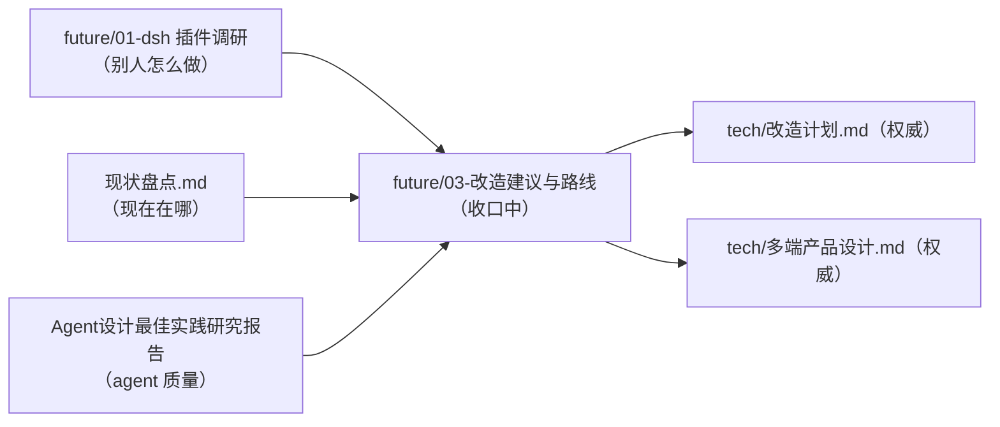

# docs 文档地图与治理规则

> 本文件是文档层的「装配点」：谁权威、谁引用、决策怎么编号、什么时候刷新。架构本身的权威是《改造计划》与《多端产品设计》。

## 文档地图

| 文档 | 角色 | 权威性 |
| --- | --- | --- |
| `tech/改造计划.md` | 服务端插件内核 + BYOK + design/code 双模式的分阶段蓝图 | **权威**：ctx key 表（§4.2）、扩展点速查表（§4.10）、路线图（§7，P0–P8）的唯一属主 |
| `tech/多端产品设计.md` | 桌面/自托管/Web/移动形态与存储迁移设计 | **权威**：多端 ctx key（persistence/storage 等）落地时并入《改造计划》§4.2；多端阶段编号 D1–D7 的属主 |
| `现状盘点.md` | 代码现状快照（组件/路由/features/迁移盘点） | 快照：允许滞后于代码，刷新规则见下 |
| `future/01-deepseek-harness插件调研.md` | dsh 插件架构调研记录 | 调研：结论已被权威文档吸收，只读 |
| `future/03-改造建议与路线.md` | 双模式改造建议稿（v3） | **收口中**：架构/决策/路线章节为历史快照，禁止再编辑；P0 定稿后归档 |
| `Agent设计最佳实践研究报告.md` | agent 质量最佳实践 | 参考 |
| `Loomic原版文档/` | 原版产品文档 | 历史参考 |
| `images/`、`future/` 其余 | 配图与历史材料 | 参考 |

## 治理规则

1. **单源原则**：同一契约只允许一份权威副本，其余文档引用不复制。当前登记的单一属主：
   - ctx key 表 = 《改造计划》§4.2（`AGENTS.md` 只引用，不复制完整清单）；
   - 扩展点机制表 = 《改造计划》§4.10（`AGENTS.md` 的速查表是它的操作摘要，冲突时以 §4.10 为准）；
   - 多端阶段编号 D1–D7 = 《多端产品设计》§13；改造阶段编号 P0–P8 = 《改造计划》§7。
2. **决策稳定 ID**：《改造计划》§6 用 `DEC-1`~`DEC-8`，《多端产品设计》§14 用 `FORM-1`~`FORM-8`。跨文档引用决策一律用 ID，不复述、不重编号。拍板后在 `docs/decisions/` 落 ADR 文件（命名 `ADR-<YYYYMMDD>-<ID>.md`，含背景/决策/后果），并在原文档对应条目标注结论与日期。
3. **现状盘点刷新**：`现状盘点.md` 在改造各阶段（P1–P8、D1–D7）合并时由该阶段 PR 同步刷新对应章节；日常代码 PR 不强制维护，允许滞后，与代码冲突时以代码为准。
4. **建议稿收口**：`future/03` 的架构、决策、路线章节为历史快照，修订一律改权威文档；《改造计划》P0（定稿 + DEC 拍板）完成后整篇归档。
5. **新文档入图**：新增 docs 文档必须同步登记本文件地图，并在文头声明角色（权威/快照/调研/参考/历史）。
