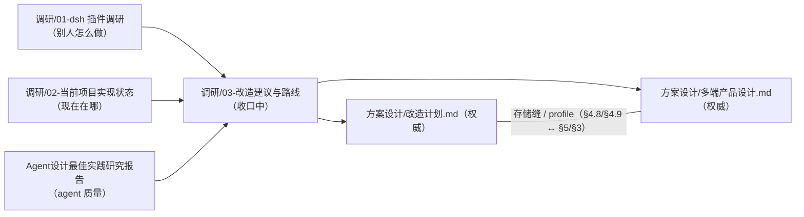

# docs 文档地图与治理规则

> 本文件是文档层的「装配点」：谁权威、谁引用、决策怎么编号、什么时候刷新。架构本身的权威是《改造计划》与《多端产品设计》。

## 文档地图

| 文档 | 角色 | 权威性 |
| --- | --- | --- |
| `方案设计/改造计划.md` | 服务端插件内核 + BYOK + design/code 双模式的分阶段蓝图 | **权威**：ctx key 表（§4.2）、扩展点速查表（§4.10）、路线图（§7，P0–P8）的唯一属主 |
| `方案设计/多端产品设计.md` | 桌面/自托管/Web/移动形态与存储迁移设计 | **权威**：存储/认证/blob/队列/凭证/toolsGateway 缝（§5）、沙箱执行后端（§7）；多端阶段编号 D1–D7 + Spike S1–S4 + OS-0 的属主（§13）。§5 缝表是落地清单，其中的 key 落地时写入《改造计划》§4.2（key 表只此一份） |
| `插件/flow插件集成规划.md` | flow 第三模式（futureFlow 子系统）集成改造方案：已拍板决策（`DEC-10`…`DEC-13`）、双模式架构（内嵌/独立 + 宿主适配层 + `ff-embed/v1` 契约）、接缝清单、合并方式三选项、分阶段路线、许可证合规与开放问题 | **方案稿**：flow 子系统实施蓝图；决策结论与理由以《改造计划》§6 为准，上游以根级 `flow/` 子模块为准（见《日志》五十四） |
| `调研/02-当前项目实现状态.md` | 代码现状快照（组件/路由/features/迁移盘点） | **权威**：全部现状数字（行数/import/路由/组件/迁移计数/provider 数量）；允许滞后于代码，刷新规则见下 |
| `调研/01-deepseek-harness插件调研.md` | dsh 插件架构调研记录 | 调研：结论已被权威文档吸收，只读 |
| `调研/04-模型Provider调研.md` | 参考项目（cherry-studio / kimi-code / nomifun / dsh / jaaz / jellyfish / futureFlow）的模型 Provider 调研：LLM / IGM（图像生成）/ VGM（视频生成 + 视觉输入）三维度对比与本项目可学习点 | 调研：只作方向参考，落地结论写入《改造计划》§4.8/§4.10 与 《日志》四十六 |
| `调研/05-生成通道轮子选型.md` | 生成通道生态尽调结论（已闭环）：AI SDK 生态本地实测（video 三段式 / edits 缝 / bytedance 包 / 反向适配不存在）、models.dev 能力库 vendor（快照 + 刷新脚本，实测 220 providers）、视频直连 poll 5/5 自含、`/v1/videos` 借形状不绑路径、视频词表借 fal 形状、中转 4 探测项、队列维持 PGMQ（否证理由勘误）；含触发器 T1–T3 与实现期确证点 | 调研结论：落地走《日志》台账；生成通道引 AI SDK 包，chat 层边界以 §4.8 为准 |
| `调研/03-改造建议与路线.md` | 双模式改造建议稿（v3） | **收口中**：§0–§7 为冻结区（`<!-- frozen:start/end -->` + `docs/frozen-lock.json` 校验，禁改）；**仅 §8 可编辑**；P0 定稿后整篇归档 |
| `调研/05-Ruflo调研与可借鉴点.md` | Ruflo（原 claude-flow）形态核对与取舍：不引入依赖；可借鉴项（编排原语 / 记忆检索模式 / 角色清单）与落点、开工前待拍板口径 | 调研：结论按现有缝落地，落点以《改造计划》§4.2/§4.10 为准 |
| `历史文档/Agent设计最佳实践研究报告.md` | agent 质量最佳实践 | 参考 |
| `历史文档/产品需求规格.md` | 2026-09 需求访谈沉淀（产品定位 / 领域模型 / 北极星场景 / 各缝行为测试清单）——**已归档**，文头列出归档时核出的 6 条与现状的漂移 | **历史**：不作依据；定位与契约以 `AGENTS.md`、《改造计划》《多端产品设计》与 `packages/shared` 的 zod 契约为准 |
| `历史文档/` 其余 | 历史留档（被取代的规格 / 定稿后归档的建议稿） | 历史：只在回看当时的判断时读 |
| `历史文档/Loomic原版文档/` | 原版产品文档（Loomic 时代，品牌改名前的原文） | 历史参考 |
| `视觉设计/旧版/品牌Logo说明.md` | 品牌 logo 规范（旧版留档：定稿 KF-2 骨架版 C · 岚配色：几何/色值/应用位置） | 参考 |
| `视觉设计/logo/字体/字体说明.md` | 字标字体清单（在用 Momo Trust Display + 候选样张的来源与许可状态）与第三方字体免责声明 | 参考 |
| `未做需求.md` | **参考图需求台账**：需求状态总表（做了 / 没做、有无参考图、图名）+ 仍未做清单 + 参考图反向索引 + 逐条详情 | 待办清单：条目状态以代码为准，落地后请在同一提交里更新总表；参考图本身只是方向参考 |
| `日志.md` | **施工日志 + 变更台账**：历轮回执（§九 ~ §四十五，按轮次记「用户口径 → 做了什么 → 证据 / 验证 / 遗留」）+ 迁移台账（§四十六，《改造计划》§4.13 移入的逐里程碑/PR 回执与 Supabase 专有对象底账）；编号是稳定引用锚点 | 参考：台账看现状、日志看过程；编号不重排不改写 |
| `插件/米家插件规划.md` | 米家设备能力的方案规划：现成方案调研（能否顶替手机米家 App）、插件系统硬边界实测、三条落地路线与推荐、已知限制 | 参考：结论拍板后按该文档落地，并在《日志》记账 |
| `插件/语音助手插件规划.md` | 语音助手的方案规划：内建插件与「默认开启」机制实测、听/想/说三段的模型选型（CPU/GPU/远端可混搭）、两套模式（默认只转文本）、按需下载与性能检测、能力缝与分阶段落地 | 参考：结论拍板后按该文档落地，并在《日志》记账 |
| `参考图/` | 需求参考图（逐张读进 `未做需求.md` 台账）与配图 | 参考 |

## 治理规则

1. **单源原则**：同一契约只允许一份权威副本，其余文档引用不复制。**属主登记表**（新增属主只能在此登记，禁止在消费文档就地维护副本）：

| 契约 | 唯一属主 | 消费文档的写法 |
| --- | --- | --- |
| ctx key 表 | 《改造计划》§4.2 | 只引用 §4.2，不列 key 清单 |
| 扩展点机制表 | 《改造计划》§4.10 | `AGENTS.md` 速查表是**改造期过渡摘要**，冲突时以 §4.10 为准 |
| 现状数字（行数 / import / 路由 / 组件 / 迁移 / provider 计数） | `调研/02` | 权威文档只写「见《02》§X」，不写死数字 |
| 阶段编号 | 改造 P0–P8 = 《改造计划》§7；多端 D1–D7 + Spike S1–S4 + OS-0 = 《多端》§13 | 只引用编号 |
| 决策 ID | 本文「决策 ID 登记表」 | 只引用 ID，不复述、不重编号 |
| BYOK 凭证红线 | 《改造计划》§4.8 | `AGENTS.md`、`多端` §11 只引用 |
| 存储 / 认证 / blob / 队列 / 凭证 / toolsGateway 缝 | 《多端》§5 | 《改造计划》§4.8 只引用 |
| 插件目录约定与 profile 机制 | 《改造计划》§4.9 | 《多端》§3 只引用 |
| 沙箱执行后端（三档 + 平台后端） | 《多端》§7 | 《改造计划》§4.6 只引用 |

2. **决策稳定 ID**：跨文档引用决策一律用 ID，不复述、不重编号。**一个决策只有一个 ID**（同一决策若已出现在两张清单，登记表标注别名，引用必须用主 ID）。拍板后把**结论与理由**写进《改造计划》§6（`DEC-*`）或《多端》§14/《改造计划》§6.1（`FORM-*`），并在本登记表标注状态与日期；**不再单独维护 ADR 文件或 decisions/ 目录**（2026-09-13 起，含历史 `DEC-1`…`DEC-9` 的理由已并入§6）。

| ID | 决策 | 定义处 | 状态 |
| --- | --- | --- | --- |
| `DEC-1` | 事件缝（3 个 agent-run 事件） | 《改造计划》§6 | 已拍板（2026-09-12） |
| `DEC-2` | 模式承载（preset vs 独立 profile） | 《改造计划》§6 | 已拍板（2026-09-12） |
| `DEC-3` | 执行模式边界（v1 做几个） | 《改造计划》§6 | 已拍板（2026-09-12） |
| `DEC-4` | 权限默认档 | 《改造计划》§6 | 已拍板（2026-09-12） |
| `DEC-5` | 计费口径 | 《改造计划》§6 | 已拍板（2026-09-12） |
| `DEC-6` | 用量统计范围 | 《改造计划》§6 | 已拍板（2026-09-12） |
| `DEC-7` | 凭证安全边界 | 《改造计划》§6 | 已拍板（2026-09-12） |
| `DEC-8` | 第三方插件生态 | 《改造计划》§6 | 已拍板（2026-09-12） |
| `DEC-9` | 存量生成/目录路径退役随 BYOK 切换（D3） | 《改造计划》§6 | 已拍板（2026-09-12） |
| `FORM-1` | Sidecar 方案 | 《多端》§14 | 待拍板 |
| `FORM-2` | 桌面 Postgres 供给 | 《多端》§14 | 已拍板（2026-09-13）：捆绑 `embedded-postgres`（PG 17） |
| `FORM-3` | 自托管认证档位 | 《多端》§14 | 待拍板 |
| `FORM-4` | 许可证组合 | 《多端》§14 | 待拍板 |
| `FORM-5` | *别名*：计费口径 → 见 `DEC-5` | — | 已并入 `DEC-5` |
| `FORM-6` | 移动 Worker 能力边界 | 《多端》§14 | 待拍板 |
| `FORM-7` | 商业化形态 | 《多端》§14 | 待拍板 |
| `FORM-8` | 存量云端退役节奏 | 《多端》§14 | 待拍板 |
| `FORM-9` | 工作区隔离机制 | 《多端》§14 | 已拍板（2026-09-13）：应用层强制 `workspace_id` 过滤 |
| `FORM-10` | 管理后台（最小运维台 + 系统供应商分发 + 计费额度） | 《多端》§14 | 已拍板（2026-09-13）：立项最小运维台 |
| `FORM-11` | 桌面 flow 引擎承载（flow 插件形态 + 引擎按需下载 + `engineRuntime` 双 Provider：WSL2 / 本机容器） | 《多端》§14 | 已拍板（2026-09-20，结论与理由见《改造计划》§6.1） |
| `DEC-10` | flow 子系统双形态：内嵌模式（可嵌入任意宿主应用）+ 独立模式（保证单独可运行） | 《改造计划》§6 | 已拍板（2026-09-17，2026-09-20 复核补充） |
| `DEC-11` | flow 执行引擎 = 本地 Dify 无头栈（唯一方向，不引远程引擎） | 《改造计划》§6 | 已拍板（2026-09-17，2026-09-20 复核补充） |
| `DEC-12` | flow 计费/凭证网关缝可插拔三选（自带网关 / 宿主·主仓网关 / 第三方网关） | 《改造计划》§6 | 已拍板（2026-09-17，2026-09-20 复核补充） |
| `DEC-13` | Dify 版本策略 = 保持可升级（MVP 阶段不锁版本）+ 升级回归门禁 | 《改造计划》§6 | 已拍板（2026-09-17，2026-09-20 复核补充） |

> 2026-09-13：决策（结论 + 理由 + 后果）统一维护在《改造计划》§6——`DEC-*` 见 §6 条目，`FORM-2`/`FORM-9`/`FORM-10` 见 §6.1；`FORM-*` 的问题定义仍在《多端》§14。**不再维护 `docs/decisions/` 目录与 ADR 文件**。跨文档引用一律用 ID。

3. **冻结区（建议稿收口）**：`调研/03` 的 §0–§7 是历史快照，修订一律改权威文档；**仅 §8 可编辑**。冻结区用 `<!-- frozen:start -->` / `<!-- frozen:end -->` 标出，其 SHA-256 记录在 `docs/frozen-lock.json`，由 `scripts/check-docs.mjs` 校验（改冻结区必然失败）。确需变更冻结区时，在 PR 描述说明理由并跑 `node scripts/check-docs.mjs --update-lock` 同步锁文件。《改造计划》P0（定稿 + DEC 拍板）完成后整篇归档。
4. **现状盘点刷新**：`调研/02-当前项目实现状态.md` 在改造各阶段（P1–P8、D1–D7）合并时由该阶段 PR 同步刷新对应章节；日常代码 PR 不强制维护，允许滞后，与代码冲突时以代码为准。
5. **新文档入图**：新增 docs 文档必须同步登记本文件地图，并在文头声明角色（权威/快照/调研/参考/历史）。
6. **机械校验**：以上规则由 `scripts/check-docs.mjs` 执行——单独跑 `pnpm test:docs`，同一校验也由 `tests/workspace.test.mjs` 挂进 `pnpm test`（`test:workspace` 阶段）。覆盖：① docs 相对链接与锚点可解析；② 冻结区 SHA-256 匹配；③ 出现的决策 ID 均已在「决策 ID 登记表」登记；④ `docs/**/*.md` 均已登记进文档地图（`历史文档/Loomic原版文档/` 与本文除外）；⑤ 全仓库只有《改造计划》§4.2 一处以表头 `ctx key` 定义 key 清单。规则靠校验落地，不靠自觉。
