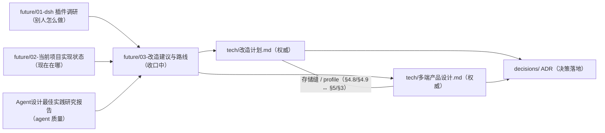

# docs 文档地图与治理规则

> 本文件是文档层的「装配点」：谁权威、谁引用、决策怎么编号、什么时候刷新。架构本身的权威是《改造计划》与《多端产品设计》。

## 文档地图

| 文档 | 角色 | 权威性 |
| --- | --- | --- |
| `tech/改造计划.md` | 服务端插件内核 + BYOK + design/code 双模式的分阶段蓝图 | **权威**：ctx key 表（§4.2）、扩展点速查表（§4.10）、路线图（§7，P0–P8）的唯一属主 |
| `tech/多端产品设计.md` | 桌面/自托管/Web/移动形态与存储迁移设计 | **权威**：存储/认证/blob/队列/凭证/toolsGateway 缝（§5）、沙箱执行后端（§7）；多端阶段编号 D1–D7 + Spike S1–S4 + OS-0 的属主（§13）。§5 缝表是落地清单，其中的 key 落地时写入《改造计划》§4.2（key 表只此一份） |
| `decisions/README.md` | 决策落地目录（ADR 命名、模板、索引） | 规则属主：ADR 文件命名与必填字段 |
| `future/02-当前项目实现状态.md` | 代码现状快照（组件/路由/features/迁移盘点） | **权威**：全部现状数字（行数/import/路由/组件/迁移计数/provider 数量）；允许滞后于代码，刷新规则见下 |
| `future/01-deepseek-harness插件调研.md` | dsh 插件架构调研记录 | 调研：结论已被权威文档吸收，只读 |
| `future/03-改造建议与路线.md` | 双模式改造建议稿（v3） | **收口中**：§0–§7 为冻结区（`<!-- frozen:start/end -->` + `docs/frozen-lock.json` 校验，禁改）；**仅 §8 可编辑**；P0 定稿后整篇归档 |
| `Agent设计最佳实践研究报告.md` | agent 质量最佳实践 | 参考 |
| `Loomic原版文档/` | 原版产品文档 | 历史参考 |
| `images/`、`future/` 其余 | 配图与历史材料 | 参考 |

## 治理规则

1. **单源原则**：同一契约只允许一份权威副本，其余文档引用不复制。**属主登记表**（新增属主只能在此登记，禁止在消费文档就地维护副本）：

| 契约 | 唯一属主 | 消费文档的写法 |
| --- | --- | --- |
| ctx key 表 | 《改造计划》§4.2 | 只引用 §4.2，不列 key 清单 |
| 扩展点机制表 | 《改造计划》§4.10 | `AGENTS.md` 速查表是**改造期过渡摘要**，冲突时以 §4.10 为准 |
| 现状数字（行数 / import / 路由 / 组件 / 迁移 / provider 计数） | `future/02` | 权威文档只写「见《02》§X」，不写死数字 |
| 阶段编号 | 改造 P0–P8 = 《改造计划》§7；多端 D1–D7 + Spike S1–S4 + OS-0 = 《多端》§13 | 只引用编号 |
| 决策 ID | 本文「决策 ID 登记表」 | 只引用 ID，不复述、不重编号 |
| BYOK 凭证红线 | 《改造计划》§4.8 | `AGENTS.md`、`多端` §11 只引用 |
| 存储 / 认证 / blob / 队列 / 凭证 / toolsGateway 缝 | 《多端》§5 | 《改造计划》§4.8 只引用 |
| 插件目录约定与 profile 机制 | 《改造计划》§4.9 | 《多端》§3 只引用 |
| 沙箱执行后端（三档 + 平台后端） | 《多端》§7 | 《改造计划》§4.6 只引用 |

2. **决策稳定 ID**：跨文档引用决策一律用 ID，不复述、不重编号。**一个决策只有一个 ID**（同一决策若已出现在两张清单，登记表标注别名，引用必须用主 ID）。拍板后在 `docs/decisions/` 落 ADR（命名与字段见该目录 README），并在原文档对应条目标注结论与日期。

| ID | 决策 | 定义处 | 状态 |
| --- | --- | --- | --- |
| `DEC-1` | 事件缝（3 个 agent-run 事件） | 《改造计划》§6 | 待拍板 |
| `DEC-2` | 模式承载（preset vs 独立 profile） | 《改造计划》§6 | 待拍板 |
| `DEC-3` | 执行模式边界（v1 做几个） | 《改造计划》§6 | 待拍板 |
| `DEC-4` | 权限默认档 | 《改造计划》§6 | 待拍板 |
| `DEC-5` | 计费口径 | 《改造计划》§6 | 待拍板 |
| `DEC-6` | 用量统计范围 | 《改造计划》§6 | 待拍板 |
| `DEC-7` | 凭证安全边界 | 《改造计划》§6 | 待拍板 |
| `DEC-8` | 第三方插件生态 | 《改造计划》§6 | 待拍板 |
| `FORM-1` | Sidecar 方案 | 《多端》§14 | 待拍板 |
| `FORM-2` | 桌面 Postgres 供给 | 《多端》§14 | 待拍板 |
| `FORM-3` | 自托管认证档位 | 《多端》§14 | 待拍板 |
| `FORM-4` | 许可证组合 | 《多端》§14 | 待拍板 |
| `FORM-5` | *别名*：计费口径 → 见 `DEC-5` | — | 已并入 `DEC-5` |
| `FORM-6` | 移动 Worker 能力边界 | 《多端》§14 | 待拍板 |
| `FORM-7` | 商业化形态 | 《多端》§14 | 待拍板 |
| `FORM-8` | 存量云端退役节奏 | 《多端》§14 | 待拍板 |

3. **冻结区（建议稿收口）**：`future/03` 的 §0–§7 是历史快照，修订一律改权威文档；**仅 §8 可编辑**。冻结区用 `<!-- frozen:start -->` / `<!-- frozen:end -->` 标出，其 SHA-256 记录在 `docs/frozen-lock.json`，由 `scripts/check-docs.mjs` 校验（改冻结区必然失败）。确需变更冻结区时，在 PR 描述说明理由并跑 `node scripts/check-docs.mjs --update-lock` 同步锁文件。《改造计划》P0（定稿 + DEC 拍板）完成后整篇归档。
4. **现状盘点刷新**：`future/02-当前项目实现状态.md` 在改造各阶段（P1–P8、D1–D7）合并时由该阶段 PR 同步刷新对应章节；日常代码 PR 不强制维护，允许滞后，与代码冲突时以代码为准。
5. **新文档入图**：新增 docs 文档必须同步登记本文件地图，并在文头声明角色（权威/快照/调研/参考/历史）。
6. **机械校验**：以上规则由 `scripts/check-docs.mjs` 执行——单独跑 `pnpm test:docs`，同一校验也由 `tests/workspace.test.mjs` 挂进 `pnpm test`（`test:workspace` 阶段）。覆盖：① docs 相对链接与锚点可解析；② 冻结区 SHA-256 匹配；③ 出现的决策 ID 均已在「决策 ID 登记表」登记；④ `docs/**/*.md` 均已登记进文档地图（`Loomic原版文档/`、`decisions/ADR-*.md`、本文除外——ADR 由 `decisions/README.md` 索引）；⑤ 全仓库只有《改造计划》§4.2 一处以表头 `ctx key` 定义 key 清单；⑥ `decisions/` 下 ADR 文件名合法。规则靠校验落地，不靠自觉。
