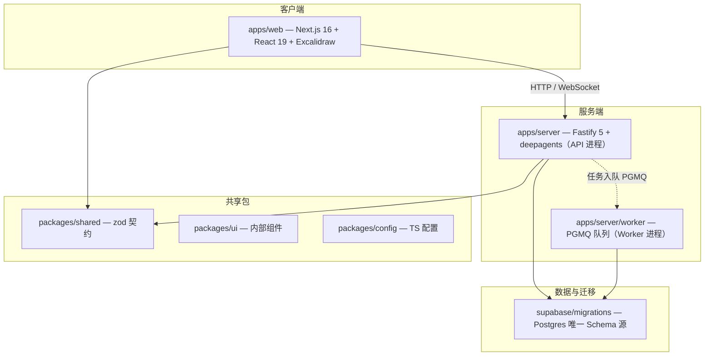
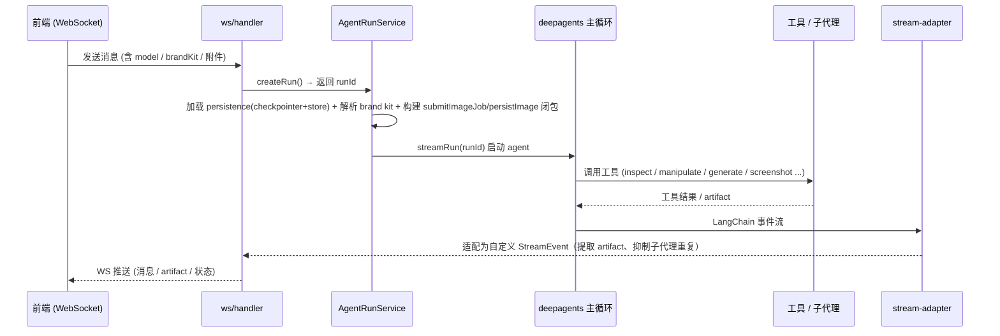
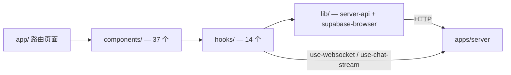
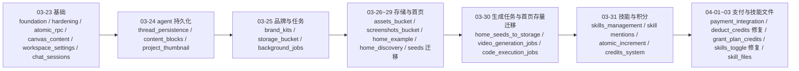

# Loomic 当前项目实现状态

> 状态：现状盘点（基于仓库真实代码，2026-09-11）
> 用途：说清「现在做成什么样了」。改造方向见《03-改造建议与路线》（收口中，见其头部声明），dsh 参照见《01-deepseek-harness 插件调研》；权威蓝图见《改造计划》/《多端产品设计》。完整文档地图见 `docs/README.md`。
> **刷新规则**：本快照允许滞后于代码；在改造各阶段（P1–P8、D1–D7）合并时由该阶段 PR 同步刷新对应章节，日常代码 PR 不强制维护；与代码冲突时以代码为准。
> 一句话：Loomic 是一个**已跑通的 BYOK Work 画布创作平台**——Next.js 前端 + Fastify/deepagents 服务端 + Supabase 存储 + PGMQ 异步生成，画布 AI 创作、图像/视频生成、品牌套件、技能、积分计费都已落地；**插件化改造（P0–P8）已于 2026-09-12 完成**：内核 + 全部 feature 插件化 + BYOK 供应商缝 + 用量统计 + MCP + 权限/执行模式缝 + profiles/presets 落地（本节快照按治理规则刷新）。

---

## 1. 技术栈与形态

| 层 | 技术 | 说明 |
| --- | --- | --- |
| Monorepo | pnpm@10 workspace + Turborepo | apps / packages / supabase / references |
| 前端 | Next.js 16（App Router, Turbopack）+ React 19 + Tailwind 4 + Base UI + Excalidraw | `output: export` 静态导出 |
| 服务端 | Fastify 5 + LangChain 1.x / deepagents + PGMQ worker | API(3001) + worker 双进程 |
| 契约 | `packages/shared` zod | HTTP / WS / job / credits / skills 跨端单一事实源 |
| 存储 | Supabase（Postgres + Auth + Storage） | migrations 为唯一 Schema 源 |
| 计费 | credits + 支付集成（Lemon Squeezy） | 订阅分级 + 积分扣减 + 水印 |

---

## 2. Monorepo 顶层结构

---

## 3. 后端架构

### 3.1 装配层现状（P8 完成后）

`apps/server/src/app.ts` 已退役为 **98 行薄封装**：选 `profiles/server.ts` → `composePlugins()` → 挂 CORS/infra 路由/WS，不 import 任何 `features/*`；`BuildAppOptions` 已删除，测试统一走 `overrides`。`worker.ts` 同样经 `profiles/worker.ts` 走内核装配。**新增 feature = features/<x>/plugin.ts + profiles 清单一行**。按 env 副作用的 `register-all.ts`（生成 provider）为迁移期遗留，随 BYOK 切换退役。

### 3.2 后端模块图

### 3.3 HTTP 路由清单（21 条，`src/http/`）

`viewer`（用户/工作区引导）、`projects`、`canvases`、`chat`、`runs`（agent 运行）、`brand-kits`、`skills` + `skills-marketplace`、`settings`、`uploads`、`fonts`、`generate`、`image-models` + `video-models` + `models`、`image-proxy`、`jobs`、`credits`、`payments` + `payments-webhook`、`health`。

### 3.4 领域服务 features（12 个，`src/features/`）

`bootstrap`、`viewer` 相关、`projects`、`canvas`、`chat`、`brand-kit`、`skills`（marketplace-service + skill-import-service）、`settings`、`uploads`、`agent-runs`（agent-run-service + types）、`jobs`（PGMQ executor 注册表）、`credits`（credit-service + tier-guard + watermark）、`payments`。

### 3.5 生成 provider（图/视频，`src/generation/providers/`）

| 能力 | provider |
| --- | --- |
| 图像 | `google-image`、`google-vertex-image`、`openai-image`、`replicate-image`、`volces-image` |
| 视频 | `google-video`、`google-vertex-video`、`metaso-video`（MiniMax H3）、`replicate-video` |
| 注册 | `registry.ts`（Map 注册表）+ `register-all.ts`（按 env 副作用批量注册） |

现状：**按服务端 env 注册**（`replicateApiToken` / `volcesApiKey` / `metasoApiKey` 等），server 和 worker 各自调用 `register-all`，靠人肉保持一致——BYOK 改造要把它变成「按用户供应商实例动态实例化」。

### 3.6 WS 与队列

- `ws/`：`connection-manager`（连接注册表）、`event-buffer`（事件缓冲/重放）、`handler`（消息处理入口）、`logger`。
- `queue/`：`pgmq-client`（PostgreSQL 原生消息队列），承载图像/视频/代码执行等异步任务。

---

## 4. Agent 运行时

### 4.1 运行流程（时序）

### 4.2 工具集（`src/agent/tools/`）

自定义工具：`project_search`（项目内检索）、`inspect_canvas`、`manipulate_canvas`（1400+ 行，10 种操作）、`generate_image`、`generate_video`、`persist_sandbox_file`、`get_brand_kit`（条件注册）、`screenshot_canvas`（条件注册，走 WS RPC）。

deepagents 内置（FilesystemMiddleware 自动注入）：`ls` / `read_file` / `write_file` / `edit_file` / `glob` / `grep` / `execute`（沙箱 shell）/ `task`（子代理分发）/ `write_todos`。

Backend 路由（CompositeBackend）：`/workspace/` → PostgresStore、`/memories/` → PostgresStore、`/skills/` → Filesystem、default → LocalShellBackend（`execute` + 临时文件）。

### 4.3 子代理（`src/agent/sub-agents.ts`）

**目前只有 1 个**：`video_generate`。deepagents 提供 `task` 工具做子代理分发，机制在，但内容极薄。

### 4.4 backend 模式与持久化

- `backends/`：按 `agentBackendMode` 在 dev（filesystem）/ prod（state）间选择。
- `persistence/`：`supabase-checkpointer`（LangGraph checkpointer，按 threadId）+ `supabase-store`（命名空间隔离存储）。
- 模型选择：`deep-agent.ts` 按 env 三选一（ChatOpenAI / ChatGoogleGenerativeAI / ChatVertexAI），`streamUsage: false`（**未采集 token 用量**）。

### 4.5 技能（skills）

已实现且较完整：`workspace-skills.ts` + SkillsMiddleware + `features/skills`（导入 + 市场）+ `skill-contracts.ts`；`skills/` 目录下 `canvas-design`（含字体库，用 `execute` 跑 Python/Pillow 生成海报）、`json-image-prompt`；`SKILL.md` 自动发现，无需改代码。迁移含 `skills_management` + `skill_files`。

---

## 5. 前端架构

### 5.1 路由（`src/app/`）

- 工作区 `(workspace)/`：`home`、`projects`、`brand-kit`、`settings`、`skills`
- 独立页：`canvas`（画布编辑器）、`login`、`register`、`auth/callback`、`pricing`（含 8 个子组件）、`loading-preview`、`not-found`

### 5.2 数据流

- **components（37）**：画布类（`canvas-editor`、`canvas-ai-toolbar`、`canvas-layers-panel`、`canvas-image-gen-panel`、`canvas-files-panel`、`canvas-tool-menu` 等）、对话类（`chat-sidebar`、`chat-input`、`chat-message`、`chat-skills`、`session-selector`）、模型/偏好（`agent-model-selector`、`image-model-preference`、`brand-kit-selector`）、首页（`home-prompt`、`home-discovery-gallery`、`home-example-browser`）、账户（`billing-section`、`profile-section`、`settings-layout`）。
- **hooks（14）**：`use-chat-stream`、`use-websocket`、`use-chat-sessions`、`use-agent-model`、`use-credits`、`use-subscription`、`use-image-attachments`、`use-image-model-preference`、`use-video-model-preference`、`use-job-fallback-polling`、`use-create-project`、`use-delete-project`、`use-generation-error-handler`、`use-breakpoint`。
- **lib（18）**：`server-api`、`auth-context`、`canvas-elements`、`canvas-image-generator`、`canvas-video-generator`、`canvas-normalize`、`brand-kit-api`、`credits-api`、`payments-api`、`font-api`、`home-discovery-*`、`home-example-*`、`supabase-browser`、`env`、`dedupe-request`、`utils`。

---

## 6. 数据模型与迁移演进（29 个迁移）

存储桶：brand-kit、public-project-assets、canvas-screenshots。RPC：原子操作（`atomic_rpc_functions`、`atomic_increment_job_attempt`、`deduct_credits`、`grant_plan_credits`）。

---

## 7. 已实现功能盘点

| 域 | 功能 | 状态 |
| --- | --- | --- |
| 画布 | Excalidraw 编辑、图层、AI 工具栏、元素操作、截图 | 已实现 |
| 对话 | 聊天会话、流式输出、WS 实时、会话选择 | 已实现 |
| 生成 | 图像（5 provider）、视频（4 provider）、异步任务 + 轮询兜底 | 已实现 |
| Agent | deepagents 主循环、9 类自定义工具、代码执行沙箱、1 个子代理 | 已实现（偏薄） |
| 品牌 | brand kit CRUD + 存储 + 条件工具注入 | 已实现 |
| 技能 | SKILL.md 自动发现、导入、市场、技能文件 | 已实现 |
| 项目 | 项目 CRUD、缩略图、首页示例库/发现库 | 已实现 |
| 账户 | Supabase 认证、设置、订阅/定价页 | 已实现 |
| 计费 | 积分余额/扣减/退款、分级门禁、水印、支付 webhook | 已实现 |

---

## 8. Agent 能力现状（对照通用 agent 功能清单）

| 能力 | 现状 | 位置/证据 |
| --- | --- | --- |
| 模型配置 | 部分（硬编码目录，前端有选择器；BYOK 未落地） | `http/models.ts`、`agent-model-selector` |
| MCP | **缺失** | 代码 0 匹配 |
| Skill | 已实现（未作为插件缝设计） | `features/skills`、`workspace-skills` |
| 联网搜索 | **缺失**（`project_search` 是项目内检索；metaso 是视频不是搜索） | `tools/project-search.ts` |
| 用量统计 | **缺失**（只有 credits 余额/计费，无 token/成本统计，`streamUsage:false`） | `features/credits` |
| 文件预览 | 部分（聊天图片缩略图 + deepagents `read_file`；无富预览） | `use-image-attachments` |
| 差异分析 | **缺失** | 无 |
| 子代理 | 部分（机制在，仅 1 个 video 子代理） | `sub-agents.ts` |
| plan/goal/loop/solo 模式 | **缺失**（`write_todos` 是唯一轻量规划） | 无 |
| 权限控制（默认/自动审批/完全访问） | **缺失**（仅桌面计划里有沙箱三档设计，未实施；当前 agent 工具直接执行） | 无 |

---

## 9. 架构痛点（2026-09-12 复核）

1. ~~装配层特权核心~~ **已解决**：app.ts 98 行薄封装，profiles/ 唯一清单。
2. ~~供应商主权缺失~~ **已解决（缝层面）**：`modelProviders`/`modelCatalog` 缝 + `providers/<protocol>/` 适配器 + SecretStore 落地；聊天与生成链路按用户实例实例化。`http/models.ts` 内置目录与 `register-all.ts` env 注册作为迁移期存量并行，随 BYOK 切换（D3）退役。
3. **存储耦合（未解决）**：各 feature service 仍直接持有 Supabase client——属《多端产品设计》D1 存储缝，按其前置铁律在 P0–P8 后另行开工。
4. ~~注册清单漂移~~ **已解决**：server/worker 插件清单收敛进 profiles/。
5. ~~agent 能力层薄~~ **基本解决**：MCP（ctx.tools）、用量统计（usage 表双采集点）、执行模式（agent/plan）、权限三档（tool-pre-execute 拦截）、文件预览/差异分析工具、子代理缝（capabilities）均已落地；联网搜索工具与 plan 审批 UI 为增量项。

---

## 10. 插件化改造现状（2026-09-12：P0–P8 完成）

- **P0**：DEC-1…DEC-8 拍板，ADR 落 `docs/decisions/ADR-20260912-*.md`。
- **P1**：`kernel/` 三文件 + 3 个 agent-run 事件缝 + `ctx.tools`/`ctx.capabilities` 注册表。
- **P2–P3**：全部 12 个 feature（brand-kit/viewer/credits/projects/canvas/chat/settings/uploads/jobs/payments/skills/agent-runs）插件化；`mounted` 阶段与 `tryGet` 按需加入内核；`app.test.ts` 装配完整性回归锁死漏挂载。
- **P4**：`provider-contracts`/`capability-contracts` 契约、`providers/<protocol>/` 适配器、`modelProviders`/`modelCatalog` 缝 + SecretStore（迁移 `20260912100000`）、usage 表 + 双采集点（迁移 `20260912130000`）、MCP 接入 ctx.tools。
- **P5**：前端供应商设置（apiKey 只写不读）+ `/api/models` 合并动态目录。
- **P6**：permissions 三档策略缝、agentModes（agent/plan）+ pre-step/turn-stopping 发射、文件预览/diff 工具。
- **P7**：`profiles/server.ts`/`worker.ts` 单一清单、worker 走内核、presets 会话级能力集。
- **P8**：app.ts 98 行薄封装、BuildAppOptions 删除、挂载树打印（`LOOMIC_DUMP_CONFIG=1`）。
- **仍属后续**（非 P0–P8 范围）：存储缝/去 Supabase（D1–D3）、沙箱与 toolsGateway（D4–D5）、自托管/移动端（D6–D7）、联网搜索工具、plan 审批 UI、`register-all` 全量退役。
