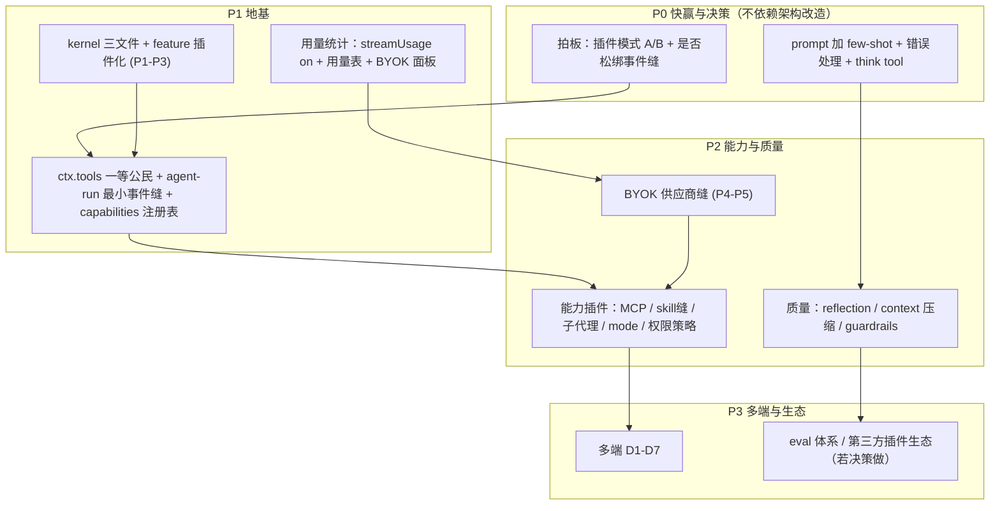
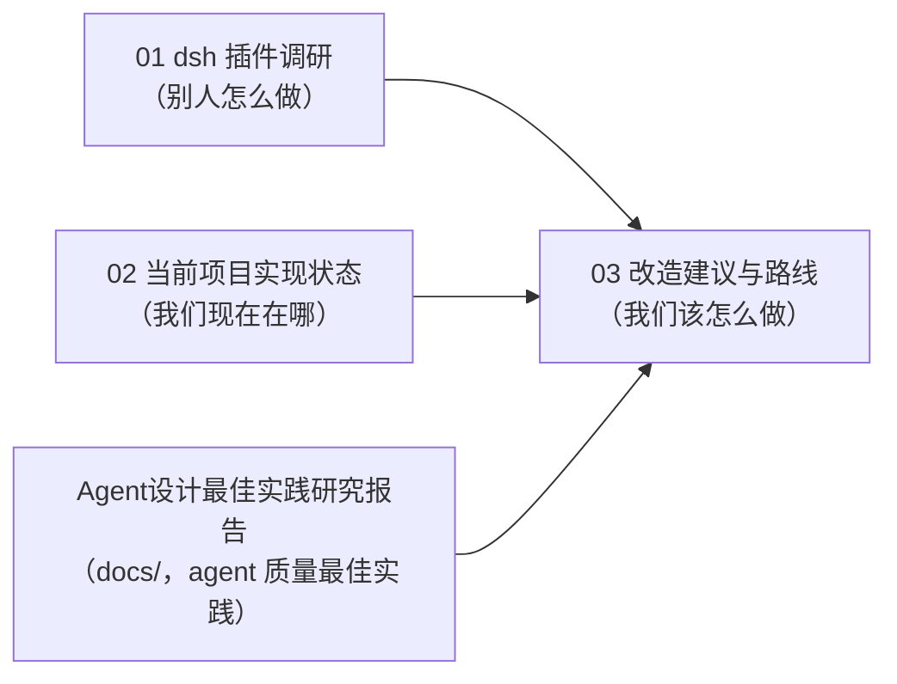

# Loomic 改造建议与路线

> 状态：建议稿（2026-09-11）
> 输入来源：《01-deepseek-harness 插件调研》（架构参照）+《02-当前项目实现状态》（现状痛点）+ `docs/Agent设计最佳实践研究报告.md`（Anthropic/LangChain/OpenAI 的 agent 设计最佳实践与 10 项 Gap）。
> 一句话：改造有**两条线**——一条是「架构插件化」（大、慢、地基），一条是「agent 质量快赢」（小、快、直接提升体验）。别只盯着大改造；先吃掉低成本高回报的快赢，同时把两个卡脖子决策拍板，再按拓扑序推地基。

---

## 1. 问题总览：三类 Gap

### 1.1 架构 / 插件化 Gap（对照 dsh）

| Gap | 现状 | dsh 的做法 |
| --- | --- | --- |
| 只插件化了管道，没插件化 agent 能力 | 扩展点表只覆盖供应商/路由/任务/feature | agent 主循环、工具、MCP、模式、权限全是插件 |
| 事件 / 拦截缝缺失 | 明确列为非目标「不建事件总线」 | waterfall/serial/bail 事件是核心扩展点 |
| `ctx.tools` 未真正定义 | Phase 6 一句「替换 deps 袋子」 | 作用域化工具注册表 + 受 guard 的执行管线 |
| 外部插件契约自相矛盾 | `ServiceKey` 封闭 enum；多端 §9 却承诺第三方生态 | 声明合并开放 key + `dsh plugin` 安装 |
| 用量统计与 BYOK 冲突 | `streamUsage:false`，无用量表 | 遥测是 dsh-base 第一层能力 |
| 权限只绑桌面沙箱 | 云/Web agent 无审批模型 | approval policy 在 dsh-base，跨形态 |

### 1.2 Agent 能力 Gap（10 项清单，详见《02》§8）

缺失：MCP、联网搜索、用量统计、差异分析、执行模式、通用权限。
部分：模型配置（BYOK 未落地）、文件预览、子代理（仅 1 个）。
已实现但未成插件：skill。

### 1.3 Agent 质量 Gap（来自 `docs/Agent设计最佳实践研究报告.md`）

Think Tool 缺失、Few-Shot Examples 缺失、错误处理指导不足、Context 压缩策略缺失、工具描述缺示例、`manipulate_canvas` 文件过大（1400+ 行）、Guardrails 体系缺失、评估体系缺失、Reflection/自我修正缺失、工具按需加载（暂不紧迫）。

---

## 2. 核心决策：插件开发模式要做到哪一层

「插件开发模式」是两件**完全不同**的事，必须先拆开，否则一句话说「加」，结果做了个和非目标冲突的大工程。

### 2.1 (A) 进程内插件开发规范 + agent-loop 可插拔缝

- 内容：cookbook + 脚手架 + `ctx.tools` 注册表 + 每插件 `Config`(zod) + agent-run 最小拦截缝 + 挂载树 dump。
- 成本：低-中。与「最小内核」一致。**且这正是补齐 §1.2 能力缺口的同一件事**——只有让 loop 可插拔，MCP/skill/subagent/mode/permission/usage 才能成为插件而不是硬编码。
- 结论：**建议做，优先级高。**

### 2.2 (B) dsh 式第三方插件安装 / 分发

- 内容：`dsh plugin add`（npm/github/tarball/本地）、profile/bundle/patch 组合、版本化插件契约、topic 发现、不可信插件沙箱。
- 成本：高。与已写明的非目标（不引入 Cordis/YAML/patch/live-reload）冲突；封闭 `ServiceKey` 结构上挡住它；**云多用户形态下第三方插件进服务端进程，是比 dsh 桌面本地大得多的安全面**。
- 结论：**暂缓实现，但必须显式决策**——要么把多端 §9 的生态承诺降级为「远期、依赖重采纳被拒机制」，要么正式立项。别让它悬着当空头支票。

### 2.3 需要你拍板的关键点

**是否松绑「不建通用事件总线」这一条非目标，给 agent-run 加 3 个拦截事件（`pre-step` / `tool-pre-execute` / `turn-stopping`）？**

- 松绑 → mode/permission/usage/MCP 都能做成插件，「一切皆插件」名副其实，(A) 完整。
- 不松绑 → 这些能力只能硬编码进 `deep-agent.ts`/`runtime.ts`，插件化只覆盖管道，agent 仍是最深耦合的黑盒。
- 建议：**松绑这一个点**（只加 3 个事件，不做通用总线），投入小、解锁面大。

---

## 3. 分层改造建议

### 3.1 内核层（沿用 P1-P7，补强）

按《插件化改造计划》推进 kernel 三文件 → feature 逐个插件化 → 供应商缝 → 前端 BYOK → profiles。**补强点**：把 `ctx.tools` 从「deps 袋子」升为一等注册表（schema 贡献 + 作用域 + guarded 执行，对齐 dsh `core/tools`）。

### 3.2 Agent 能力层（新增，本文档核心补充）

用「**开放贡献、封闭 key**」破解 §1.1 的矛盾：`ServiceKey` 保持封闭，但新增少数几个**注册表型 key** 承接无限贡献：

| 新增 ctx key | 承接什么 | 对应能力 |
| --- | --- | --- |
| `tools` | 内置工具 + MCP 工具 + skill 激活工具，统一 schema/作用域/guard | MCP、工具按需加载 |
| `capabilities` | 能力贡献者注册表（子代理、模式、联网搜索、差异分析） | 子代理、模式、联网、diff |
| `permissions` | 跨形态 tool-call 策略缝（default/auto-approve/full-access 三预设），沙箱是桌面执行后端 | 通用权限 |
| `usage` | token/成本采集（打开 `streamUsage`，落用量表，按 provider/model/run） | 用量统计 |
| agent-run 事件 | `pre-step`/`tool-pre-execute`/`turn-stopping` 三个拦截点 | 模式、权限、用量的挂载基础 |

### 3.3 Agent 质量层（快赢，来自最佳实践研究）

- **P0 低成本高回报**：system prompt 加 2-3 个 Few-Shot 端到端示例；加错误处理指导段；加 `think` 工具；工具 description 补 `examples`。
- **P1**：Reflection loop（复杂画布操作后自动 `screenshot_canvas` 验证）；Context 压缩（清除旧工具结果 + 画布状态摘要）；Guardrails 分层（输入校验 → 输出合理性 → classifier 权限分级）。
- **P2**：`manipulate_canvas` 按操作类型拆分；系统化 eval pipeline（canvas 操作 dataset + 代码 grader + LLM-as-judge + pass@k）。

### 3.4 BYOK 供应商层

按 P4-P5：`packages/shared` 加 provider 契约 → `providers/<protocol>/` 适配器 → `modelProviders`+`modelCatalog` 插件 → 前端供应商设置 CRUD → `http/models.ts` 硬编码退役。**用量统计（§3.2）是 BYOK 的关键卖点，应与本层同步。**

### 3.5 多端层（沿用 D1-D7）

存储缝 → 桌面壳 → 本地存储驱动 → 能力节点 → 沙箱与权限 → 自部署 → 移动端。前置铁律：服务端缝先就位。

---

## 4. 统一路线图

优先级总表：

| 优先级 | 事项 | 类型 | 成本 | 说明 |
| --- | --- | --- | --- | --- |
| P0 | prompt few-shot + 错误处理 + think tool | 质量快赢 | 低 | 直接提升 agent 成功率 |
| P0 | 拍板插件模式 A/B + 事件缝松绑 | 决策 | 0 | 解锁后续一切 |
| P1 | kernel + feature 插件化 (P1-P3) | 架构地基 | 中 | 已有计划 |
| P1 | ctx.tools + agent-run 事件缝 + capabilities 注册表 | 能力地基 | 中 | 本文新增核心 |
| P1 | 用量统计（streamUsage + 用量表 + 面板） | 能力 | 中 | BYOK 关键卖点 |
| P2 | BYOK 供应商缝 (P4-P5) | 架构 | 中-高 | 已有计划 |
| P2 | MCP / skill缝 / 子代理 / mode / 权限策略 插件化 | 能力 | 高 | 依赖 P1 事件缝 |
| P2 | reflection / context 压缩 / guardrails | 质量 | 中-高 | — |
| P3 | 多端 D1-D7 | 形态 | 高 | 服务端缝先就位 |
| P3 | eval 体系 / manipulate_canvas 拆分 / 第三方生态 | 质量/生态 | 高 | 长期 |

---

## 5. 每项能力的落地方式（对照 dsh 插件形状）

| 能力 | 做成什么 | 依赖的缝 | 参照 dsh |
| --- | --- | --- | --- |
| MCP | `features/mcp` 插件：连 server → 工具注册进 `ctx.tools`，命名 `mcp__<server>__<tool>` | tools | `mcp/mcp-client` |
| Skill 升缝 | 现有 skill 收敛为向 `ctx.tools`/`capabilities` 贡献的插件 | tools/capabilities | `skill/*` |
| 子代理 | 从 1 个扩为 seam：Definition + 多 Provider（in-process / 委托） | capabilities | `subagent/*` |
| 执行模式 | 先做单个「产品包」模式（提示段 + 命令 + 工具 + 持久事件），出现第 2 个再抽缝 | capabilities + 事件 | `plan/plan-mode` |
| 通用权限 | `permissions` 策略缝（default/auto-approve/full-access），沙箱为桌面后端 | permissions + 事件 | `guard/* + sandbox + approval` |
| 联网搜索 | 一个向 `ctx.tools` 贡献 `web_search` 的插件（BYOK 搜索供应商） | tools | 工具缝 |
| 用量统计 | 挂 `agent/*` 与 `llm` 流事件采集 token/成本，落 `usage` 表 | usage + 事件 | 遥测（dsh-base） |
| 文件预览 / 差异分析 | 画布产物预览 + 版本/元素 diff 工具，贡献进 `ctx.tools` | tools | `attachment` / 代码 diff |

---

## 6. 待决策清单

1. **插件开发模式**：(A) 进程内先做（建议）；(B) 第三方生态是否立项、何时。
2. **事件缝**：是否松绑「不建事件总线」，加 3 个 agent-run 拦截事件（建议松绑）。
3. **多端 §9 生态承诺**：与内核非目标矛盾，降级还是立项。
4. **计费口径**（沿用既有计划）：BYOK 免费 + 平台托管计费是否适用桌面/自部署。
5. **用量统计范围**：是否作为 BYOK v1 必备（建议是）。
6. **agent 质量快赢**：是否立即排期 P0（few-shot/错误处理/think tool）。

---

## 7. 近期最小可行动作（不等大改造）

1. 给 `loomic-main.ts` system prompt 加 Few-Shot 示例段 + 错误处理段（低成本，立竿见影）。
2. 加一个无副作用的 `think` 工具（复杂画布操作前反思）。
3. 打开 `streamUsage`，在 agent-run 落一张最小用量表（为 BYOK 面板铺路）。
4. 拍板 §6 的决策 1、2，消除文档矛盾。
5. 行业最佳实践研究已归档为 `docs/Agent设计最佳实践研究报告.md`（本文 §1.3 与 §3.3 的完整依据）。

---

## 附：三份文档的关系

