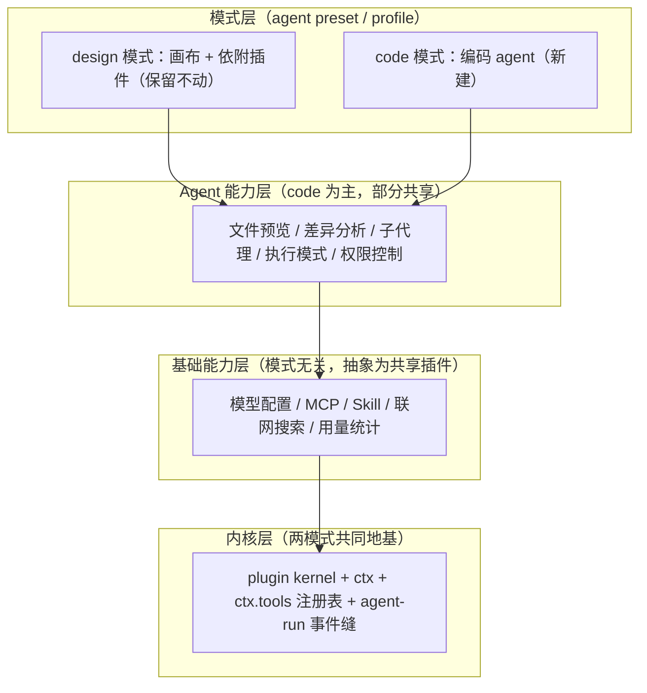
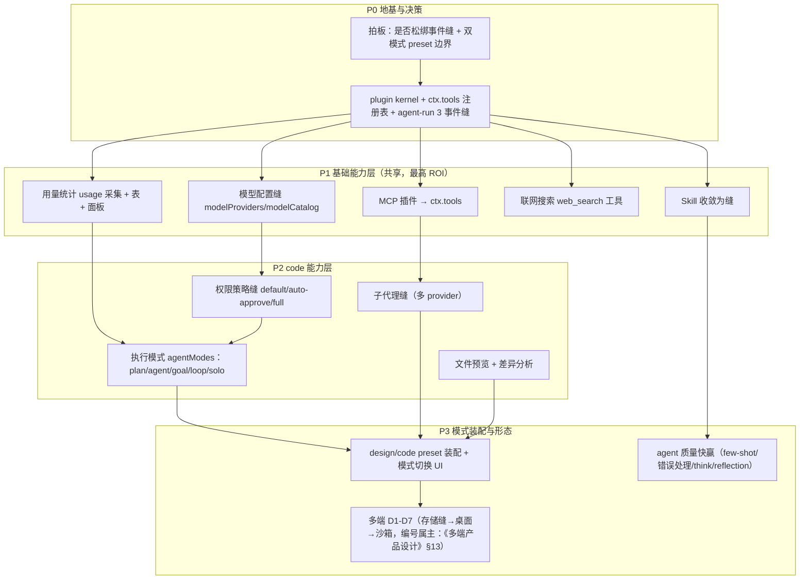
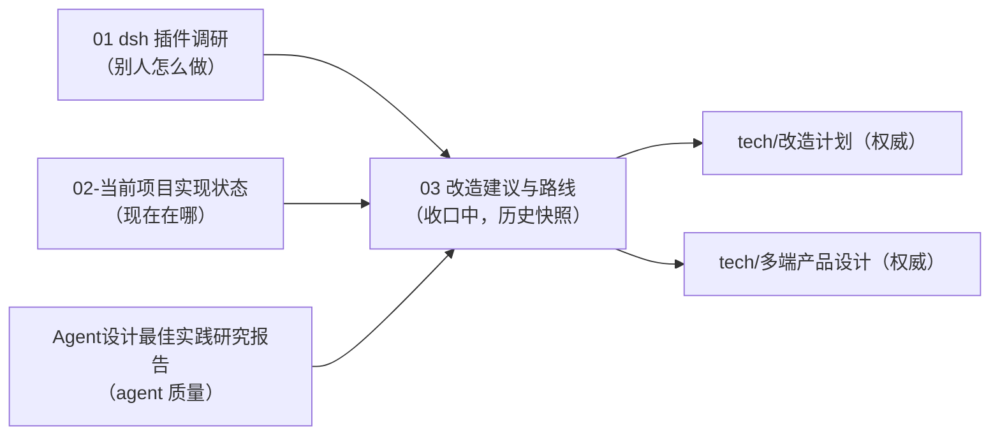

# Loomic 改造建议与路线（design / code 双模式）

> 状态：建议稿 v3（2026-09-11，已与《改造计划》v3 同步；本文为建议稿，正式细节以 `docs/tech/改造计划.md` 为准）
> **收口声明（2026-09-11）**：本文 **§0–§7**（`<!-- frozen:start -->` 至 `<!-- frozen:end -->` 之间）的架构、能力表、决策清单、路线图均已吸收进权威文档（《改造计划》/《多端产品设计》），为**历史快照，禁止再编辑**；其 SHA-256 由 `docs/frozen-lock.json` 锁定、`scripts/check-docs.mjs` 校验（改冻结区必然失败）。**唯一可编辑区是 §8 近期可行动作**（可独立推进的小动作）。跨文档引用架构细节/决策/阶段一律指向权威文档，本文不作为引用目标。文档地图与治理规则见 `docs/README.md`。
> 输入来源：《01-deepseek-harness 插件调研》（架构参照）+《02-当前项目实现状态》（现状）+ `docs/Agent设计最佳实践研究报告.md`（agent 质量最佳实践）。
> 本次方向修订：产品确立 **design / code 双模式**。design 模式（现有画布 + 依附画布的插件）**保留不动**；本次建设重心是 **code 模式**（编码 agent）与 **模式无关的基础能力层**（模型配置 / MCP / skill / 联网搜索 / 用量统计，抽象为两模式共享插件）。
> 存储决策（2026-09-11）：**去 Supabase 云托管，存储统一自管 Postgres**（桌面捆绑本机实例 / 自托管连用户 Postgres），形态收敛为「桌面本地 + 自托管」两种；现状代码仍在 Supabase 上，迁移是独立大工程（见《多端产品设计》§5）。

<!-- frozen:start -->

---

## 0. 先厘清两个「模式」概念

用户语境里的「模式」有两层，必须分开，否则架构会缠在一起：

| 概念 | 含义 | 实现维度 | 取值 |
| --- | --- | --- | --- |
| **产品模式** | 决定装配哪套业务能力（画布创作 vs 编码 agent） | agent preset / profile（装配级） | `design` / `code` |
| **agent 执行模式** | code 模式内 agent 的运行方式 | agent 运行时（会话级） | `plan` / `agent` / `goal` / `loop` / `solo` |

- **产品模式**用 dsh 的 preset 机制承载：「给一个会话不同的能力集 = 组合一个 agent preset」。design/code 是两个 preset，切换轻量、无需重启。
- **agent 执行模式**只在 code preset 内有意义，是 code 模式 agent 的子状态（见 §3.4）。

---

## 1. 目标架构：四层

| 层 | 职责 | 是否共享 | 本次动作 |
| --- | --- | --- | --- |
| L1 内核 | 插件挂载、ctx 服务仓库、工具注册表、事件拦截缝 | 两模式共享 | 新建（地基，最高优先） |
| L2 基础能力 | 模型 / MCP / skill / 搜索 / 用量 | 两模式共享 | **抽象为共享插件（用户重点）** |
| L3 agent 能力 | 预览 / diff / 子代理 / 执行模式 / 权限 | code 为主，权限与预览可共享 | 新建（code 模式主体） |
| L4 模式 | design preset / code preset | — | design 保留贴标签；code 新建 |

设计原则（继承仓库准则）：**能力即缝**（Definition + Provider + Consumer）；**开放贡献、封闭 key**（ServiceKey 封闭，用注册表型 key 承接无限贡献）；**基础能力优先抽象**（共享 = ROI 最高）；**不推倒重来**（画布能力归入 design preset，不重构）。

---

## 2. 基础能力层抽象（L2，模式无关共享插件）—— 本次重点

这五项 design 与 code 都要用，必须抽到 preset 之外、挂在共享 ctx 服务上。关键前提：先有 **`ctx.tools` 统一工具注册表** 与 **agent-run 事件缝**，MCP/skill/搜索/用量才有干净的挂载点。

| 基础能力 | 抽象为 | 挂载点（见《改造计划》§4.2） | design 模式消费 | code 模式消费 |
| --- | --- | --- | --- | --- |
| 模型配置 | model provider 缝（协议适配器）+ catalog | `modelProviders` / `modelCatalog` | 画布图/视频生成选模型 | agent 对话/编码选模型（BYOK） |
| MCP | mcp-client 插件：连 server → 工具注册进 `ctx.tools`，命名 `mcp__<server>__<tool>` | `tools` | 可用 | 可用 |
| Skill | skill 插件：SKILL.md 发现 → 向 `ctx.tools` 贡献能力 | `tools` | canvas-design 等 | 编码类 skill |
| 联网搜索 | web_search 工具插件（BYOK 搜索供应商） | `tools` | 可选 | 常用 |
| 用量统计 | 挂 agent-run 与 llm 流事件采集 token/成本 → `usage` 表 | `usage` | 是 | 是 |

抽象要点：

1. **`ctx.tools` 是统一工具注册表**：MCP、skill、联网搜索都往同一个注册表贡献工具，带 schema、作用域（scope）、guard。两个 preset 按 scope 过滤出自己需要的工具子集——**能力共享，激活按模式**。
2. **模型配置抽成协议适配器缝**：`ProviderInstanceConfig`（协议 + baseUrl + apiKeyRef + 模型清单 + compat），聊天侧与图/视频侧共用一张供应商实例表（capability 标注区分）。design 的图/视频生成与 code 的对话模型都从这里实例化。
3. **用量统计是横切关注点**：不改各能力，只在 agent-run 事件缝 + llm 流上挂钩子采集，落 `usage` 表（按 workspace / provider / model / run）。这是 BYOK 的关键卖点，两模式共享同一套采集。
4. **skill 已有实现，收敛为缝即可**：现有 `features/skills` + SkillsMiddleware + SKILL.md 发现，改造成向 `ctx.tools` 贡献的插件，design（canvas-design）和 code（编码 skill）复用同一机制。

---

## 3. code 模式能力层（L3，新建）

code 模式的主体。除权限、文件预览可被 design 复用外，其余为 code 特有。

### 3.1 文件预览

- 做成 `ctx.tools` 的读取/预览工具 + 前端预览面板：文本/代码高亮、图片、PDF、生成产物。
- 复用 deepagents 已注入的 `read_file` / `ls` / `glob`；补齐富预览 UI 与二进制/大文件处理。

### 3.2 差异分析

- 做成 diff 工具 + UI：文件版本 diff、agent 编辑前后对比、（design 侧可复用为画布元素/版本 diff）。
- 依赖文件预览的读取能力；agent 编辑走 `edit_file`，diff 作为审查视图。

### 3.3 子代理

- 从现状（仅 1 个 `video_generate`）扩为**能力缝**：Definition + 多 Provider（in-process fork / spawn / 委托外部）。
- 参照 dsh `subagent/*`：一个接口后可以是新开子 agent，也可以是委托给另一产品的一次 turn。
- code 模式用子代理做聚焦任务（干净上下文、只回精炼摘要）。

### 3.4 执行模式（plan / agent / goal / loop / solo）

- 定义一个**轻量执行模式缝** `ctx.agentModes`（只管：当前激活模式、切换、持久化），每个模式是注册进该缝的**产品包插件**（提示段 + 命令 + 工具 + 持久状态事件）。
- 各模式语义（产品定义，边界待细化）：

| 模式 | 语义 | 参照 dsh |
| --- | --- | --- |
| `agent` | 标准自主循环（默认基线） | deepagents 主循环 |
| `plan` | 先规划设计、出计划待用户批准再执行 | `plan/plan-mode` |
| `goal` | 目标驱动，设定同会话目标持续推进 | `goal/goal`（ctx.goals） |
| `loop` | 循环/重复执行直到满足条件 | `workflow/tool-ralph` |
| `solo` | 单 agent 串行，不派发子代理 | 与 §3.3 多子代理相对 |

- **克制原则**（学 dsh plan-mode）：模式是「引导不是强制」——限制靠 §3.5 权限与沙箱，不靠模式过滤工具。既然要 5 个模式，抽一个轻量 `agentModes` 缝是合理的；但缝只负责激活/切换/持久化，各模式逻辑仍独立成包，不做大一统 mode 引擎。

### 3.5 权限控制（default / auto-approve / full-access）

- 做成**跨模式** `ctx.permissions` 策略缝（design 的 execute/文件操作同样受益）：

| 档位 | 语义 | 行为 |
| --- | --- | --- |
| `default` | 默认权限 | 危险/不可逆操作 ask 确认（本次 / 本会话 / 永久记忆粒度） |
| `auto-approve` | 自动审批 | 命中已批准策略的同类操作自动放行 |
| `full-access` | 完全访问 | 不限制，开启需二次确认 + 审计 |

- 实现挂 `tool-pre-execute` 事件（waterfall 拦截）：策略监听器决定 allow / ask / deny。
- 沙箱（read-only / workspace-write / danger-full-access）是**桌面形态的执行后端**，与策略缝分离——策略决定「要不要拦」，沙箱决定「拦不住时的隔离」。
- 一号风险是 prompt injection：不可逆动作必须过人审闸门，agent 无「自我授权为永久」的路径；工具结果进上下文前清洗。

---

## 4. design 模式（L4，保留 + 归类，不重构）

现有画布能力**原样保留**，本次只在装配层「贴标签」归入 design preset：

- 画布核心：Excalidraw 编辑、图层、AI 工具栏、`inspect_canvas` / `manipulate_canvas` / `screenshot_canvas`。
- 依附画布的插件：brand-kit、图像生成（5 provider）、视频生成（4 provider）、canvas-design skill、首页示例/发现库、persist_sandbox_file。
- design preset = 上述画布能力集 + §2 基础能力层（共享）。

**纪律**：不为双模式去重构画布代码；只把它的能力集声明为 design preset，与 code preset 并列。design 现有行为不变、测试护航。

---

## 5. 内核与缝（L1，两模式共同地基）

- **plugin kernel**：`PluginDefinition`（name / inject / enabled / apply→disposer）+ `PluginContext`（register / get / effect）+ `composePlugins`（拓扑挂载，成环 fail loud）。沿用《改造计划》§4.3。
- **`ctx.tools` 一等公民**：作用域化工具注册表 + guarded 执行管线（对齐 dsh `core/tools`），是 §2/§3 所有能力的挂载点。
- **agent-run 事件缝（需拍板）**：至少 3 个拦截事件——`pre-step`（决定模型看到什么）、`tool-pre-execute`（权限/审批拦截）、`turn-stopping`（收尾）。**这是执行模式、权限、用量统计能做成插件的前提**；不加就只能硬编码进 loop。
- **preset/profile 机制**：承载 design/code 装配差异；基础能力层在两 preset 之外始终挂载。
- **存储/认证/队列缝**：去 Supabase 云，统一自管 Postgres（复用现有 migrations、剔除 Supabase 专有对象）；认证换 local-trust（桌面）/ 自管 auth（自托管）；文件走 blob 缝（本地 FS / MinIO）；PGMQ 保留。详见《多端产品设计》§5。

---

## 6. 统一路线图

优先级总表：

| 优先级 | 事项 | 层 | 成本 | 说明 |
| --- | --- | --- | --- | --- |
| P0 | 拍板事件缝松绑 + preset 边界 | 决策 | 0 | 解锁后续一切 |
| P0 | kernel + ctx.tools + agent-run 3 事件缝 | L1 | 中 | 两模式共同地基 |
| P1 | 基础能力层（模型/MCP/skill/搜索/用量） | L2 | 中-高 | **共享，ROI 最高** |
| P2 | 权限策略缝 | L3 | 中 | 跨模式复用 |
| P2 | 执行模式 agentModes | L3 | 中 | code 模式核心 |
| P2 | 子代理缝 / 文件预览 / 差异分析 | L3 | 中-高 | code 模式主体 |
| P3 | design/code preset 装配 + 切换 UI | L4 | 中 | 双模式落地 |
| P3 | agent 质量快赢 + 多端 D1-D7 | L3/形态 | 高 | 见研究报告与既有计划；D1-D7 编号属主是《多端产品设计》§13 |

---

## 7. 待决策清单（历史快照，权威清单见《改造计划》§6 DEC-1~8）

1. **事件缝**：对应 DEC-1。
2. **模式承载**：对应 DEC-2。
3. **执行模式边界**：对应 DEC-3。
4. **用量统计范围**：对应 DEC-6。
5. **权限默认档**：对应 DEC-4。
6. **计费口径**：对应 DEC-5 / FORM-5。
7. **第三方插件生态**：对应 DEC-8。

（本清单曾缺「凭证安全边界」，权威清单的 DEC-7 补齐了该项。）

<!-- frozen:end -->

---

## 8. 近期最小可行动作（不等大改造）

1. 拍板 DEC-1、DEC-2（事件缝 + preset 边界，见《改造计划》§6），据此定 kernel 与 ctx.tools 接口。
2. 先把**用量统计**做出来（打开 `streamUsage` + 最小 `usage` 表）——它独立、共享、是 BYOK 卖点，不依赖模式改造。
3. `loomic-main.ts` system prompt 加 Few-Shot 示例段 + 错误处理段、加无副作用 `think` 工具（低成本快赢，见研究报告）。
4. 把现有画布能力在装配层声明为 design preset（贴标签，不改行为），为 code preset 预留并列位置。
5. 按 §2 抽 `ctx.tools` 注册表，先把 MCP 接进来（`references/mcp-servers`、`references/mcp-typescript-sdk` 已就位可参照）。

### 8.1 2026-09-13 进展与待办（去 Supabase 程序 · 平台管理台 · 品牌）

**已落地**
- **平台管理后台**（`FORM-10`，含本轮补充拍板的「系统供应商分发 + 计费限额度」）：`/admin` 页 + 个人中心入口（仅管理员可见）；服务端 `/api/admin/*` 全端点 403 门；系统供应商＝`provider_instances.scope='system'`（管理员配一份 Key 分发给全体用户，用户无需自带 Key）；平台池对话按 token 折算 credit 扣额度（`chat_deduct` 台账），**BYOK 不计费**；额度门在 agent runtime（同时覆盖 HTTP 与 WS 两条发起路径）。实测闭环：配置 → 用户可用 → 扣费 → 额度耗尽拦截（带可读原因）→ 充值恢复 → 停用即回收分发。
- **去 Supabase 程序 M0**（决策与底账）：`FORM-2` 捆绑 `embedded-postgres`（PG 17）；`FORM-9` 应用层强制 `workspace_id` 过滤；Supabase 专有对象底账（13 张 `auth.users` 外键表 / `auth.uid()` 76 处 / 92 条策略 / 4 个桶 / 307 处硬编码云端 URL）——底账与刷新命令见《改造计划》§4.13，里程碑 M1–M3 同表。
- **品牌统一**：登录/注册页此前的硬编码「K」文字方块换成定稿 KF-2 岚组件（`LoomicLogo`）；社交分享卡 `og-image.png` 由旧的 Loomic 视觉重做为 KenFutWork 卡；`logo.svg`/`favicon.svg`/`apple-touch-icon.png` 复核与权威源一致。

**待办（按依赖顺序）**
1. **M1 存储与认证缝**：缝接口落定 → 自管 Postgres Provider（`pg` + 强制 workspace 过滤）→ 逐聚合 repository 迁移（131 处 `.from()`、7 个 RPC 身份参数化）→ 自管认证 + 前端 auth 客户端替换 → 开发环境换纯 PG 容器 → 删净 Supabase 依赖/环境变量 → 残留门禁接入 `pnpm test`（见《改造计划》§4.13）。
2. **M2 迁移执行器 + 捆绑 PG**：schema 前向中性化；运行时迁移执行器（账本 + SHA-256 + 空库重放）；PG 二进制随发布包；`profiles/desktop.ts`（local-trust + 进程内队列 + 本地 blob）；打包脚本与离线冒烟。
3. **M3 blob 与队列收口**：`.storage` 调用收口 BlobStore；生成类任务走桌面进程内队列。
4. **管理台缺口**：`FORM-10` 范围里的「禁用/启用用户」未实现（需在鉴权链路拦截）；平台池费率目前是全局常量（按千 token 1 credit），需要按模型分档时再扩为费率表。

---

## 附：文档关系（含权威文档，完整地图见 `docs/README.md`）

