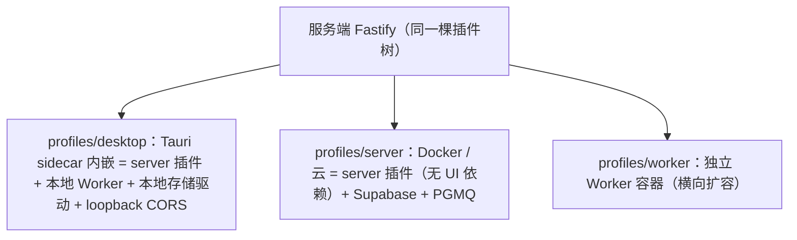
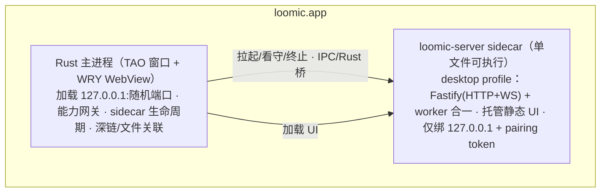

# 多端产品设计（桌面 / 自托管 / 云 / Web / 移动）

> 状态：**计划稿（概念阶段，未实施，不含代码）**。本文合并原《多端产品架构计划》与《桌面端与多端架构计划》。
> 定位：《改造计划》的**姊妹文档**——承接其 §4.8 存储窄缝（升级为 `ctx.storage` 一等缝）与 §4.9 profile 机制，落地多端形态。本文新增的 ctx key（`persistence`/`storage`/`toolsGateway` 等）须同步《改造计划》§4.2。
> 决策记录：2026-09-02 产品拍板，转向**桌面为主、三形态并存**（桌面全本地 / 自托管 / 云托管），继续 GPLv3 开源。上游地基：`docs/tech/改造计划.md`（插件内核 + BYOK 供应商缝 + design/code 双模式）。

---

## 1. 产品形态

### 1.1 三形态矩阵

| | 桌面全本地（主形态） | 自托管 | 云托管（现状演进） |
| --- | --- | --- | --- |
| 服务端 | Tauri 内嵌 sidecar（本机进程） | Docker Compose（用户机器/NAS/VPS） | 平台托管 |
| 数据存储 | 本机（PGlite/SQLite，Spike S2 定） | 自托管 Postgres + 对象存储 | Supabase |
| BYOK Key | OS 钥匙串 | 服务端加密落库 | 服务端加密落库 |
| Worker 能力 | 完整（本机操控，过沙箱） | 部署机上的受限子集 | 不开放本机操控 |
| 认证 | local-trust（本机回环免登录） | 单用户 token / 多用户 auth | Supabase JWT |
| 适用 | 个人创作者（默认） | 团队 / homelab / 多端同步 | 不想自管的基础用户 |

### 1.2 客户端形态与优先级

| 形态 | 技术 | 角色 | 数据位置 | 优先级 |
| --- | --- | --- | --- | --- |
| 桌面端（主形态） | Tauri 2（mac/win/linux） | Web UI + 内嵌服务端 sidecar + 本地 Worker + 沙箱宿主 | 本机 | P0 |
| 自部署服务端 | 同一服务端代码，Docker | 无头 server + worker，多用户工作区，BYOK | 自选数据库 | P1 |
| Web 客户端 | Next.js 静态导出（现有 `apps/web`） | 浏览器连任意服务端（桌面 loopback 或远程） | 跟随服务端 | P1 |
| 移动客户端 | Tauri 2 Mobile（iOS/Android） | 瘦客户端，QR 配对连服务端 | 跟随服务端 | P2 |
| 移动 Worker | 同上，受限能力节点 | 分享流入/相机/语音/通知；无 shell、无任意文件访问 | 端侧受限 | P3 |

**统一原则**：一份服务端代码，三种部署；一份 Web UI，三种外壳（Tauri 桌面窗口 / 浏览器 / Tauri 移动 WebView）。桌面端不是独立产品，而是「服务端 + 客户端」在本机的整体封装——数据天然本地优先，Web/移动端连接任意一个服务端实例。

### 1.3 设计原则（继承仓库准则）

1. **单一 UI 产物、单一服务端代码库**：形态差异只表达为 profile 装配差异，不为桌面写第二套后端、不 fork 前端。
2. **能力即缝**：每个形态差异（存储/认证/队列/凭证/本机工具）都是缝三元组，禁止 `if (isDesktop)` 散弹式分支。
3. **BYOK 与隐私优先**：数据与 Key 的默认存放位置随形态下沉到用户侧。
4. **内存是硬指标**：不用 Electron 是起点不是终点（§10）。

---

## 2. 参考架构提炼

### 2.1 nomifun 桌面模式（`references/nomifun-tauri`）

- **Tauri 2 + 内嵌 server**：Rust 后端以 embedded-server 形式随应用进程运行；非 Electron，用系统 WebView；React UI 产物作为资源打包。
- **能力 crate 化**：computer-use（screen/input/permissions/launch）、PTY 终端、文件、shell、SSH、浏览器平台各为独立 crate，由组合根按配置装配。
- **移动端不重写能力，只复用桌面会话**：桌面开「WebUI 访问」后，移动扫一次性 QR 配对，直接复用会话、任务与能力。
- **本地存储**：SQLite + 内嵌迁移 + repository traits。

### 2.2 dsh 沙箱模型（`references/deepseek-harness`）

- **三档囚禁**：`read-only` / `workspace-write` / `danger-full-access`；被策略拒绝的调用可经用户批准的**一次性行内提权**重试。
- **每平台后端**：Linux bwrap→Landlock、macOS Seatbelt、Windows 受限令牌 + ACL；共享策略解析器按部署默认值 + 会话级覆盖解析每次调用策略。
- **fs / subprocess 缝职责分离**：`ctx.fs`（后端可换 host/sandbox-enforcing）+ `ctx.subprocess`（子进程唯一出口）+ 模型侧工具（read/write/edit/glob/grep）——**后端更换不触碰工具与策略**。

---

## 3. 统一服务端：一份代码，三种部署

延续《改造计划》§4.9 的 profile 机制，新增部署维度：



核心决策：

- **D1 桌面 = 壳 + 内嵌服务端，不是纯客户端**：本机文件/沙箱/操控类 Worker 能力必须有本地运行时，顺带获得离线可用与 Key 本地化。
- **D2 服务端零分叉**：复用 `apps/server` 全部代码；桌面 = 新增 `profiles/desktop.ts`（server + worker 合并为**单进程**，队列换实现）。
- **D3 UI 单产物**：`apps/web` 已是 `output: "export"`；桌面 WebView 与自托管 server 托管**同一份静态文件**。前置改造：`NEXT_PUBLIC_SERVER_BASE_URL` 等构建期烘焙值必须改为**运行时注入**（Tauri 启动参数 / `window.__LOOMIC_RUNTIME__` / 相对路径），否则无法在「内嵌/远程服务端」间切换。
- **D4 sidecar 打包**：目标 = 单文件 Node 服务端可执行（Spike S1）。
- **D5 移动端 = 瘦客户端 + 受限 Worker 子集**：iOS 无 JIT、无后台常驻、文件系统沙盒化，sidecar/Node 在 iOS 不可行——平台硬约束。
- **D6 网络自带（BYON）**：产品不做内网穿透/中继；手机连桌面走 LAN（mDNS + QR 配对），跨网走用户自有通道（Tailscale / 自有 VPS 反代）。

---

## 4. 桌面端架构（Tauri 2）

**为什么不是 Electron**：Tauri 用系统 WebView（WKWebView / WebView2 / WebKitGTK），不打包 Chromium，最小应用在 KB 量级，内存与体积是数量级差距。代价：三端 WebView 行为差异要当一等公民测（尤其 Linux WebKitGTK 跑 Excalidraw，Spike S3）。

**进程模型**：



- **Sidecar 方案（推荐 A）**：A. Node 独立可执行（Node SEA 或 `bun build --compile`）——零重写，服务端插件树原样运行，代价常驻约 80–150 MB；B. Rust 重写内核——内存最优但等于大爆炸重写，仅远期选项；C. Rust 直接实现能力无 sidecar——丢失「自部署同一套服务端」统一性，否决。
- **Rust 层保持薄**：只做 Tauri 擅长的系统胶水（窗口/托盘/自更新/深链/Keychain/沙箱 OS 调用），业务一律在 sidecar——保证桌面与自部署行为一致。
- **Tauri 插件清单**：`shell`（sidecar 管理）、`fs`（scope 受限）、`dialog`、`notification`、`clipboard-manager`、`global-shortcut`、`deep-link`、`autostart`、`single-instance`、`updater`、`stronghold`/`keyring`（钥匙串）。
- **打包与更新**：`externalBin` 声明 sidecar（按 target triple 分发三平台二进制）；`tauri-plugin-updater` + 自托管更新清单。签名成本：macOS 公证（Apple 年费）、Windows 代码签名证书、Linux 无强制。

---

## 5. 服务端新增能力缝（对《改造计划》的补充）

前置：《改造计划》P0–P8 完成后开工。全部按三元组设计，新增 ctx key 须同步《改造计划》§4.2。

| 缝 | Definition | Provider（按形态） | Consumer |
| --- | --- | --- | --- |
| `persistence`/`storage`（新增） | 各聚合 repository 接口（projects/canvas/threads/…）+ blob + queue | cloud/selfhost = Supabase；local = 嵌入式 PG | 各 feature 插件 |
| `auth`（既有，加实现） | `RequestAuthenticator` | cloud/selfhost = Supabase JWT；local/selfhost 单用户 = 本地 token | HTTP 中间件、ws |
| 队列（`jobs` 下可替换） | JobService 队列接口 | server/selfhost = PGMQ；local = 同进程 SQLite 队列（`node:sqlite`/`bun:sqlite`，避免原生模块进 sidecar） | worker profile |
| 凭证（`modelProviders` 内 SecretStore） | `SecretStore` 接口 | cloud/selfhost = 服务端加密表；local = OS 钥匙串（经 Tauri IPC） | 模型实例化 |
| `toolsGateway`（新增） | 本机工具调用统一闸门（scopes 校验 / 确认策略 / 审计） | desktop = Tauri IPC → Rust 执行器；selfhost = HTTP 到部署机 agent 执行器 | `ctx.tools` 本机类工具 |

**存储缝是本计划最大单项工程**（《改造计划》曾明言关系数据不做抽象，本文正式重启它）。两条路线，Spike S2 定夺：

- **路线 A（推荐）：嵌入式 Postgres（PGlite，WASM）**——直接重放 `supabase/migrations/` SQL（方言一致，无第二套 schema 漂移）；RLS 在单用户 local 模式用固定本地角色或裁剪；需 local 兼容迁移层（auth/storage schema 物化为本地表、剔除 Supabase 专有对象）。最大优点：迁移账本与生产同源。
- **路线 B：SQLite + 平行 schema**——实现轻，但打破「`supabase/migrations` 唯一迁移源」红线，schema 双维护漂移风险长期存在。
- 节奏：repository 接口抽取跟随《改造计划》P3 的 feature 迁移**同步进行**，不另起大迁移。PGMQ：local 队列不追求 PGMQ 语义对齐，实现同一 JobService 接口即可（executor 契约不变）。

---

## 6. 能力节点（Worker）体系

现有 `registerExecutor()` 升级为**能力节点模型**，统一四种执行位置：

```text
Server（云/自部署/桌面内嵌）
  ├── 内置 Worker（进程内或本机 sidecar，现有形态）
  ├── 独立 Worker 容器（Docker 横向扩容）
  ├── 桌面 Worker（本机：沙箱内 shell/文件/computer-use，经 Rust 桥）
  └── 移动 Worker（受限：分享流入/相机/语音/通知）
```

- **节点注册**：Worker 启动后向服务端认证并声明 `capabilities: ["image_generation","video_generation","local.shell",...]`；服务端维护节点表（心跳、负载、能力清单）。
- **任务路由**：任务类型 → 需要的能力 → 路由到具备该能力的节点；桌面本机任务优先本机节点（数据不出机），云端生成类任务可路由到任意节点（BYOK 凭证随任务加密下发或节点自持）。
- **桌面特殊性**：本机 Worker 的 `local.*` 能力必须过 §7 沙箱与权限；云端/容器 Worker 默认全量能力（服务端即信任边界）。

**本机 Worker 能力清单**：

| 能力 | 载体 | 阶段 |
| --- | --- | --- |
| 文件读写/搜索/移动（scope 到授权目录） | Rust fs + 权限闸门 | D5 |
| Shell 执行（白名单 + 确认） | Rust 沙箱包装进程 | D5 |
| 剪贴板/通知/打开 URL 与应用 | Tauri 插件 | D5 |
| 目录监听、文件索引 | notify/walkdir + ignore | D5 |
| 截图 | xcap | D5 |
| 浏览器自动化 | CDP 控制用户自有浏览器（不内嵌） | D5+ |
| 输入操控（computer-use 级） | enigo | 远期（默认关闭，显式开启） |

---

## 7. 沙箱与权限体系

**与《改造计划》§4.6 的分工**：`permissions` 策略缝（default/auto-approve/full-access）是**跨形态**的 tool-call 拦截策略（挂 `tool-pre-execute` 事件）；本节沙箱是**桌面形态的执行后端**——策略决定「要不要拦」，沙箱决定「拦不住时如何隔离」。两者分离，后端更换不触碰策略与工具。

- **三档模式**（沿用 dsh 词汇）：`read-only` / `workspace-write`（默认，工作区可写）/ `danger-full-access`（明示开启，二次确认）；另有**一次性行内提权**：被拒调用弹窗说明原因，用户批准后单次放行。
- **平台后端**：macOS Seatbelt（`sandbox-exec`）、Linux bwrap→Landlock、Windows 受限令牌 + Job Object + 工作区 ACL——Rust 层实现 OS 调用，sidecar 经 Tauri IPC/Rust 桥使用（dsh 的 landlock node addon 证明 Node 进程内同样可行，作备选路径）。
- **toolsGateway 权限模型**：每个工具声明 scopes（路径范围/命令模式/网络 egress 域）；三态策略 allow/ask/deny，**默认 deny**；ask 弹 Tauri 原生确认框（记忆粒度：本次/本会话/永久）；全量审计日志（谁/何时/动作/参数摘要/结果摘要，含敏感内容脱敏）。
- **沙箱分层（务实渐进）**：L0（D5 必须）闸门 + 路径 allowlist + 路径穿越防护 + egress 默认拒绝；L1（D5 分平台）Seatbelt/Landlock+bwrap/受限令牌包裹子进程；L2（远期）网络 egress 强制过代理点，agent 网络请求全审计。
- **威胁模型（「能操控本机」的产品，一号风险是 prompt injection）**：任何不可逆/越权动作必过人审闸门，agent 无「自我授权为永久」路径；网页/文档/工具结果进上下文前清洗注入模式；恶意工作区内容不得扩大 scopes；loopback 上所有 HTTP/WS 校验 pairing token + Origin，防本地 CSRF 式劫持。
- **computer-use**（远期）：对标 `nomi-computer`，v1 先做屏幕截图 + 受控输入，画布/编码场景优先级低于文件与 shell。

---

## 8. 移动端

Tauri 2 同库出 iOS/Android，UI 复用静态产物（另做响应式适配层）。

| | iOS | Android |
| --- | --- | --- |
| 瘦客户端（画布/对话/审批/通知） | 是 | 是 |
| 媒体采集（相机/相册/语音） | 是（picker 沙盒内） | 是 |
| 分享入（系统分享到 Loomic） | 是 | 是 |
| 后台任务 | 仅 BGTask 窗口内短任务 | 前台服务（常驻通知） |
| Shell / 文件系统 | 否（平台禁止） | 受限提供（默认关闭） |
| 承载服务端 | 否（不可行） | 否（非产品方向） |

「手机 Worker」定位为 **capability 子集**：手机作为受限执行端挂到用户选定的服务端（桌面或自托管），不承载服务端本体。连接：mDNS 发现 + QR 配对（pairing token 交换并存钥匙串）；跨网 = 用户自有通道（D6）。

---

## 9. 自托管（Docker）

- 基线已有（server 已有 Dockerfile），扩展为官方 Compose：`server`（托管静态 UI）+ `worker` + `postgres`（pgmq）+ `minio`（对象存储）+ 可选 auth 组件。server 与 worker 可合并为单镜像双 profile 启动（《改造计划》profile 机制的自然产物），降低 compose 复杂度。
- **认证两档**（§14 决策）：单用户 token（家庭/单人，零外部依赖）与多用户（Supabase self-host 或等价 auth）。
- **升级纪律**沿用仓库「数据库迁移」章节：镜像版本与迁移账本绑定、先备份、只前向修复、禁止覆盖校验和。

---

## 10. 内存与性能预算

| 组成 | idle 目标 | 工作态目标 |
| --- | --- | --- |
| WebView（画布/编码页） | 120–180 MB | 300 MB |
| loomic-server sidecar | < 150 MB | 400 MB（含 agent 运行） |
| Tauri Rust 主进程 | < 60 MB | 80 MB |
| **桌面合计** | **≤ 350 MB** | **≤ 800 MB** |
| 移动瘦客户端 | < 150 MB | 无 sidecar，仅网络客户端 + 受限 Worker |
| 安装包 | < 100 MB（不含 WebView 运行时） | 系统 WebView 复用；sidecar 压缩分发 |

优化手段：server + worker 单进程合并（D2）；LangChain/deepagents 等重依赖懒加载（首次对话才 import）；local 模式不加载 Supabase SDK；单 WS 连接复用全部事件流；画布大对象虚拟化、按需加载。持续手段：启动后打印挂载树与各进程 RSS（开发模式）；内存回归纳入 workspace 测试门禁（超阈值告警）。

---

## 11. 安全与隐私

- **本地服务面**：仅绑 127.0.0.1、随机端口、pairing token 全量校验；HTTP/WS 复用现有鉴权缝。
- **Key 红线不变**：只写不读、日志脱敏、前端永不回显；local 模式 Key 落 OS 钥匙串，经凭证缝读取，明文只在服务端内存短暂持有。
- **遥测默认关**；审计数据本地存。
- **供应链**：GPL 仓库引入新依赖需过许可兼容检查（§12）。

---

## 12. 开源策略（GPL）

- **许可证（决策点，推荐组合）**：客户端/桌面端 **GPL-3.0**；服务端 **AGPL-3.0**（网络服务条款防他人拿服务端开 SaaS 却不回馈）。若偏好单一许可证，统一 AGPL-3.0。已知取舍：纯 GPLv3 无网络条款，他人把改版当 SaaS 托管不触发开源义务——初期建议纯 GPLv3 降门槛，商业化前重评是否对 `apps/server` 单独 AGPL（§14）。
- **插件生态边界**（写进 README/CONTRIBUTING）：经公开扩展点 API（ctx key / 缝接口）、独立仓库独立分发的插件视为独立作品，作者自选许可；仓库内插件目录并入 GPL（GCC 插件同款立场）。
- **依赖兼容审计**：现有依赖（MIT/Apache-2.0/BSD）均与 GPL-3 兼容；`references/` 项目仅作参考（dsh MIT、nomifun Apache-2.0），移植思路不复制代码，引用代码需保留版权声明。
- **贡献基建**（随桌面端首发）：CONTRIBUTING.md + DCO（`Signed-off-by`，轻于 CLA）+ 行为准则；issue/PR 模板；`good first issue` 引流；双语 README（中/英）。
- **治理与品牌**：商标与名称保护（注册 Loomic，商标与代码分离——GPL 授代码权不授商标权）；赞助/资金通道（OpenCollective）后置。
- **仓库结构**：维持单 monorepo（apps/desktop、apps/server、apps/web、packages/*、crates/* 随桌面端加入），开源起步不分仓。

---

## 13. 路线图（衔接《改造计划》P0–P8）

**前置铁律**：《改造计划》P0–P8（内核 + 事件缝 + feature 插件化 + 基础能力层 + code 能力 + 双模式 preset）必须先完成。profile 机制、feature 插件形状、`ctx.tools`/`permissions` 缝是本计划地基；存储缝重启也依赖 feature 先收拢成插件。

| 阶段 | 内容 | 验证门 |
| --- | --- | --- |
| **Spike S1–S4** | S1 sidecar 打包（bun compile vs Node SEA）；S2 存储缝（PGlite 重放迁移 vs SQLite 平行 schema）；S3 WebKitGTK 跑 Excalidraw；S4 现有 server 本地 idle RSS 基线 | 每项出结论文档 |
| **D1 存储缝** | `ctx.storage`/`persistence` 四接口 + repository 抽取（跟随 P3 同步）；Supabase 驱动收拢 | 契约评审 |
| **D2 桌面壳** | Tauri 工程入库；Web UI 静态产物接入 WebView；sidecar 跑通 loopback；`NEXT_PUBLIC_*` 运行时注入；local-trust 认证；托盘/自更新 | 三平台出包；画布可用；离线可用；内存达预算线 |
| **D3 本地存储驱动** | PGlite + 同源迁移执行 + 进程内队列；桌面端到端离线可用 | 离线冒烟 |
| **D4 能力节点** | 节点注册表 + 能力路由；桌面本地 Worker（进程内）；独立 Worker 容器镜像 | 能力路由冒烟 |
| **D5 沙箱与权限** | 三档模式 + 三平台后端 + toolsGateway + 授权矩阵 UI + 行内提权；文件/shell/截图工具 | 越权用例全拒；prompt injection 不逃逸；审计可回放 |
| **D6 自部署与 Web** | Docker Compose 全家桶 + 桌面 remote 模式（URL/配对切换）+ Web 客户端服务端切换 + QR 配对 | compose up 全链路；双形态切换；QR 配对 |
| **D7 移动端** | Tauri 2 Mobile 瘦客户端 + QR 配对复用会话 + 受限移动 Worker | 双平台真机过 §8 能力矩阵 |
| **OS-0 开源基建** | 许可证落位、DCO、CONTRIBUTING、双语 README、插件仓库规范 | D2 前完成 |

顺序铁律：**先服务端内核与双模式（P0–P8），后桌面（D1–D3），再本机能力（D4–D5），客户端形态最后（D6–D7）**——每层能力都依赖服务端缝先就位，避免为壳先写业务；桌面 POC（D2）完成前不启动移动端（D7）。

---

## 14. 待决策清单（开工前拍板）

1. **Sidecar 方案**：A（Node SEA/bun compile，推荐）/ B（远期 Rust 内核移植）。
2. **本地 DB**：PGlite（推荐，SQL 同源、复用迁移）/ SQLite（更小更快，需迁移转译层）。
3. **许可证组合**：客户端 GPL-3.0 + 服务端 AGPL-3.0（推荐）/ 统一 AGPL-3.0 / 初期纯 GPLv3。
4. **自托管认证档位**：单用户 token 是否首发档；多用户档何时做。
5. **计费口径**：BYOK 免费 + 平台托管计费的保守方案是否适用桌面/自部署（建议：桌面与自部署无平台计费，credits 仅存在于云端托管形态；`credits/tierGuard/payments` 在 desktop profile `enabled=false`）。
6. **移动 Worker 能力边界**：v1 是否仅「分享流入 + 通知」（建议是）。
7. **computer-use 优先级**：画布/编码场景是否需要 v1（建议否，D5 后评估）。
8. **商业化形态**：GPL 下卖什么——托管服务、官方增值模型池、企业支持。

---

## 15. 风险与非目标

| 风险 | 等级 | 对策 |
| --- | --- | --- |
| 存储缝工作量失控（最大单项） | 高 | 路线 A/B 由 Spike 早定；repository 逐聚合迁移；local 首版只覆盖核心聚合（画布/对话/设置） |
| Bun / SEA 兼容性 | 高 | S1 先行；兜底内嵌 Node runtime 随包分发 |
| 多线并行带宽不足 | 高 | 严格按拓扑序；D2 完成前不启动 D7 |
| Linux WebKitGTK 画布性能/碎片化 | 中 | S3；CI 矩阵覆盖三平台；不可接受则 Linux 降级为「自托管 + 浏览器使用」 |
| Node sidecar 内存与冷启动 | 中 | 预算门禁（§10）；懒加载插件；超标评估 bun compile 或内核 Rust 化 |
| PGlite 与 Supabase 行为差异（RLS/扩展） | 中 | repository 接口层隔离；RLS 属服务端层不在 local 复现；差异清单随 D3 维护 |
| `NEXT_PUBLIC_*` 动态化改动面 | 中 | D2 首个 PR，靠编译器牵引 |
| 沙箱逃逸 / 本机能力滥用 | 中 | 默认 workspace-write；能力默认关闭明示授权；提权审计；full-access 二次确认 |
| Tauri Mobile 成熟度（iOS 审核/生态） | 中 | 移动端排最后（D7）；不可行退化 PWA 连服务端 |
| GPL 审计疏漏引入不兼容依赖 | 低 | 依赖变更走 license 检查（纳入 hygiene 门禁） |

**非目标（明确不做）**：不做 Electron；不做 Rust 全栈重写；不做 P2P 多机数据同步（多端连同一服务端，v1 无 CRDT）；不做 iOS/Android 原生独立 App（Tauri Mobile 或 PWA 二选一）；不做内网穿透/中继服务（BYON）；云端多租户计费体系不在本计划（沿用现有 credits，仅云端形态启用）；第三方插件安装/分发生态暂缓（见《改造计划》§6 决策 8）。
