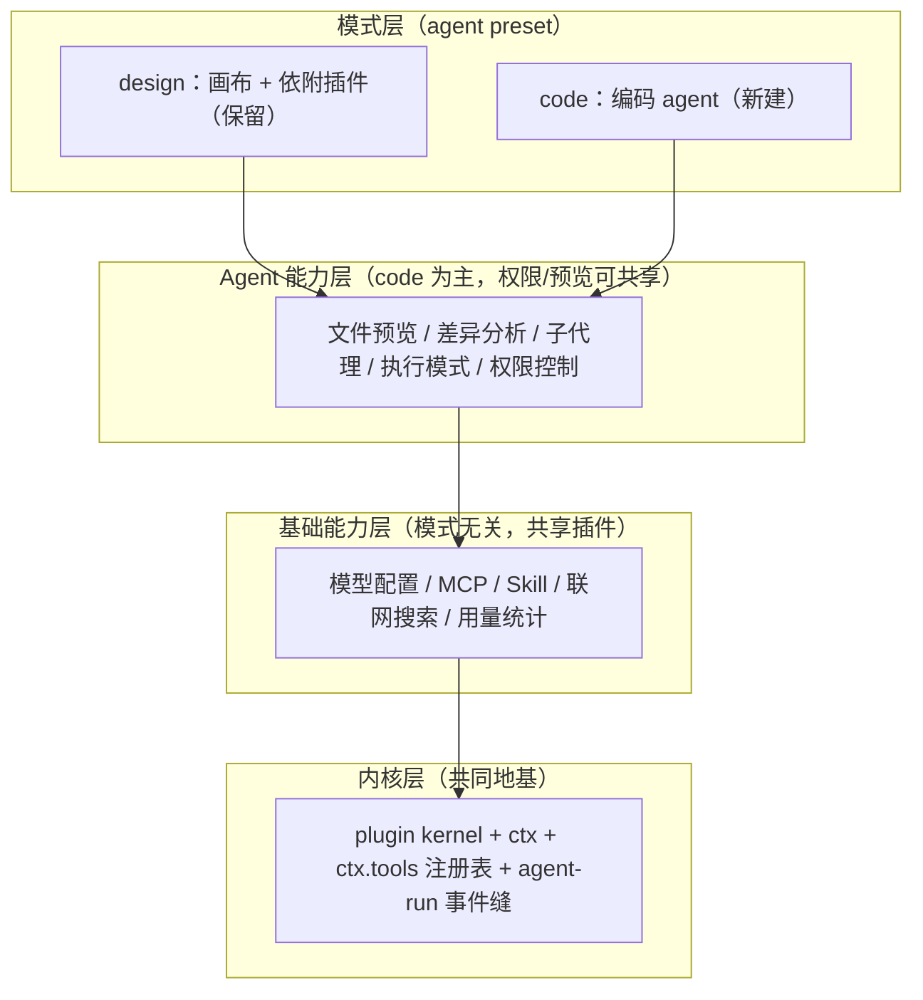

# 改造计划（插件内核 × BYOK × design/code 双模式）

> 状态：**已定稿（2026-09-12 `DEC-1`…`DEC-8` 拍板，结论与理由见 §6/§6.2），实施中**——按 §7 拓扑序逐 PR 推进，每个 PR 行为不变、测试护航。本文合并原《插件化改造计划》，并纳入 `docs/future/03-改造建议与路线.md` 的 **design / code 双模式**产品决策。多端形态（Tauri 桌面 / Docker 自托管 / Web / 移动，**已去云托管**）见姊妹文档 `docs/tech/多端产品设计.md`。
>
> 上游理念：deepseek-harness（dsh）「一切皆插件」+ nomifun 供应商架构 + Cherry Studio BYOK。

---

## 1. 产品方向与范围

### 1.1 BYOK Work 平台 + design/code 双模式

Loomic 是 **BYOK（用户自带 Key）自定义供应商/模型**的 Work 平台，产品分两种模式：

- **design 模式（保留不动）**：现有画布创作能力 + 依附画布的插件（Excalidraw 编辑、`inspect/manipulate/screenshot_canvas`、brand-kit、图/视频生成、canvas-design skill、首页示例/发现库）。本次**不重构**，只在装配层归入 design preset。
- **code 模式（新建）**：编码 agent 能力——文件预览、差异分析、子代理、执行模式、权限控制。
- **基础能力层（两模式共享）**：模型配置、MCP、skill、联网搜索、用量统计——抽象为模式无关的共享插件。

**存储方向（2026-09-11 决策）**：去 Supabase 云托管，存储统一为**自管 Postgres**（桌面捆绑本机实例 / 自托管连用户 Postgres），形态收敛为「桌面本地 + 自托管」两种，不做平台 SaaS 云。现状代码仍运行在 Supabase 上（Auth / Postgres / Storage / PGMQ / RLS），去 Supabase 是独立大工程，迁移路径见《多端产品设计》§5。

### 1.2 两个「模式」概念必须分开

| 概念 | 含义 | 实现维度 | 取值 |
| --- | --- | --- | --- |
| **产品模式** | 装配哪套业务能力（画布 vs 编码） | agent preset / profile（装配级） | `design` / `code` |
| **agent 执行模式** | code 模式内 agent 的运行方式 | agent 运行时（会话级） | `plan` / `agent` / `goal` / `loop` / `solo` |

产品模式用 dsh 的 preset 机制承载（「给一个会话不同能力集 = 组合一个 agent preset」），切换轻量、无需重启；agent 执行模式只在 code preset 内有意义（见 §4.6）。

### 1.3 现状与目标差距（BYOK）

| 维度 | 现状（SaaS，env 驱动） | 目标（BYOK 双模式） |
| --- | --- | --- |
| 模型目录 | `http/models.ts` 硬编码静态数组 | 从用户供应商实例动态推导 |
| 供应商凭证 | 服务端 env（openAI/google/replicate/volces/metaso Key） | 用户自带 Key，按工作区存储、按需实例化 |
| agent 模型 | `deep-agent.ts` 按 env 三选一 | 按用户选定供应商实例 + 模型实例化协议适配器 |
| 图/视频生成 | `generation/providers/` 按 env 注册 | 协议适配器固定，实例来自用户配置 |
| agent 能力 | 无 MCP / 无执行模式 / 无通用权限 / 无用量统计 / 子代理仅 1 个 | 抽象为共享基础能力 + code 能力层插件 |
| 存储/认证 | Supabase 直连散布各 feature（Auth/Postgres/Storage/PGMQ/RLS） | 去 Supabase 云，统一自管 Postgres + repository 缝；认证换 local-trust / 自管 auth |

---

## 2. dsh 理念提炼与裁剪决策

### 2.1 借鉴的八条理念

1. 插件是唯一扩展方式（挂载新插件，而非改核心）；2. Context 是服务仓库（认领稳定 `ctx.<key>`，按 key 发现）；3. `inject` 声明依赖（拓扑表达加载序）；4. 事件即扩展点（waterfall/serial/bail 拦截）；5. 注册即可逆副作用（`ctx.effect()` 返回 disposer）；6. Profile 与 Bundle（有序层组合，`--dump-config` 可观测）；7. 能力缝三元组（Definition + Provider + Consumer）；8. 配置目录化 + fail loud。

### 2.2 裁剪决策

| 考量 | 结论 |
| --- | --- |
| Cordis 处于 developer preview，明示会有破坏性变更 | 不引入 Cordis 本体 |
| dsh 的 profile/patch/热重载服务于「可组合发行版」 | 不引入 YAML 组合层 |
| 简洁优先、禁止大爆炸重写、不为投机灵活性堆抽象 | 自建约 150 行内核（依赖注入 + 拓扑挂载 + 显式覆盖） |
| **v3 修订：agent 能力层要可插拔** | **松绑「不建事件总线」——只加 3 个 agent-run 拦截事件（§4.3），不建通用总线** |

**v3 关键修订说明**：原计划把事件系统列为非目标，但 code 模式的执行模式、权限、用量统计都要挂钩 agent 主循环；没有拦截缝，它们只能硬编码进 loop，「一切皆插件」名不副实。故只松绑**最小事件缝**（3 个事件），仍不建通用事件总线。

### 2.3 与 dsh / Cordis 的关系：接口对齐 + 协议互操作，不做插件包兼容

Cordis 与 dsh 均处 developer preview（rc 版，官方明示破坏性变更随时发生），且 dsh 插件深度绑定其自有 core 运行时（`ctx.agentLoop` / `ctx.sessions` / `ctx.tools` / `ctx.llm` / `ctx.systemPrompt`）——Loomic 运行时是 deepagents + LangChain + LangGraph，两套 agent 内核不通用。故按四个层次区别对待：

| 层次 | 含义 | 决策 |
| --- | --- | --- |
| L1 插件包互通 | dsh 的 `@deepseek-ai/dsh-*` 插件直接装进 Loomic 跑 | **不做**：等于实现 dsh 全套 core 服务契约 = 把 Loomic 重构成 dsh 发行版，放弃 deepagents 与 design 模式差异化 |
| L2 接口形状对齐 | kernel 的 `name/inject/apply(ctx)` + `ctx.effect()`/`ctx.on()` 签名对齐 Cordis | **做**：心智复用、迁移摩擦小；但仅设计借鉴，不等于插件可互通 |
| L3 语义约定对齐 | ctx key 命名、`mcp__<server>__<tool>`、事件名 `agent/*`、能力缝三元组 | **做**：概念可迁移、文档可参照 |
| L4 生态/分发兼容 | dsh 的 bundle/profile/patch 格式、`dsh plugin add`、`dsh-plugin` topic | **暂缓**：依赖被拒的 YAML 组合层；dsh 生态尚小且绑定其运行时 |

**协议级互操作（真正现实的「兼容」）**：不要求任一方放弃运行时即可共享生态——

- **MCP**（必做）：工具级开放标准，同一 MCP server 两边通用，工具生态天然共享（见 §4.5）。
- **ACP**（Agent Client Protocol，候选）：dsh 有 `acp` profile 与 `subagent-acp`；Loomic 支持 ACP 后可与 dsh 等外部 agent 互相委托/编排，作为 §4.6 子代理缝的一种 provider。适配成本待评估。

**重新评估 L1/L4 的触发条件**：① Cordis/dsh 脱离 preview 出稳定版并冻结 API；② dsh 生态出现 Loomic 可直接消费的高价值插件；③ Loomic 决定做第三方插件热插拔生态（DEC-8）。三者同时成立前维持本节结论。

---

## 3. 当前诊断

### 3.1 已有萌芽缝（改造地基）

生成 provider 注册表（`generation/providers/registry.ts` + `register-all.ts`）、任务 executor 注册表（`registerExecutor()`）、agent 后端工厂（`agent/backends/index.ts`）、HTTP 路由（`registerXxxRoutes(app, deps)`）、认证接口（`RequestAuthenticator`）。

### 3.2 痛点

- **装配层**：`app.ts` 是特权核心（行数 / import / 服务 / 路由 / `BuildAppOptions` 计数以《02-当前项目实现状态》§3.1 为准，本文不维护现状数字）——条件注册内嵌，新增 feature 改四处。
- **供应商主权**：模型目录、agent 模型、图/视频 provider 全按**服务端 env** 硬编码，用户无法自带 Key。
- **存储耦合**：各 feature service 直接持有 Supabase client 并 `.from()`。
- **注册清单漂移**：generation/executor 靠 server、worker 两处副作用 import 人肉同步。
- **agent 能力层薄**：MCP/联网/用量/模式/通用权限/差异分析缺失；子代理、工具注册表未成体系。

---

## 4. 目标架构：四层

### 4.1 分层总览



原则：**能力即缝**（三元组齐备）；**开放贡献、封闭 key**（`ServiceKey` 封闭，用注册表型 key 承接无限贡献）；**基础能力优先抽象**（共享 = ROI 最高）；**不推倒重来**（画布归入 design preset，不重构）。

### 4.2 ctx key 表（稳定契约；**本表是唯一权威副本**，AGENTS.md 与其他文档只引用、不复制清单）

| ctx key | 服务 | 层 | 备注 |
| --- | --- | --- | --- |
| `viewer` | ViewerService | 领域 | 用户/工作区引导 |
| `projects`/`brandKit`/`canvas`/`threads`/`chat`/`settings`/`uploads` | 各领域服务 | 领域 | design 侧为主 |
| `agentRunMetadata`/`agentPersistence`/`agentRuns` | agent 运行时三件套 | agent | — |
| `jobs` | JobService（PGMQ，Postgres 扩展） | 基础 | `enabled: 有 databaseUrl` |
| `credits`/`tierGuard`/`payments` | 计费三件套 | 基础 | 云托管移除后建议默认 `enabled=false`（待 DEC-5 拍板；`FORM-5` 为该决策的历史别名） |
| `admin` | AdminService（平台管理后台） | 基础 | 管理员判定 + 用户/额度/角色 + 系统供应商分发（`FORM-10`）；HTTP 面 `/api/admin/*` 全部服务端 403 门 |
| `generation` | 图/视频协议适配器注册表 | 基础 | 接受 ProviderInstanceConfig |
| `modelProviders` | 用户供应商实例管理（CRUD + 解析） | L2 基础 | 新增 |
| `modelCatalog` | 模型目录（用户供应商实例推导） | L2 基础 | 取代硬编码 `http/models.ts` |
| **`tools`** | 统一工具注册表（schema + 作用域 + guarded 执行） | L1 内核 | **新增**：MCP/skill/联网搜索/diff 等**模型可调用工具**向其贡献 |
| **`capabilities`** | 能力贡献者注册表（**非工具**能力：子代理 provider、执行模式、能力节点等） | L1 内核 | **新增**：开放贡献、封闭 key 的承载点 |
| **`permissions`** | 跨模式 tool-call 策略缝（default/auto-approve/full-access） | L3 | **新增** |
| **`usage`** | token/成本采集（按 workspace/provider/model/run） | L2 基础 | **新增** |
| **`agentModes`** | 执行模式缝（激活/切换/持久化当前模式） | L3 | **新增** |
| **`persistence`** | 自管 Postgres Provider（`pg` 连接池；**唯一 DB 入口**） | 基础 | **新增（M1，2026-09-13 落地缝）**：workspace 谓词须以 `:workspace` 占位符显式引用，由客户端绑定为末位参数，漏写即抛 `WorkspaceIsolationError`（`FORM-9`）；Provider 随形态替换（桌面捆绑 / 自托管用户 Postgres） |
| `auth` | RequestAuthenticator | 基础 | 目标 local-trust（桌面）/ 自管 auth（自托管）；Supabase JWT 为存量实现 |
| `backend` | agent 后端工厂 | agent | — |
| `ws` | ConnectionManager + EventBuffer | 基础 | — |

**`tools` 与 `capabilities` 的分界（防止同一能力两处注册）**：`tools` 只放「暴露给模型、有 JSON schema 的可调用工具」；`capabilities` 只放「不是工具的能力贡献者」。判定法——会写进模型工具列表的归 `tools`，由运行时按 key 解析实现、模型看不到的归 `capabilities`。故 **MCP / skill / 联网搜索 / diff 归 `tools`**（子代理分发工具 `task` 本身是工具，其 provider 集合归 `capabilities`），**执行模式 / 子代理 provider 归 `capabilities`**。

依赖拓扑（`inject` 依据，环即 fail loud；**只列真实依赖对，不构成全序**，下方为「先于」关系）：

- `auth`/`ws` 先于 `viewer`；`viewer` 先于领域服务、`modelProviders`、`tools`
- 领域服务先于 `chat`；`modelProviders` 先于 `modelCatalog`/`generation`/`usage`
- `tools` 先于 `capabilities`/`permissions`
- `modelProviders`/`capabilities`/`permissions`/`usage` 先于 `agentModes`/`backend`/`agentRunMetadata`/`agentPersistence`，后者先于 `agentRuns`（依赖最多，最后挂载）

`tools` **不依赖** `viewer`/领域服务——工具注册表只在执行时经 guard 取上下文，不要把它写成领域服务的下游（那是假依赖，会制造伪环）。表中其余 key（`payments`/`tierGuard` 等）不设固定档位，以各插件 `inject` 实际声明为准；compose 检测成环即在启动期抛错。

多端形态另引入 `storage`/`toolsGateway`/`blob`/`secret` 等存储与本机能力缝（见《多端产品设计》§5），落地时并入本表（本表是唯一权威副本，AGENTS.md 等其他文档只引用不复制）。`persistence` 已落地，见上表。

### 4.3 内核（`apps/server/src/kernel/`，约 150 行 + 事件缝）

```ts
// types.ts
export interface PluginDefinition {
    name: string;                            // 稳定 id，挂载日志与诊断
    inject: ServiceKey[];                    // 依赖的服务 key，compose 据此拓扑排序
    enabled?: (env: ServerEnv) => boolean;   // 缺省 true；payment/jobs 类开关收编于此
    apply(ctx: PluginContext): void | (() => void);  // 返回 disposer
}
// context.ts
export interface PluginContext {
    register<K extends ServiceKey>(key: K, factory: (deps: DepsOf<K>) => ServiceOf<K>): void;
    get<K extends ServiceKey>(key: K): ServiceOf<K>;   // 未注册即抛错（fail loud）
    effect(fn: () => void | (() => void)): void;
    on<E extends AgentRunEvent>(event: E, listener: ListenerOf<E>): () => void;  // v3 新增：最小事件缝
    app: FastifyInstance;
    env: ServerEnv;
}
// compose.ts
export function composePlugins(plugins: PluginDefinition[], overrides?: Partial<ServiceMap>): () => void;
```

**agent-run 最小事件缝（v3 新增，只 3 个）**：`pre-step`（waterfall，决定模型看到什么、可改写/拒绝）、`tool-pre-execute`（waterfall，权限/审批拦截）、`turn-stopping`（serial，收尾）。waterfall 监听器必须调 `next()` 委托。这是执行模式/权限/用量做成插件的前提。职责边界：**服务单例语义归 kernel ctx，HTTP 封装语义归 Fastify `app.register()`**。

### 4.4 能力缝三元组

可替换能力 = **Service Definition**（接口）+ **Service Provider**（实现）+ **Consumer**（消费方，常是模型侧工具）。只写实现不声明接口与消费方的「半个缝」不合入。

### 4.5 基础能力层（L2，模式无关共享）—— 本次重点

全部挂到 preset 之外的共享 ctx 服务；两个 preset 按 scope 过滤各自工具子集，做到**能力共享、激活按模式**。

| 基础能力 | 抽象为 | 挂载点（见 §4.2） | design 消费 | code 消费 |
| --- | --- | --- | --- | --- |
| 模型配置 | 协议适配器缝 + catalog | `modelProviders`/`modelCatalog` | 图/视频选模型 | 对话/编码选模型 |
| MCP | mcp-client 插件：连 server → 工具注册进 `ctx.tools`，命名 `mcp__<server>__<tool>` | `tools` | 可用 | 可用 |
| Skill | skill 插件：SKILL.md 发现 → 向 `ctx.tools` 贡献 | `tools` | canvas-design | 编码类 skill |
| 联网搜索 | `web_search` 工具插件（BYOK 搜索供应商） | `tools` | 可选 | 常用 |
| 用量统计 | agent 链路读 LangChain `streamUsage` + 直连生成链路读 job 回调 → `usage` 表 | `usage` | 是 | 是 |

要点：`ctx.tools` 是统一注册表（MCP/skill/搜索同一挂载点，带 schema/scope/guard）；模型配置一张供应商实例表（capability 标注区分聊天/图/视频）；用量统计是横切关注点（不改各能力），**采集点两处，均不新增事件**：

- **agent 链路**：token/成本来自 LangChain `streamUsage`——它是**模型实例化参数**，在 `modelProviders` 实例化模型时开启，属基础能力层内部实现；agent-run 事件缝只负责把用量**归属到 run** 与收尾结算。不要声称「用量挂在 agent-run 事件上采集原始 token」——`pre-step`/`tool-pre-execute`/`turn-stopping` 三个事件都拿不到原始 token。
- **直连生成链路**：画布 `/generate` → PGMQ job → worker，不经 agent 主循环，在 job executor 完成回调处按 job 维度采集。

两处落同一张 `usage` 表（credits 关闭后 usage 是唯一计量，直连生成不能留盲区）。skill 已有实现，收敛为缝即可。

### 4.6 agent 能力层（L3，code 模式主体）

| 能力 | 做成什么 | 依赖缝 | 参照 dsh |
| --- | --- | --- | --- |
| 文件预览 | `ctx.tools` 读取/预览工具 + 前端面板（代码高亮/图片/PDF/产物） | tools | deepagents `read_file`/`ls`/`glob` |
| 差异分析 | diff 工具 + UI（版本 diff、编辑前后对比；design 可复用为画布 diff） | tools | 代码 diff |
| 子代理 | 从 1 个扩为缝：Definition + 多 Provider（in-process fork/spawn/委托；**ACP provider 可委托给 dsh 等外部 agent**，见 §2.3） | capabilities | `subagent/*` |
| 执行模式 | `agentModes` 轻量缝（激活/切换/持久化）+ 每模式独立产品包 | capabilities + 事件 | `plan/plan-mode` |
| 权限控制 | 跨模式 `permissions` 策略缝，挂 `tool-pre-execute` | permissions + 事件 | `guard/* + sandbox + approval` |

**执行模式语义**（产品定义，边界待细化）：`agent`（默认自主循环）、`plan`（先规划待批准再执行）、`goal`（同会话目标驱动）、`loop`（循环直到满足）、`solo`（单 agent 不派子代理）。**克制原则**（学 dsh）：模式是「引导不是强制」，限制靠权限/沙箱不靠模式过滤工具；缝只管激活/切换/持久化，各模式逻辑独立成包，不做大一统 mode 引擎。

**权限三档**：`default`（危险/不可逆操作 ask，记忆粒度本次/本会话/永久）、`auto-approve`（命中已批准策略自动放行）、`full-access`（不限制，二次确认 + 审计）。沙箱（read-only/workspace-write/danger-full-access）是**桌面形态执行后端**，与策略缝分离——策略决定要不要拦，沙箱决定拦不住时的隔离。一号风险是 prompt injection：不可逆动作必过人审，agent 无「自我授权为永久」路径。

### 4.7 模式层（L4，design/code preset）

- **design preset** = 现有画布能力集 + §4.5 基础能力层。**纪律**：不为双模式重构画布代码，只声明能力集，行为不变、测试护航。
- **code preset** = §4.6 agent 能力集 + §4.5 基础能力层 + 编码类 skill/工具。
- **permissions 缝的模式归属**：`permissions`（§4.6）是模式无关的跨形态缝，两 preset 都可挂载；但画布操作危险度低，**design preset 默认不激活权限闸门**（保持现有画布行为不变），code preset 默认激活（execute/shell/文件写入等必过 `tool-pre-execute` 拦截）。缝本身始终可用，激活与否是 preset 的配置项。
- 用户切换模式 = 切换 agent preset（会话级，**承载方式 preset vs 独立 profile 待 DEC-2 确认**），基础能力层始终挂载。

### 4.8 BYOK 供应商缝与存储缝

**供应商缝**（三元组）：
- Definition（`packages/shared` zod 契约）：`ProviderInstanceConfig = { id, workspaceId, name, protocol, baseUrl?, apiKeyRef, models:[{id,name,capability}], compat?, enabled }`；`protocol` 是封闭集合（`openai-compatible`/`anthropic`/`gemini` + 图视频 `google-image`/`replicate`/`volces`/`metaso`）。
- Provider：`apps/server/src/providers/<protocol>/` 线协议适配器（聊天复用 LangChain `ChatOpenAI`/`ChatAnthropic`/`ChatGoogleGenerativeAI`；图/视频复用现有 provider 实现——**按供应商族计 6 个**，逐 provider 清单见《02-当前项目实现状态》§3.5——凭证从 env 改为从 ProviderInstanceConfig 读）。
- Consumer：`deep-agent.ts` 按实例实例化聊天模型；generation pipeline 按任务实例实例化图/视频；`modelCatalog` 返回目录。
- **注册路径与职责切分**（防止三个注册表职责混淆）：`generation` = **运行期适配器注册表**（按协议存放已注册的图/视频适配器，任务执行时按实例解析）；`modelProviders` = **用户实例 CRUD + 凭证解析**（不持有适配器实现）；`modelCatalog` = **目录推导**（从实例 + capability 生成可选模型清单）。图/视频 provider 实现迁入 `providers/<protocol>/` 后向 `generation` 注册；**现存 `generation/providers/register-all.ts` 的按 env 副作用批量注册在 P4 退役**，改为实例驱动。
- **凭证红线**：`apiKeyRef → apiKey` 解析走 `modelProviders` 内部封装，Key 只写不读、日志脱敏、按工作区 RLS 隔离、永不回传前端。

**存储缝**（去 Supabase，统一自管 Postgres）：`ctx.auth` 接口化（local-trust / 自管 auth）；凭证存取走 SecretStore（桌面 OS 钥匙串 / 自托管加密表）；关系数据抽 repository 接口，落到自管 Postgres（复用现有 migrations、剔除 Supabase 专有对象）；文件走 blob 缝（本地 FS / MinIO）；队列 PGMQ 保留。完整迁移路径见《多端产品设计》§5。

### 4.9 插件目录约定与 profile

```text
apps/server/src/features/<feature>/
    plugin.ts              # PluginDefinition：inject + enabled + apply
    <feature>-service.ts
    *.test.ts
apps/server/src/providers/<protocol>/
    <protocol>-adapter.ts  # 线协议适配器（Service Provider）
apps/server/src/profiles/
    server.ts  worker.ts  test.ts   # 各进程/形态的插件清单
```

`server.ts`/`worker.ts` 退化为「选 profile → composePlugins() → listen」；开发环境 compose 后打印挂载树（`dsh --dump-config` 的轻量等价物）。多端形态的 `profiles/desktop.ts`（server+worker 单进程）与 `profiles/selfhost.ts` 见《多端产品设计》§3。

### 4.10 扩展点速查表（新增行为对应机制，禁止绕过）

| 目标 | 机制 | 不再改 |
| --- | --- | --- |
| 接入新供应商（OpenAI 兼容网关等） | 前端「供应商设置」添加实例——零代码 | 任何服务端文件 |
| 新线协议 | `providers/<protocol>/` + `protocol` 联合类型扩一项 | 适配器之外 |
| 新增图/视频 provider | 实现接口经 `generation` 缝注册 | server/worker 两处 |
| **接入 MCP server** | mcp-client 插件 → 工具注册进 `ctx.tools` | 业务代码 |
| **新增 skill** | SKILL.md 放入 skills 目录，skill 插件自动发现 | 代码 |
| **新增 agent 工具** | 所属 feature 插件 `apply()` 内向 `ctx.tools` 注册 | `tools/index.ts` |
| **新增子代理 provider / 执行模式** | 向 `ctx.capabilities` 贡献 | loop 代码 |
| **新增联网搜索 / diff 工具** | 向 `ctx.tools` 注册（`tools` 与 `capabilities` 分界见 §4.2） | loop 代码 |
| **自定义权限策略** | 挂 `tool-pre-execute` 事件 / 实现 `permissions` provider | loop 代码 |
| 新增 HTTP 路由 | feature 插件 `apply()` 内 `ctx.app.register()` | `app.ts` |
| 新增后台任务 | executor 调 `registerExecutor()` | `worker.ts` |
| 新增业务 feature | 新建 `features/<x>/plugin.ts` + profile 清单加一行 | `app.ts` 四处 |
| **新增存储适配器（DB / blob / 队列 / 凭证）** | 实现《多端》§5 缝接口（`persistence`/`storage`）并换 Provider：桌面 = 捆绑 Postgres / 本地 FS / 进程内队列（`FORM-2`），自托管 = 自管 Postgres / MinIO / PGMQ | 各 feature 的 repository 消费方（隔离规则见 `FORM-9`） |

### 4.11 插件基座与各层技术栈

**插件基座：自建轻量 DI 内核，不引入任何第三方插件框架。** 依据 §2.2 裁剪决策（Cordis 处于 developer preview、本项目是固定两进程应用、简洁优先）。基座是纯 TypeScript 的「服务仓库 + 拓扑挂载 + 显式覆盖」，站在现有技术栈之上，不新增运行时框架：

- **插件运行时**：自建 `kernel/`（约 150 行）——`PluginDefinition` / `PluginContext` / `composePlugins`，零框架依赖。
- **类型安全**：TypeScript 严格模式 + 泛型/条件类型（`ServiceKey` 封闭联合、`DepsOf<K>` / `ServiceOf<K>` 推导），编译器牵引 `inject` 依赖拓扑，成环 fail loud。
- **HTTP 封装**：Fastify 5——服务单例语义归 kernel ctx，路由封装语义归 `app.register()`（硬边界见 §4.3）。
- **配置校验**：zod 4——每插件 `Config` schema，加载期 fail-loud。
- **事件缝**：自建轻量 waterfall / serial 派发（仅 3 个 agent-run 事件），不引第三方事件总线。
- **agent 运行时**：deepagents 1.13 + LangGraph（checkpointer / store）+ LangChain 1.x（模型适配器）。

**各层技术栈**（复用为主，新增依赖极少）：

| 层 | 核心技术 | 复用现有 | 新增依赖 |
| --- | --- | --- | --- |
| L1 内核 | 自建 kernel（纯 TS DI + 拓扑挂载）+ Fastify 5 + zod 4 + 自建事件缝 | fastify / zod / TypeScript | 无（全自建） |
| L2 基础能力 | 模型 = LangChain 适配器；MCP = 官方 SDK；skill = SKILL.md + js-yaml；搜索 = undici；用量 = LangChain streamUsage + Postgres 表 | @langchain/* / deepagents / js-yaml / undici / pg | `@modelcontextprotocol/sdk` |
| L3 agent 能力 | 预览 = deepagents fs 工具 + 前端渲染；diff = diff 库；子代理 = deepagents SubAgent；执行模式 = `agentModes` 缝 + LangGraph 持久化；权限 = `permissions` 缝 + `tool-pre-execute` 拦截 | deepagents / @langchain/langgraph / react-markdown | diff 库、代码高亮库（选型待定） |
| L4 模式 | profile 机制（`profiles/*.ts`）+ deepagents agent preset + 作用域隔离；前端模式切换 UI | deepagents / Next.js 16 / React 19 | 无 |
| 跨层契约 | `packages/shared`（zod 4，前后端单一事实源） | @loomic/shared / zod | provider / capability 契约文件（§5） |

**前端**（design / code 两模式共用一套 UI 产物）：Next.js 16（App Router、Turbopack、`output: export`）+ React 19 + Tailwind 4 + Base UI；design 画布用 Excalidraw；通用 framer-motion / lucide-react / next-themes。code 模式新增代码与 diff 预览组件（react-markdown + 代码高亮 + diff 视图）。

**存储与队列**：**自管 Postgres**（`pg` 驱动）+ PGMQ（Postgres 扩展）为存储适配器——桌面捆绑本机 Postgres 实例，自托管连用户 Postgres。MCP 配置、用量、权限审计、skill 等新表走 `supabase/migrations`（目录名沿用，内容是 Postgres SQL，迁移时剔除 Supabase 专有对象）。文件存储走 blob 缝（桌面本地 FS / 自托管 MinIO）。去 Supabase 云的完整迁移见《多端产品设计》§5。

**构建与质量**：pnpm@10 workspace + Turborepo + Biome（lint/format）+ vitest（测试）+ tsc（typecheck）。

**新增依赖汇总**（改造引入，均需过 GPL license 兼容检查）：

- `@modelcontextprotocol/sdk`——MCP 客户端（参照 `references/mcp-typescript-sdk`），落在 L2。
- diff 库（如 `diff`）+ 代码高亮库（选型待定）——差异分析与文件预览，落在 L3。
- 其余能力全部复用现有技术栈或自建；**明确不引入** Cordis / 任何插件框架 / 通用事件总线 / YAML 组合层。

### 4.12 依赖与供应链安全

- **Next.js**：当前锁定 16.3.3，是 2026-08 最新安全补丁版（已修复当月两个 Critical RCE：`CVE-2026-75604` Windows 路径穿越、AVIF Image Optimizer RCE）。`apps/web` 为 App Router + `output: export` 静态导出，生产无 Next.js 服务端运行时，服务端类 CVE 影响面小。策略：跟随 Next.js 月度安全更新，定期 `pnpm outdated next` + `pnpm audit`；`^16.3.3` 已允许 patch/minor 自动跟随。
- **新增依赖**（`@modelcontextprotocol/sdk`、diff/高亮库等）合入前过 GPL license 兼容检查 + `pnpm audit`（纳入 hygiene 门禁）。
- **Cordis / dsh**：处 developer preview，**不作为生产依赖引入**（§2.3）；仅参照其源码与设计（`references/`）。
- **BYOK 凭证**：用户 Key 只写不读、日志脱敏、RLS 工作区隔离（§4.8），不落 worker 日志。

---

### 4.13 去 Supabase 迁移程序（自管 Postgres 落地）

> 目标态与缝设计见《多端产品设计》§5；本节是**执行程序与工作底账**（2026-09-13 起）。方向：去 Supabase 云托管，存储统一为自管 Postgres（桌面捆绑本机实例 / 自托管连用户 Postgres），形态收敛为「桌面本地 + 自托管」。

**五步**（《多端》§5）：① 数据库：迁移 SQL 剔除/物化 Supabase 专有对象；② 认证：Supabase JWT → 桌面 local-trust / 自托管自管 auth；③ 文件存储：Storage 桶 → blob 缝（本地 FS / MinIO）；④ 桌面 PG 供给：捆绑 `embedded-postgres`（`FORM-2`）；⑤ 隔离：`FORM-9` 应用层强制 `workspace_id` 过滤。

**里程碑**（每个里程碑独立可运行、PR 粒度推进）：

| 里程碑 | 内容 | 状态 |
| --- | --- | --- |
| **M0** 决策与文档 | `FORM-2`/`FORM-9`/`FORM-10` 拍板；Supabase 专有对象底账；文档同步 | ✅ 2026-09-13 |
| **M1** 存储/认证缝 | 见下方 M1 子步 | 进行中 |
| **M1.1** 缝接口落定 | `persistence` Service Definition（`SqlClient`/`WorkspaceSqlClient`/`PersistenceService` + `SqlError`/`WorkspaceIsolationError`）+ ctx key 并入 §4.2 | ✅ 2026-09-13 |
| **M1.2** 自管 Postgres Provider | `pg` 连接池 Provider；workspace 谓词经 `:workspace` 占位符强制绑定（漏写即 `WorkspaceIsolationError`，不下发查询）；`databaseUrl` env（迁移期回退 `SUPABASE_DB_URL`）；server/worker 两 profile 挂载 + 优雅关闭；10 项单测 | ✅ 2026-09-13 |
| **M1.2b** 事务支持 | `SqlTransaction` + `PersistenceService.transaction`（begin/commit，抛错回滚、连接必释放）；Provider 重构为 `PostgresQueryRunner.{query,acquire,end}`；6 项事务单测 | ✅ 2026-09-13 |
| **M1.3** 逐聚合 repository 迁移 | 服务端 177 处 `.from()`（38 文件）+ 9 处 web `.from()`（3 文件）+ 10 处 `.rpc()` → repository；55 个文件消费 `createUserClient`/`getAdminClient` 的注入点移除。**已完成聚合**：`viewer`（workspaces/profiles/workspace_members）、`projects`（projects/canvases；建项目改显式事务，不再调用依赖 `auth.uid()` 的 `create_project_with_canvas`）、`settings`（workspace_settings）、`uploads`（asset_objects；`uploadFile` 不再接受调用方传入 workspaceId）、`canvas`（canvases；经 projects 父链施加谓词；生成物落画布改经 `CanvasService`，`agent/runtime.ts` 不再自持 duck-typed 写入 client）、`chat`/`threads`（chat_sessions/chat_messages；经画布→项目链限定，`ChatService`/`ThreadService` 均按鉴权用户解析工作区）。**待迁移**：skills、usage、jobs、credits、payments、model-providers、admin、agent-runs（含 `agent/runtime.ts` 其余查询、`workspace-skills.ts`、brand-kit 与 agent 工具） | 进行中 |
| **M1.3 隔离口径** | 工作区 id 一律由服务端从鉴权用户解析（`ViewerService.resolveWorkspace`，参数收窄为 `Pick<AuthenticatedUser,"id">` 以便 worker/agent 侧复用），不接受客户端传入；`:workspace` 标记强制语句自带谓词作为第二道防线；无 `workspace_id` 列的表（canvases/chat_sessions 等）经父链 JOIN 施加谓词。每个聚合配 `*.integration.test.ts` 断言跨工作区不可读写 | ✅ 2026-09-13 |
| **M1.3 类型陷阱** | `bigint` 列经 node-postgres 回来是**字符串**（PostgREST 曾返回 JSON number）：`asset_objects.byte_size` 已归一为 number，`usage_records.input_tokens/output_tokens/total_tokens` 迁 `usage` 时必须同样处理，否则静默破坏契约 | ✅ 已登记 |
| **M1.3 待修（已登记）** | `canvas-element-writer` 的生成物落画布是**读-改-写**（读 content → 追加元素 → 覆盖写）：并发插入会丢元素（lost update），与《AGENTS.md》「持久副作用与幂等性」约束冲突。迁移 PR 保持行为不变故未一并改，**单独提交**改为单条 SQL 内 `jsonb` 追加 + 并发回归测试。同类模式在 `agent/workspace-skills.ts` 等处需一并排查 | ⚠️ 待修 |
| **M1.4** 自管认证 | 自管 auth Provider + 前端 auth 客户端替换（`supabase-browser.ts`/`auth-context.tsx`） | 待开工 |
| **M1.5** 开发环境换纯 PG 容器 | 仓内 `supabase/config.toml` 供给退役 → 纯 PG 容器（或桌面捆绑实例）；`SUPABASE_*` env 与 `@supabase/*` 依赖删净 | 待开工 |
| **M1.6** 残留门禁 | **棘轮门禁已落地**：`tests/workspace.test.mjs` 的「去 Supabase 残留只许减不许增」按代码侧（耦合文件数 / 客户端接线点 `sdkRefs` / DB 查询 `dbFromCalls` / 对象存储 `storageRefs`）与 SQL 侧（inventory 脚本 `--json`）双口径比对 `tests/supabase-cleanup-baseline.json`，越界即失败、下降未同步基线也失败（含指标增删防呆）；`scripts/supabase-inventory.mjs --check` 保留为中性化完成后的**全清**门禁。**口径修正（2026-09-13）**：原 `.from(` 计数把 `client.storage.from(...)` 误计为 DB 调用，叠加「只统计已耦合文件」后，把存储调用挪出耦合文件会凭空多算——改为全量源文件统计 + 去空白后排除紧邻 `.storage` 的 `.from(`，并补 `sdkRefs` 反映接线面收窄 | 🟡 棘轮已生效 |
| **M2** 迁移执行器 + 捆绑 PG | schema 前向中性化；运行时迁移执行器（账本 + SHA-256 + 空库重放，落实《AGENTS.md》「数据库迁移」硬约束）；捆绑 PG 二进制到发布包；桌面 profile（local-trust + 进程内队列 + 本地 blob）；打包脚本与**离线冒烟** | 待开工 |
| **M3** blob 与队列收口 | 27 处 `.storage` 调用（10 文件）收口到 BlobStore；生成类任务走桌面进程内队列；自托管保持 PGMQ | 待开工 |

**Supabase 专有对象底账**（`node scripts/supabase-inventory.mjs` 生成，`--check` 为中性化完成后的门禁；数字以脚本输出为准，不手写）：

- 13 张表有 `auth.users` 外键；`auth.users` 触发器 1 个（`on_auth_user_created`）；遍历 `auth.users` 的回填语句 1 处。
- `auth.uid()` 76 处（策略内 65 / 函数体 11）；用它的函数 6 个（5 个 `private.is_*` + `create_project_with_canvas`）；`SECURITY DEFINER` 函数 16 个。
- RLS：`CREATE POLICY` 92 条、`ENABLE RLS` 33 处；角色授权 `to authenticated` 74 次 / `to service_role` 5 次；`GRANT` 10 条。
- storage 依赖：`storage.objects` 34 处、`storage.buckets` 5 处、storage 策略 17 条；桶 4 个（`project-assets`/`user-avatars`/`brand-kit-assets`/`canvases`）。
- 扩展 3 个（`pgcrypto`/`moddatetime`/`pgmq`）；Supabase schema 引用（`auth` 94 / `storage` 60 / `extensions` 7）。
- **硬编码云端 URL 307 处**（1 个主机，home seeds 等 4 个迁移里的 `supabase.co/storage/v1/object/public/...` 绝对地址）——离线桌面会全面 404，必须本地化或移除。
- 可直接沿用：27 张 public 业务表、22 个函数（含原子 RPC）、枚举/索引/约束、`langgraph.*` 6 张表。

**约束**：迁移一律**前向修复**（已执行的历史迁移不就地改，见《AGENTS.md》）；每个 PR 行为不变 + 测试护航；空库全量重放与二次 no-op 检查必须通过。

## 5. 共享契约变更（packages/shared）

- 新增 `provider-contracts.ts`：`ProviderInstanceConfig`/`ProviderCompat`/模型能力联合/目录响应 schema。
- 新增 `capability-contracts.ts`：工具注册表条目、能力贡献者、执行模式、权限档位、用量记录 schema。
- `contracts.ts` 的 `ModelInfo` 扩展 `providerInstanceId`（标识用户供应商实例）。
- ws/job 契约：生成任务 payload 携带 `providerInstanceId` + 模型 id；agent-run 事件契约（pre-step/tool-pre-execute/turn-stopping）。
- **契约先行**：schema 定稿合入后，服务端改造才开工（编译器牵引两端）。

---

## 6. 待产品决策（实现前必须定）

> 编号 `DEC-*` 是稳定 ID：跨文档引用决策一律用 ID，不复述、不重编号（规范见 `docs/README.md`）。拍板后在本节标注结论与日期，**理由写入 §6.2**（不再单独维护 ADR 文件与 `decisions/` 目录）。

> **2026-09-12 全部拍板**：`DEC-1`…`DEC-8` 均按本节建议项采纳。**2026-09-13 起理由并入 §6.2**（原 `docs/decisions/` 目录与 ADR 文件已不再维护）；下方条目只标注结论。

1. **[DEC-1] 事件缝**：确认松绑「不建事件总线」，加 3 个 agent-run 拦截事件（建议松绑，否则执行模式/权限/用量只能硬编码）。**已拍板（2026-09-12）：采纳建议，建 3 个事件（理由见 §6.2）。**
2. **[DEC-2] 模式承载**：design/code 用 agent preset（会话级切换，推荐）还是独立 profile（部署级）。**已拍板（2026-09-12）：agent preset，会话级切换（理由见 §6.2）。**
3. **[DEC-3] 执行模式边界**：plan/agent/goal/loop/solo 是否 v1 全做（建议先 `agent` + `plan`，其余增量）。**已拍板（2026-09-12）：v1 只做 agent + plan，缝按开放设计（理由见 §6.2）。**
4. **[DEC-4] 权限默认档**：code 模式默认 `default` 还是 `auto-approve`；`full-access` 二次确认与审计。**已拍板（2026-09-12）：默认 `default` 档；design preset 不激活闸门（理由见 §6.2）。**
5. **[DEC-5] 计费口径**：云托管形态已移除，`credits/tierGuard/payments` 在桌面/自托管建议默认关闭（BYOK 自管无平台计费）；商业化改为卖托管/增值模型池/企业支持（见《多端产品设计》FORM-5/FORM-7）。**已拍板（2026-09-12）：目标态默认关闭（`enabled` 表达）；迁移期保持现状启用，随 D3 切换（理由见 §6.2）。**
6. **[DEC-6] 用量统计范围**：是否作为 BYOK v1 必备（建议是）。**已拍板（2026-09-12）：v1 必备（理由见 §6.2）。**
7. **[DEC-7] 凭证安全边界**：v1 = 服务端加密落库 + RLS + 永不回传前端；端到端「Key 不落服务端明文」复杂度显著更高。**已拍板（2026-09-12）：采纳 v1 边界（理由见 §6.2）。**
8. **[DEC-8] 第三方插件生态**：外部插件安装/分发与「不引入 Cordis/YAML」非目标冲突，本次双模式聚焦内部能力，建议暂缓并消除原多端文档的生态承诺矛盾。**已拍板（2026-09-12）：暂缓（理由见 §6.2）。**
9. **[DEC-9] 存量路径退役时点**：`register-all.ts` 副作用注册、`http/models.ts` 内置目录、`deep-agent.ts` env 三选一作为迁移期存量并行，全量退役随 D3 的 BYOK 切换 PR 执行。**已拍板（2026-09-12）：随 D3 切换退役，前置存量实例迁移（理由见 §6.2）。**

### 6.1 存储迁移与平台管理决策（`FORM-*`，问题定义见《多端》§14）

> 三个 `FORM-*` 决策 2026-09-13 拍板并**并入本节**（曾短暂以独立 ADR 文件记录，现已不单独维护）；结论、理由与后果如下，引用一律用 ID。

1. **[FORM-2] 桌面 Postgres 供给 → 捆绑 `embedded-postgres`（PG 17 线）**。随包分发二进制、首启动 `initdb` + 同源迁移；数据目录固定（`%LOCALAPPDATA%\KenFutWork\data`）；**桌面队列改进程内**（PGMQ 是第三方 Postgres 扩展、Windows 无预编译，桌面拿不到）。理由：满足「装完 exe 开箱即用」，且复用现有 Postgres 迁移与 SQL 语义，不引入第二套方言（PGlite/SQLite 被否）。代价：安装包与常驻内存上升（预算需实测校准），server 必须管理 PG 生命周期（首启动初始化 + 优雅退出，现状缺失）。
2. **[FORM-9] 工作区隔离 → 应用层强制 `workspace_id` 过滤 + 单一信任 DB 角色**。隔离集中在 repository 基类/包装器，业务服务不得自行拼裸 SQL；跨工作区访问必须失败的测试作门禁。理由：与「repository 抽取」是同一个动作，总改动量最小；桌面单用户无跨用户隔离需求，保留 92 条 RLS 策略 + 自管角色体系的维护收益不成比例。代价：**DB 层不再有兜底防线**，一旦有服务绕过 repository 直接查询，隔离会静默失效（缓解：单一查询入口 + 静态门禁 + 隔离回归测试）。
3. **[FORM-10] 管理后台 → 立项「最小运维台 + 系统供应商分发 + 计费/额度」**。含：用户/工作区/用量查看、发积分、改套餐、授撤管理员；**系统供应商（平台池）**＝`provider_instances.scope='system'`（`workspace_id` 为空，RLS 对全体登录用户只读可发现），管理员配一份 Key 分发给用户；**平台池对话按 token 折算 credit 扣额度**（费率 `CHAT_CREDITS_PER_1K_TOKENS`，集中在 `packages/shared`），**自带 Key（BYOK）不计费也不拦截**；额度门放在 agent runtime（同时覆盖 HTTP 与 WS 两条发起路径——只在 HTTP 路由拦会漏掉 workbench 的真实路径）。可见性：普通用户菜单无入口 + 服务端 403；不做内容审核、审计日志回放、支付网关改动。

---

### 6.2 决策理由（原 `decisions/` ADR 并入，2026-09-13）

> 原 `decisions/` 目录下 ADR（`DEC-1`…`DEC-9`）的结论、理由与后果压缩至此（该目录与 ADR 文件 2026-09-13 起不再维护）；引用一律用 ID。

- **[DEC-1] 事件缝（3 个 agent-run 拦截事件）**：仅建 pre-step、tool-pre-execute、turn-stopping 三缝（waterfall 须 next()），不建通用总线。理由：零事件则权限/模式/用量硬编码进 loop；总线仅 3 消费者、扩展面失控。代价与后果：新增事件须评审登记契约。重评估条件：出现第 4 个真实事件需求。
- **[DEC-2] design/code 模式承载 = agent preset（会话级）**：两模式为同进程两套能力集（design=画布+基础层，code=agent 能力层+基础层），按会话切换，`profiles/` 只管进程形态。理由：独立 profile 需重启或双部署、且割裂共享基础层。代价与后果：共享插件树，须靠工具 scope 过滤防越界。重评估条件：出现整站单模式部署诉求。
- **[DEC-3] 执行模式边界 = v1 只做 agent + plan**：goal/loop/solo 不做，但 `agentModes` 缝与 capabilities 贡献点一次建好，后续增量加、不改 loop。理由：三者无已验证语义；plan 是 code 差异化卖点且审批依赖其节奏。代价与后果：未提供模式须文档标注。重评估条件：plan/agent 跑通后按反馈逐项评估。
- **[DEC-4] 权限默认档 = code 模式 default 档**：危险/不可逆操作（shell/写文件/越工作区）触发 ask，记忆粒度本次/本会话/永久；full-access 需明示 + 二次确认 + 全量审计；design preset 不激活闸门，agent 无权自我授权永久。理由：默认 auto-approve 挡不住 prompt injection，full-access 违反「不可逆必过人审」。代价与后果：code 初体验审批偏多。重评估条件：通过率数据积累后按工具类放宽。
- **[DEC-5] 计费口径 = 桌面/自托管默认关闭 credits，迁移期保持现状**：目标态 `credits/tierGuard/payments` 默认 `enabled=false`，usage 为唯一计量；迁移期照旧启用，关闭随 D3 切换。理由：立即关破坏现存云端计费、违约「每 PR 行为不变」；永久保留与去云托管矛盾。代价与后果：迁移期两套计量并存，D3 需显式迁移 PR。重评估条件：D3 开工时复核。
- **[DEC-6] 用量统计 = BYOK v1 必备**：两采集点（agent 链路读 `streamUsage`、直连生成读 job 完成回调），不新增事件，共落一张 usage 表（workspace/provider/model/run）。理由：credits 退役后不留成本盲区，P3 迁移是建表最低成本窗口。代价与后果：多一表一采集链路。重评估条件：无（已定必备）。
- **[DEC-7] 凭证安全边界 = v1 服务端加密落库 + 永不回传前端**：`apiKeyRef`→`apiKey` 解析封装在 `modelProviders` 内，Key 只写不读、更新即覆盖、日志脱敏；工作区隔离迁移期沿用 RLS，去云后按 `FORM-9` 转为应用层强制过滤。理由：端到端不落明文复杂度高，v1 否决。代价与后果：解密时服务端持明文窗口。重评估条件：企业要求 Key 不落地。
- **[DEC-8] 第三方插件生态 = 暂缓**：不做外部插件安装/分发/签名（如 `dsh plugin add`），只做内部插件化；开放贡献、封闭 key，第三方未来经 `ctx.tools`/`ctx.capabilities` 进入。理由：需分发格式/签名/兼容矩阵/YAML 层，全属被否的非目标。代价与后果：第三方无官方接入路径，须在 README/CONTRIBUTING 写明边界。重评估条件：§2.3 三条件任一成立。
- **[DEC-9] `register-all` / `http-models` / env 三选一退役随 BYOK 切换（D3）执行**：三条路径保留至 D3 的 BYOK 切换 PR 一并退役，改由 `resolve.ts`、`modelCatalog`（原目录转种子）、实例适配器（`streamUsage:true`）取代；前置为存量实例迁移（env Key → `provider_instances` 加密落库）。理由：立即删使存量部署不可用不可回退，违约「每 PR 行为不变」；无限期并存与用量统计冲突。代价与后果：D3 前 §9 第 3 条仅部分达成。重评估条件：D3 开工核销；滞后可延一档但需重新记录决策。

## 7. 分阶段实施（每阶段独立可合并，行为不变）

| 阶段 | 内容 | PR 粒度 | 验证门 |
| --- | --- | --- | --- |
| **P0** | 本计划定稿 + §6 决策拍板（尤其 DEC-1、DEC-2） | 1（纯文档） | 评审 |
| **P1** | `kernel/` 三文件 + **3 个 agent-run 事件缝** + `ctx.tools` 注册表 + 单元测试；`app.ts` 不动 | 1-2 | 全过 |
| **P2** | 试点：`brand-kit` 插件化；`BuildAppOptions.brandKitService` 退役改 `overrides` | 1 | 全过 + 冒烟 |
| **P3** | 批量迁移（每 feature 1 PR，按 §4.2 拓扑序）：viewer→projects→canvas→chat→settings→uploads→credits→jobs→payments→skills→agent-runs | ~11 | 每 PR 全过 + 冒烟 |
| **P4** | **基础能力层**：供应商契约（§5）+ `providers/` 适配器 + `modelProviders`/`modelCatalog`；**用量统计**（`streamUsage` on + `usage` 表）；**MCP** 接入 `ctx.tools` | 3-4 | 目录/对话/生成/用量冒烟 |
| **P5** | **前端 BYOK**：供应商设置 CRUD；模型选择器读动态目录；`http/models.ts` 退役；skill 收敛为缝 | 2 | 全过 + E2E 冒烟 |
| **P6** | **code 能力层**：`permissions` 策略缝；`agentModes`（先 agent + plan）；子代理缝；文件预览 + 差异分析 | 3-4 | 越权用例全拒 + 模式切换冒烟 |
| **P7** | **模式装配**：design/code preset + 切换 UI；工具/executor 缝收编；引入 `profiles/` | 2 | 双模式双进程冒烟 |
| **P8** | 收尾：`app.ts` 退役为 compose 薄封装；`BuildAppOptions` 删除；挂载树打印 | 1 | 全过 + 完整冒烟 |

顺序铁律：内核 + 事件缝（P1）先于一切；feature 迁移（P3）先于基础能力缝（P4）；基础能力（P4）先于 code 能力（P6）——共享层就位后 code 能力才有干净挂载点；**共享契约（§5，随 P4 首个 PR 合入）先于其所有消费方的实现 PR（即 P4 后续与 P5 起）**——P1–P3 不消费新契约，不受此条约束。

---

## 8. 风险与对策 / 非目标

| 风险 | 对策 |
| --- | --- |
| `agentRuns` 依赖多、拓扑深 | compose 检测环即抛错；允许迁移中合并粗粒度 key，须同步 §4.2 |
| Fastify 封装作用域与 kernel 单例冲突 | 硬边界：服务走 ctx（全局单例），Fastify 只承担路由封装 |
| 事件缝被滥用成「什么都能拦」 | 只开放 3 个事件；新增事件须评审并登记契约 |
| code 模式引入 execute/shell 扩大安全面 | 权限缝默认 deny/ask；沙箱后端隔离；prompt injection 清洗；审计 |
| 凭证泄漏面扩大（BYOK） | Key 只写不读、日志脱敏、RLS 隔离、不落 worker 日志 |
| server/worker 注册清单漂移 | P7 后共享 profile，漂移在编译期消失 |
| 双模式导致画布回归 | design preset 只贴标签不重构；行为不变、测试护航 |
| 去 Supabase 迁移工作量（存储/认证/文件） | 拆五步、存量云并行、逐聚合迁移，详见《多端产品设计》§5/§15 |

**非目标（明确不做）**：不引入 Cordis / 第三方插件框架（YAML 组合、patch、live reload）；不建**通用**事件总线（只 3 个 agent-run 事件，出现第二个真实消费者再按 waterfall 扩展）；**不做平台托管 SaaS 云形态（去 Supabase 云，存储自管 Postgres，见《多端产品设计》）**；存储后端迁移细节不在本计划展开（由《多端产品设计》§5 承接）；前端不做对称插件化（App Router 本身即插件系统）；不改既有 `packages/shared` 契约语义（只做 §5 增量）；本次不做第三方插件安装/分发生态（DEC-8）。

---

## 9. 完成度量

- `app.ts` < 100 行且不 import 任何 `features/*`；`BuildAppOptions` 消失，测试统一 `overrides`。
- 用户在前端「供应商设置」添加一个 OpenAI 兼容供应商并完成一次对话 + 一次图生成，**服务端零代码变更**。
- `http/models.ts` 硬编码目录、`deep-agent.ts` env 三选一、`register-all.ts` 副作用注册全部退役（实例驱动等价路径已落地；存量路径退役随 DEC-9 于 D3 切换核销）。
- **接入一个 MCP server、加一个 skill、切一个执行模式、配一档权限，均零改 loop 代码**（走 `ctx.tools`/`capabilities`/事件缝）。
- design 与 code 两 preset 共享同一套基础能力层（模型/MCP/skill/搜索/用量），server 与 worker 注册来自同一棵插件树，无人工同步点。
- 存储迁移（去 Supabase、自管 Postgres）的完成度不在本计划度量，见《多端产品设计》D1/D3 验证门（缝契约评审 + 桌面离线冒烟 + 迁移重放通过）。
