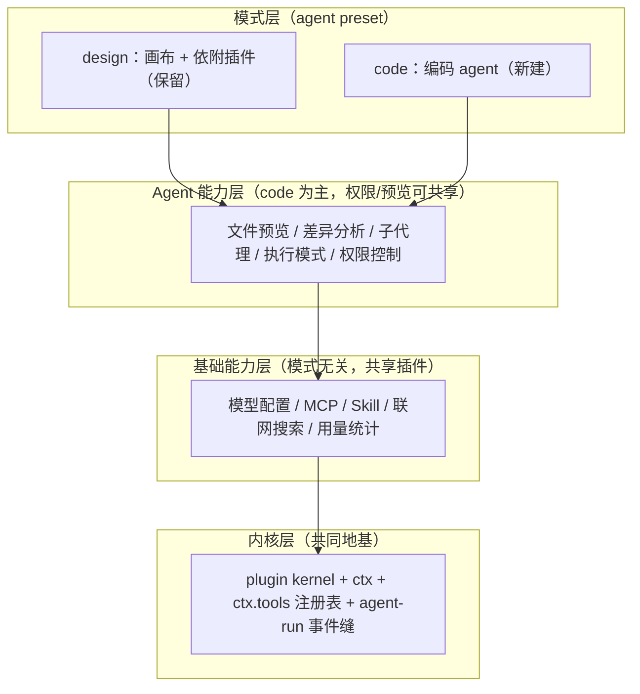

# 改造计划（插件内核 × BYOK × design/code 双模式）

> 状态：**计划稿 v3（未实施）**。本文合并原《插件化改造计划》，并纳入 `docs/future/03-改造建议与路线.md` 的 **design / code 双模式**产品决策。多端形态（Tauri 桌面 / Docker 自部署 / 云 / Web / 移动）见姊妹文档 `docs/tech/多端产品设计.md`。改造尚未开始；落地时按 §7 拓扑序逐 PR 推进，每个 PR 行为不变、测试护航。
>
> 上游理念：deepseek-harness（dsh）「一切皆插件」+ nomifun 供应商架构 + Cherry Studio BYOK。

---

## 1. 产品方向与范围

### 1.1 BYOK Work 平台 + design/code 双模式

Loomic 是 **BYOK（用户自带 Key）自定义供应商/模型**的 Work 平台，产品分两种模式：

- **design 模式（保留不动）**：现有画布创作能力 + 依附画布的插件（Excalidraw 编辑、`inspect/manipulate/screenshot_canvas`、brand-kit、图/视频生成、canvas-design skill、首页示例/发现库）。本次**不重构**，只在装配层归入 design preset。
- **code 模式（新建）**：编码 agent 能力——文件预览、差异分析、子代理、执行模式、权限控制。
- **基础能力层（两模式共享）**：模型配置、MCP、skill、联网搜索、用量统计——抽象为模式无关的共享插件。

Supabase 不移除，但从「贯穿全码库的硬依赖」降级为可插拔的默认存储适配器。

### 1.2 两个「模式」概念必须分开

| 概念 | 含义 | 实现维度 | 取值 |
| --- | --- | --- | --- |
| **产品模式** | 装配哪套业务能力（画布 vs 编码） | agent preset / profile（装配级） | `design` / `code` |
| **agent 执行模式** | code 模式内 agent 的运行方式 | agent 运行时（会话级） | `plan` / `agent` / `goal` / `loop` / `solo` |

产品模式用 dsh 的 preset 机制承载（「给一个会话不同能力集 = 组合一个 agent preset」），切换轻量、无需重启；agent 执行模式只在 code preset 内有意义（见 §4.6）。

### 1.3 现状与目标差距（BYOK）

| 维度 | 现状（SaaS，env 驱动） | 目标（BYOK 双模式） |
| --- | --- | --- |
| 模型目录 | `http/models.ts` 硬编码静态数组 | 从用户供应商实例动态推导 |
| 供应商凭证 | 服务端 env（openAI/google/replicate/volces/metaso Key） | 用户自带 Key，按工作区存储、按需实例化 |
| agent 模型 | `deep-agent.ts` 按 env 三选一 | 按用户选定供应商实例 + 模型实例化协议适配器 |
| 图/视频生成 | `generation/providers/` 按 env 注册 | 协议适配器固定，实例来自用户配置 |
| agent 能力 | 无 MCP / 无执行模式 / 无通用权限 / 无用量统计 / 子代理仅 1 个 | 抽象为共享基础能力 + code 能力层插件 |
| 存储/认证 | Supabase 直连散布各 feature | 收拢为存储适配器，凭证走窄缝 |

---

## 2. dsh 理念提炼与裁剪决策

### 2.1 借鉴的八条理念

1. 插件是唯一扩展方式（挂载新插件，而非改核心）；2. Context 是服务仓库（认领稳定 `ctx.<key>`，按 key 发现）；3. `inject` 声明依赖（拓扑表达加载序）；4. 事件即扩展点（waterfall/serial/bail 拦截）；5. 注册即可逆副作用（`ctx.effect()` 返回 disposer）；6. Profile 与 Bundle（有序层组合，`--dump-config` 可观测）；7. 能力缝三元组（Definition + Provider + Consumer）；8. 配置目录化 + fail loud。

### 2.2 裁剪决策

| 考量 | 结论 |
| --- | --- |
| Cordis 处于 developer preview，明示会有破坏性变更 | 不引入 Cordis 本体 |
| dsh 的 profile/patch/热重载服务于「可组合发行版」 | 不引入 YAML 组合层 |
| 简洁优先、禁止大爆炸重写、不为投机灵活性堆抽象 | 自建约 150 行内核（依赖注入 + 拓扑挂载 + 显式覆盖） |
| **v3 修订：agent 能力层要可插拔** | **松绑「不建事件总线」——只加 3 个 agent-run 拦截事件（§4.3），不建通用总线** |

**v3 关键修订说明**：原计划把事件系统列为非目标，但 code 模式的执行模式、权限、用量统计都要挂钩 agent 主循环；没有拦截缝，它们只能硬编码进 loop，「一切皆插件」名不副实。故只松绑**最小事件缝**（3 个事件），仍不建通用事件总线。

---

## 3. 当前诊断

### 3.1 已有萌芽缝（改造地基）

生成 provider 注册表（`generation/providers/registry.ts` + `register-all.ts`）、任务 executor 注册表（`registerExecutor()`）、agent 后端工厂（`agent/backends/index.ts`）、HTTP 路由（`registerXxxRoutes(app, deps)`）、认证接口（`RequestAuthenticator`）。

### 3.2 痛点

- **装配层**：`app.ts` 424 行特权核心——30+ import、12 服务手工构造、21 路由调用、条件注册内嵌、`BuildAppOptions` 17 个测试覆盖项；新增 feature 改四处。
- **供应商主权**：模型目录、agent 模型、图/视频 provider 全按**服务端 env** 硬编码，用户无法自带 Key。
- **存储耦合**：各 feature service 直接持有 Supabase client 并 `.from()`。
- **注册清单漂移**：generation/executor 靠 server、worker 两处副作用 import 人肉同步。
- **agent 能力层薄**：MCP/联网/用量/模式/通用权限/差异分析缺失；子代理、工具注册表未成体系。

---

## 4. 目标架构：四层

### 4.1 分层总览



原则：**能力即缝**（三元组齐备）；**开放贡献、封闭 key**（`ServiceKey` 封闭，用注册表型 key 承接无限贡献）；**基础能力优先抽象**（共享 = ROI 最高）；**不推倒重来**（画布归入 design preset，不重构）。

### 4.2 ctx key 表（稳定契约，新增/更名须改此处并同步 AGENTS.md）

| ctx key | 服务 | 层 | 备注 |
| --- | --- | --- | --- |
| `viewer` | ViewerService | 领域 | 用户/工作区引导 |
| `projects`/`brandKit`/`canvas`/`threads`/`chat`/`settings`/`uploads` | 各领域服务 | 领域 | design 侧为主 |
| `agentRunMetadata`/`agentPersistence`/`agentRuns` | agent 运行时三件套 | agent | — |
| `jobs` | JobService（PGMQ） | 基础 | `enabled: 有 supabaseDbUrl` |
| `credits`/`tierGuard`/`payments` | 计费三件套 | 基础 | BYOK 下仅对平台托管模型生效 |
| `generation` | 图/视频协议适配器注册表 | 基础 | 接受 ProviderInstanceConfig |
| `modelProviders` | 用户供应商实例管理（CRUD + 解析） | L2 基础 | 新增 |
| `modelCatalog` | 模型目录（用户实例推导 + 平台托管合并） | L2 基础 | 取代硬编码 `http/models.ts` |
| **`tools`** | 统一工具注册表（schema + 作用域 + guarded 执行） | L1 内核 | **新增**：MCP/skill/搜索都向其贡献 |
| **`capabilities`** | 能力贡献者注册表（子代理/执行模式/联网/diff） | L1 内核 | **新增**：开放贡献、封闭 key 的承载点 |
| **`permissions`** | 跨模式 tool-call 策略缝（default/auto-approve/full-access） | L3 | **新增** |
| **`usage`** | token/成本采集（按 workspace/provider/model/run） | L2 基础 | **新增** |
| **`agentModes`** | 执行模式缝（激活/切换/持久化当前模式） | L3 | **新增** |
| `auth` | RequestAuthenticator | 基础 | Supabase JWT 为一种实现 |
| `backend` | agent 后端工厂 | agent | — |
| `ws` | ConnectionManager + EventBuffer | 基础 | — |

依赖拓扑（`inject` 依据，环即 fail loud）：`viewer` → 领域服务 + `modelProviders`/`tools` → `chat`/`modelCatalog`/`capabilities` → `jobs`/`credits`/`usage`/`permissions` → `agentModes` → `agentRuns`（依赖最多，最后挂载）。

### 4.3 内核（`apps/server/src/kernel/`，约 150 行 + 事件缝）

```ts
// types.ts
export interface PluginDefinition {
    name: string;                            // 稳定 id，挂载日志与诊断
    inject: ServiceKey[];                    // 依赖的服务 key，compose 据此拓扑排序
    enabled?: (env: ServerEnv) => boolean;   // 缺省 true；payment/jobs 类开关收编于此
    apply(ctx: PluginContext): void | (() => void);  // 返回 disposer
}
// context.ts
export interface PluginContext {
    register<K extends ServiceKey>(key: K, factory: (deps: DepsOf<K>) => ServiceOf<K>): void;
    get<K extends ServiceKey>(key: K): ServiceOf<K>;   // 未注册即抛错（fail loud）
    effect(fn: () => void | (() => void)): void;
    on<E extends AgentRunEvent>(event: E, listener: ListenerOf<E>): () => void;  // v3 新增：最小事件缝
    app: FastifyInstance;
    env: ServerEnv;
}
// compose.ts
export function composePlugins(plugins: PluginDefinition[], overrides?: Partial<ServiceMap>): () => void;
```

**agent-run 最小事件缝（v3 新增，只 3 个）**：`pre-step`（waterfall，决定模型看到什么、可改写/拒绝）、`tool-pre-execute`（waterfall，权限/审批拦截）、`turn-stopping`（serial，收尾）。waterfall 监听器必须调 `next()` 委托。这是执行模式/权限/用量做成插件的前提。职责边界：**服务单例语义归 kernel ctx，HTTP 封装语义归 Fastify `app.register()`**。

### 4.4 能力缝三元组

可替换能力 = **Service Definition**（接口）+ **Service Provider**（实现）+ **Consumer**（消费方，常是模型侧工具）。只写实现不声明接口与消费方的「半个缝」不合入。

### 4.5 基础能力层（L2，模式无关共享）—— 本次重点

全部挂到 preset 之外的共享 ctx 服务；两个 preset 按 scope 过滤各自工具子集，做到**能力共享、激活按模式**。

| 基础能力 | 抽象为 | ctx key | design 消费 | code 消费 |
| --- | --- | --- | --- | --- |
| 模型配置 | 协议适配器缝 + catalog | `modelProviders`/`modelCatalog` | 图/视频选模型 | 对话/编码选模型 |
| MCP | mcp-client 插件：连 server → 工具注册进 `ctx.tools`，命名 `mcp__<server>__<tool>` | `tools` | 可用 | 可用 |
| Skill | skill 插件：SKILL.md 发现 → 向 `ctx.tools` 贡献 | `tools` | canvas-design | 编码类 skill |
| 联网搜索 | `web_search` 工具插件（BYOK 搜索供应商） | `tools` | 可选 | 常用 |
| 用量统计 | 挂 agent-run + llm 流事件采集 → `usage` 表 | `usage` | 是 | 是 |

要点：`ctx.tools` 是统一注册表（MCP/skill/搜索同一挂载点，带 schema/scope/guard）；模型配置一张供应商实例表（capability 标注区分聊天/图/视频）；用量统计是横切关注点（只在事件缝挂钩子，不改各能力）；skill 已有实现，收敛为缝即可。

### 4.6 agent 能力层（L3，code 模式主体）

| 能力 | 做成什么 | 依赖缝 | 参照 dsh |
| --- | --- | --- | --- |
| 文件预览 | `ctx.tools` 读取/预览工具 + 前端面板（代码高亮/图片/PDF/产物） | tools | deepagents `read_file`/`ls`/`glob` |
| 差异分析 | diff 工具 + UI（版本 diff、编辑前后对比；design 可复用为画布 diff） | tools | 代码 diff |
| 子代理 | 从 1 个扩为缝：Definition + 多 Provider（in-process fork/spawn/委托） | capabilities | `subagent/*` |
| 执行模式 | `agentModes` 轻量缝（激活/切换/持久化）+ 每模式独立产品包 | capabilities + 事件 | `plan/plan-mode` |
| 权限控制 | 跨模式 `permissions` 策略缝，挂 `tool-pre-execute` | permissions + 事件 | `guard/* + sandbox + approval` |

**执行模式语义**（产品定义，边界待细化）：`agent`（默认自主循环）、`plan`（先规划待批准再执行）、`goal`（同会话目标驱动）、`loop`（循环直到满足）、`solo`（单 agent 不派子代理）。**克制原则**（学 dsh）：模式是「引导不是强制」，限制靠权限/沙箱不靠模式过滤工具；缝只管激活/切换/持久化，各模式逻辑独立成包，不做大一统 mode 引擎。

**权限三档**：`default`（危险/不可逆操作 ask，记忆粒度本次/本会话/永久）、`auto-approve`（命中已批准策略自动放行）、`full-access`（不限制，二次确认 + 审计）。沙箱（read-only/workspace-write/danger-full-access）是**桌面形态执行后端**，与策略缝分离——策略决定要不要拦，沙箱决定拦不住时的隔离。一号风险是 prompt injection：不可逆动作必过人审，agent 无「自我授权为永久」路径。

### 4.7 模式层（L4，design/code preset）

- **design preset** = 现有画布能力集 + §4.5 基础能力层。**纪律**：不为双模式重构画布代码，只声明能力集，行为不变、测试护航。
- **code preset** = §4.6 agent 能力集 + §4.5 基础能力层 + 编码类 skill/工具。
- 用户切换模式 = 切换 agent preset（会话级），基础能力层始终挂载。

### 4.8 BYOK 供应商缝与存储窄缝

**供应商缝**（三元组）：
- Definition（`packages/shared` zod 契约）：`ProviderInstanceConfig = { id, workspaceId, name, protocol, baseUrl?, apiKeyRef, models:[{id,name,capability}], compat?, enabled }`；`protocol` 是封闭集合（`openai-compatible`/`anthropic`/`gemini` + 图视频 `google-image`/`replicate`/`volces`/`metaso`）。
- Provider：`apps/server/src/providers/<protocol>/` 线协议适配器（聊天复用 LangChain `ChatOpenAI`/`ChatAnthropic`/`ChatGoogleGenerativeAI`；图/视频复用现有 6 个实现，凭证从 env 改为从 ProviderInstanceConfig 读）。
- Consumer：`deep-agent.ts` 按实例实例化聊天模型；generation pipeline 按任务实例实例化图/视频；`modelCatalog` 返回目录。
- **凭证红线**：`apiKeyRef → apiKey` 解析走 `modelProviders` 内部封装，Key 只写不读、日志脱敏、按工作区 RLS 隔离、永不回传前端。

**存储窄缝**（克制起步）：`ctx.auth` 接口化；凭证存取走 SecretStore；关系数据不做全量抽象但保持 feature 内聚，为 repository 抽取留接缝——桌面本地优先形态出现后由《多端产品设计》的存储缝承接。

### 4.9 插件目录约定与 profile

```text
apps/server/src/features/<feature>/
    plugin.ts              # PluginDefinition：inject + enabled + apply
    <feature>-service.ts
    *.test.ts
apps/server/src/providers/<protocol>/
    <protocol>-adapter.ts  # 线协议适配器（Service Provider）
apps/server/src/profiles/
    server.ts  worker.ts  test.ts   # 各进程/形态的插件清单
```

`server.ts`/`worker.ts` 退化为「选 profile → composePlugins() → listen」；开发环境 compose 后打印挂载树（`dsh --dump-config` 的轻量等价物）。

### 4.10 扩展点速查表（新增行为对应机制，禁止绕过）

| 目标 | 机制 | 不再改 |
| --- | --- | --- |
| 接入新供应商（OpenAI 兼容网关等） | 前端「供应商设置」添加实例——零代码 | 任何服务端文件 |
| 新线协议 | `providers/<protocol>/` + `protocol` 联合类型扩一项 | 适配器之外 |
| 新增图/视频 provider | 实现接口经 `generation` 缝注册 | server/worker 两处 |
| **接入 MCP server** | mcp-client 插件 → 工具注册进 `ctx.tools` | 业务代码 |
| **新增 skill** | SKILL.md 放入 skills 目录，skill 插件自动发现 | 代码 |
| **新增 agent 工具** | 所属 feature 插件 `apply()` 内向 `ctx.tools` 注册 | `tools/index.ts` |
| **新增子代理 / 执行模式 / 联网搜索 / diff** | 向 `ctx.capabilities` 贡献 | loop 代码 |
| **自定义权限策略** | 挂 `tool-pre-execute` 事件 / 实现 `permissions` provider | loop 代码 |
| 新增 HTTP 路由 | feature 插件 `apply()` 内 `ctx.app.register()` | `app.ts` |
| 新增后台任务 | executor 调 `registerExecutor()` | `worker.ts` |
| 新增业务 feature | 新建 `features/<x>/plugin.ts` + profile 清单加一行 | `app.ts` 四处 |

---

## 5. 共享契约变更（packages/shared）

- 新增 `provider-contracts.ts`：`ProviderInstanceConfig`/`ProviderCompat`/模型能力联合/目录响应 schema。
- 新增 `capability-contracts.ts`：工具注册表条目、能力贡献者、执行模式、权限档位、用量记录 schema。
- `contracts.ts` 的 `ModelInfo` 扩展 `providerInstanceId`（区分平台托管与用户实例）。
- ws/job 契约：生成任务 payload 携带 `providerInstanceId` + 模型 id；agent-run 事件契约（pre-step/tool-pre-execute/turn-stopping）。
- **契约先行**：schema 定稿合入后，服务端改造才开工（编译器牵引两端）。

---

## 6. 待产品决策（实现前必须定）

1. **事件缝**：确认松绑「不建事件总线」，加 3 个 agent-run 拦截事件（建议松绑，否则执行模式/权限/用量只能硬编码）。
2. **模式承载**：design/code 用 agent preset（会话级切换，推荐）还是独立 profile（部署级）。
3. **执行模式边界**：plan/agent/goal/loop/solo 是否 v1 全做（建议先 `agent` + `plan`，其余增量）。
4. **权限默认档**：code 模式默认 `default` 还是 `auto-approve`；`full-access` 二次确认与审计。
5. **计费口径**：保守方案 = 用户自有 Key 免费、平台托管模型按 credits 计费；影响 `credits/tierGuard/payments` 的 enabled 与水印。
6. **用量统计范围**：是否作为 BYOK v1 必备（建议是）。
7. **凭证安全边界**：v1 = 服务端加密落库 + RLS + 永不回传前端；端到端「Key 不落服务端明文」复杂度显著更高。
8. **第三方插件生态**：外部插件安装/分发与「不引入 Cordis/YAML」非目标冲突，本次双模式聚焦内部能力，建议暂缓并消除原多端文档的生态承诺矛盾。

---

## 7. 分阶段实施（每阶段独立可合并，行为不变）

| 阶段 | 内容 | PR 粒度 | 验证门 |
| --- | --- | --- | --- |
| **P0** | 本计划定稿 + §6 决策拍板（尤其决策 1、2） | 1（纯文档） | 评审 |
| **P1** | `kernel/` 三文件 + **3 个 agent-run 事件缝** + `ctx.tools` 注册表 + 单元测试；`app.ts` 不动 | 1-2 | 全过 |
| **P2** | 试点：`brand-kit` 插件化；`BuildAppOptions.brandKitService` 退役改 `overrides` | 1 | 全过 + 冒烟 |
| **P3** | 批量迁移（每 feature 1 PR，按 §4.2 拓扑序）：viewer→projects→canvas→chat→settings→uploads→credits→jobs→payments→skills→agent-runs | ~11 | 每 PR 全过 + 冒烟 |
| **P4** | **基础能力层**：供应商契约（§5）+ `providers/` 适配器 + `modelProviders`/`modelCatalog`；**用量统计**（`streamUsage` on + `usage` 表）；**MCP** 接入 `ctx.tools` | 3-4 | 目录/对话/生成/用量冒烟 |
| **P5** | **前端 BYOK**：供应商设置 CRUD；模型选择器读动态目录；`http/models.ts` 退役；skill 收敛为缝 | 2 | 全过 + E2E 冒烟 |
| **P6** | **code 能力层**：`permissions` 策略缝；`agentModes`（先 agent + plan）；子代理缝；文件预览 + 差异分析 | 3-4 | 越权用例全拒 + 模式切换冒烟 |
| **P7** | **模式装配**：design/code preset + 切换 UI；工具/executor 缝收编；引入 `profiles/` | 2 | 双模式双进程冒烟 |
| **P8** | 收尾：`app.ts` 退役为 compose 薄封装；`BuildAppOptions` 删除；挂载树打印 | 1 | 全过 + 完整冒烟 |

顺序铁律：内核 + 事件缝（P1）先于一切；feature 迁移（P3）先于基础能力缝（P4）；基础能力（P4）先于 code 能力（P6）——共享层就位后 code 能力才有干净挂载点；契约（P4 首个 PR）先于所有实现 PR。

---

## 8. 风险与对策 / 非目标

| 风险 | 对策 |
| --- | --- |
| `agentRuns` 依赖多、拓扑深 | compose 检测环即抛错；允许迁移中合并粗粒度 key，须同步 §4.2 |
| Fastify 封装作用域与 kernel 单例冲突 | 硬边界：服务走 ctx（全局单例），Fastify 只承担路由封装 |
| 事件缝被滥用成「什么都能拦」 | 只开放 3 个事件；新增事件须评审并登记契约 |
| code 模式引入 execute/shell 扩大安全面 | 权限缝默认 deny/ask；沙箱后端隔离；prompt injection 清洗；审计 |
| 凭证泄漏面扩大（BYOK） | Key 只写不读、日志脱敏、RLS 隔离、不落 worker 日志 |
| server/worker 注册清单漂移 | P7 后共享 profile，漂移在编译期消失 |
| 双模式导致画布回归 | design preset 只贴标签不重构；行为不变、测试护航 |

**非目标（明确不做）**：不引入 Cordis / 第三方插件框架（YAML 组合、patch、live reload）；不建**通用**事件总线（只 3 个 agent-run 事件，出现第二个真实消费者再按 waterfall 扩展）；不在本计划做存储后端抽象（由《多端产品设计》承接）；前端不做对称插件化（App Router 本身即插件系统）；不改既有 `packages/shared` 契约语义（只做 §5 增量）；本次不做第三方插件安装/分发生态（§6 决策 8）。

---

## 9. 完成度量

- `app.ts` < 100 行且不 import 任何 `features/*`；`BuildAppOptions` 消失，测试统一 `overrides`。
- 用户在前端「供应商设置」添加一个 OpenAI 兼容供应商并完成一次对话 + 一次图生成，**服务端零代码变更**。
- `http/models.ts` 硬编码目录、`deep-agent.ts` env 三选一、`register-all.ts` 副作用注册全部退役。
- **接入一个 MCP server、加一个 skill、切一个执行模式、配一档权限，均零改 loop 代码**（走 `ctx.tools`/`capabilities`/事件缝）。
- design 与 code 两 preset 共享同一套基础能力层（模型/MCP/skill/搜索/用量），server 与 worker 注册来自同一棵插件树，无人工同步点。
