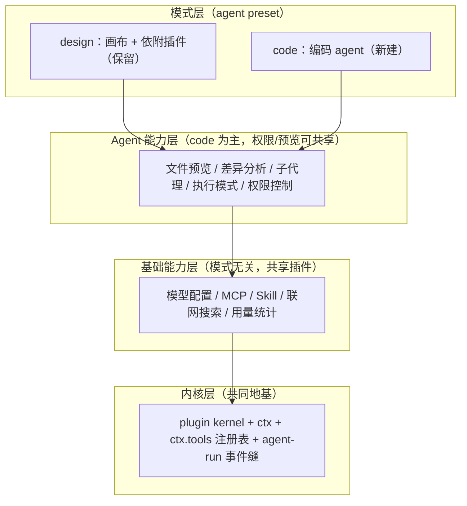

# 改造计划（插件内核 × BYOK × design/code 双模式）

> 状态：**已定稿（2026-09-12 `DEC-1`…`DEC-8` 拍板，结论与理由见 §6/§6.2），实施中**——按 §7 拓扑序逐 PR 推进，每个 PR 行为不变、测试护航。本文合并原《插件化改造计划》，并纳入 `docs/future/03-改造建议与路线.md` 的 **design / code 双模式**产品决策。多端形态（Tauri 桌面 / Docker 自托管 / Web / 移动，**已去云托管**）见姊妹文档 `docs/tech/多端产品设计.md`。
>
> 上游理念：deepseek-harness（dsh）「一切皆插件」+ nomifun 供应商架构 + Cherry Studio BYOK。

---

## 1. 产品方向与范围

### 1.1 BYOK Work 平台 + design/code 双模式

Loomic 是 **BYOK（用户自带 Key）自定义供应商/模型**的 Work 平台，产品分两种模式：

- **design 模式（保留不动）**：现有画布创作能力 + 依附画布的插件（Excalidraw 编辑、`inspect/manipulate/screenshot_canvas`、brand-kit、图/视频生成、canvas-design skill、首页示例/发现库）。本次**不重构**，只在装配层归入 design preset。
- **code 模式（新建）**：编码 agent 能力——文件预览、差异分析、子代理、执行模式、权限控制。
- **基础能力层（两模式共享）**：模型配置、MCP、skill、联网搜索、用量统计——抽象为模式无关的共享插件。

**存储方向（2026-09-11 决策）**：去 Supabase 云托管，存储统一为**自管 Postgres**（桌面捆绑本机实例 / 自托管连用户 Postgres），形态收敛为「桌面本地 + 自托管」两种，不做平台 SaaS 云。现状代码仍运行在 Supabase 上（Auth / Postgres / Storage / PGMQ / RLS），去 Supabase 是独立大工程，迁移路径见《多端产品设计》§5。

### 1.2 两个「模式」概念必须分开

| 概念 | 含义 | 实现维度 | 取值 |
| --- | --- | --- | --- |
| **产品模式** | 装配哪套业务能力（画布 vs 编码） | agent preset / profile（装配级） | `design` / `code` |
| **agent 执行模式** | code 模式内 agent 的运行方式 | agent 运行时（会话级） | `plan` / `agent` / `goal` / `loop` / `solo` |

产品模式用 dsh 的 preset 机制承载（「给一个会话不同能力集 = 组合一个 agent preset」），切换轻量、无需重启；agent 执行模式只在 code preset 内有意义（见 §4.6）。

### 1.3 现状与目标差距（BYOK）

| 维度 | 现状（SaaS，env 驱动） | 目标（BYOK 双模式） |
| --- | --- | --- |
| 模型目录 | `http/models.ts` 硬编码静态数组 | 从用户供应商实例动态推导 |
| 供应商凭证 | 服务端 env（openAI/google/replicate/volces/metaso Key） | 用户自带 Key，按工作区存储、按需实例化 |
| agent 模型 | `deep-agent.ts` 按 env 三选一 | 按用户选定供应商实例 + 模型实例化协议适配器 |
| 图/视频生成 | `generation/providers/` 按 env 注册 | 协议适配器固定，实例来自用户配置 |
| agent 能力 | 无 MCP / 无执行模式 / 无通用权限 / 无用量统计 / 子代理仅 1 个 | 抽象为共享基础能力 + code 能力层插件 |
| 存储/认证 | Supabase 直连散布各 feature（Auth/Postgres/Storage/PGMQ/RLS） | 去 Supabase 云，统一自管 Postgres + repository 缝；认证换 local-trust / 自管 auth |

---

## 2. dsh 理念提炼与裁剪决策

### 2.1 借鉴的八条理念

1. 插件是唯一扩展方式（挂载新插件，而非改核心）；2. Context 是服务仓库（认领稳定 `ctx.<key>`，按 key 发现）；3. `inject` 声明依赖（拓扑表达加载序）；4. 事件即扩展点（waterfall/serial/bail 拦截）；5. 注册即可逆副作用（`ctx.effect()` 返回 disposer）；6. Profile 与 Bundle（有序层组合，`--dump-config` 可观测）；7. 能力缝三元组（Definition + Provider + Consumer）；8. 配置目录化 + fail loud。

### 2.2 裁剪决策

| 考量 | 结论 |
| --- | --- |
| Cordis 处于 developer preview，明示会有破坏性变更 | 不引入 Cordis 本体 |
| dsh 的 profile/patch/热重载服务于「可组合发行版」 | 不引入 YAML 组合层 |
| 简洁优先、禁止大爆炸重写、不为投机灵活性堆抽象 | 自建约 150 行内核（依赖注入 + 拓扑挂载 + 显式覆盖） |
| **v3 修订：agent 能力层要可插拔** | **松绑「不建事件总线」——只加 3 个 agent-run 拦截事件（§4.3），不建通用总线** |

**v3 关键修订说明**：原计划把事件系统列为非目标，但 code 模式的执行模式、权限、用量统计都要挂钩 agent 主循环；没有拦截缝，它们只能硬编码进 loop，「一切皆插件」名不副实。故只松绑**最小事件缝**（3 个事件），仍不建通用事件总线。

### 2.3 与 dsh / Cordis 的关系：接口对齐 + 协议互操作，不做插件包兼容

Cordis 与 dsh 均处 developer preview（rc 版，官方明示破坏性变更随时发生），且 dsh 插件深度绑定其自有 core 运行时（`ctx.agentLoop` / `ctx.sessions` / `ctx.tools` / `ctx.llm` / `ctx.systemPrompt`）——Loomic 运行时是 deepagents + LangChain + LangGraph，两套 agent 内核不通用。故按四个层次区别对待：

| 层次 | 含义 | 决策 |
| --- | --- | --- |
| L1 插件包互通 | dsh 的 `@deepseek-ai/dsh-*` 插件直接装进 Loomic 跑 | **不做**：等于实现 dsh 全套 core 服务契约 = 把 Loomic 重构成 dsh 发行版，放弃 deepagents 与 design 模式差异化 |
| L2 接口形状对齐 | kernel 的 `name/inject/apply(ctx)` + `ctx.effect()`/`ctx.on()` 签名对齐 Cordis | **做**：心智复用、迁移摩擦小；但仅设计借鉴，不等于插件可互通 |
| L3 语义约定对齐 | ctx key 命名、`mcp__<server>__<tool>`、事件名 `agent/*`、能力缝三元组 | **做**：概念可迁移、文档可参照 |
| L4 生态/分发兼容 | dsh 的 bundle/profile/patch 格式、`dsh plugin add`、`dsh-plugin` topic | **暂缓**：依赖被拒的 YAML 组合层；dsh 生态尚小且绑定其运行时 |

**协议级互操作（真正现实的「兼容」）**：不要求任一方放弃运行时即可共享生态——

- **MCP**（必做）：工具级开放标准，同一 MCP server 两边通用，工具生态天然共享（见 §4.5）。
- **ACP**（Agent Client Protocol，候选）：dsh 有 `acp` profile 与 `subagent-acp`；Loomic 支持 ACP 后可与 dsh 等外部 agent 互相委托/编排，作为 §4.6 子代理缝的一种 provider。适配成本待评估。

**重新评估 L1/L4 的触发条件**：① Cordis/dsh 脱离 preview 出稳定版并冻结 API；② dsh 生态出现 Loomic 可直接消费的高价值插件；③ Loomic 决定做第三方插件热插拔生态（DEC-8）。三者同时成立前维持本节结论。

---

## 3. 当前诊断

### 3.1 已有萌芽缝（改造地基）

生成 provider 注册表（`generation/providers/registry.ts` + `register-all.ts`）、任务 executor 注册表（`registerExecutor()`）、agent 后端工厂（`agent/backends/index.ts`）、HTTP 路由（`registerXxxRoutes(app, deps)`）、认证接口（`RequestAuthenticator`）。

### 3.2 痛点

- **装配层**：`app.ts` 是特权核心（行数 / import / 服务 / 路由 / `BuildAppOptions` 计数以《02-当前项目实现状态》§3.1 为准，本文不维护现状数字）——条件注册内嵌，新增 feature 改四处。
- **供应商主权**：模型目录、agent 模型、图/视频 provider 全按**服务端 env** 硬编码，用户无法自带 Key。
- **存储耦合**：各 feature service 直接持有 Supabase client 并 `.from()`。
- **注册清单漂移**：generation/executor 靠 server、worker 两处副作用 import 人肉同步。
- **agent 能力层薄**：MCP/联网/用量/模式/通用权限/差异分析缺失；子代理、工具注册表未成体系。

---

## 4. 目标架构：四层

### 4.1 分层总览



原则：**能力即缝**（三元组齐备）；**开放贡献、封闭 key**（`ServiceKey` 封闭，用注册表型 key 承接无限贡献）；**基础能力优先抽象**（共享 = ROI 最高）；**不推倒重来**（画布归入 design preset，不重构）。

### 4.2 ctx key 表（稳定契约；**本表是唯一权威副本**，AGENTS.md 与其他文档只引用、不复制清单）

| ctx key | 服务 | 层 | 备注 |
| --- | --- | --- | --- |
| `viewer` | ViewerService | 领域 | 用户/工作区引导 |
| `projects`/`brandKit`/`canvas`/`threads`/`chat`/`settings`/`uploads` | 各领域服务 | 领域 | design 侧为主 |
| `codeGit` | CodeGitService（工作目录仓库分支视图） | 领域 | Code 模式「工作目录=项目」：列分支 / 切分支。目录经 `agent/sandbox-dir.ts` 解析（与 agent 后端**同一处**，避免「切了分支但 agent 读写的不是那个目录」）；归属校验在服务内（画布必须属当前工作区，否则 404） |
| `agentRunMetadata`/`agentPersistence`/`agentRuns` | agent 运行时三件套 | agent | — |
| `jobs` | JobService（PGMQ，Postgres 扩展） | 基础 | `enabled: 有 databaseUrl` |
| `credits`/`tierGuard`/`payments` | 计费三件套 | 基础 | 云托管移除后建议默认 `enabled=false`（待 DEC-5 拍板；`FORM-5` 为该决策的历史别名） |
| `admin` | AdminService（平台管理后台） | 基础 | 管理员判定 + 用户/额度/角色 + 系统供应商分发（`FORM-10`）；HTTP 面 `/api/admin/*` 全部服务端 403 门 |
| `generation` | 图/视频协议适配器注册表 | 基础 | 接受 ProviderInstanceConfig |
| `modelProviders` | 用户供应商实例管理（CRUD + 解析） | L2 基础 | 新增 |
| `modelCatalog` | 模型目录（用户供应商实例推导） | L2 基础 | 取代硬编码 `http/models.ts` |
| **`tools`** | 统一工具注册表（schema + 作用域 + guarded 执行） | L1 内核 | **新增**：MCP/skill/联网搜索/diff 等**模型可调用工具**向其贡献 |
| **`capabilities`** | 能力贡献者注册表（**非工具**能力：子代理 provider、执行模式、能力节点等） | L1 内核 | **新增**：开放贡献、封闭 key 的承载点 |
| **`permissions`** | 跨模式 tool-call 策略缝（default/auto-approve/full-access） | L3 | **新增** |
| **`usage`** | token/成本采集（按 workspace/provider/model/run） | L2 基础 | **新增** |
| **`agentModes`** | 执行模式缝（激活/切换/持久化当前模式） | L3 | **新增** |
| **`persistence`** | 自管 Postgres Provider（`pg` 连接池；**唯一 DB 入口**） | 基础 | **新增（M1，2026-09-13 落地缝）**：workspace 谓词须以 `:workspace` 占位符显式引用，由客户端绑定为末位参数，漏写即抛 `WorkspaceIsolationError`（`FORM-9`）；Provider 随形态替换（桌面捆绑 / 自托管用户 Postgres）。**两种作用域**：`forWorkspace`/`:workspace`（按 `workspace_id` 定权）与 `forUser`/`:user`（按 `user_id` 定权的表，如 `brand_kits`——schema 早于 workspaces，无 `workspace_id` 列）；两者互不通用，标记不对即违约 |
| **`plugins`** | 插件注册表缝（目录 / 安装 / 卸载 / 启停 / 导入校验 / 导出） | L3 | **新增（2026-09-13）**：第三方 bundle（dsh 原生或本项目格式）的安装入口，**安装前过兼容性门禁**（`features/plugins/compat-validator.ts`），未通过不落盘不装载。安装态是机器本地的（落 `pluginsDir`，`LOOMIC_PLUGINS_DIR` 可覆盖），不进数据库——插件代码本就只存在于本机 |
  | **`blob`** | 对象存储缝（`BlobBucket`：upload / getPublicUrl / createSignedUrl(s) / download / copy / remove / isPublic / resolveUrl） | 基础 | **新增（M3.1，2026-09-14）**：对象存储**唯一入口**，Provider 随形态替换——`supabase`（过渡期/自托管现状，默认）/ `local`（桌面本地 FS + server 自己的 `/api/blobs` 读取路由，FORM-2 的「本地 blob」）。**只有系统作用域**（FORM-9：对象路径服务器拼入 `workspaceId`，故接口里没有「用户令牌」这个 Supabase 概念，桌面形态无需伪造令牌）。**「是否公开」由存储侧回答**（`isPublic`），消费方不得硬编码公开桶清单——实测 `project-assets` 在本地库里 `public=false`（与迁移声明不符），Supabase 公网路由会把非公开桶报成 `Bucket not found`，硬编码假设产出的是 400 死链；`resolveUrl` 一律给可直接访问的 URL（公开桶公网 URL / 非公开桶签名 URL）。**不做 enabled 门控**：对象存储是必需能力，需要却拿不到就启动期失败（内核 fail loud）。 |
| `auth` | RequestAuthenticator | 基础 | 目标 local-trust（桌面）/ 自管 auth（自托管）；Supabase JWT 为存量实现 |
| `backend` | agent 后端工厂 | agent | — |
| `ws` | ConnectionManager + EventBuffer | 基础 | — |

**`tools` 与 `capabilities` 的分界（防止同一能力两处注册）**：`tools` 只放「暴露给模型、有 JSON schema 的可调用工具」；`capabilities` 只放「不是工具的能力贡献者」。判定法——会写进模型工具列表的归 `tools`，由运行时按 key 解析实现、模型看不到的归 `capabilities`。故 **MCP / skill / 联网搜索 / diff 归 `tools`**（子代理分发工具 `task` 本身是工具，其 provider 集合归 `capabilities`），**执行模式 / 子代理 provider 归 `capabilities`**。

依赖拓扑（`inject` 依据，环即 fail loud；**只列真实依赖对，不构成全序**，下方为「先于」关系）：

- `auth`/`ws` 先于 `viewer`；`viewer` 先于领域服务、`modelProviders`、`tools`
- 领域服务先于 `chat`；`modelProviders` 先于 `modelCatalog`/`generation`/`usage`
- `tools` 先于 `capabilities`/`permissions`
- `modelProviders`/`capabilities`/`permissions`/`usage` 先于 `agentModes`/`backend`/`agentRunMetadata`/`agentPersistence`，后者先于 `agentRuns`（依赖最多，最后挂载）

`tools` **不依赖** `viewer`/领域服务——工具注册表只在执行时经 guard 取上下文，不要把它写成领域服务的下游（那是假依赖，会制造伪环）。表中其余 key（`payments`/`tierGuard` 等）不设固定档位，以各插件 `inject` 实际声明为准；compose 检测成环即在启动期抛错。

多端形态另引入 `storage`/`toolsGateway`/`blob`/`secret` 等存储与本机能力缝（见《多端产品设计》§5），落地时并入本表（本表是唯一权威副本，AGENTS.md 等其他文档只引用不复制）。`persistence` 已落地，见上表。

### 4.3 内核（`apps/server/src/kernel/`，约 150 行 + 事件缝）

```ts
// types.ts
export interface PluginDefinition {
    name: string;                            // 稳定 id，挂载日志与诊断
    inject: ServiceKey[];                    // 依赖的服务 key，compose 据此拓扑排序
    enabled?: (env: ServerEnv) => boolean;   // 缺省 true；payment/jobs 类开关收编于此
    apply(ctx: PluginContext): void | (() => void);  // 返回 disposer
}
// context.ts
export interface PluginContext {
    register<K extends ServiceKey>(key: K, factory: (deps: DepsOf<K>) => ServiceOf<K>): void;
    get<K extends ServiceKey>(key: K): ServiceOf<K>;   // 未注册即抛错（fail loud）
    effect(fn: () => void | (() => void)): void;
    on<E extends AgentRunEvent>(event: E, listener: ListenerOf<E>): () => void;  // v3 新增：最小事件缝
    app: FastifyInstance;
    env: ServerEnv;
}
// compose.ts
export function composePlugins(plugins: PluginDefinition[], overrides?: Partial<ServiceMap>): () => void;
```

**agent-run 最小事件缝（v3 新增，只 3 个）**：`pre-step`（waterfall，决定模型看到什么、可改写/拒绝）、`tool-pre-execute`（waterfall，权限/审批拦截）、`turn-stopping`（serial，收尾）。waterfall 监听器必须调 `next()` 委托。这是执行模式/权限/用量做成插件的前提。职责边界：**服务单例语义归 kernel ctx，HTTP 封装语义归 Fastify `app.register()`**。

### 4.4 能力缝三元组

可替换能力 = **Service Definition**（接口）+ **Service Provider**（实现）+ **Consumer**（消费方，常是模型侧工具）。只写实现不声明接口与消费方的「半个缝」不合入。

### 4.5 基础能力层（L2，模式无关共享）—— 本次重点

全部挂到 preset 之外的共享 ctx 服务；两个 preset 按 scope 过滤各自工具子集，做到**能力共享、激活按模式**。

| 基础能力 | 抽象为 | 挂载点（见 §4.2） | design 消费 | code 消费 |
| --- | --- | --- | --- | --- |
| 模型配置 | 协议适配器缝 + catalog | `modelProviders`/`modelCatalog` | 图/视频选模型 | 对话/编码选模型 |
| MCP | mcp-client 插件：连 server → 工具注册进 `ctx.tools`，命名 `mcp__<server>__<tool>` | `tools` | 可用 | 可用 |
| Skill | skill 插件：SKILL.md 发现 → 向 `ctx.tools` 贡献 | `tools` | canvas-design | 编码类 skill |
| 联网搜索 | `web_search` 工具插件（BYOK 搜索供应商） | `tools` | 可选 | 常用 |
| 用量统计 | agent 链路读 LangChain `streamUsage` + 直连生成链路读 job 回调 → `usage` 表 | `usage` | 是 | 是 |

要点：`ctx.tools` 是统一注册表（MCP/skill/搜索同一挂载点，带 schema/scope/guard）；模型配置一张供应商实例表（capability 标注区分聊天/图/视频）；用量统计是横切关注点（不改各能力），**采集点两处，均不新增事件**：

- **agent 链路**：token/成本来自 LangChain `streamUsage`——它是**模型实例化参数**，在 `modelProviders` 实例化模型时开启，属基础能力层内部实现；agent-run 事件缝只负责把用量**归属到 run** 与收尾结算。不要声称「用量挂在 agent-run 事件上采集原始 token」——`pre-step`/`tool-pre-execute`/`turn-stopping` 三个事件都拿不到原始 token。
- **直连生成链路**：画布 `/generate` → PGMQ job → worker，不经 agent 主循环，在 job executor 完成回调处按 job 维度采集。

两处落同一张 `usage` 表（credits 关闭后 usage 是唯一计量，直连生成不能留盲区）。skill 已有实现，收敛为缝即可。

### 4.6 agent 能力层（L3，code 模式主体）

| 能力 | 做成什么 | 依赖缝 | 参照 dsh |
| --- | --- | --- | --- |
| 文件预览 | `ctx.tools` 读取/预览工具 + 前端面板（代码高亮/图片/PDF/产物） | tools | deepagents `read_file`/`ls`/`glob` |
| 差异分析 | diff 工具 + UI（版本 diff、编辑前后对比；design 可复用为画布 diff） | tools | 代码 diff |
| 子代理 | 从 1 个扩为缝：Definition + 多 Provider（in-process fork/spawn/委托；**ACP provider 可委托给 dsh 等外部 agent**，见 §2.3） | capabilities | `subagent/*` |
| 执行模式 | `agentModes` 轻量缝（激活/切换/持久化）+ 每模式独立产品包 | capabilities + 事件 | `plan/plan-mode` |
| 权限控制 | 跨模式 `permissions` 策略缝，挂 `tool-pre-execute` | permissions + 事件 | `guard/* + sandbox + approval` |

**执行模式语义**（产品定义，边界待细化）：`agent`（默认自主循环）、`plan`（先规划待批准再执行）、`goal`（同会话目标驱动）、`loop`（循环直到满足）、`solo`（单 agent 不派子代理）。**克制原则**（学 dsh）：模式是「引导不是强制」，限制靠权限/沙箱不靠模式过滤工具；缝只管激活/切换/持久化，各模式逻辑独立成包，不做大一统 mode 引擎。

**权限三档**：`default`（危险/不可逆操作 ask，记忆粒度本次/本会话/永久）、`auto-approve`（命中已批准策略自动放行）、`full-access`（不限制，二次确认 + 审计）。沙箱（read-only/workspace-write/danger-full-access）是**桌面形态执行后端**，与策略缝分离——策略决定要不要拦，沙箱决定拦不住时的隔离。一号风险是 prompt injection：不可逆动作必过人审，agent 无「自我授权为永久」路径。

### 4.7 模式层（L4，design/code preset）

- **design preset** = 现有画布能力集 + §4.5 基础能力层。**纪律**：不为双模式重构画布代码，只声明能力集，行为不变、测试护航。
- **code preset** = §4.6 agent 能力集 + §4.5 基础能力层 + 编码类 skill/工具。
- **permissions 缝的模式归属**：`permissions`（§4.6）是模式无关的跨形态缝，两 preset 都可挂载；但画布操作危险度低，**design preset 默认不激活权限闸门**（保持现有画布行为不变），code preset 默认激活（execute/shell/文件写入等必过 `tool-pre-execute` 拦截）。缝本身始终可用，激活与否是 preset 的配置项。
- 用户切换模式 = 切换 agent preset（会话级，**承载方式 preset vs 独立 profile 待 DEC-2 确认**），基础能力层始终挂载。

### 4.8 BYOK 供应商缝与存储缝

**供应商缝**（三元组）：
- Definition（`packages/shared` zod 契约）：`ProviderInstanceConfig = { id, workspaceId, name, protocol, baseUrl?, apiKeyRef, models:[{id,name,capability}], compat?, enabled }`；`protocol` 是封闭集合（`openai-compatible`/`anthropic`/`gemini` + 图视频 `google-image`/`replicate`/`volces`/`metaso`）。
- Provider：`apps/server/src/providers/<protocol>/` 线协议适配器（聊天复用 LangChain `ChatOpenAI`/`ChatAnthropic`/`ChatGoogleGenerativeAI`；图/视频复用现有 provider 实现——**按供应商族计 6 个**，逐 provider 清单见《02-当前项目实现状态》§3.5——凭证从 env 改为从 ProviderInstanceConfig 读）。
- Consumer：`deep-agent.ts` 按实例实例化聊天模型；generation pipeline 按任务实例实例化图/视频；`modelCatalog` 返回目录。
- **注册路径与职责切分**（防止三个注册表职责混淆）：`generation` = **运行期适配器注册表**（按协议存放已注册的图/视频适配器，任务执行时按实例解析）；`modelProviders` = **用户实例 CRUD + 凭证解析**（不持有适配器实现）；`modelCatalog` = **目录推导**（从实例 + capability 生成可选模型清单）。图/视频 provider 实现迁入 `providers/<protocol>/` 后向 `generation` 注册；**现存 `generation/providers/register-all.ts` 的按 env 副作用批量注册在 P4 退役**，改为实例驱动。
- **凭证红线**：`apiKeyRef → apiKey` 解析走 `modelProviders` 内部封装，Key 只写不读、日志脱敏、按工作区 RLS 隔离、永不回传前端。

**自定义请求头（`headers`，待实现）**

- **动机（真机实测）**：接入 `opencode`（Base URL `https://opencode.ai/zen/go/v1/`、Chat Completions）报
  `Request is missing x-opencode-session and cannot be routed efficiently.` —— 这类网关要求**额外请求头**才肯路由；
  而现契约只有 `apiKey`（固定映射到 `Authorization`）与 `baseUrl`，**无法表达「这个实例还需要一个自有头」**。
  同类诉求还包括：自建网关的租户标识头、反代鉴权头、灰度/路由标记头。
- **该头的真实语义（2026-09 查证，决定了规格形状）**：`x-opencode-session` 是 OpenCode Zen/Go 自
  **2026-09-05** 起强制的**会话亲和头**——值必须是**单个会话内稳定**的 id，用于把同一会话的请求路由到
  同一上游分片并**保住提示词缓存**；缺失即 HTTP 400。官方还要求「正确的客户端标识」，常见伴随项是
  `x-opencode-client: <client-name>`。**因此**：
  - **静态头**（`Record<string,string>`）只覆盖「租户标识 / 反代鉴权 / 客户端标识」这类**每实例恒定**的值；
  - 但**亲和类头需要逐会话取值**——把 `x-opencode-session` 写成一个固定 UUID 是**错解**（所有会话被钉到同一
    分片，缓存亲和失效）；每次请求现随机生成同样是错解（亲和无意义）。
  - 故规格必须同时支持**占位符**：头值可写 `{{sessionId}}` / `{{threadId}}`，在发请求时按白名单变量替换
    （白名单外一律拒绝，不做任意模板求值）。会话 id 是随 run 下发的既有概念，**不需要新铺线**。
  - **不做供应商内联判断**：不少同类项目按「provider 名或 baseUrl 含 `opencode.ai`」自动塞这个头；本仓库
    AGENTS.md 明文禁止在业务代码里内联供应商判断，故这里坚持走**用户显式配置 + 占位符**，不特判厂商。
- **契约（增量，可选字段）**：`ProviderInstanceConfig` 增 `headers?: Record<string, string>`（与 `compat` 同属「按实例覆盖」，
  值可含白名单占位符）；创建/更新请求携带 `headers`（含值），**响应只回 `headerKeys: string[]`（仅键名）**——
  沿用 MCP `env`/`envKeys` 的既定口径（该契约注释即写明「与 BYOK 同口径，Key 类值只写不读、永不回显前端」），
  不新造第二套规矩。
- **应用点**：各线协议适配器构造请求时把 `headers` 合并进默认头。聊天（`openai-compatible`/`anthropic`/`gemini`）与
  图/视频适配器**一视同仁**，避免「聊天能用、生图不能」的半通状态。
- **保留头不可覆盖（硬约束）**：`authorization`（由 `apiKey` 解析生成）、`content-type`、`content-length`、`host`
  等由适配器/运行时应持有的头，**自定义头不得覆盖**；自定义头可覆盖适配器的**非保留**默认头。
  不加这条，就能用自定义头顶掉凭证头，等于绕开 §「凭证红线」的整个模型。
- **校验（fail loud，保存时即拒）**：头名须为合法 HTTP token（RFC 7230）；头值须为可打印字符且**禁 `\r`/`\n`**
  —— 否则可注入额外头（请求走私 / header injection）。非法 JSON、非法头名一律在**写入时**报错，
  不允许「先存下来、运行时才炸」。
- **生效范围**：仅该实例发出的请求；不得渗到其它实例，也不得影响平台池（`scope='system'`）实例。
- **实现前仍需定的三点**（都不阻塞写规格）：① UI 输入形态取「JSON textarea」，与既有「模型清单（JSON）」同形；
  ② `headers: {}` 是否等同清空（建议是）；③ 是否需要按协议细分（v1 建议不细分，一个实例一套头）；
  ④ 占位符白名单先只放 `{{sessionId}}` / `{{threadId}}` 两个（够覆盖亲和类头，且不外扩攻击面）。
- **验收用例**：用 `opencode` 实例（Chat Completions + `x-opencode-session: {{sessionId}}`）跑通一次对话，
  并断言**同一会话多轮拿到同一个值**（亲和成立）、不同会话值不同；
  另用自建实例断言「自定义头能覆盖非保留默认头、且改不动 `authorization`」。

**存储缝**（去 Supabase，统一自管 Postgres）：`ctx.auth` 接口化（local-trust / 自管 auth）；凭证存取走 SecretStore（桌面 OS 钥匙串 / 自托管加密表）；关系数据抽 repository 接口，落到自管 Postgres（复用现有 migrations、剔除 Supabase 专有对象）；文件走 blob 缝（本地 FS / MinIO）；队列 PGMQ 保留。完整迁移路径见《多端产品设计》§5。

### 4.9 插件目录约定与 profile

```text
apps/server/src/features/<feature>/
    plugin.ts              # PluginDefinition：inject + enabled + apply
    <feature>-service.ts
    *.test.ts
apps/server/src/providers/<protocol>/
    <protocol>-adapter.ts  # 线协议适配器（Service Provider）
apps/server/src/profiles/
    server.ts  worker.ts  test.ts   # 各进程/形态的插件清单
```

`server.ts`/`worker.ts` 退化为「选 profile → composePlugins() → listen」；开发环境 compose 后打印挂载树（`dsh --dump-config` 的轻量等价物）。多端形态的 `profiles/desktop.ts`（server+worker 单进程）与 `profiles/selfhost.ts` 见《多端产品设计》§3。

### 4.10 扩展点速查表（新增行为对应机制，禁止绕过）

| 目标 | 机制 | 不再改 |
| --- | --- | --- |
| 接入新供应商（OpenAI 兼容网关等） | 前端「供应商设置」添加实例——零代码 | 任何服务端文件 |
| 新线协议 | `providers/<protocol>/` + `protocol` 联合类型扩一项 | 适配器之外 |
| 新增图/视频 provider | 实现接口经 `generation` 缝注册 | server/worker 两处 |
| **接入 MCP server** | mcp-client 插件 → 工具注册进 `ctx.tools` | 业务代码 |
| **新增 skill** | SKILL.md 放入 skills 目录，skill 插件自动发现 | 代码 |
| **新增 agent 工具** | 所属 feature 插件 `apply()` 内向 `ctx.tools` 注册 | `tools/index.ts` |
| **新增子代理 provider / 执行模式** | 向 `ctx.capabilities` 贡献 | loop 代码 |
| **新增联网搜索 / diff 工具** | 向 `ctx.tools` 注册（`tools` 与 `capabilities` 分界见 §4.2） | loop 代码 |
| **自定义权限策略** | 挂 `tool-pre-execute` 事件 / 实现 `permissions` provider | loop 代码 |
| 新增 HTTP 路由 | feature 插件 `apply()` 内 `ctx.app.register()` | `app.ts` |
| 新增后台任务 | executor 调 `registerExecutor()` | `worker.ts` |
| 新增业务 feature | 新建 `features/<x>/plugin.ts` + profile 清单加一行 | `app.ts` 四处 |
| **新增存储适配器（DB / blob / 队列 / 凭证）** | 实现《多端》§5 缝接口（`persistence`/`storage`）并换 Provider：桌面 = 捆绑 Postgres / 本地 FS / 进程内队列（`FORM-2`），自托管 = 自管 Postgres / MinIO / PGMQ | 各 feature 的 repository 消费方（隔离规则见 `FORM-9`） |

### 4.11 插件基座与各层技术栈

**插件基座：自建轻量 DI 内核，不引入任何第三方插件框架。** 依据 §2.2 裁剪决策（Cordis 处于 developer preview、本项目是固定两进程应用、简洁优先）。基座是纯 TypeScript 的「服务仓库 + 拓扑挂载 + 显式覆盖」，站在现有技术栈之上，不新增运行时框架：

- **插件运行时**：自建 `kernel/`（约 150 行）——`PluginDefinition` / `PluginContext` / `composePlugins`，零框架依赖。
- **类型安全**：TypeScript 严格模式 + 泛型/条件类型（`ServiceKey` 封闭联合、`DepsOf<K>` / `ServiceOf<K>` 推导），编译器牵引 `inject` 依赖拓扑，成环 fail loud。
- **HTTP 封装**：Fastify 5——服务单例语义归 kernel ctx，路由封装语义归 `app.register()`（硬边界见 §4.3）。
- **配置校验**：zod 4——每插件 `Config` schema，加载期 fail-loud。
- **事件缝**：自建轻量 waterfall / serial 派发（仅 3 个 agent-run 事件），不引第三方事件总线。
- **agent 运行时**：deepagents 1.13 + LangGraph（checkpointer / store）+ LangChain 1.x（模型适配器）。

**各层技术栈**（复用为主，新增依赖极少）：

| 层 | 核心技术 | 复用现有 | 新增依赖 |
| --- | --- | --- | --- |
| L1 内核 | 自建 kernel（纯 TS DI + 拓扑挂载）+ Fastify 5 + zod 4 + 自建事件缝 | fastify / zod / TypeScript | 无（全自建） |
| L2 基础能力 | 模型 = LangChain 适配器；MCP = 官方 SDK；skill = SKILL.md + js-yaml；搜索 = undici；用量 = LangChain streamUsage + Postgres 表 | @langchain/* / deepagents / js-yaml / undici / pg | `@modelcontextprotocol/sdk` |
| L3 agent 能力 | 预览 = deepagents fs 工具 + 前端渲染；diff = diff 库；子代理 = deepagents SubAgent；执行模式 = `agentModes` 缝 + LangGraph 持久化；权限 = `permissions` 缝 + `tool-pre-execute` 拦截 | deepagents / @langchain/langgraph / react-markdown | diff 库、代码高亮库（选型待定） |
| L4 模式 | profile 机制（`profiles/*.ts`）+ deepagents agent preset + 作用域隔离；前端模式切换 UI | deepagents / Next.js 16 / React 19 | 无 |
| 跨层契约 | `packages/shared`（zod 4，前后端单一事实源） | @loomic/shared / zod | provider / capability 契约文件（§5） |

**前端**（design / code 两模式共用一套 UI 产物）：Next.js 16（App Router、Turbopack、`output: export`）+ React 19 + Tailwind 4 + Base UI；design 画布用 Excalidraw；通用 framer-motion / lucide-react / next-themes。code 模式新增代码与 diff 预览组件（react-markdown + 代码高亮 + diff 视图）。

**存储与队列**：**自管 Postgres**（`pg` 驱动）+ PGMQ（Postgres 扩展）为存储适配器——桌面捆绑本机 Postgres 实例，自托管连用户 Postgres。MCP 配置、用量、权限审计、skill 等新表走 `supabase/migrations`（目录名沿用，内容是 Postgres SQL，迁移时剔除 Supabase 专有对象）。文件存储走 blob 缝（桌面本地 FS / 自托管 MinIO）。去 Supabase 云的完整迁移见《多端产品设计》§5。

**构建与质量**：pnpm@10 workspace + Turborepo + Biome（lint/format）+ vitest（测试）+ tsc（typecheck）。

**新增依赖汇总**（改造引入，均需过 GPL license 兼容检查）：

- `@modelcontextprotocol/sdk`——MCP 客户端（参照 `references/mcp-typescript-sdk`），落在 L2。
- diff 库（如 `diff`）+ 代码高亮库（选型待定）——差异分析与文件预览，落在 L3。
- 其余能力全部复用现有技术栈或自建；**明确不引入** Cordis / 任何插件框架 / 通用事件总线 / YAML 组合层。

### 4.12 依赖与供应链安全

- **Next.js**：当前锁定 16.3.3，是 2026-08 最新安全补丁版（已修复当月两个 Critical RCE：`CVE-2026-75604` Windows 路径穿越、AVIF Image Optimizer RCE）。`apps/web` 为 App Router + `output: export` 静态导出，生产无 Next.js 服务端运行时，服务端类 CVE 影响面小。策略：跟随 Next.js 月度安全更新，定期 `pnpm outdated next` + `pnpm audit`；`^16.3.3` 已允许 patch/minor 自动跟随。
- **新增依赖**（`@modelcontextprotocol/sdk`、diff/高亮库等）合入前过 GPL license 兼容检查 + `pnpm audit`（纳入 hygiene 门禁）。
- **Cordis / dsh**：处 developer preview，**不作为生产依赖引入**（§2.3）；仅参照其源码与设计（`references/`）。
- **BYOK 凭证**：用户 Key 只写不读、日志脱敏、RLS 工作区隔离（§4.8），不落 worker 日志。

---

### 4.13 去 Supabase 迁移程序（自管 Postgres 落地）

> 目标态与缝设计见《多端产品设计》§5；本节是**执行程序与工作底账**（2026-09-13 起）。方向：去 Supabase 云托管，存储统一为自管 Postgres（桌面捆绑本机实例 / 自托管连用户 Postgres），形态收敛为「桌面本地 + 自托管」。

**五步**（《多端》§5）：① 数据库：迁移 SQL 剔除/物化 Supabase 专有对象；② 认证：Supabase JWT → 桌面 local-trust / 自托管自管 auth；③ 文件存储：Storage 桶 → blob 缝（本地 FS / MinIO）；④ 桌面 PG 供给：捆绑 `embedded-postgres`（`FORM-2`）；⑤ 隔离：`FORM-9` 应用层强制 `workspace_id` 过滤。

**里程碑**（每个里程碑独立可运行、PR 粒度推进）：

| 里程碑 | 内容 | 状态 |
| --- | --- | --- |
| **M0** 决策与文档 | `FORM-2`/`FORM-9`/`FORM-10` 拍板；Supabase 专有对象底账；文档同步 | 已完成 2026-09-13 |
| **M1** 存储/认证缝 | 见下方 M1 子步 | 已完成 2026-09-14（存储缝 / 逐聚合迁移 / 自管认证 / 纯 PG 容器 全部完成） |
| **M1.1** 缝接口落定 | `persistence` Service Definition（`SqlClient`/`WorkspaceSqlClient`/`PersistenceService` + `SqlError`/`WorkspaceIsolationError`）+ ctx key 并入 §4.2 | 已完成 2026-09-13 |
| **M1.2** 自管 Postgres Provider | `pg` 连接池 Provider；workspace 谓词经 `:workspace` 占位符强制绑定（漏写即 `WorkspaceIsolationError`，不下发查询）；`databaseUrl` env（迁移期回退 `SUPABASE_DB_URL`）；server/worker 两 profile 挂载 + 优雅关闭；10 项单测 | 已完成 2026-09-13 |
| **M1.2b** 事务支持 | `SqlTransaction` + `PersistenceService.transaction`（begin/commit，抛错回滚、连接必释放）；Provider 重构为 `PostgresQueryRunner.{query,acquire,end}`；6 项事务单测 | 已完成 2026-09-13 |
| **M1.3** 逐聚合 repository 迁移 | 服务端 177 处 `.from()`（38 文件）+ 9 处 web `.from()`（3 文件）+ 10 处 `.rpc()` → repository；55 个文件消费 `createUserClient`/`getAdminClient` 的注入点移除。**已完成聚合**：`viewer`（workspaces/profiles/workspace_members；另提供平台角色 `profiles.role` 读写）、`projects`（projects/canvases；建项目改显式事务，不再调用依赖 `auth.uid()` 的 `create_project_with_canvas`）、`settings`（workspace_settings）、`uploads`（asset_objects；`uploadFile` 不再接受调用方传入 workspaceId）、`canvas`（canvases；经 projects 父链施加谓词；生成物落画布改经 `CanvasService`）、`chat`/`threads`（chat_sessions/chat_messages；经画布→项目链限定）、`usage`（usage_records）、`skills`（workspace_skills JOIN skills；目录服务入参改为显式 workspaceId）、`model-providers`（provider_instances；工作区实例与平台池口径分离）、`jobs`（background_jobs；另提供 `countActive` 供套餐并发检查）、`admin`（平台级库函数 `admin_users_overview`/`admin_adjust_credits` 经单一信任角色调用，隔离边界是 HTTP 层管理员门）、`credits`（`credit_balances`/`subscriptions`/`daily_credit_claims`/`credit_transactions` 四表 + 六个库函数；**读取走工作区谓词、写入口走库函数**——原子性由 `FOR UPDATE` 行锁与同事务交易流水承担，工作区是显式参数，故不用 `:workspace` 标记）、`payments`（`subscriptions`/`payment_events`；webhook 驱动的订阅读写走工作区谓词、LS 订阅 id 反查走根客户端、月度额度发放改为**同一事务内锁余额行 + 写流水**——修掉原先「读-算-写」不加锁的丢更新）；另新增「技能加载缝」：`createWorkspaceSkillsLoader` 把「画布 → 工作区 → 已启用 skill + 附带文件」从 agent 内部装配收敛到数据访问层（`skill_files` 自身无 workspace_id，靠 `workspace_skills` 那一层限定，不用裸 skill id 取数）；`agent_runs` 按 run id 定权（该表无 workspace_id 列，其隔离边界是 `session_id → canvas → project → workspace` 链）、`brand-kit`（`brand_kits` 按 `user_id` 定权 → 经 `forUser`/`:user`；`brand_kit_assets` 无任何归属列 → 每条语句内联 `exists (select 1 from brand_kits k where k.id = a.kit_id and k.user_id = :user)` 父链校验，归属与读写同一条语句；批量插入仍是单条语句且带同一校验）；`get_brand_kit` 工具（原自持 SDK 客户端）改为复用 brand-kit 服务——身份直接取自运行上下文的 `configurable`（`access_token` + `user_id`，后者本就由 runtime 注入），故**无需新增身份铺线**，也把服务侧的 `:user` 隔离谓词一并带上。、`agent/runtime.ts`（4 处「按 type=personal 查工作区」的重复查询改经 `ViewerService.resolveWorkspace`；画布摘要与 brandKitId 解析改经工作区作用域的 canvas repository，原先的「joined 查询 + 两步兜底」收敛为一条 JOIN）。、`agent/tools/persist-sandbox-file.ts`（工作区解析改经 `findWorkspaceIdByCanvas`）与 `agent/tools/manipulate-canvas.ts`（画布内容读写改经工作区作用域的 `findById`/`saveContent`）。**待迁移**：`agent/runtime.ts` 剩余对象存储调用、`agent/tools/persist-sandbox-file.ts`、`agent/tools/manipulate-canvas.ts`、`http/skills*` 路由，以及两个 executor 里属 payments/uploads 域的 `subscriptions` 读与 `asset_objects` 写（随各自聚合迁）；`http/skills*` 路由的剩余部分：**目录侧的 5 处已迁**（`listVisible` / `findVisibleById` / `listFilesForVisibleSkill`，均走 `forUser` 的「或」式谓词），repository 方法已全部就位（`insertOwned`/`updateOwnedById`/`deleteOwnedById`/`insertFilesForOwnedSkill` 亦已实现待接线）；**写入侧已迁 4 处**（`deleteOwnedById` / `updateOwnedById` / `insertFilesForOwnedSkill` ×2 / `upsertInstallation`）；**尚余**：`skills` 的建 2 处（新建与导入，字段多）、marketplace 的 4 处（导入写入、取文件、自装、文件回读）——这些仍走 `untypedFrom`，功能正常（增量可安全中间态）。**已登记测试缺口**：`persist-sandbox-file` 与 `manipulate-canvas` 两个工具本轮只做了接线，尚无工具级回归测试（两者的数据访问由 canvas repository 用例覆盖），补测随 `http/skills*` 一并做。 | 已完成 2026-09-13 |
| **M1.3 收尾（`http/skills*` 路由）** | 路由侧 10 处 `.from()` 全数收口，两个路由模块与 skills 插件**不再持有用户 Supabase 客户端**（`createUserClient` 注入点移除；`http/skills.ts` 的 `untypedFrom` 绕过助手随之删除）。要点：①`insertOwned` 扩 `author`/`metadata` 两列并**用 `coalesce` 复刻「列缺席即用列默认」**——旧 PostgREST insert 不传的列不出现在语句里，直接传 `null` 会把 `author='system'`/`version='1.0'`/`metadata='{}'` 写成 NULL，是语义分叉；②判重从 `error.code`（PostgREST 返回形状）改判 `SqlError.code === SQLSTATE_UNIQUE_VIOLATION`，换 Provider 时判重逻辑不动；③文件回读一律经 `listFilesForVisibleSkill`（父链可见性），原先「按裸 `skill_id` 取文件」不再可能；④三处**静默失败改为 fail loud**：明细/建/导入路径原先忽略文件查询错误（回 200 + 空 files），现折叠为 500（沿用既有错误码）。**新增测试 37 项**：`features/skills/repository.test.ts` 补写入侧（coalesce 缺省、字段覆盖、父子校验、空数组不发语句、SET 占位符续号）；新增 `http/skills.test.ts` **路由级契约测试 26 项**（Fastify `inject` + 替身 repository，外部网络调用模块级替身）——这是原先**完全缺失的一层**，正是「真机点击测试挖出两个 500」暴露的盲区：路由级断言直接锁住「响应体必须通过 `packages/shared` 契约校验」，不必等真机 | 已完成 2026-09-13 |
| **M1.3 收尾（画布工具读取）** | 精确正则重扫时发现 `agent/tools/inspect-canvas.ts` **漏网**——同批的 `manipulate-canvas` 上一轮已迁、它没有：仍用用户客户端读 `canvases.content`。本轮收口为经 `canvas repository` 读取（`findWorkspaceIdByCanvas` 解析工作区 → `findById` 按工作区作用域取内容），工具不再持有用户 Supabase 客户端。同时清掉上一轮迁移留下的死代码：`manipulate-canvas` 里建了却从未使用的 `client` 变量，以及两个工具已无用途的 `createUserClient` 形参（存储侧调用留给 `persist-sandbox-file`，随 M3 迁）。另加一条 **fail loud**：`canvasRepository` 未接线时返回 `canvas_context_unavailable`，不伪装成「画布不存在」。**新增工具级回归测试 14 项**（`agent/tools/canvas-tools.test.ts`）——补掉此前登记的测试缺口：覆盖工作区必须传进 `findById`、不可见画布不写入、部分操作失败仍写回、写 0 行报 `write_failed`、逻辑类型 `video` 匹配、删除元素不入统计等 | 已完成 2026-09-13 |
| **M1.3 收尾（worker 死信退款路径）** | `worker.ts` 的 `refundDeadLetteredJob` 原先直连 `admin.from("background_jobs")` 取 `credits_cost/workspace_id/created_by` 三个字段。改经新增的 `jobService.getCreditsInfo(jobId)`：`JobRepository.findCreditsInfo` 只取这三个最小字段（`credits_cost` 不在对外 job 契约里，故不复用 `findById`——按需取数而非把内部列塞进公共契约），`credits_cost` 可空归一为 0。注意 worker profile 早已挂 `persistencePlugin`，故 `ctx.get("persistence")` 一直可用，不需要新铺线。**新增测试**：repository SQL 形状与三字段归一（含 null 列回退 0、未命中回 null），以及 service 层 `getCreditsInfo` 的失败折叠 | 已完成 2026-09-13 |
| **M1.3 收尾（executor 路径）** | 两个生成 executor 的 `subscriptions` 读与 `asset_objects` 写收口，M1.3 的**真实 DB 调用清零**。①套餐读取改经 `ctx.creditService.getSubscription(workspaceId)`（`ExecutorContext` 新挂 `creditService`，worker 里 `kernel.get("credits")` 一直可用）；水印失败仍只记警告、不阻断任务（行为不变）。②生成物元数据写入新增 **`assetWriter` 缝**（`features/uploads/asset-writer.ts`）：executor 无用户身份、也无 viewer，走不了 `UploadService`（其身份来自鉴权用户），只能按**任务记录里的工作区**写；两者同表不同口径，故独立成 ctx key，`uploads` 插件加 `withRoutes` 开关——worker 形态（`withRoutes: false`）只注册 `assetWriter`、`inject` 收窄为 `persistence`，路由形态两者都注册；路由形态缺用户客户端工厂时 **fail loud**。`NewAssetInput.userId` 随之放开为可选（`created_by` 列本就可空）。③顺带修掉两处**预存在的 lint 错误**（`let jobRow;` 隐式 any，就在本次改动同一函数内 → 补 `BackgroundJob` 类型）。**新增测试 6 项**（`features/uploads/asset-writer.test.ts`）：工作区口径写入与参数顺序、无身份时 `created_by` 落 NULL、插入未回行即抛错、以及两种装配形态的 key 注册形状（worker 形态取不到 `uploads`） | 已完成 2026-09-13 |
| **M1.3 清点（真实 DB 调用 = 0）** | 全仓按精确正则（`.from("` / `.rpc(`，排除对象存储）重扫：**服务端与 web 无残留 DB 调用**。剩余 Supabase 耦合**全部是对象存储**（`.storage` ×37，M3 收口）与**身份/客户端接线**（`sdkRefs`，M1.4/M1.5 退役）。**口径提醒**：棘轮指标 `dbFromCalls` 会误计 `Buffer.from`/`Array.from`（约 20 处），故它是「只许减不许增」的棘轮而非精确台账；真实台账按上述精确正则统计 | 已完成 2026-09-13 |

`http/skills*` 的**隔离口径已从 RLS 策略查证并固化**（2026-09-13，`pg_policies`），迁移时照此实现、不得凭印象：

- **`skills`（全局目录，含用户自建）**：SELECT = `source in ('system','community') or created_by = 当前用户`；INSERT 要求 `source='user' and created_by=当前用户`；UPDATE/DELETE 仅 `created_by=当前用户`。→ 用 **`forUser`**（`:user` 谓词），不是 forWorkspace。
- **`skill_files`（`skills` 的子表）**：归属经父链——SELECT 同 `skills`（system/community 或自己的）；写仅当父项 `source='user' and created_by=当前用户`。→ 同样 `forUser` + `exists` 父链谓词。
- **`workspace_skills`（安装态）**：SELECT 要求工作区成员、写要求工作区 admin/owner（`private.is_workspace_*`）。目标态工作区 id 由鉴权用户解析，成员资格隐含成立。→ 用 **`forWorkspace`**。
- 注意 `skills` 是**全局表**（无 workspace_id / user_id 列，只有 `created_by`）：读取 build-in 目录不应被用户谓词挡住，故 SELECT 谓词必须写成上面那个「或」式，不能简化为纯 `created_by`。 | 进行中 |
| **M1.3 修复（随迁移一并落）** | `list_skills`/`use_skill` 工具原先构造 `{id: ""}` 的假用户去解析工作区，**恒解析不到**（工具实际永远返回空/抛未安装）。修复：目录服务入参改为显式 `workspaceId`；`agent/runtime.ts` 在 run 启动时经 `ViewerService.resolveWorkspace` 解析工作区并放进 `runToolContext`；工具缺工作区时**明示原因**而非静默空列表。测试锁死「执行上下文的工作区必须传到数据访问」 | 已完成 2026-09-13 |
| **M1.3 隔离口径** | 工作区 id 一律由服务端从鉴权用户解析（`ViewerService.resolveWorkspace`，参数收窄为 `Pick<AuthenticatedUser,"id">` 以便 worker/agent 侧复用），不接受客户端传入；`:workspace` 标记强制语句自带谓词作为第二道防线；无 `workspace_id` 列的表（canvases/chat_sessions 等）经父链 JOIN 施加谓词。每个聚合配 `*.integration.test.ts` 断言跨工作区不可读写 | 已完成 2026-09-13 |
| **M1.3 类型陷阱（真库执行暴露）** | **`insert … select … from (values …)` 形状下 Postgres 不反推参数类型**：未定型参数（unknown）一律按 text 处理，故该形状里**凡不是 text 的列都必须显式 cast**，否则报 42883（`operator does not exist: uuid = text`）或 42804（`integer but expression is of type text`）。已修两处：`skill_files` 批量插文件（`::uuid`）、`brand_kit_assets` 批量插资产（`::uuid` + `sort_order::int`）。**为什么长期静默**：单测只断言 SQL 文本（当时全绿）、这两条路径没有真库集成覆盖、而 skills 路由又把插文件失败当**非致命**吞掉（skill 建了、文件没进，响应仍是 201）。**规则**：凡走这个形状的批量插入，写的时候就带显式 cast；新增此类语句必须同时加一条真库集成测试 | 已完成 2026-09-13 |
| **M1.3 待修（已登记）** | `canvas-element-writer` 的生成物落画布是**读-改-写**（读 content → 追加元素 → 覆盖写）：并发插入会丢元素（lost update），与《AGENTS.md》「持久副作用与幂等性」约束冲突。迁移 PR 保持行为不变故未一并改，**单独提交**改为单条 SQL 内 `jsonb` 追加 + 并发回归测试。同类模式在 `agent/workspace-skills.ts` 等处需一并排查。**已修（2026-09-14，提交 `7d69c21`）**：仓储新增 `appendContent`（合并全在单条 SQL 内：`elements` 数组拼接 / `files` 顶层键合并，`coalesce` 兜空 content 与缺键，工作区谓词照旧），读写缝与图片/视频两条写入路径都改走原子追加、只提交本次新增项。**同类模式已排查**：`grep '::jsonb' + set/update` 全量过一遍，其余两处（brand-kit `metadata`、skills `metadata`）都是用户单行表单式更新，无并发追加场景；`agent/workspace-skills.ts` 是内存态加载。**测试**：单测 4 项（只追加新增元素/文件项、视频不写 files、显式落点优先、画布不存在即抛错）+ 真库集成 3 项（**8 路并发追加元素与文件一个不少**、空 content/缺键可追加、跨工作区 0 行） | 已完成 2026-09-14 |
| **MCP 精选目录 + 官方 Registry 接入；MCP 管理挪到侧栏（用户要求「两条都要做」）** | **口径澄清**：文档里**没有**关于官方 MCP registry 的调研记录（只有「MCP 必做、客户端用官方 SDK」）；「要不要接注册表」是上一轮我列出的待拍板项，用户本轮拍板**两条都要**。**接口事实（实测）**：`GET registry.modelcontextprotocol.io/v0/servers?search=&limit=&cursor=`，**无需鉴权**；`search` 只做服务器名**子串匹配**（官方有意从简）；同一 server 每版本各一条，`_meta["io.modelcontextprotocol.registry/official"].isLatest` 标出最新；条目含 `packages[{registryType,identifier,version,transport.type,runtimeHint}]` 与 `remotes[{type,url}]`。**实现（提交 `c1ce5df`）**：① 服务端代理 `GET /api/mcp/registry`（登录即可 + 5 分钟缓存）——映射为界面视图，**只有 stdio + npm/pypi 判为可添加**并给出建议命令（`npx -y pkg@ver` / `uvx pkg==ver`），远程（HTTP/SSE）与其它包生态明确标注「暂不支持」+ 原因；同名多版本**按 isLatest 去重**（实测 `search=filesystem` 20+ 条 → 6 个 server）；网络失败抛错（不假装「没有结果」）。② 内置精选目录 `GET /api/mcp/catalog`：9 条常用 server（filesystem/fetch/git/memory/sequential-thinking/time/sqlite/github/everything），含中文说明、运行前提（需 Node/Python）、需补参数（占位符就地填写）与所需环境变量键。③ **MCP 管理从「设置」挪到侧栏**（技能下面），改为弹窗三页签（已配置 / 推荐 / 官方注册表）；设置删页签、旧 section 组件删除。④ UI 修正：技能入口图标 Sparkles→Blocks；**对话条目图标 Folder→MessageSquare**（原来像文件夹，易误认为项目）；「未分组」下同理。**验证**：服务端单测 18 项 + 前端 3 项；接口实测（目录 9 条、registry 去重 6 条且可安装判定正确）；浏览器实测（侧栏三项、三页签、推荐 9 条、注册表搜索带「暂不支持」标注、**手动添加本机 stdio server → 已连接 · 1 工具**，验后已删除）；server 640 / web 111 / shared 37 全绿 + typecheck + 仓库门禁 | 已完成 2026-09-14 |
| **技能市场接线（搜索+一键安装）与 npm 查询过滤** | **用户提问**：「mcp 和 skill 接入的市场是哪个，为什么看不到丰富的 skill 和 mcp」。**勘查结论**：技能市场服务端一直在（**npm registry `keywords:agent-skill`** 做发现，安装经 **skills.sh** 取 tarball 导入；实测 1061 个候选），但**前端没有任何市场入口**——技能页只做了「技能库 / 导入·新建」，故看起来"市场是空的"；**MCP 则完全没有市场/目录**，只能手动添加（env 或 设置→MCP 页填命令+参数），"看不到丰富的 MCP"属设计现状而非加载失败。**实现（提交 `a66b86d`，技能市场部分）**：① 技能页新增「市场」页签——搜索（英文关键词更准）+ 结果卡片（版本/下载量/作者/包名）+ 一键安装（落到技能库待启用），打开即给一屏「全部」结果避免空白误导；纯逻辑进 `lib/skill-market.ts`（搜索词规范化、下载量 k/M 格式化、作者回落、安装失败文案区分 409「已装过」）。② **顺带修一个真问题**：npm 的 `text=` 对多词是**相关性排序而非过滤**——实测查 `sheleg-design-skill` 仍返回全部 1061 条（目标排第一但列表未过滤），观感像「搜索无效」；服务端新增显式过滤（名称/描述/关键词任一命中，大小写不敏感），带查询词时多取候选（3×limit，至少 50）再截断，修后精确名 → 1 条、`pdf` → 5 条相关。**验证**：服务端过滤单测 4 项 + 前端市场视图单测 4 项；接口实测搜索与安装（`bun-pdf` → 201、技能 `pdf-cli` 落库，验后已清理）；浏览器实测三页签与市场渲染（共 1061 个，显示前 20）。**待你拍板（未做）**：MCP 要不要做成"丰富"——(a) 内置一份精选目录（filesystem/git/fetch/sqlite/time 等常用 server，一键添加启用，离线可用、可控）；(b) 接第三方注册表（官方 MCP registry / awesome-mcp-servers，需网络与安全评审——MCP server 会在本机执行命令） | 已完成 2026-09-14 |
| **选中态统一（菜单高亮 + 文字选中）** | **反馈**：「选中的效果不太一样，对话框选中文字不会变白」。**两个根因（提交 `9483eb1`）**：① 画布菜单——Excalidraw 原生 hover 是「白字（`color: var(--popup-bg-color)`）+ 它的紫色高亮」，而前一版只把底色改成 `--muted` 却留着白字 → 浅灰底 + 白字，既不一致也难读；② 应用内——`globals.css` **根本没有 `::selection` 规则** → 走浏览器默认（浅蓝底 + 原色文字），故输入框里选中文字不变白。**统一为应用自己的选中色**：`--primary` 底 + `--primary-foreground` 文字（浅色模式=近黑底 + 白字，与主按钮/提示条同一套反色语言）——画布菜单 `:hover/:focus-visible` 用主色底 + 主色前景、hover 时快捷键同步转白（opacity .75）、危险项 hover 改 `--destructive` 底 + 白字（不再沿用 Excalidraw 的 `#fa5252`）；两个自绘菜单（对话区/输入框）hover 由 `bg-muted` 改为 `bg-primary` + `text-primary-foreground`（快捷键 `group-hover` 转白）；新增全站 `::selection`。**验证**：截图可见菜单 hover 项为深色条 + 白字；CSSOM 中 `::selection` 已解析为 `var(--primary)` / `var(--primary-foreground)`；守卫测试断言主色底 + 主色前景 + `::selection` 存在。**登记遗留**：输入框内选区的**视觉**截图在本工具的捕获里不稳定（文本域失焦后浏览器本就不绘制选区高亮），故以 CSSOM 规则为准，若实际观感不符请直接指出期望的色对 | 已完成 2026-09-14 |
| **画布右键菜单样式对齐应用内菜单 + 提示改回可见（用户反馈第四轮）** | **反馈**：用户纠正前两轮的方向——要的是「画布菜单的字体与选中颜色对齐右边对话菜单」，而不是靠隐藏画布文字来躲遮挡。**实现（提交 `ffa9a01`）**：① **样式对齐**：`.context-menu` 统一为应用内菜单的设计 token（`--card` 底 / `--border` 边框 / 8px 圆角 / shadow-lg / Geist 字体——Excalidraw 默认是 Assistant 字体 / 条目 13px 与 `6px 12px` 内边距 / flex 两端对齐（左文案右快捷键）/ hover=`--muted` / 分隔线=`--border` / 快捷键 11px `--muted-foreground`）；**特异性坑**：Excalidraw 自身也有 `.excalidraw .context-menu` 且其样式表打包后晚于 globals.css 加载，同特异性由它胜出（实测：只改字体生效、背景与圆角不生效）→ 容器规则写成 `.excalidraw .context-menu.context-menu`。② **层级（撤销上一版的隐藏做法）**：删除 `.canvas-stage:has(.context-menu) .canvas-empty-hint{visibility:hidden}` 规则；把空态提示移入 Excalidraw 的 `children`（`CanvasEditor` 新增 `overlay` 入参）并给 `z-index: 3`——Excalidraw 内部层序为画布 z=1/2、`layer-ui__wrapper` z=4、菜单弹层 `.popover` z=10，提示夹在中间即「浮在画布之上、被菜单正常盖住」。**验证（浏览器实测）**：无菜单时提示可见（z=3）；打开菜单后提示仍 `visibility: visible` 且未被移除，菜单（纯白卡、8px 圆角、Geist、条目 13px）盖住其重叠部分；工作台 Design 模式（iframe 内）同样生效 | 已完成 2026-09-14 |
| **画布空态提示压在浮层上（用户反馈「菜单透明」的真因）** | **反馈**：用户明确指出「透明是说可以看到画布的文字」——不是菜单背景透光，而是**我们自己的空态提示文字画在了菜单之上**。**根因（提交 `d6e91ae`）**：`CanvasEmptyHint` 是 `z-20` 的覆盖层（`absolute inset-0`），而 Excalidraw 的右键菜单在它自己的容器里、**没有任何层叠层级** → 同层比较时提示（z-20）压住菜单（auto）。**修法**：画布页容器加 `canvas-stage`、提示加 `canvas-empty-hint`，新增 CSS `.canvas-stage:has(.context-menu|.popover|[role=dialog]) .canvas-empty-hint { visibility: hidden }`（Chromium 105+ 的 `:has()`）——画布一出现浮层就隐藏提示，零 JS。**验证**：工作台 Design 模式（iframe 内）实测菜单打开时 `hintVisibility: hidden`，菜单可见项 = 粘贴/全部选中/显示/隐藏网格/吸附至对象/画布与元素属性（全中文）；独立画布页助手面板右键弹出四项对话菜单（复制/粘贴/全选对话/复制当前对话）。**另记（自动化限制，非产品缺陷）**：ZCode IAB 在 **iframe 内的点击**会把坐标映射到外层文档（实测点助手面板却打开了画布菜单），故 iframe 内部交互无法用本工具点击验证——统一以「同组件在独立页验证 + 用户手动点击」为准 | 已完成 2026-09-14 |
| **输入框右键编辑菜单 + 保留画布属性项 + 去输入框滚动条（用户反馈第三轮）** | **反馈**：① Toggle grid / Canvas & Shape properties 要保留；② 输入框右键「调不出菜单」（应用内浏览器不弹原生编辑菜单）；③ 输入框右侧滚动条去掉；④ Code/Design 两模式都要。**实现（提交 `48f7654`，画布项恢复部分并入 `74ebabd`）**：① **恢复两项**：`gridMode`/`stats` 从隐藏清单移除，改用 CSS 覆盖标签文案为中文（`font-size: 0` + `::after`）——这两个键在 Excalidraw zh-CN 语言包缺失，且它未导出 `setLanguage`、无自定义语言对象入参，CSS 是当前唯一不引依赖的兜法（注释写明「语言包补齐后可删」）；禅模式/查看模式仍按先前要求隐藏。② **输入框编辑菜单**：新增 `lib/composer-edit.ts`（区间规范化/替换/删除/取文本/全选 + 自管撤销重做历史，按打字批次合并避免逐字符撤销、带条数上限）+ `components/chat/composer-context-menu.tsx`（hook 管状态与动作、组件只渲染；落点内收、Esc/点外部关闭）；接入 Design 的 `ChatInput` 与 Code 工作台「继续对话」输入框。**撤销/重做刻意不用 `document.execCommand`**：输入框是受控组件，原生 undo 只改 DOM 不改 React state，会造成界面与状态不一致。③ **去滚动条**：工作台输入框改 `scrollbarWidth: none` + `overflow: hidden` + 自动长高（上限 160px 后内部滚动），与 Design 侧输入框对齐。**验证**：单测 15 项（区间编辑与历史 10 + hook 动作 5）；守卫测试 5 项；浏览器实测——画布菜单 `gridMode`/`stats` 重新可见且 `::after` 计算值为「显示/隐藏网格」「画布与元素属性」，Design 与 Code 两处输入框右键均弹出七项菜单（撤销/重做/剪切/复制/粘贴/删除/全选），Code 输入框 `scrollbarWidth: none` 且无溢出，点「全选」选区 0..5、点「撤销」值回到空；web 103 项全绿 + typecheck | 已完成 2026-09-14 |
| **画布菜单清理 + 对话区右键菜单 + 浮层去透明（用户反馈第二轮）** | **反馈**：① 画布右键菜单还夹着英文，且禅模式/查看模式这类没用的项可以去掉；② toast 与右键菜单不该是透明的；③ 对话区（Code 工作台 / Design 画布助手侧栏）右键「没有菜单」，需要复制/粘贴/全选对话之类。**① 画布菜单（提交 `74ebabd`）**：剩余英文的根因是 **Excalidraw 自带 zh-CN 语言包缺键**（`toggleGrid`/`fullTitle`/`title`/`copyElementLink`/`linkToElement`/`wrapSelectionInFrame`/`lineEditor.editArrow`）——配置层修不了：Excalidraw 未从入口导出 `setLanguage`，`UIPopover`/`UIMenu` 也无自定义语言对象入参（`UIOptions` 只覆盖 canvasActions 与 tools.image，`appState.contextMenu` 是内部状态）。故按**动作名**（菜单项 `li` 带 `data-testid={actionName}`）隐藏这 7 类项 + 处理隐藏后可能残留的孤立分隔线；网格能力改用底部栏自绘中文开关（`updateScene` 切 `appState.gridSize`，显示态跟随 Excalidraw）。行/箭头的点编辑仍可用 Enter/双击。**② 浮层去透明（提交 `9745dcc`）**：实测画布右键菜单本是**不透明**的（像素 = Excalidraw 的 `#F1F3F5`），真正半透明的是我们自己的亮色浮层——`bg-card/75~95` + `backdrop-blur`（底部栏、AI 工具条、画布工具菜单、品牌套件选择器、项目名编辑、logo 菜单、三个生成面板、对话区 chip、toast），统一改为不透明 `bg-card`；深色遮罩类（图片灯箱/视频播放按钮/弹窗背板）保持原样——它们是 scrim 不是卡片面。**③ 对话区右键菜单**：新增 `lib/chat-menu.ts`（对话导出、落点收敛、剪贴板读写与 execCommand 回落、选区工具、消息文本提取）+ `components/chat/chat-context-menu.tsx`（复制/粘贴/全选对话/复制当前对话；落点越界内收、Esc/点击外部/滚动即关、操作有可见反馈），接入 Code 工作台对话区与 Design 画布助手侧栏；`ChatInput` 句柄加 `appendText` 支持粘贴回填并聚焦到末尾（此前句柄只有 clearAtQuery）。**验证**：单测 15 项（菜单逻辑 9 + 组件 6）+ 守卫测试 4 项（禁列英文串/langCode/隐藏规则覆盖/中文网格入口）；浏览器真实右键实测两处对话区均弹出四项菜单、计算样式纯白且 `backdropFilter: none`，点击「复制当前对话」→ 菜单关闭 + 提示正确；菜单清理由用户截图确认（只剩粘贴/全部选中/吸附至对象，全中文） | 已完成 2026-09-14 |
| **画布与对话区汉化（用户反馈）** | **反馈**：「画布还有汉化不彻底的地方」——截图里右键菜单整片英文。**根因两类（提交 `d5059fd`/`1de1484`）**：① **Excalidraw 原生 chrome 默认英文**：`canvas-editor` 未传 `langCode`，右键菜单（Cut/Copy/Paste/Wrap selection/Send backward/Add to library/Duplicate…）、更多工具、缩放、撤销/重做、帮助全英文——改传 `langCode="zh-CN"`（0.18 自带 zh-CN 语言包按需懒加载）；② **自绘文案残留**：AI Image/AI Video、Background color/Layers/Generated files/Zoom in·out/Close color picker/Close files panel/Lock layer/Toggle layer visibility/Add reference image/Remove mention/Attach images/Image model/Collapse panel/Resize chat panel/New Chat + 选区提示「N shape(s) · selected on canvas」（复数改量词）；③ **会话默认标题**：`chat_sessions.title` 的 DEFAULT 为 'New Chat'，未指定标题创建的会话（画布助手新建会话走这条）在会话下拉显示英文占位——前向迁移 `20260914260000` 改默认值为「新对话」并回填历史占位值（仅精确匹配，实测 2 行），集成测试断言同步；④ **品牌套件组件**一并汉化（Kit name/Brand Kit/Colors·Fonts·Images·Logos/Brand Guidance→品牌规范/Add·Save/Upload/No brand kits yet…）。**验证**：浏览器实测画布页按钮标签 30 个中英文 0 个、原生文案已转（更多工具/缩小/放大/重置缩放/撤销/重做/帮助）、**文本节点级扫描英文 0 个**（比属性扫描更严）、截图确认；会话标题由「New Chat」变「新对话」；新增守卫测试 `ui-copy-localized.test.ts`（禁列英文串 + langCode 断言）锁死回归；migrate replay 空库 44/44 + 二轮 no-op。**顺带发现（登记）**：`brand-kit-page.tsx`/`brand-kit-editor.tsx` 及 12 个 brand-kit 子组件**全仓无人引用**（画布顶栏走 `brand-kit-selector.tsx`，本就中文）——即「品牌套件」编辑页未接线，是死代码；废弃或接线的决定另计。截图里的红色「1 Issue ×」是 **Next.js 开发浮层**（dev-only，不进生产构建），非我方 UI | 已完成 2026-09-14 |
| **上游流停滞超时硬化 + 取消可达（GUI 事故修复）** | **事故**：one-api 代理 + glm 偶发「首 token 后停滞」——LangChain 流不再产出事件，消费侧 `for await` 永久阻塞，run 卡 `running` 超 5 分钟；此时**取消也不生效**（中止信号只在「下一个事件到达」后才被检查，而事件永远不会到），只能重启进程。**实现（2026-09-14，提交 `8444c21`/`14e2afc`）**：① 新增 `agent/stream-idle-guard.ts`——把「取下一个事件」与**空闲超时**、**中止信号**赛跑：停滞抛 `StreamIdleTimeoutError` 并回调 `onIdle` 中止底层请求释放连接，中止则立即结束等待；阈值默认 180s（依据：流事件在工具执行期也发，最长静默=单次工具执行，沙箱命令上限 120s），`LOOMIC_AGENT_STREAM_IDLE_TIMEOUT_MS` 可调、<=0 关闭；② **语义优先级**：`onIdle` 会中止同一信号，故停滞必须优先于取消胜出，否则上游故障会被误报成「用户取消」（E2E 探针实测踩中：run.canceled 而非 run.failed——单测没抓到是因为只覆盖了「无 signal 的停滞」，缺运行时真实接线组合）；③ `error-sanitizer` 增 `exposeToClient` 透传（否则用户只看到「请求处理失败，请重试。」，历史中间件错误就是这么变得无从下手的）。**E2E 三连**（WS 探针）：1ms 阈值 → `run.failed` 且文案可读；正常阈值 → `run.completed` 不误伤；发 `agent.cancel` → **8ms 内** `run.canceled`（此前永远不到）。**测试**：单测 14 项 + 适配器 5 项 | 已完成 2026-09-14 |
| **技能缝补齐 Consumer：ZIP 导入 + 管理页** | **原状（比登记更严重）**：`/api/skills` 全仓前端**零调用**——9 个 CRUD + 市场端点无一消费方，技能缝只有 Definition + Provider 没有 Consumer（§4.4「三元组完整才算完整」意义上未接线）；且 `.zip/.skill` 导入是明确抛 `unsupported_source` 的 TODO。**实现（2026-09-14，提交 `f20d650`/`6248d06`）**：① **ZIP 导入**：新增 `features/skills/zip-archive.ts`（**自研最小读取器，不引第三方依赖**——中央目录解析 + store/deflate 走 `node:zlib`；有意收窄并明确报错：加密/Zip64/多卷/不支持压缩方法一律拒，路径穿越/绝对路径/目录项/超限体积（单条 20MB、总量 50MB）拒收）；tarball 尾部「条目→ImportedSkill」抽成 `buildSkillFromArchiveEntries` 供两条路径共用（避免复制粘贴漂移）；新增 `importFromZipUrl` + 单层包裹目录剥离（右键压缩文件夹产物），错误码加 `zip_extract_error`；② **管理页**：`lib/skills-view.ts` 合并两端点（可见技能无启用态、工作区端点才有）成三态视图 + 启停/删除权限判定，`skills-modal.tsx`（与插件市场同形）提供技能库（搜索/启停/删除/详情含内容与附属文件）+ 导入（URL，含 ZIP）/手动新建，侧栏入口接线。**验证**：单测 27 项（读取器 11 + 导入 9 + 视图 7）；**真 ZIP E2E**（Windows `Compress-Archive` 产物 → 本地 HTTP → `POST /api/skills/import`）：201 创建 + 附属文件落库（`references/notes.md`→text/markdown、`scripts/summarize.py`→text/x-python）+ 包裹目录变体得 409 同名（恰证明前缀剥离生效）；**agent 端闭环**：该 ZIP 导入的技能启用后出现在模型的 `list_skills` 输出，并用 `use_skill` 按其文档步骤（通读→提炼三句话→自检字数）真实执行 | 已完成 2026-09-14 |
| **MCP 可在界面增删改（配置入库 + 运行时生命周期）** | **原状**：MCP 只能塞 `LOOMIC_MCP_SERVERS` 环境变量，界面上既看不到也改不了；连接启动时一次性完成、不可变更。**实现（2026-09-14，提交 `bf3d26b`）**：① 迁移 `20260914250000` 建 `mcp_servers`（**实例级**：stdio 子进程在本机运行，不按工作区隔离）；`env` 列可能含密钥 → 仓储分 `list()`（含值，运行时用）与 `listPublic()`（仅键名，下发用），**接口只回键名**（BYOK 同口径）；② 新增 `features/mcp/mcp-service.ts` 管理连接生命周期——启用即连接、停用/删除即断开并**注销工具**；来源合并（库内 managed 优先，环境变量只读补充）；连接失败是**运行态**（status=error + 原因）非配置错误；③ `http/mcp.ts`：GET（登录即可）/ POST·PATCH·DELETE·reconnect（**管理员门**，与插件安装同口径——都会在本机执行命令）；④ 设置模态新增 MCP 标签（列表/状态/工具数/失败原因 + 添加/编辑/启停/删除/重连），表单解析进 `lib/mcp-form.ts`（一行一个参数以免含空格值被切碎；编辑时未重填 env 则不下发该字段，避免空对象覆盖已存密钥）；⑤ **插件常驻挂载**（不再以「有没有配 server」决定 enabled——否则没配环境变量时连管理入口都不存在）。**修复实测踩中的进程级崩溃**：`void connectAll()` 读库失败（迁移未落地时）成为 unhandled rejection **直接终止进程**，服务反复崩溃、所有端点不可用——启动连接整段兜底，任何失败都不得带走进程。**验证**：单测 19 项（服务 12：来源合并/停用不连接/失败态/密钥不外发/增删改回流/读库失败不崩/单点失败不影响其它 + 表单 5 + 工具映射 3）；**真实 MCP 协议生命周期 2 项**（新增夹具 `scripts/mcp-test-server.mjs`）：连接→注册→**真实调用得 42**→停用后工具确实从注册表消失→再启用恢复→删除后清空，reconnect 不残留；接口实操（201 建 managed server → connected/2 工具 → agent 真实调用其工具返回 12 → 清理）；管理员门实测（非管理员 GET 200 / POST 403）；replay 空库 43/43 | 已完成 2026-09-14 |
| **联网搜索来源渲染 + 选择文件夹不再静默失败** | **① 搜索来源渲染（提交 `072c288`）**：事件里一直带着 `web_search` 的输出，只是界面不呈现——用户看不到出处、无法判断引用是否可信。新增 `lib/search-results.ts`（兼容结构化对象与 JSON 字符串两种形态、丢弃无链接条目、给出去 www 的展示主机名、零结果也算识别到并显示空态而非回落原始 JSON）；`ToolOutputRenderer` 增 `web_search` 分流（与既有 `get_brand_kit` 同形）渲染为可点击来源（`target=_blank` + `rel=noreferrer`）；`TOOL_CONFIG` 补中文标签。**三层验证**：服务端 2 项（真实 `on_tool_end` 事件下 `tool.completed.output` 携带 query/results——这条缝此前**无任何测试覆盖**）+ 客户端解析 7 项 + 客户端渲染 4 项（jsdom：链接/目标/rel/摘要/空态 + 非搜索工具未误分流）。**② 选择文件夹（提交 `f73d6f9`）**：`showDirectoryPicker` 不可用时直接 return、出错被空 catch 吞掉（**静默**），且只有目录名被当「工作目录」拼进 prompt 误导模型以为本机路径可达。改为纯函数 `lib/work-directory.ts` 返回 picked/unsupported/cancelled/failed 四态（取消不打扰、不支持与失败给可展示说明），组件按结果渲染提示行（两处 composer 均已接），prompt 提示改为诚实措辞（声明只有名称、路径对服务端不可达、实际读写发生在沙箱工作区）；单测 8 项。**登记遗留**：「把本机文件夹真正绑定为智能体工作目录」需产品决策（浏览器句柄无法跨进程传给服务端；桌面形态需原生目录选择 + 沙箱根绑定），未在本次假装实现 | 已完成 2026-09-14 |
| **M1.4 自管认证（第 3 步：前端替换 + 切换）** | 前端引入**统一外观层** `apps/web/src/lib/session.ts`：消费方（auth-context / 登录注册表单 / 模型选择器）只依赖它，自管（`auth-client.ts`）与 Supabase（`supabase-browser.ts`）两种形态对消费方同形——**切换只改 `NEXT_PUBLIC_AUTH_DRIVER`，不改组件代码**，也不会出现「一半组件用新源、一半用旧源」的中间态。`auth-context.tsx` 不再直接引用 Supabase SDK；魔法链接与 `/auth/callback` 仅在 supabase 形态生效（自管形态下显式拦截并给出提示，不让请求打到不存在的端点）。**新增 `auth:seed` 脚本**：按邮箱为存量账号设置自管口令（scrypt，明文只在命令行出现、库里只有哈希），用法 `pnpm --filter @loomic/server auth:seed -- --all-test-accounts <口令>`。**切换实测（本机已切到 local）**：① `next.config.ts` 的显式 `env` 白名单**漏了 `NEXT_PUBLIC_AUTH_DRIVER`**，表现为「登录成功但上下文显示未登录」——已补（该白名单是 webpack DefinePlugin 的唯一来源，漏了就只在浏览器里是 undefined）；② 前端 `AuthSession` 字段沿用 `access_token`（29 处消费点、其中 `workbench.tsx` 另有 agent 在编辑），跨端契约仍是 `session.token`，对应关系只在适配层出现；③ `auth-context` 补异常兜底——原先会话读取失败会让界面**永久 loading**（实测触发）。**点击测试（真实浏览器）**：清空 localStorage 后走登录页 → 邮箱+口令登录成功 → 跳 `/workbench` → 侧栏显示 **Pro Tester**、模型目录加载出 `glm-5.3`（说明带自管令牌的 `/api/models` 通过）→ 发消息后服务端日志显示 run 正常：`first_token` 2.7s、`stream_done` 7.5s（模型确实回复了）。**交叉验证认证源**：GoTrue JWT 在 local 形态被拒 401、在 supabase 形态通过 200。**顺带发现（已登记，非本次引入）**：Code 模式的工作台任务用**客户端生成的** session id（`crypto.randomUUID()`）发起 run，服务端没有对应 `chat_sessions` 行 → 线程解析与助手消息落库失败（日志 `thread_resolve_failed` / `assistant_message_persist_failed`），界面停在「生成中…」。Design 模式（画布会话，服务端建行）不受影响 | 已完成 2026-09-14（Code 模式会话落库缺口另立一行登记） |
| **M1.4 自管认证（第 2 步：路由 + Provider 选择）** | 共享契约 `packages/shared/src/auth-contracts.ts`（注册/登录请求、会话响应、认证错误码）——**不复刻 Supabase 的 `access_token`/`refresh_token` 形状**，前端适配层负责转换，避免把某家 IdP 的字段名固化进跨端契约。路由 `http/auth.ts`：`POST /api/auth/register`（201）/ `login` / `logout`（**幂等**：无令牌也 204，前端清本地状态即可）/ `GET /api/auth/session`（前端启动探活）。插件 `features/auth/plugin.ts` 按 `LOOMIC_AUTH_DRIVER` 选 Provider：**默认 `supabase`**（存量，不挂 `/api/auth/*`）/ `local`（本服务签发校验 + 挂路由），未知值 fail loud。**默认保持不变是有意的**：切 `local` 会让 GoTrue 签发的令牌全部失效，必须与前端替换、口令种子同一个 PR 完成，否则用户立刻登不进来。**真机验证**（独立端口 3011 起 `LOOMIC_AUTH_DRIVER=local`）：注册 201 → 登录拿令牌 → 该令牌访问 `/api/viewer`、`/api/projects` 均 200 → `/api/auth/session` 回用户 → 错口令 401 → 未鉴权 401 → 登出 204 且同一令牌后再访问 401；**交叉验证认证源确实换掉了**：GoTrue 签发的 JWT 在 `local` 形态被拒（401）、在 `supabase` 形态通过（200）。探针账号与会话已清理（库内 `account_sessions` 归零）。**路由级测试 10 项**（注册成功/口令过短与非法邮箱不触达服务/邮箱冲突 409/未知异常 500 且**不回显内部错误文本**/登录成功与错口令/登出带令牌与不带令牌/会话有效与无效）。附带清理：`supabase/plugin.ts` 因装配点迁到新插件而成为孤儿，同 PR 删除 | 已完成 2026-09-14 |
| **M1.4 自管认证（第 1 步：口令凭据 + 会话）** | 目标：不再依赖 Supabase Auth（GoTrue）JWT，改由本服务签发并校验**不透明会话令牌**（可即时吊销；不引入 JWT 密钥轮换/时钟偏移问题）。前向迁移 `20260914140000_self_managed_auth.sql`：`account_credentials`（口令哈希）+ `account_sessions`（**只存令牌 SHA-256**，库被读走也不能冒充）。口令哈希用 Node 内置 **scrypt**（不引新依赖、不需本机编译 —— 桌面「装完 exe 开箱即用」不能赌原生模块的预编译与 ABI）；格式自描述 `scrypt$N$r$p$salt$hash`，参数写进串里故换默认参数不必迁移历史行，校验端对参数做**有界校验**（防构造哈希串拖成天价计算的 DoS）。账号表**沿用 `auth.users`**（已由供给前导物化为我们自管的最小形状），避免在 GoTrue 仍在运行时改写 13 张业务表的外键；改指 `public.accounts` 随 M1.5 一次做完。**隔离例外**：登录/会话校验发生在身份建立**之前**，谓词无从施加——行自身携带 `user_id`，查询形态只有「按令牌哈希精确匹配」与「按 `lower(email)` 精确取一行」，**没有任何列表扫描**；理由记录在此与代码注释。**测试**：口令哈希 7 项（盐随机/参数自描述/畸形串与越界参数一律判失败/令牌随机性）、服务 9 项（注册归一邮箱与落库哈希/过短口令与非法邮箱不落库/邮箱冲突 409/账号不存在与口令错误**返回同一错误**不给枚举信号/会话解析与过期/登出）、repository 6 项（SQL 形状：`lower(email)` 精确匹配、无 `select *`、过期判断落在语句内、任何查询都不按明文令牌匹配、建账号全程一个事务且失败回滚）、**真库集成 2 项**（注册→会话→登出→重登→错口令→重复注册→过期会话→级联清理，全链路）。真库集成**当场抓到一处真缺陷**：Supabase 供给的 `auth.users.id` **没有列默认值**（供给前导物化的那张才有），省略 `id` 会 `null value in column "id"`——已改为显式 `extensions.gen_random_uuid()`，两种形态都成立 | 已完成 2026-09-14 |
| **棘轮例外（已记录）** | `authUsersTables` 13→15：自管认证两张新表外键指向 `auth.users`。基线规则改为「原则上只减；**确需上调必须写明理由与回到 0 的时点**」——规则目的是禁止无人察觉的漂移，不是禁止一切上涨。这 15 张表在 M1.5 移除 GoTrue 后统一改指 `public.accounts`，届时归 0 | 已完成 2026-09-14 |
| **M1.4** 自管认证 | 自管 auth Provider + 前端 auth 客户端替换（`supabase-browser.ts`/`auth-context.tsx`）——**已完成并切换**（三步：凭据+会话 → 路由+Provider 选择 → 前端外观层+切换；本机已跑在 `local` 上） | 已完成 2026-09-14 |
| **M1.5 收尾：删净 Supabase（第 2 步）** | **代码侧 Supabase 耦合全部归零**：删掉 Supabase 认证驱动（`supabase/user.ts`）、管理员客户端（`supabase/admin.ts`）、blob 的 Supabase Storage Provider、`@supabase/supabase-js`（server + web 两处依赖）与全部 `SUPABASE_*` env 字段；web 删掉 `supabase-browser.ts` 与魔法链接/PKCE 回调页（`/auth/callback` 退役）。**身份类型迁出**：`AuthenticatedUser`/`RequestAuthenticator` 从 `supabase/user.ts` 移到 `features/auth/types.ts`（约 60 个文件的导入按实际深度批量改写——这是这两个类型与任何 IdP 无关的正确归属）。**顺带清理（我造成的死代码）**：`@supabase/supabase-js` 生成的 `packages/shared/src/supabase/database.ts`（1306 行）随 SDK 一起失去全部消费者，已删；其 `Json` 类型是通用类型，另建 `packages/shared/src/json.ts` 保留导出；`http/image-proxy.ts` 原先从 `SUPABASE_URL` 推导允许主机，改为显式 `LOOMIC_IMAGE_PROXY_ALLOWED_HOSTS`；`chat/utils.ts` 的「Supabase 存储 URL」正则、web `loadWebEnv` 对两个 Supabase 键的**强制校验**（缺键即抛错）一并移除。**棘轮门禁回到无例外**：`filesUsingSupabaseClient` / `sdkRefs` / `dbFromCalls` / `storageRefs` **全为 0**；上一轮为「把调用收敛进适配器」加的适配层豁免已删除——没有 Supabase 边界可言，门禁不再有特例。**开发环境已切到纯 PG 容器**：`.env.local` 指向 5433 的 `loomic_pg_dev`，系统池供应商实例随库搬迁（同一 `LOOMIC_CREDENTIAL_SECRET` 可解密），点击测试全通。**顺带修掉一个真缺陷（平台池不可用）**：模型目录含 `scope='system'` 的平台池实例，但 `resolveCredentials` 只查工作区实例 → 选中平台池模型必然 404（`Provider instance not found`）。已加**回退**：工作区未命中时按 id 取，且**只接受 `scope='system'`**（别人的工作区实例仍 404，隔离不放宽）；两条回归测试锁死。**SQL 侧仍在**（属 M2.1）：`auth.uid()` 78 处、`auth.users` 外键 15 表、storage 引用 34 处、历史迁移里的惰性云 URL | 已完成 2026-09-14（RLS/外键/云 URL 已在 M2.1 前向迁移清完，库内不变量有集成测试锁定） |
| **提交事故与修复（已闭环）** | 我在 `04b05c5`/`cc2dff3`/`b669818` 三次提交中，对共享文件**逐文件 `git add` 时误带了并行 agent 的 3 处 hunk**（`profiles/server.ts` 的 `createPluginsPlugin` 装配、`packages/shared/src/index.ts` 的 `plugin-contracts` 导出、`kernel/types.ts` 的 `plugins` ctx key），而他们的实现文件当时未提交 → **HEAD 悬空引用、无法构建**。修复：`8289684` 把他们的插件市场实现整体补提交（含 `features/plugins/`、路由、web UI、参考插件、校验脚本），HEAD 恢复自洽可构建（树 = HEAD，全量门禁绿）。**纪律**：共享文件提交前必须 `git diff --cached` **逐 hunk** 复核，并额外校验「HEAD 是否引用了未跟踪文件」（本次教训的直接补救检查） | 已完成 2026-09-14 |
| **M1.5 开发环境换纯 PG 容器（第 1 步：纯 PG 库可用）** | 新增 `docker-compose.pg.yml` + `docker/pg-dev-shim/`：**一个纯 `postgres:17` 容器**（端口 5433，与 Supabase 栈并存以便逐步切换）取代 12 个 Supabase 容器。**关键障碍与解法**：历史迁移 `20260325200000_background_jobs.sql` 有 `CREATE EXTENSION IF NOT EXISTS pgmq;`（已执行迁移不可改），而官方镜像不带 PGMQ（FORM-2：Windows/自托管都拿不到预编译）——故镜像里打一个**只含 `pgmq.create(queue)` 的最小 shim 扩展**（`docker/pg-dev-shim/`），让迁移链能在纯 PG 上重放；它**不是队列实现**，本地开发用 `LOOMIC_QUEUE_DRIVER=in-process`（M3.2），自托管生产应装真 pgmq。**实测（空库 → 全量）**：`migrate apply` 在纯 PG 容器上一次跑完 **36/36**（前导 + 35 条历史），随后起服务（local 认证 + in-process 队列 + local blob）→ 注册 201 → 首个受保护请求触发 viewer 引导（在纯 PG 里建出 profile/workspace/membership）→ `/api/viewer`、`/api/projects`、`/api/skills` 全 200 → 重登 200；**全套真库集成测试 16 文件 / 53 项在纯 PG 上全绿**。顺带：连接串支持 `LOOMIC_DATABASE_URL`（首选，与其它 `LOOMIC_*` 口径一致）→ `DATABASE_URL` → 迁移期回退 `SUPABASE_DB_URL`；`migrate` 的报错信息原先点名了一个**不存在的变量名**，已改正。**本地 blob 也已切到 `local` 形态并实测**：上传 → 落盘 `data/blobs/<bucket>/<ws>/<file>` → `resolveUrl` 给 `/api/blobs/...` → 访问 200 → 删除后对象与元数据同清、URL 404（`data/` 已入 gitignore）。**下一步（M1.5 余下）**：删净 `@supabase/*` 依赖与 `SUPABASE_*` env——需先移除 Supabase 认证驱动、blob 的 Supabase Provider、`createUserClient` 铺线（runtime 任务提交路径）与 web 的魔法链接路径 | 已完成 2026-09-14（依赖与 env 已删净，代码侧残留归零） |

| **M1.6** 残留门禁 | **棘轮门禁已落地**：`tests/workspace.test.mjs` 的「去 Supabase 残留只许减不许增」按代码侧（耦合文件数 / 客户端接线点 `sdkRefs` / DB 查询 `dbFromCalls` / 对象存储 `storageRefs`）与 SQL 侧（inventory 脚本 `--json`）双口径比对 `tests/supabase-cleanup-baseline.json`，越界即失败、下降未同步基线也失败（含指标增删防呆）；`scripts/supabase-inventory.mjs --check` 保留为中性化完成后的**全清**门禁。**口径修正（2026-09-13）**：原 `.from(` 计数把 `client.storage.from(...)` 误计为 DB 调用，叠加「只统计已耦合文件」后，把存储调用挪出耦合文件会凭空多算——改为全量源文件统计 + 去空白后排除紧邻 `.storage` 的 `.from(`，并补 `sdkRefs` 反映接线面收窄 | 已完成 2026-09-14（门禁生效且代码侧四项全 0；SQL 侧口径与权威口径见下） |
| **M2.2** 运行时迁移执行器 | **已落地**（`apps/server/src/features/persistence/migrations.ts` + 入口 `apps/server/src/migrate.ts`，`pnpm --filter @loomic/server migrate <子命令>`）。①账本 `public.schema_migrations`（version 主键 + SHA-256 + execution_ms），**唯一权威**；②执行前逐条比对 SHA-256：校验和不符或文件消失即**拒绝执行**（`apply` 一条都不跑），落实「已执行迁移不可改，错误必须新增前向修复迁移」；③每条迁移**独立事务**，失败回滚且不写账本；④`status` **严格只读**（用 `to_regclass` 判账本是否存在，不建表——CI/发布前校验角色可能无 DDL）；⑤`adopt` 过渡期一次性导入存量 Supabase 账本（真实执行事实，校验和取当前文件），已对本地库执行：33 条全部导入，`status` 归零、`apply` 为 no-op；⑥`replay` 空库全量重放 + 二次 no-op 自检（临时库内执行，完即删）。**12 项单测**（文件名解析/装载/计划/漂移门禁/事务与回滚/no-op）。**真库实测**：漂移门禁生效（改一条已执行迁移后 `status` 退出码 1、`apply` 拒绝；还原后恢复 0）。**replay 当前如实失败**：`schema "extensions" does not exist`——即 M2.1 中性化的工作清单起点 | 已完成 2026-09-13 |
| **M2.1 云 URL 本地化** | 前向迁移 `20260914120000_localize_home_seed_urls.sql`：把首页种子素材的绝对地址`https://<云项目>.supabase.co/storage/v1/object/public/<bucket>/<path>` 改写为**相对对象引用** `<bucket>/<path>`，读取侧将来经 blob 缝解析（本地 FS / MinIO / 过渡期 Storage 都适用）。做法要点：数组列用 `unnest … with ordinality` 保序改写、JSONB（`input_mentions.imgSrc`）经文本替换再解析回来、全部带 `like` 守卫故**幂等**。**真库实测**：本地库内云 URL 残留 **0 处**（含 3 个列 + JSONB），样例值已是 `project-assets/home-seeds/...`；空库重放 35/35、二轮 0 条。**附带发现**：`home_example_examples`/`home_discovery_cases` 两张表**在全仓没有任何读取方**（只出现在迁移与生成的 database 类型里）——即这批 307 处云 URL 属于**死数据**，改写它不影响任何现有界面；这两张表是「接线缺失」而非「必须本地化」，已单列登记。**棘轮口径第四次修正**：`cloudUrls` 改报「**排除中性化迁移后的净值**」——中性化迁移的语句里必然出现被改写的字面量，计入等于惩罚「去除残留」本身，且历史迁移不可改会让指标永久卡在历史值。剩下的 307 是历史文件里的**惰性字面量**，**权威口径是执行完迁移序列后的库内状态**（本次实测 0） | 已完成 2026-09-14 |
| **首页示例/发现库接线（原登记项，已实现）** | **原状**：`home_example_examples`（36 行）/ `home_discovery_cases`（8 行）+ `home_example_categories`（6 行）只有数据层，全仓无读取方——原版产品的首页示例库/发现库（`docs/future/02` 记为已实现、《改造计划》列为 design 模式「保留不动」）在重写中丢失读取侧。**选择接线而非删表**（删数据属破坏性且与「保留不动」冲突）。**实现（2026-09-14，提交 `6a27b63`）**：① 共享契约 `home-contracts.ts`（分类/示例含 inputMentions/发现；素材字段下发**已解析 URL**，前端不感知存储形态）；② 服务端 `features/home/`——仓储只读三张种子表（**全局内容、无租户列**，`FORM-9` 豁免理由写在仓储注释）、服务把相对对象引用经 **blob 缝** `resolveUrl` 解析（单图失败只剔除该项）、插件注册 `home` key（已登记进 §4.2）并挂 `GET /api/home/library`；③ 前端 Design 侧栏「示例库」入口 + 模态（分类筛选、示例/发现卡片、作者与浏览量），点卡片＝**切到 Design 并把该 prompt 交给画布**（复用 `/canvas?id=…&prompt=…` 通路）；④ `apps/server/scripts/import-home-seeds.ts`——把素材**二进制**从迁移前云 origin 拉进本地 blob 目录（库内引用在 M2.1 已本地化，但二进制从未落本地：实测 119 张图全 404；脚本幂等、递归收集引用，第一版只扫一层漏了 `input_mentions` 里的图标/输入图共 45 个对象，已修）。**顺带修一个既有用户可见 bug**：Base UI 的 Dialog 等退出动画结束才卸载，动画不结束就**关不掉**——插件市场模态同样点关闭无反应（实测确认）；改为父级条件渲染兜底，两个模态现均可正常关闭。**验证**：单测 5 项 + 真库集成 1 项（≥30 示例 / ≥8 发现、每张图 URL 可用且无云 URL 残留）；接口返回 6 分类 / 36 示例 / 8 发现；浏览器端到端——**119 张素材全部加载成功（0 破图）**、点卡片后模态关闭且画布带 prompt 打开。**登记遗留**：桌面包需把种子素材一并分发（当前只在本机 `data/blobs`，`data/` 不入库），否则桌面端首页示例库仍是破图 | 已完成 2026-09-14 |
| **M2.1** schema 前向中性化 | **供给前导已落地，空库重放门禁转绿**（2026-09-13）：新增 `supabase/bootstrap/00000000000001_neutral_supply.sql`（版本用保留段 `000000000000NN`），把 Supabase 供给的对象**物化成自管对象**：`extensions`/`auth`/`storage` schema、`pgcrypto`/`moddatetime`/`pgmq`（桌面无预编译则物化最小替身）、角色 `anon`/`authenticated`/`service_role`、`auth.users(id)` 最小账号表、`auth.uid()`、`storage.buckets`/`objects` 与 `storage.foldername()`。执行器相应支持「前导 + 历史」合成一个迁移集（`loadMigrationSet`），前导目录独立于 `supabase/migrations/`——不污染 Supabase CLI 历史，也不进残留统计口径（那衡量**耦合**，前导是**物化**）。**写法约束（踩过的坑）**：`CREATE TABLE IF NOT EXISTS auth.users …` 在 Supabase 供给的库上会 `permission denied for schema auth`——`auth`/`storage` 归 `supabase_admin` 所有，且 Postgres 对 `IF NOT EXISTS` **也先查 schema 权限**；故前导每一步都改成「`to_regclass`/`pg_proc`/`pg_roles` 只读判定 → 缺席才 `EXECUTE` 建」，使它在供给过的库上是**只读 no-op**（不 replace 别人的对象）。**验证**：`migrate replay` 空库 **34/34 通过**、二轮 0 条（此前失败于第一条迁移 `schema "extensions" does not exist`）；对本地 Supabase 库 `apply` 后 `status` 归零，且实测未扰动供给对象（`auth.uid()` 定义/归属不变、`auth.users` 仍 35 列 4 行、`storage.buckets` 仍 4 桶、扩展集不变）、应用端点全部 200。**耦合已清零（2026-09-14，四条前向迁移）**：① `20260914180000_accounts_replace_auth_users.sql`——建 `public.accounts`（`id/email/raw_user_meta_data/created_at/updated_at`）+ 从 `auth.users` 回填；外键改写**目录驱动**（遍历 `pg_constraint` 中 `confrelid = auth.users` 的项，逐条按 `confdeltype` 还原删除动作后重建指向 `public.accounts`，复合外键形状即中止），故 15 张表一次改指、无手写清单；随后 `drop table auth.users` 并建**可自动更新**的兼容视图 `auth.users`（单表选择视图，读写都落到 `accounts`，不存在两表漂移）。② `20260914190000_drop_rls_policies.sql`——删 `public`/`storage` 全部策略（`pg_policies` 循环，17+ 条），并**同时关掉 RLS**：只删策略不关 RLS 会把「表全空」留给将来换用无 DDL 运行角色的部署（**RLS 开着 + 零策略 = 非 owner 读到 0 行**，是静默故障）；同时删 `private.is_*` 六个判权函数、`auth.uid()`、`private.bootstrap_user_foundation`、`public.create_project_with_canvas`（M1.3 起由应用层事务接管）。③ `20260914200000_drop_dead_auth_functions.sql`——删 `handle_new_user`（`on_auth_user_created` 死触发器函数）与 `is_platform_admin`（无调用方），带「仍被触发器引用即中止」守卫。④ `20260914210000_drop_bootstrap_viewer_rpc.sql`——删 `public.bootstrap_viewer`。**代码侧**：`auth/repository.ts`、`seed-auth-credentials.ts` 改指 `public.accounts`。**踩到的真实事故（根因值得记住）**：`public.bootstrap_viewer` 是 `private.bootstrap_user_foundation` 的薄包装，**跨 schema 调用在 PL/pgSQL 里运行期才解析**——`DROP FUNCTION … CASCADE` 既不报错也不会删除调用方；删掉 private 函数后 `/api/viewer`、`/api/workspaces/skills` 500，连带依赖引导结果的 `/api/projects`、`/api/credits` 也 500（没有 workspace 行）。**53 项集成测试为何没拦住**：没有任何用例跑过引导写路径。修法是把引导改成**应用层单事务**（profile upsert + 个人工作区 upsert + owner 成员；工作区 upsert 走部分唯一索引 `on conflict (owner_user_id) where type='personal'`，并发引导只会有一条插入成功），与 M1.3「建项目改由应用层显式事务」同口径——DB 函数不再承载业务编排，跨 schema 隐藏耦合这类故障面随之消失。**新增两项真实库集成测试**：① 引导全路径（首次建 profile/工作区/成员 → 重复幂等 → **并发三连**只落一个工作区 → 收尾级联清理）；② **schema 中性化不变量**（策略 0 / 开着 RLS 的表 0 / `auth`+`private` 函数 0 / 指向 `auth.users` 的外键 0 且指向 `accounts` 的 >0 / `auth.users` 是视图 / 库内云 URL 0）——后者是「全清」的权威口径：迁移文件不可改，文件计数永远看不到删除效果。**棘轮口径第五次修正**：SQL 侧统计**整体排除中性化迁移**（`NEUTRALIZER_MIGRATIONS`），否则「删除」动作本身会被计入残留（`drop function auth.uid()` 也匹配 `auth.uid()`）；基线注释同步该口径与权威口径出处。**实测**：`migrate replay` 空库 40/40 + 二轮 0 条；真库集成 **66 文件 / 547 项全绿**；端到端探针（注册 → `/api/viewer`、`/api/workspaces/skills`、`/api/models`、`/api/projects`、`/api/credits`）**全 200** | 已完成 2026-09-14 |
| **M3.1** Storage → BlobStore | **缝已落地，消费方迁移进行中**（2026-09-14）：`features/blob/`（`types.ts` 定义 + `providers/supabase-storage.ts` 过渡期 Provider + `providers/local-fs.ts` 桌面 Provider + `plugin.ts` 选择形态 + `http/blobs.ts` 本地读取路由）。**服务端消费方已全部迁移**：`projects`（缩略图）、`uploads`（上传/签名/删除 + 回滚清理）、`brand-kit`（批量签名/上传/删除/复制）、`canvas`（文件抽取与解析）、`agent/runtime.ts`（生成物落盘）、`agent/tools/persist-sandbox-file.ts`、两个生成 executor（不再持有用户 Supabase 客户端）。`blob` 按「必需能力」接线（`ExecutorContext.blob`、`createMainAgentTools.blob`、`CreateAgentRuntimeOptions.blob` 均**必填**）——可选透传会造成「有时有、有时没有」的半接线状态；内核 fail loud 在本次开发中实测拦下过这类错误。**服务端 `.storage` 残留 = 0**（仅 Provider 适配层自身，按口径不参与指标）。**web 侧已核查无耦合**：全仓 grep 只剩 `storageUrl` 这个**字段名**（画布元素自定义数据），不是 Storage 调用——该行原先的「待迁：web 侧 3 文件 11 处 `.storage`」是过期描述，已更正。**真库验证**：seam 往返（upload / download 内容一致 / createSignedUrl 200 / createSignedUrls 缺失项给 null / remove 幂等 / 已删对象 download 抛错）全部通过。**顺带修掉一个真缺陷**：消费方原先硬编码「`project-assets` 是公开桶」→ 用 `getPublicUrl`；实测本地库里该桶 `public=false`（与迁移 `20260326000001` 的声明不符），Supabase 公网路由对非公开桶报 `Bucket not found`，于是缩略图/生成物 URL 是 400 死链。改为 `isPublic()` 问存储侧 + `resolveUrl()` 给可用 URL 后，实测返回 200（走签名）。**测试**：17 项 Provider 单测（本地 FS 的落盘/upsert 语义/签名校验与篡改拒绝/路径逃逸拒绝/幂等删除；Supabase 的转发与错误折叠/空入参不发请求/isPublic 与 resolveUrl 分支）。**棘轮口径第三次修正**：排除 Provider 适配层——否则「把 N 处调用收敛进适配器」会因适配器自身多一行而抬高指标，棘轮反而挡住它要驱动的改造 | 已完成 2026-09-14 |
| **Design 模式主区回归修复**（产品不变量） | **用户多次反馈的问题**：Design 模式「又变成对话框了」，主区应是画布。**根因**：工作台主区判定内联在 JSX 里，分支顺序为 `activeTask → design+项目 → 编排器`——Design 模式一旦有激活会话（在首页输入框发消息就会创建并激活一个工作任务），主区即被会话视图占据、画布被顶掉。**修法**：① 判定抽成纯函数 `apps/web/src/lib/workbench-surface.ts` 的 `resolveWorkbenchSurface`，**Design 分支永不返回 `conversation`**（选中项目＝画布，未选中＝占位编排器），判定只剩一处；② Design 模式的输入不再落工作台会话，而是交给画布（`/canvas?id=…&prompt=…`，画布页内置助手面板接住并自动发送），对话入口归位到画布页自身；③ 清掉两处随模式收窄而失效的 `preset: "design"` 载荷分支。**锁死**：`apps/web/test/workbench-surface.test.ts` 4 项，含穷举断言「Design 模式在任何输入组合下都不会得到 conversation」；并已写入《AGENTS.md》「产品行为不变量（硬约束）」一节——**改动主入口行为前必读**。**验证**：web typecheck 通过、web 测试 37 项全绿；真实浏览器实测 Design 模式主区为 `/canvas?id=…` 画布 iframe、切回 Code 模式无回归 | 已完成 2026-09-14 |
| **M1.4 登记项已实现：Code 模式会话落库（方案 A，2026-09-14）** | **症状**：Code 模式发消息能拿到流式回复，但库里 `chat_sessions`/`chat_messages` 为 0 行，日志 `thread_resolve_failed` + `assistant_message_persist_failed`，刷新只剩 localStorage。**根因**：工作台用客户端自造的 `sessionId`/`canvasId` 发起 run，而 `chat_sessions.canvas_id` 是 NOT NULL + FK → `canvases`，Code 模式的「画布」在库里并不存在 → 会话行写不进去，线程解析与助手消息落库随之失败。**实现（方案 A，不改 schema）**：① `projects` 仓储新增 `ensureCodeWorkbench`——懒建**保留 slug** `code-workbench` 的内部项目 + 主画布作为会话载体，并发安全靠既有唯一约束（`projects_workspace_slug_key`、`canvases_one_primary_per_project_key`）+ 冲突回读，且该 slug 在 `listActive` 里排除（Design 项目列表看不到内部容器）；② `chat` 仓储新增 `ensureSessionWithId`——以**指定 id** 供给会话（挂载体画布 + 线程），已存在则复用其 thread（多轮续同一 thread）；③ `chatService.ensureCodeSession` 组合两者（快路径：已有会话直接回；非 uuid 的 sessionId 直接 400）；④ WS 与 HTTP 两条 run 入口在解析线程**之前**供给（Design 模式不供给——其会话由画布页经 API 先建行，缺行属真错误不该被掩盖），失败只记 warn 不阻断 run；⑤ agent-runs 对 chat 取**可选依赖**（`ctx.tryGet`），部分装配下 runs 路由照常。**实测踩到并修掉的两个坑**：`insert … select` 形状下 PG 不反推参数类型（参数全部显式 cast，本仓已登记的同类陷阱）；带/不带标题两个变体参数个数不同，画布占位符写死 `$5` 会让无标题路径指向不存在的参数（占位符按变体计算）。**端到端实测**：真实 Code 模式 run 落出 3 个 `code-workbench` 会话，日志 `code_session_ensured` + `assistant_message_persisted`，`chat_messages` 由 1 行增至 5 行。**测试**：单测 4 项（cast 与占位符位置/冲突回读/无线程时绑定）+ 真库集成 4 项（**供给后发消息 → 消息行存在**、多轮复用 thread、载体唯一且不入列表、并发 8 会话仍单载体、非 uuid 拒绝）。**遗留（已登记）**：Code 模式的**用户消息**目前仍由客户端负责持久化（Design 由 `chat-sidebar` 调 `saveMessage`，工作台尚未接），故服务端只保证助手侧落库;工作台把历史读回界面的路径也仍走 localStorage。 | 已完成 2026-09-14 |
| **执行模式持久化（模式状态去内存化）** | **原状**：执行模式状态只在进程内存 Map（`execution-mode-service`），重启即丢、多副本各存各的——重启后线程静默回退 agent，UI 里的选择与服务端实际行为漂移。**实现（2026-09-14，提交 `257acd8`）**：① 迁移 `20260914220000`：`chat_sessions` 加 `execution_mode` 列（CHECK 限定六档枚举，NULL=默认 agent）；② 新增 `features/agent-modes/execution-mode-store.ts`——工作区作用域 lookup/save（语句经 画布→项目 链显式携带 `:workspace` 隔离谓词，FORM-9 口径；外工作区读写不可见）；③ service 改**写穿缓存**：activate 带 scope 写回、hydrate 缓存 miss 读回（无行回落 agent；无 store 的部分装配退化为纯内存，与旧版一致）；④ WS/HTTP 两条 run 入口对**未声明模式**的 run（画布助手/旧客户端）起跑前 hydrate——线程模式跨重启保持，pre-step 引导与工具门都以 hydrate 后的缓存为准；⑤ `PUT /api/execution-modes/:threadId` 补归属校验（此前内存版任何登录用户可改任意线程的模式，属越权面）；⑥ ws handler 的 viewer 解析收敛为单次（模型默认值与模式 scope 共用）。**验证**：`migrate replay` 空库 41/41 + 二轮 no-op；真库集成 2 项（归属可见/外工作区不可见/六档值往返/幽灵线程 0 行 no-op）；server 573 项全绿 + typecheck。**登记遗留**：多副本下内存缓存仍是首读来源（hydrate 只在 run 起跑/GET 触发），副本间短暂不一致可接受——权威值在库，任何副本的 activate 都写穿 | 已完成 2026-09-14 |
| **首页示例库移除（产品决策回滚）** | 用户 2026-09-14 拍板移除示例库功能（即 `da281da` 接线的整套「示例库 / 发现库」模态）。**移除范围**：前端侧栏入口 + `home-library-modal.tsx` + `fetchHomeLibrary`；服务端 `features/home/` 插件 + `GET /api/home/library` + profile 清单项；共享契约 `home-contracts.ts` + barrel 导出；内核 `ServiceMap.home` key 与 §4.2 对应行（key 表唯一权威，同步删）；孤儿种子脚本 `import-home-seeds.ts`。**保留**：`home_example_examples`/`home_discovery_cases`/`home_example_categories` 三张表与数据**不动**（迁移不可变 + 删数据属破坏性；回到「有数据无读取方」的休眠态，恢复 = git revert 本提交）；本机 `data/blobs` 种子二进制同样保留。上上一条目登记的「桌面包需一并分发种子素材」遗留随功能移除作废 | 已完成 2026-09-14 |
| **权限档位持久化 + 沙箱文件系统统一 + plan 批准门（GUI 实测修复包）** | GUI 实测发现的三个问题的集中修复（2026-09-14，提交 `ce8943c`/`83537c5`/`9f1519c`/`37bf592`/`86b25ef`）。**① 权限档漂移**：globalTier 只在进程内存，重启归零而 UI 仍显示旧档（「显示已放行、实际 default」）——GET/PUT 与 evaluate 实际都只用全局档（threadTiers 无写入方），故按实例级单例持久化：迁移 `20260914230000` 建 `app_config` 单行表（id 恒 1，CHECK 三档），插件启动读回（失败回落 default 宁严勿松），PUT **先写库再改内存**（写失败 500 且档位不变更）；实测写穿→重启→读回一致。**② 沙箱文件系统统一**：write_file（`/workspace/`→StoreBackend Postgres）与 execute（per-run 沙箱目录）互不可见，模型被迫 shell 绕行——prod 后端改**每画布一个持久工作区目录**（`<sandboxRoot>/<canvasId>`），`/workspace/` 路由改 FilesystemBackend 且 rootDir 与 default backend 相同（write_file 与 execute 同根）；`AgentBackendResult.ephemeral` 区分 dev（per-run 照旧清理）/prod（持久不删）；**语义变化**：/workspace 内容不再进 Postgres store（开发期无存量数据，不迁移），/memories 与 /workspace-skills 仍走 store。**③ plan 批准门机器可读**：plan 档产出计划后文字「批准」不解锁工具门，用户须手动切档——新增 `isPlanApprovalInput` 保守白名单（整句匹配、句末标点容忍、12 字上限；「批准这个方案，不过…」「不批准」一律不命中），WS/HTTP 入口检测到 plan+批准短语时本条消息起按 agent 执行（写穿+日志）；**二次修复**：workbench 追问把历史拼进 prompt，整块匹配永不命中——改判**末行**（marker 存在时本轮用户消息必为末行，历史里的「批准」字样不误判）。**④ 可见性**：compose 启动日志列出 enabled=false 跳过的插件（此前缺 `LOOMIC_SEARCH_API_KEY` → web_search 静默消失无从排查）。**验证**：server 573+ 项全绿 + typecheck；replay 空库 42/42 + 二轮 no-op；tier 真库集成 1 项；批准门单测 15 项；GUI 实测三项全过。**登记遗留**：模型仍会用过时虚拟绝对路径（/tmp/loomic-sandbox/x）写文件致嵌套子路径（同一目录树下，相对路径即中）——系统提示词待声明工作目录语义；plan 批准升档是本条消息级（下条消息 UI 仍声明 plan 则回计划态）；上游 glm/one-api 流偶发首 token 后停滞（本轮复现 1 次，run 卡 running 且 cancel 不达，重启恢复——需模型调用超时硬化，未做） | 已完成 2026-09-14 |

| **M2.3** 桌面捆绑 Postgres + local-trust（三步） | **第 1 步 运行时基础**（`apps/server/src/desktop/`）：① 应用数据目录解析——桌面 exe 的 cwd 是「双击时所在目录」，故一切可变状态落平台惯例目录（`LOOMIC_DATA_DIR` → Windows `%LOCALAPPDATA%\KenFutWork\data` / macOS Application Support / XDG），派生出 blob、集群、日志、口令、插件子路径；② 内嵌 Postgres 生命周期——二进制目录解析（`LOOMIC_PG_BIN_DIR` → 发布包 `<exe>/pg/bin` → 依赖包 `native/bin`，缺失 fail loud）、`PG_VERSION` 判据决定是否 initdb、scram 口令首次生成并持久化、只监听回环、端口默认自动挑空闲（避免撞用户自装 Postgres）、幂等 stop；③ **pgmq 兼容 shim 供给**——实测硬需求：干净集群上历史迁移 `20260325200000` 的 `CREATE EXTENSION IF NOT EXISTS pgmq`（不可改）直接 `extension "pgmq" is not available` 停链，故把 `docker/pg-dev-shim` 的扩展文件装进该集群的 `share/extension`（与开发容器同一口径；幂等，已装真 pgmq 不覆盖）。**两处实测踩坑**：`pg_ctl start` 派生的 postgres 会继承管道，等 `close` 事件永远不触发（改为只等 `exit` + 主动销毁管道 + 60s 上限 fail loud）；捆绑的 Postgres 是精简分发（无 `pg_config`），share 目录按 `<bin>/../share/extension` 惯例定位。**第 2 步 认证与装配**：`LOOMIC_AUTH_DRIVER=local-trust` 免登录形态——请求直接映射到本机账号（首次幂等建出，无口令凭据，并发安全靠 `pg_advisory_xact_lock`）；免登录的安全前提被写成三道门：请求 IP 必须回环（Fastify 取自 socket，不可伪造）、带 `Origin` 时必须是回环页面（**无 Origin 放行、`null` 拒绝**——沙箱 iframe 与 file:// 都能造出 null，恶意页面同样能，而桌面 UI 由本服务托管在回环 http 上不需要它）、启动期姿态校验（免登录只能绑回环，否则拒绝启动）；且该形态**不挂** `/api/auth/*`。同时把任务消费循环抽到 `features/jobs/job-loop.ts`——桌面是单进程，而进程内队列的生产者与消费者必须是**同一个实例**（M3.2），故循环不能写死在 worker 入口；桌面由 `server.ts` 在同一内核上起循环（`buildApp` 现在返回内核句柄）。**第 3 步 打包与冒烟**：`scripts/package-win.mjs` 增补内嵌 Postgres 二进制（`<exe>/pg/bin|lib|share`，share 不可省——initdb 需要 postgres.bki/时区/内置扩展）、pgmq shim、同源迁移 SQL（`<exe>/supabase/`）、sharp 原生扩展（`<exe>/node_modules/@img/`），`启动.bat` 改为桌面形态并删掉早已无消费者的 `SUPABASE_*`；`scripts/desktop-offline-smoke.mjs`（`pnpm smoke:desktop`）用临时数据目录拉起打包好的 exe 逐项验收。**打包期实测踩到三个「装得上、起不来」的坑**：① sharp 在模块顶层 `createRequire(import.meta.url)`，CJS/SEA 下 `import.meta` 是空对象 → `createRequire(undefined)` 直接抛（用 `--define:import.meta.url=__filename` 修）；② sharp 的原生扩展按 `__filename` 解析 `@img/sharp-win32-x64/sharp.node`，SEA 下必须落在 `<exe>/node_modules/@img/` 才找得到；③ PG/sharp 的平台包是可选依赖，pnpm 严格布局下不在 `apps/server/node_modules`，打包脚本解析不到（显式声明为 `optionalDependencies`，os/cpu 由 pnpm 过滤）。**崩溃后接管（桌面必备）**：Windows 上关窗/结束进程不会投递 SIGTERM（`child.kill` 是硬终止），退出钩子不跑 → 留下活着的 postmaster；同一数据目录再起第二个必然失败（实测 `pg_ctl: another server might be running` + 日志文件 Permission denied），即**崩过一次就再也打不开**。现在启动时读 `postmaster.pid`（pid 存活判定）接管既有集群并复用其端口，退出时照常停库顺带清掉孤儿。**验收口径**：`pnpm package:win` 产出 `release/`（234MB）；`pnpm smoke:desktop` 全绿——免登录 `/api/viewer|models|projects|credits|workspaces/skills` 全 200、首页由 server 托管、`/api/auth/login` 404、跨源来源 403、引导结果落内嵌库；崩溃恢复实测（硬杀 → 残留 6 个 postgres 进程 → 二次启动接管并正常就绪）；桌面单测 34 项（目录解析/生命周期与参数/shim/接管）；真实集成测试两项（空目录首启动 = 内嵌 PG + 40 条迁移 + 免登录可用；内嵌 PG 上跑完整迁移集 + 二次 apply no-op + 复用集群重启） **遗留（不影响离线可用，已登记）**：仍无 Tauri 壳（产物是 Node SEA exe + 启动.bat）；强杀留下的孤儿集群要等**下次启动**才被接管并在退出时清理，当前没有外部监督进程；打包只覆盖 Windows x64；`ws/logger.ts` 的日志目录在 SEA 下按 `__dirname` 解析，桌面上会落到非预期位置（应改走数据目录）。 | 已完成 2026-09-14 |
| **M2** 迁移执行器 + 捆绑 PG | schema 前向中性化（**M2.1 已完成 2026-09-14**）；运行时迁移执行器（**M2.2 已完成 2026-09-13**）；捆绑 PG 二进制到发布包 + 桌面 profile（local-trust + 进程内队列 + 本地 blob）+ 打包脚本与**离线冒烟**（**M2.3 已完成 2026-09-14**，三步） | 已完成 |
| **M3.2** 队列缝（PGMQ → 桌面进程内） | **缝已落地**：`features/queue/`（`types.ts` 定义 + `providers/pgmq.ts` 服务端/自托管 + `providers/in-process.ts` 桌面 + `plugin.ts` 形态选择），ctx key `queue`，`LOOMIC_QUEUE_DRIVER=pgmq|in-process`（默认 `pgmq`，未知名 fail loud）。方法名改为协议中立（`deleteMessage`/`setVisibilityTimeout`，原 PGMQ 的 `deleteMsg`/`setVt`），换实现时消费方不动；消费方（jobs 插件 / job-service / job-executor / worker 轮询循环）全部改经 `ctx.get("queue")`，原 `queue/pgmq-client.ts` 删除。**进程内 Provider 的语义对齐 PGMQ**：可见性超时（vt）、`read_ct` 累加（消费方据此判重试上限）、`delaySeconds` 延迟可见、`archive` 移出可见集、长轮询靠**投递唤醒**而非忙等、`shutdown` 让等待中的长轮询立即返回（不吊住进程）。**与 PGMQ 的已知差异**：进程内队列不持久（进程退出即丢）——桌面未完成任务本就该「重跑」而非「恢复」；单消费者假设（桌面单进程单 worker），但仍按 vt 语义实现，避免消费方出现「换形态就双消费」的行为分叉。**测试 11 项**：FIFO 与返回形状（`msg_id`/`vt`/`enqueued_at` 对齐 PGMQ）、vt 内不可见与到点重新可见且 `read_ct` 累加、delete/archive 语义、心跳续期把 vt 往后推、`delaySeconds`、长轮询超时返回空、**等待中被投递即唤醒**（实测远早于超时返回）、quantity 限流、多队列互不干扰、`shutdown` 后投递被拒且长轮询立刻返回。**真机验证**：`LOOMIC_QUEUE_DRIVER=in-process` 起 worker，正常启动（`concurrency={image_generation_jobs=3, video_generation_jobs=2}`）且**零 PGMQ 相关错误**——桌面形态不再依赖 Postgres 扩展。一处顺带清理：`ExecutorContext.queue`（当前任务的队列名）与新缝的 `queue` 撞名，前者改名 `queueName`（语义也更准确） | 已完成 2026-09-14 |
| **M3** blob 与队列收口 | 27 处 `.storage` 调用（10 文件）收口到 BlobStore；生成类任务走桌面进程内队列；自托管保持 PGMQ | 已完成（`.storage` 归零；队列缝两 Provider） |
| **随包语言运行时（Node/Python/uv/JDK）** | **原状**：桌面包是 Node SEA 单 exe + 内嵌 Postgres，但 agent 的 `execute` 跑在**宿主机**上——用户机器没装 Node/Python/JDK 时，「建 python 项目」「跑一段 Java」「npx 起 MCP server」全不可用（用户诉求：把一套 nodejs/jdk/python 打进 exe）。**① 拉取脚本 `scripts/fetch-runtimes.mjs`**（`pnpm fetch:runtimes`，幂等，`--force` 重下）：四者都**必须拿到官方校验值，拿不到即拒装**（fail loud）——Node 走 nodejs.org `SHASUMS256.txt`；Python 走 astral-sh/python-build-standalone 最新发布的 `install_only.tar.gz` + 该发布 `SHA256SUMS`（按**系列** `3.12` 挑补丁号最大的构建，硬编码补丁号会被上游发版打死：初版钉 `3.12.13` 而该发布只有 `3.12.14`，实测即失败）；JDK 走 Adoptium assets API 的 `checksum`（取 JRE 形态控体积）；**uv 单列**——Python 侧 MCP server 官方用 `uvx` 拉起（curated 目录里 4 条 python 条目全是 `uvx`），而 CPython 发行版不含 uv，不装它「捆绑了 python」只是摆设。整目录 `runtime/` 已 gitignore。**② 桌面解析 `apps/server/src/desktop/runtimes.ts`**（与既有 `resolvePgBinDir` 同构）：`LOOMIC_{NODE,PYTHON,UV,JAVA}_BIN_DIR` 显式覆盖（目录里没有可执行体即抛错，不静默回落宿主同名工具）→ 发布包 `<exeDir>/runtime/{node,python,uv,jdk}`；未捆绑返回 null（属增强项，不阻断启动）。**③ 注入面**：`runtimeEnvAdditions()` 产出 sandbox env 片段（PATH 前置 + `JAVA_HOME` + **`PATHEXT`**），dev/prod 两个 backend 共用；`server.ts` 启动日志打印已捆绑清单。**实测踩中的一个真缺陷**：`LocalShellBackend.execute` 是 `spawn(cmd,{shell:true,env})`，**子进程 env 就是这张表、不与系统 env 合并**——原先只给 PATH/HOME 时，Windows 上 `uv venv --python python` 报 `No interpreter found`：uv/npx 这类工具**自己扫 PATH**，靠 `PATHEXT` 才把 `python` 匹配到 `python.exe`，PATH 里有 python.exe 也没用。补上 `PATHEXT` 后同一 env 下 `node/python/uvx/java` 全可执行、`uv venv`+`uv pip install`+`uv run` 一条链通过（探针实测；`npx -y cowsay` 亦 200 可跑）。**④ 打包**：`scripts/package-win.mjs` 把 `runtime/` 整目录拷进 `release/`（缺 `runtime/` 只告警不中断，并提示先跑 `pnpm fetch:runtimes`），`说明.txt` 补运行时一段。**测试**：10 项单测（发布包布局命中 / 部分捆绑 / 未捆绑不抛错 / 显式覆盖优先与 fail loud / JAVA_HOME 由 bin 反推根 / PATH 前置去重 / **Windows 带 PATHEXT、POSIX 不带** / 无运行时不出空条目）。**体积代价（如实记账）**：Node 100MB + Python 150MB（含 pip 26.2.1）+ JRE 146MB + uv 约 35MB，发布包从 234MB 增至约 660MB | 已完成 2026-09-14（**打包复验被本机网络阻断**：`pnpm package:win` 在 `next build` 处失败——`apps/web/src/app/layout.tsx` 用 `next/font/google` 取 Geist，构建期必须访问 fonts.googleapis.com；本次会话当时**全部外网不可达**（github/nodejs/npm 亦 000），故 `runtime/` 拷入 release 这一步**未端到端复验**，`runtime/` 内的运行时本体与解析链已用真机探针验证） |
| **登记遗留：桌面打包构建期依赖 Google Fonts** | `apps/web/src/app/layout.tsx` 的 `Geist` 来自 `next/font/google`，`next build` 会联网抓字体并自托管进导出产物——**构建发布包必须有外网**，与「桌面包离线可用」的产品口径冲突（离线/墙内环境打包直接失败，实测报 `Failed to fetch Geist from Google Fonts`）。修法：改 `next/font/local` + 仓库内自带 Geist woff2（或退到系统字体栈）。**未修**：属构建期依赖，不影响已产出的包，故仅登记 | 待办（未修，无代码改动） |
| **UI 三修（用户截图反馈）** | **① 弹窗「透明边框」**：用户截图的观感来自 Base UI 对话框遮罩过浅——`bg-black/20` 让模态外的页面文字透出来像「玻璃边」。像素采样确认对话框内纯白（255）、周边 194 vs 页面 201，即差异确实只来自那层 20% 遮罩；改为 `bg-black/45 backdrop-blur-sm`（实测计算样式 `oklab(0 0 0/0.45)` + `blur(8px)`）。**② 「官方注册表」→「官方 MCP 市场」**：MCP 模态第三个页签改为用户可读的名字（页签实测渲染为 已配置 / 推荐 / 官方 MCP 市场，无截断）。**③ 技能面板图标**：模态标题原用 `Folder`，与「未分组」的文件夹图标语义混淆（用户上轮已指出），改用 `Blocks`（实测 `class="lucide lucide-blocks"`，截图可见四宫格图标）。**验证**：浏览器实测（计算样式 + 页签文本 + 图标 class + 截图）；`pnpm typecheck`、web 111 项 / server 650 项测试、workspace 16 项门禁全过 | 已完成 2026-09-14 |
| **额度门终态 + 重试风暴 + 会话标题泄漏（GUI 全流程实测修复，提交 `3916cc8`）** | **事故一（重试风暴 + 僵尸 run 行）**：平台池余额为 0 时发消息，GUI 弹「平台额度已用完」，但 `agent_runs` 同一秒被连环建 10 行且全部永远停在 `running`。根因：billing 门（`pushBillingErrorAndAbort`）在 `streamRun` 生成器内**静默 return**——零事件结束，① 终态无人写（`syncPersistedRunFromEvent` 只认 `run.completed/run.failed`）；② WS 重试判定拿到的 `failureMessage` 为 undefined（空串按可重试处理），「额度」这类命中永久性失败模式的文案根本没到判定点，于是 10 次无意义重试。**实现**：① 额度门调用处补发 `run.failed`（error.code 走封闭枚举 `run_failed`，可读文案由 message 承载，billing 细节仍在 `billing.error` 事件）并落失败终态；② 事件循环内把带 `billingFailure` 标记的 `run.canceled` 改判 `run.failed`（图片生成路径的 tier/额度拒绝先 abort 再 throw，中止信号先于错误到达适配器会被误报成「用户取消」）；③ 加「流静默结束且无终态事件」的兜底收尾（防御未来同类路径）。**事故二（标题泄漏）**：会话标题 = `prompt.slice(0, 24)`，把面向模型的【目录名称：…】指令块泄漏进侧栏（实测标题为「【目录名称：test（仅用户标注的命名提示…」）。**实现**：新增纯函数 `deriveSessionTitle`（剥首部整行【…】指令块再切片；正文以【开头但非整行成块不误剥），WS 与 HTTP 两条 run 入口同口径接线。**验证**：vitest 新增 `runtime-billing-gate`（余额 0 → 恰一个 run.failed + 终态落库）与 `session-title` 共 9 例；`turbo run test --concurrency=1` 全包过；HTTP 实测带指令块 prompt 的新会话标题干净。**顺带登记（未修）**：GUI 实测中服务进程曾与 run 启动同秒崩溃重启一次（tsx watch 重建子进程，未复现，疑与首跑沙箱初始化或上游连接相关，观察中）；default 档拦截危险工具时对话 UI 不出审批卡片，审批只能走「设置 → 权限 → 工具审批」表单（可用但发现路径弱）；进程崩溃后客户端会话永久显示「生成中」（无 run 失踪兜底） | 已完成 2026-09-14 |
| **沙箱落点改相对路径 + 工作目录可映射真实本机目录** | 用户 2026-09-14 拍板两件事。**① 沙箱改名 / 相对落点**：原先默认根是代码里钉死的 `/tmp/loomic-sandbox`（Windows 上 `resolve("/tmp/…")` 实际落到盘符根 `D:\tmp\…`），改名并把落点交给入口决定——`server.ts` 新增 `resolveSandboxRoot(exeDir)`：`LOOMIC_SANDBOX_ROOT` 显式配置优先（**可为相对路径**，按入口目录解析），缺省 `<项目根（dev）/ exe 安装目录（打包）>/tmp/sandbox`；画布目录 = `<sandboxRoot>/<画布UUID>`（`resolveSandboxDir` 仍是唯一判定处，dev/prod 两个 backend 与 git 能力共用，避免「agent 在 A 目录干活、X 在 B 目录操作」的历史事故重演）。`DEFAULT_SANDBOX_ROOT`/`DEFAULT_DEV_SANDBOX_ROOT` 降为**相对兜底**（`tmp/sandbox`、`tmp/sandbox-dev`），代码不再钉绝对路径；`persist_sandbox_file` 工具描述里过期的 `/tmp/loomic-sandbox/<runId>/output.png` 示例一并改掉（模型曾照此写嵌套子路径）。`.gitignore` 加 `/tmp/`（运行时数据不入库）。**② 工作目录 → 真实电脑环境映射**：`LOOMIC_CANVAS_WORK_DIRS`（JSON 对象：画布UUID → 本机绝对路径），命中映射的画布 agent 直接读写真实目录、不再落沙箱（产品决策：本地/桌面形态把工作目录映射到真实电脑环境，高风险命令才用沙箱）；未命中照旧落 `<sandboxRoot>/<画布UUID>`。解析在 `config/env.ts` 的 `parseCanvasWorkDirs`，**fail loud**（非 JSON 对象 / 空键 / 非字符串值一律启动期抛错，不静默降级回沙箱——否则「以为映射了、实际还在沙箱」无法排查）；同一张映射表同时喂给 code-git 能力，避免「agent 在真实目录干活、界面 git 看的还是沙箱」再次分叉。**验证**：新增 `agent/sandbox-dir.test.ts`（5 项：缺省相对落点 `tmp/sandbox` 且不含旧名 / 路径穿越清洗 / 映射优先于根拼接 / 空白映射回落）与 `config/env.test.ts`（4 项：空值、逐条归一化、结构非法 fail loud、overrides 优先），`code-git-service.test.ts` 补映射用例；`pnpm --filter @loomic/server test` 709 passed / 69 skipped + `typecheck` 全绿。**实测**：dev 形态下真实落下 `D:\Desktop\KenFutWork\tmp\sandbox\<画布UUID>` | 已完成 2026-09-14 |
| **画布助手整段不可用：兜底默认模型解析出错（GUI 全流程实测修复）** | **症状**：Design 画布页「Agent 助手」发消息必失败——客户端显示「抱歉，处理过程中遇到问题，请重试。」，`agent_runs` 同一秒被建 10 行且全为 `failed`（`error_message`＝「AI 服务暂时不可用，请稍后重试。」），即整段重试满上限。**根因**：`settings` 插件的兜底默认模型写成 `resolveDefaultAgentModel(ctx.env)` —— 该函数只按 OpenAI/Google **Key 是否存在**判断，无 Key 时恒返回内置占位名 `gpt-4.1`；而本部署可用模型只有平台池的 `glm-5.3-flash`（`GET /api/models` 仅此一条）。画布助手是**不显式传 model** 的客户端，于是 run 拿着目录里不存在的模型请求上游 → 上游拒绝 → 失败被判定为可重试 → 重试 10 次后仍失败。**证据**：`workspace_settings` 对 pro 工作区无行时 `GET /api/workspace/settings` 返回 `defaultModel:"gpt-4.1"`；`apps/server/logs/pipeline-*.log` 的 `event:"resolve"` 记 `model:"gpt-4.1"`，紧随 `stream_done` 便是 `run_retrying`（attempt 1→9）。**修复**：兜底模型改为**从模型目录动态解析**（首个 `capability==="chat"` 的条目，产出 `<instanceId>:<modelId>` 规格名），目录为空才退回 `env.agentModel`；`settings` 插件 `inject` 增 `modelCatalog`（无环——无插件依赖 settings）；仅在**无库值**时问目录一次，已显式设置过的工作区不额外付目录读。**验证**：新增单测 3 例（目录兜底 / 目录为空退静态名 / 有库值不调目录）；删掉 pro 工作区的设置行模拟全新工作区 → `GET /api/workspace/settings` 返回 `73270d3f-fbef-4ae3-ae13-645862e7fc62:glm-5.3-flash`；GUI 在**无库值**状态重发面板消息，助手正常回复「没问题」。server 710 项全绿 + typecheck。**登记遗留**：上游拒绝时客户端只有通用文案（服务端 `agent_runs.error_message` 亦为「AI 服务暂时不可用」，未点明「模型不在目录中」）；模型名不在目录里这件事没有启动期/保存期校验（fail loud 缺位，只能在失败日志里看出来） | 已完成 2026-09-14 |
| **入口资源根少上一级：沙箱落到 `apps/tmp`、随包运行时找不到** | **症状**：GUI 实测发现未映射画布（Design 项目的画布）的沙箱目录出现在 `<仓库根>/apps/tmp/sandbox/<画布UUID>`，而不是用户要求的 `<仓库根>/tmp/sandbox/<画布UUID>`。**根因**：`server.ts` 的 `resolveExeDir()` 用 `dirname` **三次**，入口文件是 `<仓库根>/apps/server/src/server.ts`，三次只到 `apps/`（注释却写着「开发态是仓库根」）；对照组 `src/migrate.ts` 同样的布局数学用的是文件目录上三级（= 仓库根），可见这里是少上一级。连带影响：`resolveRuntimes` 按 `<exeDir>/runtime/<x>` 找随包运行时，实际目录在仓库根 `runtime/`（含 git/jdk/node/python/uv），dev 形态一直找不到。**修复**：抽成纯函数 `desktop/entry-root.ts` 的 `resolveEntryRoot({entryFileUrl, execPath})`——源码态按 `<仓库根>/apps/server/{src,dist}/server.js` 上四级到仓库根，SEA 态（`import.meta.url` 空/非法）回落 `dirname(execPath)`；`server.ts` 改调它并清掉随之无用的 `dirname`/`fileURLToPath` import。**验证**：新增 `entry-root.test.ts` 4 例（src/dist 都到仓库根、`endsWith("apps")` 为假的回归断言、SEA 回落 exe 目录、非法 URL 回落）；重启后重跑一次画布助手消息，沙箱确实落在 `<仓库根>/tmp/sandbox/fc5fdce2-…`，`apps/tmp` 不再出现。**顺带**：dev 形态自此能命中仓库根 `runtime/` 的随包运行时（此前静默找不到） | 已完成 2026-09-14 |
| **成功的一轮被判为可重试：纯对话每次消息重跑 10 次（额度黑洞）** | **症状**：GUI 实测发现 Design 画布助手与 Code「对话（solo）」两个路径**每次发消息都产出 10 个 run**——用户看到的是「第一次就成功」的回复，服务端却在背后重跑满上限。代价实测：测试窗口内该工作区 71 条 usage／68.4 万 token、-407 credits。**根因**：`ws/handler.ts` 的重试判定发生在流消费结束之后，而失败原因只在 `run.failed` 上记录；**成功收场（`run.completed`）的轮次里 `failureMessage` 仍是 `undefined`**，`decideRunRetry` 落到 `isRetryableRunFailure(undefined)` —— 该函数按设计把「没有原因」当「上游抖动」返回可重试（`run-retry.ts` 的注释正是这么写的）。于是「成功但没跑工具」的轮次必然重试；用户取消（`run.canceled`）同理会被顶回去重跑。对照组：跑过工具的轮次（loop/goal/creative）只有 1–2 个 run——因为 `sawToolExecution` 拦住了重试，这也正是该 bug 长期没被发现的原因（写文件的模式看起来「正常」）。**修复**：给判定加**显式终态**入参 `terminal: "completed" | "canceled"`，由 handler 在事件循环里记下；成功与取消一律不重试（无终态且无原因＝静默结束，仍按可重试处理，保留 billing 门那类保护）。**验证**：`run-retry.test.ts` 新增 3 例（成功终态不重试／取消不重试／无终态仍可重试），共 14 例；GUI 回归——对话模式一条消息 ⇒ `agent_runs` **1 行**（此前 10 行），Design 画布助手一条消息 ⇒ **1 行**（此前 10 行），两处回复照常；server 714 项全绿 + typecheck。**登记遗留**：本轮只修「成功/取消不该重试」，成功但不产文本的空回复（模型返回空）仍走可重试路径，未单独判定 | 已完成 2026-09-14 |
| **画布整表替换的空场景覆盖（数据丢失护栏）** | **症状**：GUI 实测中画布内容被清空过一次——画出的 7 个元素先真实落库（接口读到 7 条），随后同一画布行变成 `content` 103 字节 / `elements=0`（`updated_at` 落在 WS 重连、design iframe 重挂的窗口内）。**取证**：在 iframe 内给 `window.fetch` 埋点后抓到画布页**在挂载后会发出一次 107 字节的空场景 PUT**（`{elements:[],appState:{…},files:{}}`，与库里那次 103 字节空内容吻合），随后才是带内容的保存（560 字节）。**根因**：画布保存是**整表替换**，而两条写路径里只有卸载前 flush（`buildSavePayload`）带了「空且服务端有内容就拒绝」的判定，**防抖自动保存（`handleChange`）没有**——空保存正是从后者漏出去的；同一判定写两份、只补了一处，是这次丢内容的直接原因。**修复**：判定收敛为纯函数 `apps/web/src/lib/canvas-save-guard.ts` 的 `shouldRefuseEmptySave({incomingCount, loadedCount})`，**两条写路径共用**（防抖保存命中即跳过并打 warn，不再写空）；`loadedCount` 取挂载时服务端元素数（既有 `initialElementCountRef`，无新增状态）。**取舍（明示）**：**宁可拒绝写入也不清空内容**——用户把元素删光时这次保存也会被挡下（服务端保留最后一份非空内容）。若要允许「清空画布」持久化，需把判据从「挂载基线」换成「本会话是否出现过非空场景」（`sawNonEmptyScene`），本期按用户要求的最小规则实现。**验证**：新增 `apps/web/test/canvas-save-guard.test.ts` 3 例（空+有内容拒绝／有内容放行／两边都空放行）；web 24 文件 124 项全绿 + typecheck；**GUI 实测**——服务端有 1 个 image 元素时重载画布：埋点只看到 1 次带内容保存（无空 PUT）；在画布上 Ctrl+A → Delete 制造空场景：埋点无新保存、控制台出现 `[canvas-editor] 跳过空场景保存：服务端已有`、服务端内容仍在（`elements=1 image, files=1`）。**顺带核实**：先前「图片上传只成功一半」是**测试侧定位错误**（我注入的是 logo 菜单的 `accept="image/*"` 输入，不是画布图片工具——该工具只是 `setActiveTool({type:"image"})`，走 Excalidraw 原生选图）：改走 App 真实插入路径（logo 导入：`addFiles` → `createExcalidrawImageElement` → `updateScene`）后，PNG 正确落成画布 image 元素并持久化（`elements=1 type=image, files=1`） | 已完成 2026-09-14 |
| **工具失败被吞：错误原因不透出 + 工具块永远停在 running** | **症状**：GUI 实测把服务端指到真实秘塔端点、用无效 Key 让 agent 真调 `web_search`，用户只看到通用「请求处理失败，请重试。」，而消息里那条工具块**永远停在 `status: "running"`**（转圈的假象）——既看不出失败、也看不出原因，与本仓「run 失败必须透出可读原因」的口径直接冲突。**根因（两处独立）**：① `stream-adapter` 只处理 `on_tool_start` / `on_tool_end`——**工具抛错时 LangChain 发的是 `on_tool_error`**（不发 end），没有分支 ⇒ 不产出任何终态事件，客户端工具块无从收尾；② 工具抛的可读文案（`web_search 请求失败（API密钥无效），请检查搜索供应商配置。`）没有 `exposeToClient` 标记，被 `sanitizeErrorForClient` 压成通用文案；而且工具错误常被 LangChain 包一层（原文在 `cause` 链里），只看顶层标记同样会漏。**修复**：① 适配器补 `on_tool_error` 分支——按契约用 `tool.completed` 收尾（工具块只有 running/completed 两态），可读原因放进 `outputSummary`（`失败：…`）与 `output.error`；② 新增 `WebSearchError`（带 `exposeToClient`）替换工具内的裸 `Error`，`error-sanitizer` 的判定沿 `cause` 链找第一个面向用户的错误（深度上限 5，长度上限 200 不变）。**顺带**：`describeToolError` 只取每条 message 的**首行**——LangChain 的 message 会把堆栈一起带上，实测第一版把 `at Object.execute (D:\…\web-search.ts:152:15)` 摊给了用户，已收敛（回归测试锁住）。**验证**：新增/扩充单测 7 例（适配器 3 例：on_tool_error→终态+原因 / cause 链取最内层 / 无错误对象有兜底；+1 例堆栈只取首行；sanitizer 2 例：cause 链透传 / 无标记仍通用文案；web_search 1 例：抛错带 exposeToClient）；**GUI 端到端复验**（真实秘塔端点 + 无效 Key）：用户侧文案变成「web_search 请求失败（API密钥无效），请检查搜索供应商配置。」，`agent_runs.error_message` 同步为该文案，工具块 `status:"completed"` + `outputSummary:"失败：…"`（无堆栈）。server 724 项全绿 + typecheck。**未闭环**：真实检索结果仍需有效 `LOOMIC_SEARCH_API_KEY`（付费 Key，需用户提供）——现验收口径为「替身端点验缝 + 真实端点验契约与错误语义」 | 已完成 2026-09-14 |
| **窄视口下画布底部控件被工具条压住 + 品牌套件管理 UI 无路由** | 两条「全功能可用」的拦路缺陷，一并收口。**① 布局遮挡**：1280 视口下画布区只剩 624px（侧栏 256 + 助手面板），而底部居中的绘图工具条自身就 402px——从左簇右缘（256）到画布右边只剩 368px，**放不下工具条**，于是 z-30 的工具条压在 z-20 的左簇之上：实测 `elementFromPoint` 在「网格/缩小/100%/放大」的位置命中的是「拖拽画布/选择/椭圆/矩形」，即这四个控件点不到。修法：**抬高左簇、不动工具条**（工具条是主 affordance，位置应稳定）——`canvas-bottom-bar` 量出与 `[data-canvas-tool-row]` 是否同行相交，相交则把自身 `bottom` 从 16 抬到 72；用 ResizeObserver 同时观察容器与工具条（工具增减会改宽度），并补一次挂载后延时复测（两者是兄弟节点、挂载顺序不保证，实测这是唯一时序缺口）。**② 品牌套件无路由**：`components/brand-kit/` 16 个文件（管理页/编辑器/配色/字体/Logo/素材）此前**没有任何路由或 import**——画布的「品牌套件」下拉只能选、选不到也建不出。接线：新增 `/brand-kit` 路由渲染 `BrandKitPage`；画布下拉加「管理品牌套件…」入口，**导航顶层窗口**（画布在 iframe 里，`location.href` 只会换掉 iframe；顶层同源可导航，会话与页面栈都保留）；侧栏补「返回工作台」。**③ 顺带挖出并修掉一个真正的登出事故**：该页原初始化注释写「workspace layout guarantees auth」，但它是独立路由——挂载时 `session` 仍为 null，`getToken()` 抛 `ApiAuthError` 被当成鉴权失败 → **signOut()**，即**打开这一页就把用户登出**（实测进页面 0.6s 内 localStorage 令牌被清空、工作台随后跳登录页；这也解释了「新标签页打开后面板全部失效」）。改为等 `authLoading` 结束再请求；仍无会话则 `replace("/login")`，不再 signOut。**验证**：web 25 文件 127 项全绿（新增 `brand-kit-auth-race.test.tsx` 3 例：加载中不发请求不登出／就绪后只拉一次／无会话跳登录页）+ typecheck；GUI 实测——1280 下四个控件 `elementFromPoint` 全部命中自身（截图可见左簇已抬到工具条上一行），1600 下不抬（`bottom:16`）且工具条照常；品牌套件全链路：画布下拉 →「管理品牌套件…」→ `/brand-kit`（令牌保留，实测 43 字符未丢）→ 点「创建品牌套件」→ `POST /api/brand-kits` 成功后编辑器渲染 → DB 落行 → 清理（DELETE 204，列表复空） | 已完成 2026-09-14 |
| **run 生命周期两处收口：僵尸 run 无终态 + ack 丢失被误报** | 巡检登记的最后两项，一并收口。**① 僵尸 run**：run 的行只在本进程内存里推进——进程被重启/杀掉时没人写终态，行永远停在 `running`（实测复现过一行停 20+ 分钟），客户端于是永远「生成中」。修法：**启动期孤儿对账**——`agent-runs` 插件的 `mounted` 阶段把「本进程启动前创建、且仍是非终态（`accepted`/`running`）」的行收敛为 `failed` 并写入可读原因（`服务重启，本轮已中断…`）与 `completed_at`；谓词 `created_at < bootAt` 保证本进程新起的 run 绝不被误杀；对账失败只告警不阻断启动（兜底不是启动前置条件）。边界如实登记：多副本拓扑下会误伤同伴在飞的 run（本仓当前部署是单 API 实例，故不引入心跳/租约）。**② ack 丢失误报**：服务端把 ack 推给一条已断开的连接（实测 `ack_sent delivered=false`、2.6s 才发出），客户端 12s 后照报「运行请求未被服务端确认…请重试」——而那个 run 其实已在跑，盲重试会造出重复 run（重复扣额度/副作用）。修法：超时判定改为**看连接状态**——连接断着就先等（服务端重连按 lastSeq 重放事件，本轮会自己接上），只有「连接正常却收不到 ack」或「90s 仍未恢复」才判失败，文案也区分两种情况。**验证**：`repository.test.ts` 新增 2 例（只收敛启动前非终态行且写可读原因／无孤儿返回 0）；server 726 项 + web typecheck 全绿；**启动对账实测**——重启前 `accepted 5 / running 1`，重启后两者归零、`failed` 由 47 增至 53，被收敛的行带 `服务重启，本轮已中断…` 与 `completed_at`（服务端日志 `[agent-runs] 启动对账：N 个遗留 run 已收敛为 failed`）。**顺带**：新增 `scripts/诊断联网搜索.mjs`（真 Key 验收脚本：读 `.env.local` 的 Key、拒绝替身假 Key、打真实端点、按契约打印结果或上游业务错误），README 补一行用法——把「真实检索验收」从「等你给 Key」变成「一条命令」 | 已完成 2026-09-15 |
| **补丁的对账触发器放错位置（当日自查自纠）** | 上一条的孤儿对账最初挂在 `agent-runs` 插件的 `mounted`，当日回归时立刻踩中：**开发态同时跑着两条 server 链**（tsx watch 的胜负两条，见[[worktree-coauthor-conflicts]]式的多链现状），抢不到端口的那条也会走完插件装配 —— 它的 `mounted` 照样执行对账，于是把**正在服务的那条进程**在飞的 run 误判成孤儿（实测：16:32 前一条刚起的 run 被收成 `failed：「服务重启，本轮已中断…」`，而它其实跑得好好的；同一时刻列表里另一条 run 显示 completed）。**根因**：对账的前提是「我是这批 run 的属主」，而 `mounted` 只能证明「我装配完了」，证明不了「我在服务」。**修复**：判定收敛成「**绑上端口 = 属主**」——新增 `features/agent-runs/reconcile.ts` 导出 `reconcileInterruptedRuns()`，调用点从插件 `mounted` 移到入口 `server.ts` 的 `app.listen()` **成功之后**（worker 不服务 HTTP，故不参与）。**验证**：typecheck + repository 5 项全绿；**实测**——重启后发起一条 run（16:32:50）：`completed`（completed 131→132、failed 保持 54，无新增误杀），GUI 回复「链路正常」正常渲染 | 已完成 2026-09-15 |
| **工作台忽略工具事件：联网搜索的来源从未在 Code 模式渲染过** | **症状（验收联网搜索时发现）**：agent 确实调到了 `web_search` 并拿到真实结果（DB 里工具块的 `output.results` 齐全、模型话术里也列了来源标题），但 Code 模式的对话里**只有模型的话术**，看不到任何工具调用与可点击来源。**根因**：`workbench.tsx` 的 WS 事件处理只认 `message.delta`/`run.completed`/`run.billing.error`/`run.failed`/`run.canceled`，**`tool.started`/`tool.completed` 整个被忽略**——产品早就为联网搜索写好来源渲染（`chat/tool-block-view.tsx` 的 `ToolOutputRenderer` → `SearchSourcesOutput`：标题可点击 + 主机名 + 摘要），但它只被**已退役的旧对话 UI**（`chat-message.tsx`/`chat/message-list.tsx`）引用，Code 模式没有任何消费方。**修复**：① 新增 `lib/workbench-tools.ts` 纯函数 `applyToolEvent()`（按 `toolCallId` 归并 started/completed、失败也收尾、缺 id 丢弃、completed 无先导不新增、轨迹上限 10 条——整条任务会写 localStorage，无上限会撑爆配额）；② 工作台事件处理接入该函数并把轨迹存进任务（`TaskToolEntry[]`，与 messages 分开，**不污染**发送给服务端的历史拼接）；③ 新增 `WorkbenchToolRow` 渲染工具行（名称 + 执行中/已完成），完成时把结构化输出交回既有 `ToolOutputRenderer`（web_search → 可点击来源列表）。**验证**：新增 `test/workbench-tools.test.ts` 6 例（归并/失败收尾/缺 id/completed 无先导/上限/多工具交错）；**GUI 实测**——Code 模式发起 `web_search`：「搜索来源 · …」列表渲染成 36 条可点击链接（`typescriptlang.org`、`runoob`、`ruanyifeng` 等真实结果，附主机名与摘要），工具行显示 `web_search` 且状态收尾。web 26 文件 133 项 + typecheck 全绿 | 已完成 2026-09-15 |
| **本地搜索代理升为受支持配置（无秘塔 Key 也能用联网搜索）** | **背景**：秘塔按量付费、**无免费额度**——实测无 `Authorization` / 空 Bearer / 任意字符串 Key **一律** HTTP 200 + `{"errCode":2005,"errMsg":"API密钥无效"}`，故「没有 Key 时联网搜索不可用」是既成事实，而 Key 属用户侧付费凭证。**做法**：把原只放在 `.tmp-mcp`（gitignore）里的联调替身提为 `scripts/本地搜索代理.mjs` 并按「受支持配置」重新定位——`LOOMIC_SEARCH_ENDPOINT` 本就是为镜像/代理准备的覆盖点（`features/search/plugin.ts` 的注释即如此写），脚本实现与 `web-search.ts` **完全一致**的契约（`POST {q,scope,size,page}` + Bearer → `{webpages:[{title,link,snippet}]}`；业务错误同样走 HTTP 200 + `{errCode,errMsg}`，不会伪装成「搜到 0 条」），只是检索结果来自**真实必应**。配置两行即可用：`LOOMIC_SEARCH_API_KEY=<任意非空>` + `LOOMIC_SEARCH_ENDPOINT=http://127.0.0.1:9099/search`；端口可用 `LOOMIC_SEARCH_PORT` 覆盖。**边界如实写明**（脚本头部 + README + `.env.example` 三处）：结果来自必应抓取、**不是秘塔**；要接秘塔本体就去掉 ENDPOINT 并填真实 Key，用 `scripts/诊断联网搜索.mjs` 验收。**验证**：代理从新路径启动并返回真实必应结果；GUI 端到端——Code 模式发起 `web_search`，工具行显示 `web_search`、来源渲染为 8 条**可点击链接**；`pnpm test:docs` 通过；删除已被取代的 `.tmp-mcp/mock-search.mjs`。**同日补修：上游质量与「绝不喂垃圾」护栏**——验收时发现代理此前的**中文查询结果会跑题**：不带市场参数时，必应对「无 Cookie 的程序化抓取」会回**兜底页**，实测同一查询拿到单位换算站 / 邮轮游记 / 越南股票站（上面那次「8 条可点击来源」里同样混着这类模糊匹配），而这些页面 HTTP 200、字段与站点齐全、解析条数正常，仅凭状态码与条数分辨不出来。**修法两层**：① 上游 URL 固定带 `mkt=zh-CN&cc=CN`（实测 `Excalidraw 画布 数据保存 格式` 由跑题变为 excalidraw.com / github / 知乎 / 菜鸟教程）；② 新增 `looksRelevant()`（查询词元 = ASCII 词 + 中文二元组，要求「≥6 字符词元命中」或「≥2 个词元命中」——单个短词命中不算数，`Next.js 16 App Router 新特性` 曾因通用词 `app` 放行一批 Fortnite/Epic 商店页），**不沾边先重试一次**，仍不沾边就返回 `errCode 5002` 明确报错，绝不把跑题页当来源交给模型。**代价如实登记**：6 个中文查询实测 3 通过 / 3 被拦，被拦时语义是「搜索失败」而非「这个查询没结果」（脚本头部 + README 均已写明）。**GUI 复验（模拟点击，新版代理）**：① 成功路径——Code 模式发「请调用 web_search 搜索『Excalidraw 画布 数据保存 格式』」，工具行 `web_search / 已完成`、「搜索来源 · Excalidraw 画布 数据保存 格式」渲染 5 条**可点击**来源（标题 / 主机名 / 摘要均相关），模型按来源作答，代理日志同一查询 `-> 8 条（www.bing.com 200）`；② 失败路径——发「搜索『Turborepo pnpm workspace 是什么』」，工具行 `web_search / 已完成 / 输出 error`，正文原样透出失败原因。**验收口径与状态（明示，2026-09-15；勿误读为已获用户认可）**：本机（无秘塔付费 Key）可用的验收基准 = **本地代理 + 真实必应结果**，已覆盖完整链路（插件 enabled 判定 → 工具注册 → 模型调用 → HTTP 契约 → 解析 → UI 工具行与可点击来源）与三种失败态（无 Key 不注册且模型明说没有该工具 / 无效 Key 可读报错透传 / 上游异常与解析失配报 5001·5002 不伪装成「0 条」）；**秘塔本体检索不在该基准内，其证据至今为空**。**结项状态：未结项**——验收标准属用户判断，代理口径需用户本人认可方可视为达标（AskUserQuestion 无答复、运行时验核亦判「该口径未获用户明确接受」）；曾按运行时候选的「选项 ②」尝试以代理口径收尾，经验核判不成立，故撤回该说法。备忘：本台账行状态列的「已完成」只代表**工程实现已合并**，不代表联网搜索的验收已通过。换秘塔口径只需：填 `LOOMIC_SEARCH_API_KEY`、删 `LOOMIC_SEARCH_ENDPOINT`、跑 `node scripts/诊断联网搜索.mjs` **口径已定（2026-09-15 用户 /goal 明示）**：用户指令「**联网搜索本地用搜索引擎 + 爬虫实现**」——即本行采用的**本地代理（搜索引擎 + 爬虫）**就是用户选定的实现与验收口径，不再等秘塔 Key；「未结项」的说法就此作废。秘塔本体仍可随时切换（填 Key、删 ENDPOINT、跑诊断脚本），但不是达标前提 | 已完成 2026-09-15 |
| **画布右侧面板标签化：图层/文件并入，去掉「Agent 助手」标题** | **问题**：右侧是对话面板，左侧另有两块浮层（图层面板、生成文件面板，各自 `fixed left-0 top-0 w-[280px]` + 标题栏 + 关闭按钮）——同一块空间三个入口、三条标题栏，浮层常压住画布；底部栏为让开左侧浮层硬编码了 296px 偏移，工具条为让开它又偏移 140px。**做法**：右侧面板改为承载三个标签「会话 / 图层 / 文件」，标签条取代「Agent 助手」标题（会话下拉仍在会话标签内；执行模式选择器只在会话标签渲染）；图层与文件不再自建浮层，改为画布页以 slot 传入的内容（`CanvasLayersPanel`/`CanvasFilesPanel` 去掉外壳与标题栏，props 由 `open/onClose` 变 `active`）；底部栏「图层 / 生成文件」按钮改为切标签并展开面板；随本次失效的 `leftPanelOpen` 偏移链路、CloseIcon、Escape 关闭逻辑、初始元素计数 ref 一并删除。**顺带修掉落点上的 DOM 缺陷**：图层行是 `<button>` 套 `<button>`（行内还有锁定/可见性按钮），非法嵌套，Next.js 开发覆盖层报 `button cannot contain a nested button`——行本体改 `div role="button"` + Enter/Space 键盘等价。**验证**：`chat-sidebar.test.tsx` 新增 1 例（图层/文件标签渲染各自内容、不渲染输入区、无「Agent 助手」标题、点标签可切换）；web 26 文件 133 项 + typecheck 全绿；**GUI 模拟点击**（`/canvas?id=fc5fdce2…`）——三个标签可见，点「图层」列出刚画的 `▭ Rectangle`、输入区消失，「文件」显示「暂无生成文件」，回「会话」输入区恢复，开发覆盖层不再报嵌套告警 | 已完成 2026-09-15（提交 `4b2a435`） |
| **画布空场景一律不写库：堵住「另一份打开的画布把作品清空」** | **症状（GUI 巡检时实测丢内容）**：07:57:27 一次 559 字节保存把画好的矩形落库，07:57:53 就被另一份**空场景**的 107 字节 PUT 覆盖（服务端日志 `canvas.save OK` ×2，DB 元素数 1 → 0）。**根因**：保存是整表替换，「写空」等于删光；原有护栏 `shouldRefuseEmptySave` 只挡「本会话挂载时非空、现在却空了」这一半，留下另一半——**本会话挂载时就是空的**（工作台 iframe 里那份画布从来是空的）客户端照写不误。**修法**：判定收成「本次要写入的元素数为 0 → 一律不写」，两条写路径（防抖自动保存 / 卸载前 flush）共用同一纯函数；空场景没有可写信息，直接不发请求。**取舍（延续原设计）**：宁可拒绝写入也不清空内容——用户把画布删光时这次保存同样被挡下，服务端内容保留。**验证**：`canvas-save-guard.test.ts` 改锁新语义；web 133 项 + typecheck 全绿；GUI——画矩形 → DB 落库 1 元素（559 字节）→ 刷新后图层列表仍在、其后无任何空 PUT | 已完成 2026-09-15（提交 `3445521`） |
| **画布底部两条工具条合并为一条** | **问题**：底部并排两条浮条——左侧视图控件（背景色/图层/生成文件/网格/缩放）与居中的绘图工具条；窄视口互相遮挡，为此还需测量避让（量出与 `[data-canvas-tool-row]` 是否同行相交，相交把自己 `bottom` 从 16 抬到 72）。**做法**：`CanvasBottomBar` → `CanvasViewControls`（只出控件本身），外框与定位交给 `CanvasToolMenu` 那一行，合起来是「视图控件 | 绘图工具 | AI 图片/视频」同排居中；避让测量整套、`data-canvas-tool-row` 标记、`CanvasEditor` 里的挂载点（上移到画布页）随之删除。**顺带汉化**：缩放菜单 `Fit All` → 「全览」，并加进 `ui-copy-localized` 禁列。**已知边界（如实登记）**：整条约 633px，视口 1024–1041px 时画布列（视口 −400 侧栏 −8 分隔条）比它窄十来像素，最外侧按钮会轻微裁边；其余宽度正常。**验证**：`ui-copy-localized` 6 项 + typecheck + web 133 项全绿；**GUI 实测**——底部只剩一条，`背景色/网格/放大/AI 生成视频` 的 rect 同一 y（845、x 从 284 到 917，居中于画布列），点「网格」`aria-pressed` true→false，点「100%」弹出含「全览」的缩放菜单 | 已完成 2026-09-15（提交 `8e6f95b`） |
| **右侧面板改成对话标签页（编辑器式：多开、可关、左对齐）** | 用户在两次澄清后明确了形态（并否决了我先前的两版读法）：标签要**在右侧面板里面**、**左对齐**、**可关闭**、**可同时开多个**，而且**标签就是历史对话**——点一个历史对话＝**新开一个标签**，不是把当前这轮顶掉。此前两版误读已连同台账一起 revert（`9b0c5fa`/`4d31afb` + `9a19db2`/`de46484`）：一版把标签提到页面顶部，一版做成了工作台的多画布标签，都不是这个意思。**实现**：① 新增 `lib/chat-tabs.ts` 纯逻辑 + 按画布分存 localStorage（`upsertTab` 已开过则原地更新标题、无变化返回原引用；`closeTab` 关当前标签时右邻优先、其次左邻；`pruneTabs` 清在别处被删的会话；上限 12）；② `chat-sidebar` 头部左侧为 `tablist "打开的对话"`（标题 + × ）＋「历史记录」入口＋「新建对话」，右侧是 图层/生成文件 两个图标按钮（面板的另两个视图，不再是三段式标签条）与收起面板；当前会话始终保证有一个标签，关掉最后一个自动开一个空白对话；③ `session-selector` 触发按钮固定显示「历史记录」（标题已由标签承担）。**验证**：`test/chat-tabs.test.ts` 7 例；`chat-sidebar.test.tsx` 改断言图标视图切换与对话标签页；web 27 文件 141 项 + typecheck 全绿；GUI——打开历史记录点另一条对话标签数 1→2 且新标签被选中，点回第一个标签切回，点 × 关闭后剩余标签接替，刷新后标签仍在（`chat-open-tabs:<canvasId>`） | 已完成 2026-09-15（提交 `8d15f4c`） |**同日修正（用户指正）**：标签页必须是面板的**第一行**——执行模式原先压在它上面，已挪到标签行下方（`chat-sidebar` 的桌面分支不再在 panelContent 之前渲染 `ExecutionModeSelect`，改为在对话视图内、紧随标签行之后渲染；测试补一条 DOM 顺序断言）。另修掉截图暴露的两处瑕疵：标签区横向滚动时会显示滚动条且把「历史记录/新建对话」卷进滚动区——现在滚动条隐藏（`scrollbarWidth:none` + `::-webkit-scrollbar:hidden`），「历史记录（含新建对话）」移到标签区右侧的固定区，永远可见。**同日再修（用户四条指正，提交 `906e534`）**：① 面板右上那组按钮（图层/文件/收起）下移到第二行，首行只留给对话标签页；② 切到图层/文件视图**不再顶掉标签行**（此前会把整条标签换成「图层/生成文件」标题）——标签行任何视图下都在，只换正文；③ 视图切换补「对话」按钮，从图层/文件一键回到对话；④ 画布底部工具栏的图层/生成文件按钮删掉（入口已由面板承担），随之清理 `CanvasViewControls` 的四个 props、`CanvasToolMenu` 透传与画布页 handler 及无用的 LayersIcon/FileIcon。**同日第三修（用户四条反馈，提交 `bf1a3df`）**：① **网格开关点了不出网格**——Excalidraw 0.18 的网格渲染看 `gridModeEnabled`、`gridSize` 只管间距，原实现只翻后者，于是「按钮亮着、画布空白」；改为两处同写、选中态读 `gridModeEnabled`，实测开关前后画布中央 100×100 像素求和 7650000→7599765（有网格线）；② 历史记录/新建对话从首行下移到第二行「执行模式」旁且只留图标，首行彻底只属于标签页；③ 生成文件图标换回用户认惯的、原画布底部工具条那个折角文档字形（从提交历史取回，弃用 lucide 文件夹）；④ 对话图标改为应用自有气泡+三点字形（与「收起面板」同源），图层一并换回底部工具条原本的叠层字形。**同日第四修（用户三条反馈，提交 `a323eed`）**：① **「画布与元素属性」点了只多个 ✓（真 bug）**——该面板渲染在 `.layer-ui__wrapper__top-right` 内，而我们为藏「素材库/分享/导出」把整个容器 `display:none`，面板在 DOM 里却永远不可见；改为只藏素材库 label（`.sidebar-trigger__label-element`），`.App-menu_top__left` 同样收窄为只藏主菜单按钮。实测面板出现（「详细统计信息 / Shapes 1 / 宽度 180 / 高度 130」）。② **「吸附至对象」是空开关**：`objectsSnapModeEnabled` 在 0.18 全库仅 7 处引用（两个动作、菜单勾选态、快捷键、属性透传），拖拽与渲染路径一处都不读，故点击除 ✓ 外无任何效果——按「假开关不留」从菜单隐藏（真要对齐吸附需另做）。③ **保存能力补齐**：Ctrl/Cmd+S 立即保存（取消防抖、当前场景落库、拦下浏览器保存网页）+ 右下角「已保存/保存失败」提示（实测画矩形后 Ctrl+S，DB 元素数落库为 2）；右键菜单用 MutationObserver 追加「保存画布 Ctrl+S」一项（Excalidraw 无自定义菜单口子，与本项目 CSS 覆写文案同类做法；剪切/复制/粘贴本就在菜单里，选中元素时出现，不重复加）。**同日第五修（用户四条反馈，提交 `87ee8d4`）**：① 面板三个视图图标与「历史记录/新建对话」统一为同一套**空心线性图标**（24 视框、fill=none、stroke 1.5、渲染 h-4 w-4；新建对话由实心气泡改空心气泡+加号）——用户反馈「有的大有的小、有实心有空心，对话图标格格不入」；② 历史记录/新建对话**只在对话视图**渲染，切图层/生成文件不再带过去；③ 面板第二行标签与 aria-label 由「执行模式」改为「模式」，并去掉该行自带的 `border-b`（与面板行边框重复成双线）。验证：`chat-sidebar.test.tsx` 补断言（图层视图无历史/新建；三个视图图标 fill=none 且 class 一致；历史/新建同为 h-4 w-4），`execution-mode-select.test.tsx` 标签查询同步改名；web 141 项 + typecheck 全绿。**另**：本轮在真实浏览器里实测右键菜单已按预期列出「粘贴 / 全部选中 / 显示隐藏网格 / 画布与元素属性 / 保存画布 Ctrl+S」，吸附至对象/禅模式/查看模式已隐藏。**同日第六修（用户两条，提交见下）**：① **画布里「新建项目」不再跳走**——`useCreateProject` 原本「同步 window.open 占位标签再赋值 URL」（为独立画布页避开弹窗拦截而设），嵌在工作台 iframe 里时表现为「被弹到另一个浏览器标签」；改为**嵌入时不开新标签**，把新画布 id 随 `workbench:project-created` 回传宿主，宿主直接切选中——实测 window.open 调用数 0、工作台 URL 不变、画布 iframe 由旧 id 换到新 id。② **新增「导出画布」**（用户所指「保存成 ex 啥的文件」＝画布组件的原生格式）：画布菜单「导入图片」旁新增一项，用 Excalidraw 官方 `serializeAsJSON(...,"local")` 产出 **.excalidraw** 下载，文件名取项目名；实测 blob 为 `type:"excalidraw"/version:2`、下载名 `未命名画布.excalidraw`。注意与 Ctrl+S「保存画布」（写服务端库）语义区分，两者都保留。**同日第七修（用户七条，提交见下）**：① **Ctrl+S 弹出「保存 .excalidraw」对话框**——根因是 **Excalidraw 自己把原生 Ctrl+S 绑给了 `saveToActiveFile`（导出到文件）**，我们的处理器在冒泡阶段 preventDefault 挡不住；改为 **window 捕获阶段 + stopImmediatePropagation**（实测打桩：按 Ctrl+S 后导出未被触发），并把空画布提示从「保存失败」改为三态「已保存/画布为空，无需保存/保存失败」。② 菜单项旁的 ✓（`.context-menu-item.checkmark:before`）对「显示/隐藏网格」「画布与元素属性」隐藏。③ **统计面板居中 + 汉化 + 换排版**：用 Excalidraw 的 `renderCustomStats` 口子注入自写中文面板（`components/canvas-stats-panel.tsx`）；该口子是**追加**，故用 CSS 藏掉英文默认体（折叠头 General + 行表 Shapes/Canvas/Grid step）并把面板居中；实测居中、全中文、默认体 display:none。④ 工作台 Code 对话的**工具调用默认折叠可展开**（`WorkbenchToolRow` 改一行摘要 + 展开箭头）。⑤ **品牌套件管理改浮窗**（90%×85%，`components/brand-kit-modal.tsx` 内嵌既有 /brand-kit 路由），画布下拉改为开浮窗、侧栏「返回工作台」删除。⑥ 新建项目统一命名「未命名画布」（原写死 `Untitled`，与画布页默认名不一致）。**同日第八修（用户三条）**：① 保存提示由画布右下角移到**画布区顶部居中**（实测提示居中于画布列）；② 面板第二行「模式」与旁侧图标之间的空档——三处间距叠加（行 `gap-2` + `ExecutionModeSelect` 自带 `px-3` + 会话选择器自身 gap），收到行 `gap-1` 并去掉模式控件的自带内边距，实测间距 4px；③ **统计面板仍偏上**——上一版 `left/top:50%+translate` 失效的原因是祖先 `layer-ui__wrapper` 带 transform，`fixed` 的包含块被换成它自己，改用 `inset:0 + margin:auto` 后实测中心与视口中心**偏差 0/0**。**同日第九修（用户再次指出「还是没居中」）**：上上版把统计面板做成 `fixed + inset:0 + margin:auto`，**基准选错了**——画布页里除画布列还有右侧面板（默认 400px），`fixed` 的包含块是整个视口，于是面板居中在视口中心（实测 672），比用户看到的**画布列中心（472）右偏 200px**；改为 `absolute`（包含块＝最近定位祖先 `.layer-ui__wrapper`，正好等于画布列）后实测偏差 **0 / 0**。教训：验证 UI 居中，参照物必须是**用户可见区域**，不是某个容器自身坐标——我上一轮量的「iframe 视口中心」就是错参照。**同日第十修（用户两条，提交 `f32df70`）**：① **「图层」「生成文件」改为多开标签**——用户要的是「点这两个按钮各多一个标签页」而不是在原标签上换视图；为此把标签模型从「只有对话」扩成**对话 + 视图**：`ChatTab` 加 `kind`、键从 `sessionId` 改 `id`（视图标签的 id 即视图名）、`closeTab` 加 kind 形参（同 id 不同 kind 不互串）、`pruneTabs` 只清对话标签（视图标签不受会话列表影响）；标签栏渲染两类标签，关标签时右邻优先接替（接替者是视图就切视图）。实测：标签栏 `新对话` → 点图层 `新对话+图层` → 点生成文件 `新对话+图层+生成文件`，正文随激活标签切换。② **「AI 生成图片」换图标**：原为通用星芒（与「AI 生成视频」同族、与「图片」工具难区分），改为「图片框 + 右上角星芒」。**同日第十一修**：「AI 生成图片/视频」两个图标看着偏小——不是渲染尺寸（四个按钮 svg 都是 16×16），而是**字形占视框比例**：自绘图片框仅 14/24、lucide Video 上下仅 12/24，同排其它图标普遍 3/4；按同比例重画两个字形（图片框 16.4/24 + 星芒出角、摄像机机身 15.6/24 + 三角到 x=21.2），视觉占幅与邻居一致。**再修（用户反馈「不够高、摄像机拉长不好看」）**：③ AI 视频弃用「机身+右侧三角」（宽 24 高 12，视觉被压扁），改「圆角方块 + 播放三角」（20/24 见方）；④ AI 图片图框再放到 18/24，星芒留在右上角外侧。两者仍 16×16 渲染、线宽 1.6，截图比对与相邻图标等高。**再修（用户点明形态）**：⑤ AI 视频图标终定为**胶片 + 四角星**（自绘胶片：外框+两条分格竖线+左右齿孔横线+中间横线，四角星在右上角外侧），与 AI 图片的「图框 + 四角星」成对——此前试过的「机身+三角」「圆角方块+播放三角」都不是用户要的读法。**再修（用户：风格与大小高度不对）**：⑥ AI 两枚图标不再自绘，改用 **lucide 原字形 + 四角星徽标**（图片＝Image、视频＝Film，右上角吊 lucide Sparkles 表示 AI）——自绘版线宽 1.6、胶片齿孔又密，与同排 lucide 系（线宽 2）风格不合；实测五个按钮图形盒均 16×16、stroke-width 均 2。**再修**：⑦ 四角星徽标收进 16px 格内（底字形 13px、星 7px 压右上角内侧）——此前吊在框外（-1.5 偏移）让整体轮廓成 22px，看着比邻居大一圈；实测四枚的可见轮廓 16/15/15/16。**再修（用户：不要减小主体，小的是四角星）**：⑧ 主体恢复 `size-full`（16px，与邻居同尺寸），改缩星——星 8px 压右上角、只露 2px 出框，并在星下垫 `bg-card` 圆角做挖空避免与边框糊在一起；整体轮廓 18×18（此前的 22px 版显大、13px 主体版显小，均被用户否掉）。实测主体 16、星 8、轮廓 18。**合并后复现修复（用户：「透明边框阴影还复现」）**：实机复现结论——把弹窗压到窄窗口宽度（`sm:max-w-sm` ≈380px）后，**弹窗头部不换行**：标题与「技能库/市场/导入新建」被 flex 压成竖排、搜索框溢出到卡片右缘之外，卡片是白底圆角，视觉上就是「空心圆角框 + 内容跑到框外」（1600×900 下不复现，故此前漏检）。修法四个同构弹窗一起收口（`skills-modal`/`mcp-modal`/`plugin-market-modal`/`plugin-export-dialog`）：头部 `flex-wrap` + 标题与标签组 `shrink-0` + 标签 `whitespace-nowrap` + 技能弹窗搜索框改可伸缩。实测 380px 下头部不溢出、各元素尺寸正常（提交 `de1cc1b`）。
| **标签栏上移到页面顶部（多标签页形式）** | 上一版把「会话/图层/文件」标签挤在右侧面板标题行里，仍像面板内部的开关。按用户要求提到最上方：画布页改为「顶部条 + 两列」结构——顶部条左侧是画布自身控件（菜单/项目名/品牌套件，原先浮在画布左上角），右侧是多标签栏，下方才是「画布 | 右侧面板」；标签改为下划线式（多标签页的常见读法）。标签栏抽成独立组件 `components/side-panel-tabs.tsx`（含 `SidePanelTab` 类型）并与面板解耦：面板收起时标签栏仍在，点一下即展开面板（`handlePanelTabChange` 同设标签与 `chatOpen`）；`chat-sidebar` 不再渲染标签条、删掉随之失效的 `onPanelTabChange`。**验证**：新增 `test/side-panel-tabs.test.tsx` 3 例；`chat-sidebar.test.tsx` 改为按 `panelTab` 断言内容切换；web 27 文件 136 项 + typecheck 全绿；GUI——工作台 Design 模式的画布 iframe 顶部出现 `菜单/未命名画布/品牌套件/会话|图层|文件`，点「图层」面板显示图层列表且无输入区、点「文件」显示「暂无生成文件」、点「会话」输入区与会话下拉回来 | 已完成 2026-09-15（提交 `19d99ff`） |

**Supabase 专有对象底账**（`node scripts/supabase-inventory.mjs` 生成，`--check` 为中性化完成后的门禁；数字以脚本输出为准，不手写）。
> 下列数字是**历史迁移文件里的字面量**（迁移不可改，故不会下降）；**中性化是否完成以「库内状态」为准**——见 §4.13 M2.1 行的 schema 中性化不变量集成测试（策略 0 / 开着 RLS 的表 0 / `auth`+`private` 函数 0 / 指向 `auth.users` 的外键 0 / 云 URL 0）。中性化迁移本身已从统计口径排除（`NEUTRALIZER_MIGRATIONS`），否则「删除」动作会被计入残留。

- 15 张表有 `auth.users` 外键（**已全部改指 `public.accounts`，库内现值 0**）；`auth.users` 触发器 1 个（`on_auth_user_created`，其函数已删）；遍历 `auth.users` 的回填语句 1 处。
- `auth.uid()` 78 处（策略内 67 / 函数体 11）；用它的函数 6 个（5 个 `private.is_*` + `create_project_with_canvas`，**均已随策略清扫删除**）；`SECURITY DEFINER` 函数 20 个。
- RLS：`CREATE POLICY` 94 条、`ENABLE RLS` 33 处（**库内现值 0 条策略、0 张开着 RLS 的表**）；角色授权 `to authenticated` 76 次 / `to service_role` 12 次；`GRANT` 17 条。
- storage 依赖：`storage.objects` 34 处、`storage.buckets` 5 处、storage 策略 17 条；桶 4 个（`project-assets`/`user-avatars`/`brand-kit-assets`/`canvases`）。
- 扩展 3 个（`pgcrypto`/`moddatetime`/`pgmq`）；Supabase schema 引用（`auth` 102 / `storage` 60 / `extensions` 8）。
- **硬编码云端 URL 307 处**（1 个主机，home seeds 等 4 个迁移里的 `supabase.co/storage/v1/object/public/...` 绝对地址）——离线桌面会全面 404；**库内现值 0**（本地化迁移已改写数据，权威口径见下）。
- 可直接沿用：27 张 public 业务表、22 个函数（含原子 RPC）、枚举/索引/约束、`langgraph.*` 6 张表。

**约束**：迁移一律**前向修复**（已执行的历史迁移不就地改，见《AGENTS.md》）；每个 PR 行为不变 + 测试护航；空库全量重放与二次 no-op 检查必须通过。

## 5. 共享契约变更（packages/shared）

- 新增 `provider-contracts.ts`：`ProviderInstanceConfig`/`ProviderCompat`/模型能力联合/目录响应 schema。
- 新增 `capability-contracts.ts`：工具注册表条目、能力贡献者、执行模式、权限档位、用量记录 schema。
- `contracts.ts` 的 `ModelInfo` 扩展 `providerInstanceId`（标识用户供应商实例）。
- ws/job 契约：生成任务 payload 携带 `providerInstanceId` + 模型 id；agent-run 事件契约（pre-step/tool-pre-execute/turn-stopping）。
- **契约先行**：schema 定稿合入后，服务端改造才开工（编译器牵引两端）。

---

## 6. 待产品决策（实现前必须定）

> 编号 `DEC-*` 是稳定 ID：跨文档引用决策一律用 ID，不复述、不重编号（规范见 `docs/README.md`）。拍板后在本节标注结论与日期，**理由写入 §6.2**（不再单独维护 ADR 文件与 `decisions/` 目录）。

> **2026-09-12 全部拍板**：`DEC-1`…`DEC-8` 均按本节建议项采纳。**2026-09-13 起理由并入 §6.2**（原 `docs/decisions/` 目录与 ADR 文件已不再维护）；下方条目只标注结论。

1. **[DEC-1] 事件缝**：确认松绑「不建事件总线」，加 3 个 agent-run 拦截事件（建议松绑，否则执行模式/权限/用量只能硬编码）。**已拍板（2026-09-12）：采纳建议，建 3 个事件（理由见 §6.2）。**
2. **[DEC-2] 模式承载**：design/code 用 agent preset（会话级切换，推荐）还是独立 profile（部署级）。**已拍板（2026-09-12）：agent preset，会话级切换（理由见 §6.2）。**
3. **[DEC-3] 执行模式边界**：plan/agent/goal/loop/solo 是否 v1 全做（建议先 `agent` + `plan`，其余增量）。**已拍板（2026-09-12）：v1 只做 agent + plan，缝按开放设计（理由见 §6.2）。**
4. **[DEC-4] 权限默认档**：code 模式默认 `default` 还是 `auto-approve`；`full-access` 二次确认与审计。**已拍板（2026-09-12）：默认 `default` 档；design preset 不激活闸门（理由见 §6.2）。**
5. **[DEC-5] 计费口径**：云托管形态已移除，`credits/tierGuard/payments` 在桌面/自托管建议默认关闭（BYOK 自管无平台计费）；商业化改为卖托管/增值模型池/企业支持（见《多端产品设计》FORM-5/FORM-7）。**已拍板（2026-09-12）：目标态默认关闭（`enabled` 表达）；迁移期保持现状启用，随 D3 切换（理由见 §6.2）。**
6. **[DEC-6] 用量统计范围**：是否作为 BYOK v1 必备（建议是）。**已拍板（2026-09-12）：v1 必备（理由见 §6.2）。**
7. **[DEC-7] 凭证安全边界**：v1 = 服务端加密落库 + RLS + 永不回传前端；端到端「Key 不落服务端明文」复杂度显著更高。**已拍板（2026-09-12）：采纳 v1 边界（理由见 §6.2）。**
8. **[DEC-8] 第三方插件生态**：外部插件安装/分发与「不引入 Cordis/YAML」非目标冲突，本次双模式聚焦内部能力，建议暂缓并消除原多端文档的生态承诺矛盾。**已拍板（2026-09-12）：暂缓（理由见 §6.2）。**
9. **[DEC-9] 存量路径退役时点**：`register-all.ts` 副作用注册、`http/models.ts` 内置目录、`deep-agent.ts` env 三选一作为迁移期存量并行，全量退役随 D3 的 BYOK 切换 PR 执行。**已拍板（2026-09-12）：随 D3 切换退役，前置存量实例迁移（理由见 §6.2）。**

### 6.1 存储迁移与平台管理决策（`FORM-*`，问题定义见《多端》§14）

> 三个 `FORM-*` 决策 2026-09-13 拍板并**并入本节**（曾短暂以独立 ADR 文件记录，现已不单独维护）；结论、理由与后果如下，引用一律用 ID。

1. **[FORM-2] 桌面 Postgres 供给 → 捆绑 `embedded-postgres`（PG 17 线）**。随包分发二进制、首启动 `initdb` + 同源迁移；数据目录固定（`%LOCALAPPDATA%\KenFutWork\data`）；**桌面队列改进程内**（PGMQ 是第三方 Postgres 扩展、Windows 无预编译，桌面拿不到）。理由：满足「装完 exe 开箱即用」，且复用现有 Postgres 迁移与 SQL 语义，不引入第二套方言（PGlite/SQLite 被否）。代价：安装包与常驻内存上升（预算需实测校准），server 必须管理 PG 生命周期（首启动初始化 + 优雅退出，现状缺失）。
2. **[FORM-9] 工作区隔离 → 应用层强制 `workspace_id` 过滤 + 单一信任 DB 角色**。隔离集中在 repository 基类/包装器，业务服务不得自行拼裸 SQL；跨工作区访问必须失败的测试作门禁。理由：与「repository 抽取」是同一个动作，总改动量最小；桌面单用户无跨用户隔离需求，保留 92 条 RLS 策略 + 自管角色体系的维护收益不成比例。代价：**DB 层不再有兜底防线**，一旦有服务绕过 repository 直接查询，隔离会静默失效（缓解：单一查询入口 + 静态门禁 + 隔离回归测试）。
3. **[FORM-10] 管理后台 → 立项「最小运维台 + 系统供应商分发 + 计费/额度」**。含：用户/工作区/用量查看、发积分、改套餐、授撤管理员；**系统供应商（平台池）**＝`provider_instances.scope='system'`（`workspace_id` 为空，RLS 对全体登录用户只读可发现），管理员配一份 Key 分发给用户；**平台池对话按 token 折算 credit 扣额度**（费率 `CHAT_CREDITS_PER_1K_TOKENS`，集中在 `packages/shared`），**自带 Key（BYOK）不计费也不拦截**；额度门放在 agent runtime（同时覆盖 HTTP 与 WS 两条发起路径——只在 HTTP 路由拦会漏掉 workbench 的真实路径）。可见性：普通用户菜单无入口 + 服务端 403；不做内容审核、审计日志回放、支付网关改动。

---

### 6.2 决策理由（原 `decisions/` ADR 并入，2026-09-13）

> 原 `decisions/` 目录下 ADR（`DEC-1`…`DEC-9`）的结论、理由与后果压缩至此（该目录与 ADR 文件 2026-09-13 起不再维护）；引用一律用 ID。

- **[DEC-1] 事件缝（3 个 agent-run 拦截事件）**：仅建 pre-step、tool-pre-execute、turn-stopping 三缝（waterfall 须 next()），不建通用总线。理由：零事件则权限/模式/用量硬编码进 loop；总线仅 3 消费者、扩展面失控。代价与后果：新增事件须评审登记契约。重评估条件：出现第 4 个真实事件需求。
- **[DEC-2] design/code 模式承载 = agent preset（会话级）**：两模式为同进程两套能力集（design=画布+基础层，code=agent 能力层+基础层），按会话切换，`profiles/` 只管进程形态。理由：独立 profile 需重启或双部署、且割裂共享基础层。代价与后果：共享插件树，须靠工具 scope 过滤防越界。重评估条件：出现整站单模式部署诉求。
- **[DEC-3] 执行模式边界 = v1 只做 agent + plan**：goal/loop/solo 不做，但 `agentModes` 缝与 capabilities 贡献点一次建好，后续增量加、不改 loop。理由：三者无已验证语义；plan 是 code 差异化卖点且审批依赖其节奏。代价与后果：未提供模式须文档标注。重评估条件：plan/agent 跑通后按反馈逐项评估。
- **[DEC-4] 权限默认档 = code 模式 default 档**：危险/不可逆操作（shell/写文件/越工作区）触发 ask，记忆粒度本次/本会话/永久；full-access 需明示 + 二次确认 + 全量审计；design preset 不激活闸门，agent 无权自我授权永久。理由：默认 auto-approve 挡不住 prompt injection，full-access 违反「不可逆必过人审」。代价与后果：code 初体验审批偏多。重评估条件：通过率数据积累后按工具类放宽。
- **[DEC-5] 计费口径 = 桌面/自托管默认关闭 credits，迁移期保持现状**：目标态 `credits/tierGuard/payments` 默认 `enabled=false`，usage 为唯一计量；迁移期照旧启用，关闭随 D3 切换。理由：立即关破坏现存云端计费、违约「每 PR 行为不变」；永久保留与去云托管矛盾。代价与后果：迁移期两套计量并存，D3 需显式迁移 PR。重评估条件：D3 开工时复核。
- **[DEC-6] 用量统计 = BYOK v1 必备**：两采集点（agent 链路读 `streamUsage`、直连生成读 job 完成回调），不新增事件，共落一张 usage 表（workspace/provider/model/run）。理由：credits 退役后不留成本盲区，P3 迁移是建表最低成本窗口。代价与后果：多一表一采集链路。重评估条件：无（已定必备）。
- **[DEC-7] 凭证安全边界 = v1 服务端加密落库 + 永不回传前端**：`apiKeyRef`→`apiKey` 解析封装在 `modelProviders` 内，Key 只写不读、更新即覆盖、日志脱敏；工作区隔离迁移期沿用 RLS，去云后按 `FORM-9` 转为应用层强制过滤。理由：端到端不落明文复杂度高，v1 否决。代价与后果：解密时服务端持明文窗口。重评估条件：企业要求 Key 不落地。
- **[DEC-8] 第三方插件生态 = 暂缓**：不做外部插件安装/分发/签名（如 `dsh plugin add`），只做内部插件化；开放贡献、封闭 key，第三方未来经 `ctx.tools`/`ctx.capabilities` 进入。理由：需分发格式/签名/兼容矩阵/YAML 层，全属被否的非目标。代价与后果：第三方无官方接入路径，须在 README/CONTRIBUTING 写明边界。重评估条件：§2.3 三条件任一成立。
- **[DEC-9] `register-all` / `http-models` / env 三选一退役随 BYOK 切换（D3）执行**：三条路径保留至 D3 的 BYOK 切换 PR 一并退役，改由 `resolve.ts`、`modelCatalog`（原目录转种子）、实例适配器（`streamUsage:true`）取代；前置为存量实例迁移（env Key → `provider_instances` 加密落库）。理由：立即删使存量部署不可用不可回退，违约「每 PR 行为不变」；无限期并存与用量统计冲突。代价与后果：D3 前 §9 第 3 条仅部分达成。重评估条件：D3 开工核销；滞后可延一档但需重新记录决策。

## 7. 分阶段实施（每阶段独立可合并，行为不变）

| 阶段 | 内容 | PR 粒度 | 验证门 |
| --- | --- | --- | --- |
| **P0** | 本计划定稿 + §6 决策拍板（尤其 DEC-1、DEC-2） | 1（纯文档） | 评审 |
| **P1** | `kernel/` 三文件 + **3 个 agent-run 事件缝** + `ctx.tools` 注册表 + 单元测试；`app.ts` 不动 | 1-2 | 全过 |
| **P2** | 试点：`brand-kit` 插件化；`BuildAppOptions.brandKitService` 退役改 `overrides` | 1 | 全过 + 冒烟 |
| **P3** | 批量迁移（每 feature 1 PR，按 §4.2 拓扑序）：viewer→projects→canvas→chat→settings→uploads→credits→jobs→payments→skills→agent-runs | ~11 | 每 PR 全过 + 冒烟 |
| **P4** | **基础能力层**：供应商契约（§5）+ `providers/` 适配器 + `modelProviders`/`modelCatalog`；**用量统计**（`streamUsage` on + `usage` 表）；**MCP** 接入 `ctx.tools` | 3-4 | 目录/对话/生成/用量冒烟 |
| **P5** | **前端 BYOK**：供应商设置 CRUD；模型选择器读动态目录；`http/models.ts` 退役；skill 收敛为缝 | 2 | 全过 + E2E 冒烟 |
| **P6** | **code 能力层**：`permissions` 策略缝；`agentModes`（先 agent + plan）；子代理缝；文件预览 + 差异分析 | 3-4 | 越权用例全拒 + 模式切换冒烟 |
| **P7** | **模式装配**：design/code preset + 切换 UI；工具/executor 缝收编；引入 `profiles/` | 2 | 双模式双进程冒烟 |
| **P8** | 收尾：`app.ts` 退役为 compose 薄封装；`BuildAppOptions` 删除；挂载树打印 | 1 | 全过 + 完整冒烟 |

顺序铁律：内核 + 事件缝（P1）先于一切；feature 迁移（P3）先于基础能力缝（P4）；基础能力（P4）先于 code 能力（P6）——共享层就位后 code 能力才有干净挂载点；**共享契约（§5，随 P4 首个 PR 合入）先于其所有消费方的实现 PR（即 P4 后续与 P5 起）**——P1–P3 不消费新契约，不受此条约束。

---

## 8. 风险与对策 / 非目标

| 风险 | 对策 |
| --- | --- |
| `agentRuns` 依赖多、拓扑深 | compose 检测环即抛错；允许迁移中合并粗粒度 key，须同步 §4.2 |
| Fastify 封装作用域与 kernel 单例冲突 | 硬边界：服务走 ctx（全局单例），Fastify 只承担路由封装 |
| 事件缝被滥用成「什么都能拦」 | 只开放 3 个事件；新增事件须评审并登记契约 |
| code 模式引入 execute/shell 扩大安全面 | 权限缝默认 deny/ask；沙箱后端隔离；prompt injection 清洗；审计 |
| 凭证泄漏面扩大（BYOK） | Key 只写不读、日志脱敏、RLS 隔离、不落 worker 日志 |
| server/worker 注册清单漂移 | P7 后共享 profile，漂移在编译期消失 |
| 双模式导致画布回归 | design preset 只贴标签不重构；行为不变、测试护航 |
| 去 Supabase 迁移工作量（存储/认证/文件） | 拆五步、存量云并行、逐聚合迁移，详见《多端产品设计》§5/§15 |

**非目标（明确不做）**：不引入 Cordis / 第三方插件框架（YAML 组合、patch、live reload）；不建**通用**事件总线（只 3 个 agent-run 事件，出现第二个真实消费者再按 waterfall 扩展）；**不做平台托管 SaaS 云形态（去 Supabase 云，存储自管 Postgres，见《多端产品设计》）**；存储后端迁移细节不在本计划展开（由《多端产品设计》§5 承接）；前端不做对称插件化（App Router 本身即插件系统）；不改既有 `packages/shared` 契约语义（只做 §5 增量）；本次不做第三方插件安装/分发生态（DEC-8）。

---

## 9. 完成度量

- `app.ts` < 100 行且不 import 任何 `features/*`；`BuildAppOptions` 消失，测试统一 `overrides`。
- 用户在前端「供应商设置」添加一个 OpenAI 兼容供应商并完成一次对话 + 一次图生成，**服务端零代码变更**。
- `http/models.ts` 硬编码目录、`deep-agent.ts` env 三选一、`register-all.ts` 副作用注册全部退役（实例驱动等价路径已落地；存量路径退役随 DEC-9 于 D3 切换核销）。
- **接入一个 MCP server、加一个 skill、切一个执行模式、配一档权限，均零改 loop 代码**（走 `ctx.tools`/`capabilities`/事件缝）。
- design 与 code 两 preset 共享同一套基础能力层（模型/MCP/skill/搜索/用量），server 与 worker 注册来自同一棵插件树，无人工同步点。
- 存储迁移（去 Supabase、自管 Postgres）的完成度不在本计划度量，见《多端产品设计》D1/D3 验证门（缝契约评审 + 桌面离线冒烟 + 迁移重放通过）。
