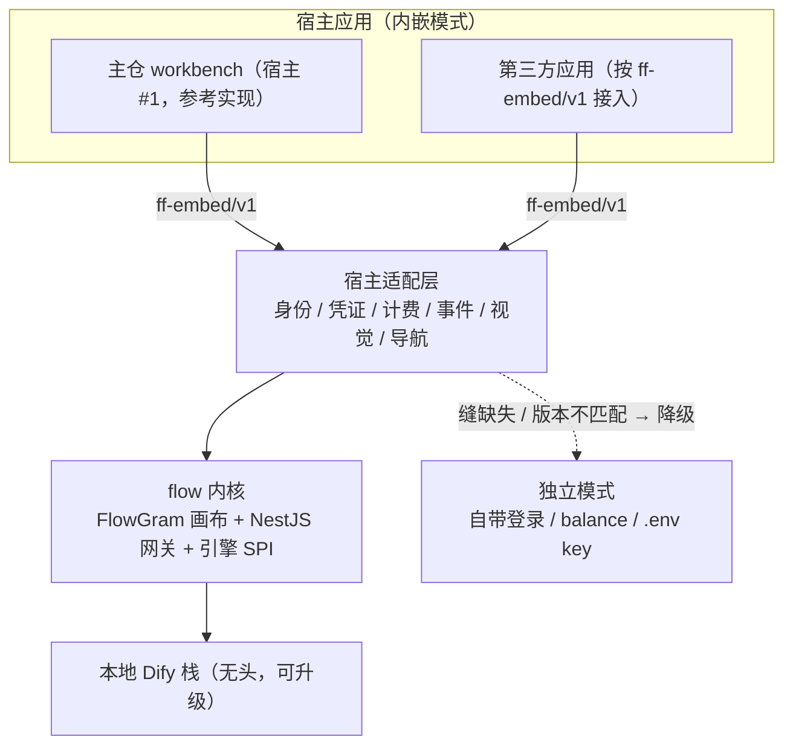

# flow 集成方案（futureFlow 子系统 × 第三模式）

> **角色声明**：方案稿——flow 子系统的集成实施蓝图。决策结论与理由的唯一权威在《[改造计划](../方案设计/改造计划.md)》§6（`DEC-10`…`DEC-13`）；代码现状数字以代码为准。上游仓库以子模块挂载于根级 `flow/`（github.com/future73807/futureFlow，MIT，pnpm workspace：frontend + gateway；完整历史，不走 `references/` 的浅克隆维护，见《日志》五十四）。
>
> **状态（2026-10-09，第二轮补充）**：P0–P6 已落地——模式骨架与宿主适配层、凭证/计量/事件缝、引擎探测与托管（含**承载目标**：本机容器 / WSL2 发行版内 docker）、桌面资源目录承载 compose、卸载 purge（删引擎、留插件代码）均有实现与测试；回执见《日志》一百三十九、一百四十一与一百四十三。**P7（深度收编评估）未启动**（§6 标注「远期，届时另立方案」）；WSL2 发行版内起栈的真机验收待有通用发行版的机器（本机只有 Docker Desktop 内部发行版）。
> **2026-10-09 逐项复核（本轮）**：按 §9 开放问题的三条拍板补齐并登记两处**口径偏差**——① WSL 回收落地为 `wsl.exe --terminate <distro>`（不是拍板文里的全局 `wsl --shutdown`：后者会连用户的其它发行版含 Docker Desktop 一起停掉，爆炸半径过大）；② 内存口径落地为**指引**（引擎页承载表显示「`%USERPROFILE%\.wslconfig` 加 `[wsl2] memory=4GB`」），**不代写**这个全局文件。③ §9-③ 的「卸载默认保留数据卷 + 询问」被用户 2026-10-09 口径覆盖：**停止**默认保留数据卷（`down`，无 `--volumes`），**卸载**删引擎本体（`down --volumes --rmi all`，下次安装重新下载）而插件代码与 compose 资源保留。§7 的 Dify source-available 属性已登记进根级 `NOTICE.md`。

## 1. 背景与定位

- 主仓现有 **design**（画布创作）与 **code**（工作目录 agent）双模式；新增第三种 **flow 模式**：可视化 AI 工作流（编排、发布快照、执行、审计、触发器）。**交付形态是插件**（`FORM-11`）：flow 以插件形态交付，重量级的本地引擎**按需下载**，不随安装包分发——见 §3.5。
- 承载体是合作方作者的 futureFlow，三层架构：FlowGram 画布（React 18 + Semi UI + Rsbuild，`/canvas/:id` 为无侧边栏自包含视图）→ 自研 NestJS 网关（TypeORM + PostgreSQL：双模鉴权/扣费三段事务/DSL 转换 3286 行/Dify Console 集成 1732 行）→ **本地 Dify 容器栈**（必需依赖、不降级，**不引远程托管引擎**）。
- 完成度：代码卫生好（模块边界清晰、迁移体系完整），但处于 **MVP**——SQL/Python 节点仅本地试运行、定时触发是进程内 `setInterval`、多轮会话/审批等待缺失、测试是自写脚本体系（不进主仓 CI）。
- 愿景关系：work = flow + agent（但不完全等于）。三引擎并列（design/code/flow），work 是未来超集；**本期不合引擎**，用引擎 SPI 保住未来可组合性（见 §5）。
- **版权地位（已澄清）**：futureFlow 作者 future73807 即本仓协作者（git 历史 377 提交），其自有代码并入本仓没有版权障碍；上游仓库补一个标准 MIT LICENSE 文件属对外规范动作（面向未来外部贡献者与第三方审计），随上游节奏补即可，**不阻塞任何阶段**。

## 2. 已拍板决策（2026-09-17 提案 + KenKen 确认；2026-09-20 复核补充；结论与理由见《改造计划》§6.2）

| ID | 决策 | 对集成的影响 |
| --- | --- | --- |
| `DEC-10` | flow 子系统**双形态**：**内嵌模式**（可嵌入**任意宿主应用**）+ **独立模式**（保证单独可运行） | 模式差异**只准**落在宿主适配层（§3.2）：内嵌模式去品牌、统一风格、身份/凭证/计费/事件桥接宿主；独立模式自带登录/管理员/bootstrap/计费，零宿主依赖。**主仓是首个宿主（参考实现），契约对第三方宿主开放**（§3.3） |
| `DEC-11` | 执行引擎 = **本地 Dify**（无头栈为默认，**唯一方向**） | **不引入远程托管引擎**；Dify 地址可配，指向用户**自管的本地/内网实例**（BYON 口径）；自托管 Compose 加 dify profile（不跑 dify-web/nginx，Dify logo 条款明文不适用）；**桌面承载 = flow 插件 + 引擎按需下载（双 Provider：WSL2 / 本机容器）**（`FORM-11`，§3.5） |
| `DEC-12` | 计费/凭证**网关缝可插拔（三方可选）** | ① **自带网关**（独立模式默认：自带 balance + `.env` 全局 key）；② **宿主/主仓网关**（内嵌主仓：credits/usage（`DEC-5`/`DEC-6`）+ BYOK 实例（`DEC-7`））；③ **第三方网关**（接入别人已有的网关：`base_url` + key，按 BYOK 实例配置，零代码） |
| `DEC-13` | Dify **保持可升级**（**MVP 阶段不锁版本**） | 引擎适配层收敛兼容硬编码（boolean→number、iteration 展开等**不得渗出适配器**）+ 每次升级的 DSL 转换回归门禁；固定 digest 只作**可复现基线**，不是版本冻结 |

## 3. 双模式架构与交付形态（差异收敛）

### 3.1 两种模式

| 维度 | 内嵌模式（embedded） | 独立模式（standalone） |
| --- | --- | --- |
| 运行形态 | 作为**宿主应用的一个视图**挂载（iframe/组件），随宿主生命周期 | 自带 frontend + gateway，独立进程 / 独立域名 |
| 宿主 | **任意**宿主；主仓 workbench 是首个参考实现，第三方应用按同一契约接入 | 无宿主 |
| 身份 | 宿主签发身份 → 桥接注入（token 交换 / postMessage） | 自带登录 + 管理员 + bootstrap 首启 |
| 凭证与计费 | 由所选网关 Provider 决定（主仓 credits/BYOK 或第三方网关） | 自带 balance + `.env` 全局 key |
| 品牌与风格 | 去品牌，视觉令牌随宿主（`--ff-*` 对齐） | 自有品牌与完整 UI |
| 依赖 | 宿主提供身份/凭证/计费/事件通道（缺项走自带实现） | 零宿主依赖，单独可跑 |
| 定位 | 把 flow 能力**嵌进别人已有的产品** | 保证 flow **单独可交付**（自托管/桌面/试用） |

**共同内核（两模式同源，不得分叉）**：FlowGram 画布 + NestJS 网关 + 本地 Dify 栈 + 引擎 SPI。两模式差异必须能被穷举为「宿主适配层的一组能力注入」——**禁止**在画布、执行链路、DSL 转换里出现 `if (embedded)` 之类的模式分支。

### 3.2 宿主适配层（Host Adapter）——唯一的模式差异缝

按主仓「能力缝三元组」（Definition + Provider + Consumer）组织，缝的消费者是 flow 内核，Provider 由模式选择：

| 缝 | Definition（能力契约） | 内嵌 Provider | 独立 Provider |
| --- | --- | --- | --- |
| 身份 identity | `resolveUser()` / `issueSession()` | 宿主 token 交换或 postMessage 注入 → 按外部 sub get-or-create | 自带账号体系 |
| 凭证 credentials | `resolveProviderCredential()` | 宿主 `resolveCredentials` 下发（BYOK 实例 → Dify Provider 同步） | `.env` 全局 key |
| 计费 billing | `reserve` / `settle` / `refund`（三段事务，flow run id 作幂等键） | 宿主 credits/usage 或第三方网关 | 自带 balance |
| 事件 events | `emit()` + 断线重放（`lastSeq`） | 宿主 WS 通道（`flowRun.*`） | 自带 SSE |
| 视觉 theme | `--ff-*` 令牌 + 品牌位 | 随宿主 | 自有品牌 |
| 导航 navigation | `openProject()` / 返回宿主 | postMessage 通知宿主（复用 `workbench:project-created` 通道口径） | 内部路由 |

两条纪律：

1. **半个缝不许合入**——只写实现不声明接口与消费方的缝不允许进主干（同主仓 `AGENTS.md` 能力缝规则）。
2. **独立 Provider 是兜底**——每一缝都必须存在独立实现并可用；任一缝缺失或宿主不可信时，flow **降级到独立模式**运行，而不是崩溃或半残。

### 3.3 内嵌契约（`ff-embed`）——对宿主开放的稳定接口

- **版本化协议**：`ff-embed/v1`，握手 → 能力协商 → 身份注入 → 事件订阅 → 卸载；两侧各自声明支持版本，**版本不匹配时降级到独立模式并在界面明示**。
- **最小宿主要求**：一个可承载 iframe 的容器 + 身份令牌注入通道 + 主题令牌；凭证/计费/事件三项缺省走 flow 自带实现（即宿主只做「最小接入」也能跑）。
- **安全边界**：内嵌模式**不信任宿主消息**——入站 postMessage 一律 schema 校验 + origin 白名单；宿主给的 sub 必须经服务端验签或 token 交换，禁止前端直接信任。
- **发布形态（已定，2026-09-20）**：v1 **对外发布协议文档 + 第三方宿主接入指引**，并**对外承诺 v1 稳定**（破坏性变更必须升版本号 + 给兼容窗口）；**SDK 延后**——先让第三方能按文档接入，等出现真实宿主需求再打包 SDK。实现上仍先以主仓为第一个消费者打通（不为想象的第三方需求过度抽象），但协议与文档从第一天起按「多宿主」书写。

### 3.4 独立模式自足清单（验收判据）

「单独可运行」不是形容词，是可核对的清单：首启 bootstrap → 建工作流 → 发布快照 → 执行（**本地 Dify**）→ 审计与触发器，**全链路不依赖主仓任何服务**；计费走自带 balance 或第三方网关。每次改动后由冒烟脚本核对，缺项即视为破坏 `DEC-10`。

### 3.5 交付形态：flow 作为插件 + 引擎按需下载（`FORM-11`）

- **flow 以插件形态交付**：服务端是 `features/flow/` 插件（Definition/Provider/Consumer 内聚，ServiceMap 登记一处），前端在插件市场以条目出现（自带 `plugins/` 目录或按包分发，与米家等插件同一机制 `POST /api/plugins/install`），可安装 / 卸载；**未安装时主仓不加载 flow 能力、也不出现 flow 模式的空壳入口**（遵守仓库硬规则「不摆空壳、不放假开关」）。
- **引擎按需下载，不随安装包分发**：本地 Dify 无头栈（镜像 ~1.7GB、磁盘 4–6GB、空载内存 1.5–3GB）与桌面预算（安装包 <150MB、内存 ≤900MB）差一个数量级，因此**安装 / 启用 flow 插件时才下载**（明示体积、磁盘与内存代价，用户确认后开始），未装未启用则零占用、零常驻。下载实现沿用 `scripts/fetch-runtimes.mjs` 的下载 + 校验和做法（同《插件/语音助手插件规划》§5：校验和不匹配即失败、**不留半截文件**、可取消、失败给可读报错与重试），产物落用户数据目录、**不入库**（AGENTS.md 禁止提交产物）。
- **引擎由 flow 插件托管生命周期**：拉起 → 探活 → 端口分配 → 优雅退出 → 卸载时按策略清理（数据目录 / 镜像 / 发行版各自明确「保留还是删除」，卸载前让用户选）。这一层与沙箱的定位**同构**（本机受管执行），但**沙箱不能当容器运行时用**——见 §4 第 14 行。

#### 3.5.1 引擎运行时缝（`engineRuntime`）：双 Provider，不是一个缝两个版本

「WSL 还是本机 Docker」不是两个产品版本，而是**同一条缝的两个 Provider**——同一份 flow 插件、同一个内核、同一份 `ff-embed/v1`，差异只在运行时 Provider。这是本仓能力缝的标准形状（Definition + Provider + Consumer），也是「内核禁止模式分支」这条纪律在运行时层面的延伸：

| 角色 | 内容 |
| --- | --- |
| Definition | `provision()` / `start()` / `stop()` / `status()` / `teardown()` + 能力声明（可用内存上限、是否需虚拟化、端口可达性） |
| Provider A | **WSL2 承载**（Windows 专属）：分发一个内含容器运行时与无头 Dify 镜像集的 distro，走 `fetch-runtimes` 的下载 + 校验和；`.wslconfig` 限内存上限；不随开机自启，退出 flow 或桌面时可 `wsl --shutdown` 回收 |
| Provider B | **本机容器承载**：检测已装的 Docker / Podman（含 `docker compose`），直接用官方镜像拉起无头 profile，用户已有的运行时复用 |
| Provider C（兜底） | **不本地承载**：只装 flow 客户端，引擎指向用户**自管的本地 / 内网 Dify 地址**（仍是本地，不违反 `DEC-11`） |
| Consumer | flow 插件（启用时探测 → 给选择 → 用户确认 → 下载 → 托管生命周期） |

- **按需与降级**：启用 flow 时先探测（WSL2 可用？本机容器可用？都没有？）→ 把可用路径列给用户选 → 都没有则引导安装（WSL：`wsl --install`；容器：Docker Desktop / Podman）或直接走 Provider C。**降级必须明示原因**，不放无提示的空壳。
- **Windows 上推荐 WSL2 优先**：① 免 Docker Desktop 商业授权（Docker Desktop 对超规模企业需付费订阅，WSL2 内跑开源 Docker Engine / Podman 无此约束）；② 隔离边界更清晰（轻量 VM，与桌面进程、与沙箱互不影响）；③ 内存可显式设上限且可整体关停。本机 Docker 作为「用户已有就直接用」的路径保留。
- **平台矩阵（同一条缝，按平台选 Provider）**：

  | 平台 | 首选 Provider | 备选（用户已有就复用） | 说明 |
  | --- | --- | --- | --- |
  | Windows | **WSL2**（微软内置轻量 VM） | 本机 Docker / Podman | WSL2 内跑开源 Docker Engine 或 Podman，无 Docker Desktop 授权约束 |
  | macOS | **Colima**（Lima 系，开源免费、命令行可脚本化，最适合被插件托管） | Docker Desktop / OrbStack / Rancher Desktop | macOS 是 Darwin 内核、**没有 Linux 内核也没有原生容器**，容器一律跑在一个 Linux VM 里——**不存在「Mac 本机原生容器」这一档** |
  | Linux | 原生 Docker / Podman | — | 唯一不需要 VM 的平台，直接拉镜像 |

- **Apple Silicon（M 系列）**：Dify 官方镜像已支持多架构（arm64），Mac 上走 arm64 **原生**，不需要 Rosetta / QEMU 模拟；少数第三方或插件镜像若只有 amd64 会落到模拟（性能与稳定性打折），启用时探测到需模拟应显式提示。
- **为什么不做「非容器源码部署」**（Mac 上 Homebrew 装 Postgres / Redis / Python 直接跑 Dify 的诱惑）：① **官方口径**是「只要能运行 Docker，就能部署 Dify」、推荐 Docker Compose，非容器生产部署不在官方支持之列；② Dify 的 `sandbox` 容器本身就是**代码执行的隔离边界**（flow 的 SQL / Python 节点就靠它），裸跑等于把任意代码执行放到宿主进程里;③ 升级从「拉新镜像 + 跑回归」变成手工迁移，直接违反 `DEC-13`「保持可升级」。
- **WSL 前提**：Windows 10 19041+ 或 11、虚拟化已开启、且是 **WSL2**（WSL1 无完整内核与 systemd，不合适）；不满足即不可选，界面写明原因。网络走 `localhostForwarding` / 显式端口转发，flow 插件只认 `127.0.0.1:<port>`。
- **许可不变**：WSL 内跑的仍是「独立容器 + API 通信」聚合，不复制 Dify 代码进仓库；**不跑 dify-web**（`DEC-11` 无头口径）。

## 4. 主仓接缝清单（勘查结论）

| # | 接缝 | 现有机制 | flow 要动什么 | 风险 |
| --- | --- | --- | --- | --- |
| 1 | 工作台主区判定 | `workbench-surface.ts` 纯函数 + design 永不 conversation 不变量 + 测试锁死 | `WorkbenchMode`/`Surface` 加 flow 短路分支（flow 主区恒为画布）+ 穷举回归测试 + AGENTS.md 不变量登记 | 高（历史事故高发区） |
| 2 | 项目类型 kind | `projectKindSchema` 枚举 → DB CHECK → 前端按 kind 取列表 | 枚举加 `"flow"` + **前向迁移**改 CHECK + 第三份列表/侧栏/建项目 | 中 |
| 3 | 画布 iframe 内嵌 | `/canvas?id=` iframe + 同源 localStorage 鉴权 + `workbench:project-created` postMessage | `/flow` 路由页 + 主区 iframe 分支 + 复用 postMessage 通道（主仓作为宿主 #1 消费 `ff-embed/v1`） | 低（机制现成） |
| 4 | 作用域绑定 | run 必绑项目（硬约束，见 AGENTS.md 历史事故） | flow run 绑 `kind='flow'` 项目；画布 id 即作用域，与 design 同构 | 中 |
| 5 | BYOK 供应商缝 | protocol 封闭枚举 + `provider_instances` 加密存储 + `resolveCredentials`（workspace→system 回退） | 凭证缝的宿主 Provider 走 `resolveCredentials` 下发 Dify Provider；**第三方网关也走同一缝**（按实例 `base_url` + key 配置）；禁止内联供应商判断 | 高（凭证红线 + 封闭集纪律） |
| 6 | 计费 credits | DB 原子扣/退（`FOR UPDATE` + 流水同事务）+ `job_id` 幂等索引 + runtime 平台池额度门；`DEC-5` 目标态默认关 | 按 `DEC-12` 做**三方缝**：宿主态接 credits/usage（flow run id 作幂等键）+ 平台池余额门进 flow 执行入口；第三方网关态由该网关自计费、主仓只记 usage；独立态保留自带 balance | 中 |
| 7 | 桌面 Tauri 生命周期 | 单子进程 spawn/探活/优雅退出 + 内嵌 PG + 进程内队列 | 引擎**不随安装包分发、默认不常驻**：flow 以插件形态交付，本地 Dify 栈按需下载并由插件托管生命周期（`FORM-11`，§3.5）；Tauri 的「单子进程」模型不受影响——引擎是插件管的独立运行时（WSL2 / 本机容器），不是 sidecar | 高（架构级） |
| 8 | 插件内核 + 插件市场 | kernel ServiceMap + profiles 清单 + plugin 四件套（inject/apply/mounted）+ 市场（`POST /api/plugins/install`，自带 `plugins/` 与 url 两条来源，admin 门） | `features/flow/` 插件（工作流定义/版本/运行记录）+ ServiceMap 登记一处 +《改造计划》§4.2 一处；**flow 以插件形态交付**（市场可装 / 卸，未装不加载、不出入口）+ 引擎下载清单挂在该插件上（`FORM-11`） | 低 |
| 9 | 队列 job | `backgroundJobTypeSchema` 仅图/视频 + `registerExecutor()` | flow 执行需后台化时扩 `flow_execution` job 类型 + executor | 中 |
| 10 | WS 事件 | `streamEventSchema` 判别联合 + canvasId 锚定推送 + `lastSeq` 断线重放 | 加 `flowRun.*` 事件；flow 画布纳入 EventBuffer；SSE 收敛为子系统内部实现 | 中 |
| 11 | workspace 工程 | `apps/*` 通配 + pnpm@10 锁定 + `onlyBuiltDependencies` 白名单 | React 18/zod 4/Nest 与主仓隔离；带 postinstall 的新依赖补白名单 | 中 |
| 12 | 文档治理 | `check-docs` 门禁 + 决策 ID 表 + 《日志》台账 | 本方案入图；各阶段落地时同提交更新台账 | 低 |
| 13 | 宿主适配层（**新增缝**） | 无（新机制，§3.2） | 六缝 Definition + 内嵌/独立两套 Provider + `ff-embed/v1` 握手；每缝必须有独立兜底实现 | 高（决定双模式是否真成立） |
| 14 | 沙箱 / 执行后端 | 目录级：画布→工作目录映射（`sandbox-dir.ts`，产品决策 2026-09-14「暂时不用沙箱，高风险命令才用沙箱」）+ 权限闸门 + 路径 allowlist；OS 级隔离（Seatbelt / Landlock / Windows 受限令牌 + Job Object）属《多端》§7 的 D5 | **flow 的 SQL / Python 节点本地试运行**复用该缝；**引擎承载不走沙箱**——沙箱是「把进程关小」的降权收窄，不提供镜像分发 / 多服务编排 / 容器网络 / 持久卷，要放行多容器只能开 `danger-full-access`，等于拆掉桌面安全模型 | 中（误用会同时破安全与预算） |
| 15 | 引擎运行时缝 `engineRuntime`（**新增缝**） | 无（新机制，§3.5.1） | Definition（provision/start/stop/status/teardown）+ 双 Provider（WSL2 / 本机 Docker·Podman）+ 兜底 Provider（指向自管地址）+ Consumer（flow 插件）；下载沿用 `fetch-runtimes` 的校验和做法 | 中（决定桌面能否承载） |

## 5. 合并方式（三选项）

> 先分清两个正交维度：**A/B/C 是「flow 与主仓的耦合深度」**；**内嵌/独立是「flow 对宿主的形态」（§3）**。B 形态下 flow 同时具备两种模式——主仓是内嵌宿主 #1，独立模式仍可单独交付。

- **A. 子模块独立运行（现状，已落地）**：主仓与 futureFlow 双栈各自跑，零耦合。flow 上游仍在 MVP 冲刺期的最优解——子模块指针跟随上游，零维护成本。
- **B. iframe 集成内嵌（推荐目标）**：主仓加 flow 模式骨架（P1）+ futureFlow 侧宿主适配层与 `ff-embed/v1`（P2–P5）；NestJS 网关与本地 Dify 栈作为**独立子系统**保留，不折叠进主仓进程。React 18 vs 19、Rsbuild vs Next 的双版本问题靠 iframe 天然隔离，反而安全。
- **C. 深度代码收编（远期可选）**：frontend 折叠进 `apps/web`、网关改写为 Fastify `features/flow/`、TypeORM 迁移翻译进 `supabase/migrations`。成本最高，且与「迁移单源」「插件形状」纪律的对接代价大；等上游稳定 + B 跑通后再评估。
- **架构主轴（B/C 共用）**：futureFlow 已有 FlowGram→Dify 中间转换层，把它正式化为**引擎 SPI**（create/publish/run/stream 四接口 + 多 Provider，**全部本地执行**：本地 Dify 适配器 / FlowGram runtime-js 轻量适配器）。画布协议稳定、引擎可插拔（Coze Studio 先例已验证该解耦），同时为桌面零 Docker 形态铺路。

## 6. 分阶段实施（PR 拓扑）

| 阶段 | 内容 | 验证 |
| --- | --- | --- |
| P0 | 子模块挂载 + 本方案 + 决策登记 | `pnpm test:docs` + `node --test tests/workspace.test.mjs` |
| P0.5 | 章程与决策登记（已完成：AGENTS.md references 例外 + `DEC-10`…`DEC-13`）；上游补 MIT LICENSE 文件为对外规范建议，不阻塞 | 人工核对 |
| P1 | 主仓模式骨架（不碰上游）：kind 枚举 + DB 前向迁移 + `workbench-surface` flow 分支 + 穷举不变量测试 + AGENTS.md 不变量登记 + `/flow` 占位路由 + **flow 插件条目**（市场可见；未安装时不出入口、不加载能力） | `apps/web` vitest（`workbench-surface.test.ts` 扩 flow 穷举）+ `pnpm typecheck` |
| P2 | **宿主适配层 + `ff-embed/v1`**（`DEC-10`）：六缝 Definition 先立，内嵌 Provider 以主仓为宿主 #1 打通（token 交换/postMessage 注入、按宿主 sub get-or-create、CORS 加外壳域名、去品牌、`--ff-*` 视觉令牌对齐），独立 Provider 保留并回归 | 双栈本地联调（futureFlow `pnpm start`：3000/3001/8080/5001）+ GUI 冒烟 + **独立模式自足清单**（§3.4）回归 |
| P3 | 凭证缝（`DEC-12`）：宿主 Provider = BYOK 实例下发（`resolveCredentials` → Dify Provider 同步，独立 feature 服务）；**第三方网关 Provider = 实例 `base_url` + key 接入**；独立 Provider = `.env` 全局 key | 服务端单测（凭证不回显、脱敏）+ 联调 + 三方 Provider 各自跑通 |
| P4 | 计量缝（`DEC-12`）：宿主态接 credits/usage（`DEC-5`/`DEC-6`），flow run id 作幂等键，平台池余额门进 flow 执行入口；第三方网关态只记 usage 不自扣；独立态保留自带 balance | 幂等重放/并发/退款回归测试 |
| P4（现状口径，2026-10-09 复核） | **credits/平台池余额门已随 `DEC-20`（用户与账户系统重构）退役**：本期本机免账户 + BYOK，所有路径不检查套餐或余额，不留假计费服务；计量缝的实质内容（宿主态计费 + 余额门）**顺延到《官方账户与远端连接基础设施》（`DEC-21`）阶段**再落，届时以该规格为准 | 当前无计费回归可跑；`DEC-20` 的「不留空计费服务」由账户重构轮的测试覆盖 |
| P5 | 事件统一：`streamEventSchema` 加 `flowRun.*`，EventBuffer 纳管 flow 画布，断线 `lastSeq` 重放；内嵌态经宿主通道透出 | shared 契约测试 + WS 集成测试 |
| P6 | 部署形态（`DEC-11` + `FORM-11`）：自托管 Compose 加 dify profile（**本地 Dify 无头栈**）；桌面 = flow 插件 + 引擎按需下载 + `engineRuntime` 双 Provider（WSL2 / 本机容器）+ 兜底（指向自管地址） | 空库全量重放 + Compose 健康检查 + 下载失败/取消路径 + 卸载后无残留 + WSL 与本机 Docker 两条路各自跑通启停 |
| P7 | （远期）深度收编评估 | 届时另立方案 |

纪律：每阶段一个可验证行为变化 + 测试护航；跨端契约（`packages/shared`）改动全量门禁；《日志》台账同提交记账。

## 7. 许可证与合规

- **组合结论**：GPL-3.0 主仓 ⊃ MIT futureFlow（宽松→copyleft 单向兼容，可并入）；Dify（Apache 2.0 + 附加条款，source-available）以**独立容器 + API 通信**接入，属聚合（aggregation）而非衍生作品；**不得把 Dify Python 代码复制进本 monorepo**，保持容器边界，分发附其 LICENSE/NOTICE。
- **Dify 附加条款**：① 多租户限制——单用户/单 workspace 部署不触发；未来若做 SaaS 且 Dify 侧多 workspace，需书面商业授权。② logo/版权条款**仅约束 Dify 前端**——`DEC-11` 的无头部署（不跑 dify-web/nginx）明文不适用。
- **Dify 版本（`DEC-13`）**：本地 Dify **保持可升级**，MVP 阶段不锁版本；固定 digest 只作可复现基线。升级路径 = 适配层收敛 + DSL 转换回归门禁（网关对 0.15.3 有行为兼容硬编码：boolean→number、iteration 展开等，**必须留在适配器内**，升级时逐项回归）。THIRD-PARTY-NOTICES 如实标注 source-available 属性。

## 8. 风险清单

| # | 风险 | 对策 |
| --- | --- | --- |
| 1 | 上游有 force-push 历史（2026-09-17 实测） | 子模块指针固定到具体 commit；升级指针时逐提交审阅 |
| 2 | 依赖未文档化的 Dify Console 私有 API（建应用/导入 DSL） | 网关已封装集成服务；Dify 升级前做兼容回归（`DEC-13` 门禁） |
| 3 | **Dify 升级频率高（MVP 阶段版本漂移快）** | 兼容差异一律收敛在引擎适配器；把「升级 + DSL 转换回归」做成固定动作而非一次性工程；不为某一版本写长期兼容 |
| 4 | **第三方宿主不可控**（内嵌到别人应用） | `ff-embed/v1` 版本协商 + 降级；入站消息 schema 校验 + origin 白名单；宿主 sub 必须服务端验签 |
| 5 | **模式分支渗入内核**（双模式变成两套代码） | 差异只准落在宿主适配层六缝；代码评审把内核里的模式判断视为缺陷；独立 Provider 常驻可用 |
| 6 | 前端巨型单文件组件（最大 2654 行）维护成本 | B 形态下作为子系统隔离；不鼓励主仓侧改其内部 |
| 7 | 网关进程内定时器/内存态限流，多副本会重复触发 | 自托管文档标注单副本约束；后续再评估分布式锁 |
| 8 | 测试体系非标准（自写脚本 + 真 Docker 栈），进不了主仓 CI | 保留为上游自检；主仓侧为集成缝与双模式清单写自己的回归测试 |
| 9 | 上游仓库无独立 LICENSE 文件（仅 README/package.json 声明 MIT） | 版权人即本仓协作者，并入无障碍；建议上游顺手补标准 MIT LICENSE 文件，便于未来外部贡献与第三方审计 |
| 10 | 引擎按需下载的失败面（网络中断、磁盘不足、校验和不匹配、镜像拉一半） | 沿用 `scripts/fetch-runtimes.mjs` 的下载 + 校验和（不匹配即失败、不留半截文件、可取消、可重试）；体积与磁盘代价前置明示；失败给可读报错 + 手动放置路径 |
| 11 | **误把「沙箱」当容器运行时**（曾在本轮提出） | 结论写进文档（§3.5 / §4 第 14 行）：沙箱是降权隔离，不提供镜像/编排/容器网络/持久卷；引擎承载走 `engineRuntime` 缝，禁止用 `danger-full-access` 兜底 |
| 12 | WSL2 前提不满足（Windows 版本过低、虚拟化未开、WSL1） | 启用 flow 时探测并**写明不可选原因**；不满足时落 Provider B / C，不静默失败 |
| 13 | Docker Desktop 商业授权（超规模企业需付费订阅） | Windows 默认推荐 WSL2 路径（开源 Docker Engine / Podman，无授权约束）；本机 Docker 作为「用户已有就复用」路径，文档中如实提示授权条款由用户自担 |
| 14 | macOS 上被误当成「Linux 那套，直接装就行」（实际 Darwin 无原生容器，必须 VM） | 平台矩阵写死（§3.5.1）：macOS 首选 Colima（Linux VM），Apple Silicon 走官方 arm64 镜像；**不做非容器源码部署**（官方只支持能跑 Docker 的部署，且 sandbox 容器是代码执行隔离边界） |

## 9. 开放问题

1. **桌面引擎「怎么拿到运行时」的实施细节**（`FORM-11` 已定：承载方式 = flow 插件 + 按需下载，运行时 = 双 Provider「WSL2 / 本机容器」+ 兜底「指向自管地址」）。**三问已拍板（2026-09-25，用户委托按工程最优补定，可复议）**：
   - ① **WSL2 分发形态：装好 WSL 后在其内自行拉取镜像**（不在仓库里自分发打包发行版）。理由：插件守护 + 无头镜像集实测已到 **≈8.3GB**，打包分发会让安装包/补丁体积失控；自行拉取贴近官方升级路径（`DEC-13`），配合 docker compose 的 profile 一条命令起栈。代价：首次需要外网（与「镜像按需下载」的前提一致）。宿主侧职责 = 探测 WSL2 可用性（已落地）→ 指导安装发行版 → 在 distro 内启用 Docker Engine → 拉起 compose。
   - ② **内存口径：`.wslconfig` `memory=4GB`，退出 flow 时自动 `wsl --shutdown`**。理由：无头栈 10 容器实测空载 1.5–3GB，4GB 留出运行余量且不挤占桌面「内存 ≤900MB 的应用进程」预算（引擎是独立 VM，不占该口径）；自动 shutdown 换取「不用 flow 时零常驻」，代价是下次冷启动慢数秒——桌面场景可接受。数据（docker volume）不受 shutdown 影响。**落地口径（2026-10-09，偏差已登记）**：回收实现为停栈成功后 `wsl.exe --terminate <distro>`（只停本栈所在发行版，不碰用户其它发行版）；内存上限**只给指引不代写**（`.wslconfig` 是管用户所有发行版的全局文件，插件不越权改），指引显示在引擎页承载表。
   - ③ **数据卷落点：落 distro 内**（docker 命名卷），不挂载 Windows 目录。理由：跨文件系统 I/O（9P）对 Postgres 是数量级劣化；备份用 `docker run --rm -v … tar` 导出命令文档化（compose 文件头已写「down -v 无残留」口径）。卸载策略：flow 插件卸载时**默认保留数据卷**并显式询问「保留 / 全删」，选择全删才执行 `down -v`——与 compose 头的口径一致。**落地口径（2026-10-09，用户口径覆盖本条）**：普通**停止**默认保留数据卷（`down`，不带 `--volumes`）；**卸载**按用户 2026-10-09 口径删引擎本体（`down --volumes --rmi all`，下次安装重新下载），插件代码与 compose 资源保留——不再询问「保留 / 全删」，如要复议以本条落地口径为准。
2. **NestJS 网关长期去留**：B 形态下作为独立子系统长期存在，还是以 C 为目标提前做 Fastify 适配层？影响 P3/P4 缝的实现位置。
3. **上游协作模式**：作者继续在原仓开发、主仓子模块指针跟随；何时转入主仓直接开发（作者已是本仓协作者，随时可转）。
