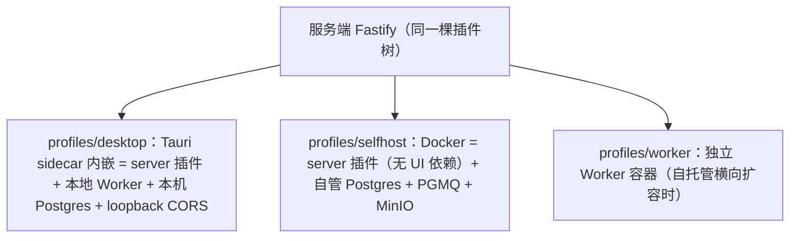
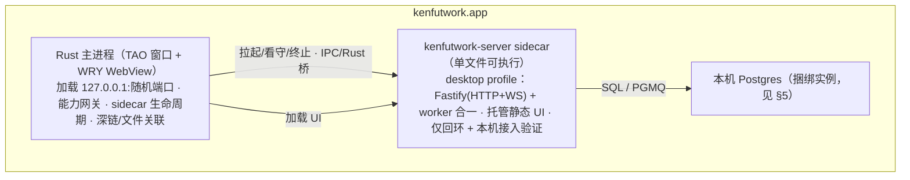

# 多端产品设计（桌面 / 自托管 / Web / 移动）

> 状态：**权威形态设计，整体实施中**。2026-10-05 本期本地实例重构、整体验收及分类提交已完成；局域网、自部署接入档位及远端服务仍按各自阶段推进。形态取舍以本稿为准，具体身份/目录实施规格见《[用户与账户系统重构](./用户与账户系统重构.md)》。
> 定位：《改造计划》的**姊妹文档**——承接其 §4.8 存储缝与 §4.9 profile 机制，落地多端形态。本文新增的 ctx key（`persistence`/`storage`/`toolsGateway` 等）须同步《改造计划》§4.2。
> 决策记录：
> - 2026-09-02：转向**桌面为主**，继续 GPLv3 开源。
> - **2026-09-11**：去 Supabase 云托管，存储统一自管 Postgres。
> - **2026-10-05**：本期单本地实例、桌面及回环 Web 免账户 BYOK；未来官方账户/远端服务仅写规格（`DEC-21`），不冻结云端承载方式，不实现 SaaS、团队或企业版。
> 现状标注：代码事实与验证回执以《02-当前项目实现状态》及《日志》为准；本文的目标和历史迁移过程不能直接作为实现完成证据。上游地基为《改造计划》。

---

## 1. 产品形态

### 1.1 两形态矩阵

| | 桌面本地（主形态） | 自托管 |
| --- | --- | --- |
| 服务端 | Tauri 内嵌 sidecar（本机进程） | Docker Compose（用户机器/NAS/VPS） |
| 数据存储 | 本机 Postgres（桌面捆绑实例，见 §5） | 自管 Postgres + 对象存储（MinIO） |
| BYOK Key | 数据根目录明文凭据文件，授权设置可查看/复制（规范见《改造计划》§4.8） | 凭据供给与授权独立于官方账户，部署规则另立规格 |
| Worker 能力 | 完整（本机操控，过沙箱） | 部署机上的受限子集 |
| 接入与身份 | 本机接入凭据 + 稳定实例归属，无账户 | 独立实例身份和接入授权；官方账户不是运行前提 |
| 适用 | 个人创作者（本期） | 用户自部署与远端扩展（后续）；团队/企业管理本期不做 |

**本期边界**：本地 BYOK 先行，官方账户与远端服务只形成《[官方账户与远端连接基础设施](./官方账户与远端连接基础设施.md)》。去 Supabase 云不等于永久禁止官方远端服务；本期不实现平台 SaaS，不预设未来计算承载或商业模式。

### 1.2 客户端形态与优先级

| 形态 | 技术 | 角色 | 数据位置 | 优先级 |
| --- | --- | --- | --- | --- |
| 桌面端（主形态） | Tauri 2（mac/win/linux） | Web UI + 内嵌服务端 sidecar + 本地 Worker + 沙箱宿主 | 本机 Postgres | P0 |
| 自托管服务端 | 同一服务端代码，Docker | 无头 server + worker，独立实例身份与 BYOK | 自管 Postgres | 后续 |
| Web 客户端 | Next.js 静态导出（现有 `apps/web`） | 本期连桌面 loopback；远端授权后续接入 | 跟随来源实例 | 本机 P0，远端后续 |
| 移动客户端 | Tauri 2 Mobile（iOS/Android） | 瘦客户端，QR 配对连服务端 | 跟随服务端 | P2 |
| 移动 Worker | 同上，受限能力节点 | 分享流入/相机/语音/通知；无 shell、无任意文件访问 | 端侧受限 | P3 |

**统一原则**：一份服务端代码，部署于本机或用户服务器；一份 Web UI 可封装于桌面/浏览器/未来移动端。本期桌面与本机浏览器共享同一实例，远端列表按来源和当前授权追加，不能由官方登录替换本地数据。

### 1.3 设计原则（继承仓库准则）

1. **单一 UI 产物、单一服务端代码库**：形态差异只表达为 profile 装配差异，不为桌面写第二套后端、不 fork 前端。
2. **能力即缝**：每个形态差异（存储/认证/队列/凭证/本机工具）都是缝三元组，禁止 `if (isDesktop)` 散弹式分支。
3. **BYOK 与隐私优先**：数据与 Key 默认落在用户侧（本机或自管服务器），不经平台云。
4. **内存是硬指标**：不用 Electron 是起点不是终点（§10）。

---

## 2. 参考架构提炼

### 2.1 nomifun 桌面模式（`references/nomifun-tauri`）

- **Tauri 2 + 内嵌 server**：Rust 后端以 embedded-server 形式随应用进程运行；非 Electron，用系统 WebView；React UI 产物作为资源打包。
- **能力 crate 化**：computer-use、PTY 终端、文件、shell、SSH、浏览器平台各为独立 crate，由组合根按配置装配。
- **移动端不重写能力，只复用桌面会话**：桌面开「WebUI 访问」后，移动扫一次性 QR 配对，直接复用会话、任务与能力。
- **本地存储**：SQLite + 内嵌迁移 + repository traits（KenFutWork 选型不同，见 §5：用自管 Postgres 复用现有迁移）。

### 2.2 dsh 沙箱模型（`references/deepseek-harness`）

- **三档囚禁**：`read-only` / `workspace-write` / `danger-full-access`；被策略拒绝的调用可经用户批准的**一次性行内提权**重试。
- **每平台后端**：Linux bwrap→Landlock、macOS Seatbelt、Windows 受限令牌 + ACL；共享策略解析器按部署默认值 + 会话级覆盖解析每次调用策略。
- **fs / subprocess 缝职责分离**：`ctx.fs`（后端可换 host/sandbox-enforcing）+ `ctx.subprocess`（子进程唯一出口）+ 模型侧工具（read/write/edit/glob/grep）——**后端更换不触碰工具与策略**。

---

## 3. 统一服务端：一份代码，两种部署

延续《改造计划》§4.9 的 profile 机制：



核心决策：

- **D1 桌面 = 壳 + 内嵌服务端，不是纯客户端**：本机文件/沙箱/操控类 Worker 能力必须有本地运行时，顺带获得离线可用与 Key 本地化。
- **D2 服务端零分叉**：复用 `apps/server` 全部代码；桌面 = 新增 `profiles/desktop.ts`（server + worker 合并为**单进程**）。
- **D3 UI 单产物**：`apps/web` 已是 `output: "export"`；桌面 WebView 与自托管 server 托管**同一份静态文件**。前置改造：`NEXT_PUBLIC_SERVER_BASE_URL` 等构建期烘焙值必须改为**运行时注入**（Tauri 启动参数 / `window.__KENFUTWORK_RUNTIME__` / 相对路径）。
- **D4 sidecar 打包**：目标 = 单文件 Node 服务端可执行（Spike S1）。
- **D5 移动端 = 瘦客户端 + 受限 Worker 子集**：iOS 无 JIT、无后台常驻、文件系统沙盒化，sidecar/Node 在 iOS 不可行——平台硬约束。
- **D6 网络自带（BYON）**：内网穿透/中继不进入本期。下一独立阶段才做局域网访问：默认关闭、逐设备配对、桌面确认与独立撤销，配对设备等同实例主人；发现和传输方案届时确定，不提前要求 mDNS/QR 或固定网络工具。

---

## 4. 桌面端架构（Tauri 2）

**为什么不是 Electron**：Tauri 用系统 WebView（WKWebView / WebView2 / WebKitGTK），不打包 Chromium，最小应用在 KB 量级，内存与体积是数量级差距。代价：三端 WebView 行为差异要当一等公民测（尤其 Linux WebKitGTK 跑 Excalidraw，Spike S3）。

**进程模型**：



- **Sidecar 方案（推荐 A）**：A. Node 独立可执行（Node SEA 或 `bun build --compile`）——零重写，服务端插件树原样运行，代价常驻约 80–150 MB；B. Rust 重写内核——仅远期选项；C. Rust 直接实现能力无 sidecar——否决。
- **Rust 层保持薄**：只做系统胶水（窗口/托盘/自更新/深链/沙箱 OS 调用与服务生命周期），业务一律在 sidecar——保证桌面与未来自部署可复用相同服务；供应商凭据目标按《改造计划》§4.8，不要求 OS 钥匙串。
- **Tauri 插件清单**：`shell`（sidecar 管理）、`fs`（scope 受限）、`dialog`、`notification`、`clipboard-manager`、`global-shortcut`、`deep-link`、`autostart`、`single-instance`、`updater`；本期 BYOK 不依赖 stronghold/keyring。
- **打包与更新**：`externalBin` 声明 sidecar（按 target triple 分发三平台二进制）；`tauri-plugin-updater` + 自托管更新清单。签名成本：macOS 公证、Windows 代码签名证书、Linux 无强制。


### 4.1 数据根目录与恢复

`DEC-20` 的数据根目录统一归属本地实例：数据库、实例元数据、附件/blob、凭据、配置、插件和会话恢复数据随整体目录迁移；外部 Code 项目目录不移动。迁移等待在途工作结束，停止服务与数据库后复制、校验并切换，失败继续原目录。

本期提供目录入口与停机文件夹备份/恢复指引，不新增打包器或单会话导入。恢复保持实例与会话上下文，外部项目路径不可用时提示重新关联，不自动重放任务；凭据目录包含明文秘密值。操作步骤与验收唯一见《用户与账户系统重构》§5。

---

## 5. 存储与能力缝（去 Supabase，统一自管 Postgres）

前置：《改造计划》P0–P8 完成后开工。全部按三元组设计。下表是**缝落地清单**（Definition/Provider/Consumer 三元），**不是 ctx key 表**——其中新增的 key 落地时写入《改造计划》§4.2（key 表只此一份，本文不维护副本）。

| 缝 | Definition | Provider（按形态） | Consumer |
| --- | --- | --- | --- |
| `persistence`/`storage`（新增） | 各聚合 repository 接口（projects/canvas/threads/…）+ blob + queue | desktop = 本机捆绑 Postgres；selfhost = 用户自管 Postgres | 各 feature 插件 |
| 本地实例与接入 | 实例引导 + LocalActor + 客户端授权接口 | 本期 = 稳定 instanceId、HttpOnly cookie / 明确授权 Bearer、回环服务；未来自部署独立接入 | scoped repository、HTTP/SSE/WS/RPC |
| 队列（jobs 下可替换） | JobService 队列接口 | desktop = 进程内队列（`FORM-2`）；selfhost = PGMQ（Postgres 扩展） | worker profile |
| blob（文件存储） | BlobStore 接口 | desktop = 数据根目录内本地文件；selfhost = 独立对象存储 Provider | 画布图/视频/上传 |
| 凭据（供应商服务内部） | 统一凭据存取接口 | 本期 = 数据根目录明文文件；授权设置可读取（规范见《改造计划》§4.8） | 供应商配置与模型实例化 |
| 本机工具网关 | scopes 校验、确认策略与执行接口 | desktop = 本机沙箱；selfhost = 部署机执行器 | 本机工具消费者 |

**本地实例（2026-10-05 修订）**：实例主人无需账户、成员或管理员角色；已获授权的客户端可管理供应商、插件和 MCP，仍受安装检查、Task 授权、沙箱及工具审批约束。删除旧 `isAdmin=true` 固定用户与多账户后台，本机接入权不等于模型执行可绕过沙箱。官方账户与远端服务的独立授权见 `DEC-21`，本期不实现多主体体系。

**为什么用自管 Postgres（而非 PGlite/SQLite）**：现有 `supabase/migrations/`（数量见《02-当前项目实现状态》§6，本文不写死计数）是 Postgres SQL，且用到原子 RPC 与 Postgres 语义——**自管 Postgres 服务能原样复用这套迁移与 SQL 知识**，无需第二套 schema 或方言转译。桌面与自托管共用同一 Postgres 语义，只是部署位置不同（本机 vs 服务器）。PGMQ 仅在自托管形态可用（桌面队列见 `FORM-2` 结论）；RLS 按 `FORM-9` 结论由应用层隔离取代。

**去 Supabase 的迁移工作（本计划最大单项工程）**：Supabase = Postgres + Auth + Storage + 自动 API + RLS 角色体系。替换为自管 Postgres 需要：

1. **数据库**：Supabase 托管 Postgres → 自管 Postgres 服务；迁移 SQL 中**剔除/物化 Supabase 专有对象**（`auth` schema、`storage` schema、依赖 Supabase 内置角色的 RLS 策略、Supabase 专有扩展），业务表与 RPC 保留。
2. **接入与身份**：历史 Supabase JWT/固定本地用户退出第一方业务；本期改为本地实例 + 接入客户端。未来自部署认证另立规格，官方账户不是前提。
3. **文件存储**：Supabase Storage 桶 → blob 缝（桌面本地 FS / 自托管 MinIO）。
4. **桌面 Postgres 供给**：捆绑 `embedded-postgres`（随应用分发一个真 Postgres 二进制，对用户透明）。**已拍板（2026-09-13）：`FORM-2` 采纳捆绑方案（PG 17 线、首启动 initdb + 同源迁移；桌面队列改进程内，不依赖 PGMQ 扩展）——实施细节与备选取舍见《改造计划》§6.1。**
5. **应用层隔离**：`FORM-9` 保留唯一 repository 入口与强制作用域过滤，2026-10-05 将第一方主体统一为实例。漏写谓词、错误实例归属、Task 旧代际必须拒绝；不保留账户 RLS 或双主体别名。

节奏：历史去 Supabase 按原回执留档；本轮按《用户与账户系统重构》分域接线与验证。现有测试数据无需保留，不维护存量云部署兼容；不可变迁移历史继续保留，schema 用前向清理迁移收敛。

---

## 6. 能力节点（Worker）体系

现有 `registerExecutor()` 升级为**能力节点模型**，统一执行位置：

```text
Server（自托管 / 桌面内嵌）
  ├── 内置 Worker（进程内或本机 sidecar）
  ├── 独立 Worker 容器（自托管 Docker 横向扩容）
  ├── 桌面 Worker（本机：沙箱内 shell/文件/computer-use，经 Rust 桥）
  └── 移动 Worker（受限：分享流入/相机/语音/通知）
```

- **节点注册**：Worker 启动后向服务端认证并声明 `capabilities: ["image_generation","video_generation","local.shell",...]`；服务端维护节点表（心跳、负载、能力清单）。
- **任务路由**：任务类型 → 需要的能力 → 路由到具备该能力的节点；桌面本机任务优先本机节点（数据不出机）；BYOK 凭证随任务加密下发或节点自持。
- **桌面特殊性**：本机 Worker 的 `local.*` 能力必须过 §7 沙箱与权限；自托管容器 Worker 默认全量能力（服务端即信任边界）。

**本机 Worker 能力清单**：

| 能力 | 载体 | 阶段 |
| --- | --- | --- |
| 文件读写/搜索/移动（scope 到授权目录） | Rust fs + 权限闸门 | D5 |
| Shell 执行（白名单 + 确认） | Rust 沙箱包装进程 | D5 |
| 剪贴板/通知/打开 URL 与应用 | Tauri 插件 | D5 |
| 目录监听、文件索引 | notify/walkdir + ignore | D5 |
| 截图 | xcap | D5 |
| 浏览器自动化 | CDP 控制用户自有浏览器（不内嵌） | D5+ |
| 输入操控（computer-use 级） | enigo | 远期（默认关闭，显式开启） |

---

## 7. 沙箱与权限体系

**与《改造计划》§4.6 的分工**：`permissions` 策略缝（default/auto-approve/full-access）是**跨形态**的 tool-call 拦截策略（挂 `tool-pre-execute` 事件）；本节沙箱是**桌面形态的执行后端**——策略决定「要不要拦」，沙箱决定「拦不住时如何隔离」。两者分离，后端更换不触碰策略与工具。

- **三档模式**（沿用 dsh 词汇）：`read-only` / `workspace-write`（默认，工作区可写）/ `danger-full-access`（明示开启，二次确认）；另有**一次性行内提权**：被拒调用弹窗说明原因，用户批准后单次放行。
- **平台后端**：macOS Seatbelt（`sandbox-exec`）、Linux bwrap→Landlock、Windows 受限令牌 + Job Object + 工作区 ACL——Rust 层实现 OS 调用，sidecar 经 Tauri IPC/Rust 桥使用。
- **toolsGateway 权限模型**：每个工具声明 scopes（路径范围/命令模式/网络 egress 域）；三态策略 allow/ask/deny，**默认 deny**；ask 弹 Tauri 原生确认框（记忆粒度：本次/本会话/永久）；全量审计日志（谁/何时/动作/参数摘要/结果摘要，含敏感内容脱敏）。
- **沙箱分层（务实渐进）**：L0（D5 必须）闸门 + 路径 allowlist + 路径穿越防护 + egress 默认拒绝；L1（D5 分平台）Seatbelt/Landlock+bwrap/受限令牌包裹子进程；L2（远期）网络 egress 强制过代理点。
- **威胁模型（一号风险是 prompt injection）**：任何不可逆/越权动作必过人审闸门，agent 无「自我授权为永久」路径；网页/文档/工具结果进上下文前清洗注入模式；恶意工作区内容不得扩大 scopes；loopback 上所有 HTTP/WS 校验 pairing token + Origin。
- **computer-use**（远期）：对标 `nomi-computer`，v1 先做屏幕截图 + 受控输入。
- **沙箱不是容器运行时**（2026-09-20 澄清，起因是「flow 引擎能不能放进沙箱」）：本节沙箱只解决「本机执行怎么隔离降权」（目录 / 权限 / 路径 / egress），**不提供镜像分发、多服务编排、容器网络、持久卷**——这四样是容器运行时的职责。需要它们的场景（flow 的本地 Dify 无头栈）走独立的 `engineRuntime` 缝（`FORM-11`，见《flow集成方案》§3.5.1）：Windows 由 WSL2 或本机 Docker/Podman 承担，macOS 由 Colima / Docker Desktop，Linux 由原生 Docker / Podman。**禁止**用 `danger-full-access` 把多容器栈塞进沙箱当兜底——那等于拆掉本节的隔离模型，同时击穿 §10 的内存预算。

---

## 8. 移动端

Tauri 2 同库出 iOS/Android，UI 复用静态产物（另做响应式适配层）。

| | iOS | Android |
| --- | --- | --- |
| 瘦客户端（画布/对话/审批/通知） | 是 | 是 |
| 媒体采集（相机/相册/语音） | 是（picker 沙盒内） | 是 |
| 分享入（系统分享到 KenFutWork） | 是 | 是 |
| 后台任务 | 仅 BGTask 窗口内短任务 | 前台服务（常驻通知） |
| Shell / 文件系统 | 否（平台禁止） | 受限提供（默认关闭） |
| 承载服务端 | 否（不可行） | 否（非产品方向） |

「手机 Worker」定位为 **capability 子集**：手机作为受限执行端挂到用户选定的服务端（桌面或自托管），不承载服务端本体。连接：mDNS 发现 + QR 配对；跨网 = 用户自有通道（D6）。

---

## 9. 自托管（Docker）

- 基线已有（server 已有 Dockerfile），扩展为官方 Compose：`server`（托管静态 UI）+ `worker` + `postgres`（含 PGMQ 扩展）+ `minio`（对象存储）+ 可选 auth 组件。server 与 worker 可合并为单镜像双 profile 启动，降低 compose 复杂度。
- **身份边界**：自部署身份独立于官方账户（`DEC-21`）；具体接入档位由 `FORM-3` 后续确定。团队、多用户和企业管理本期不实现，不把本机回环规则直接用于公共网络。
- **升级纪律**沿用仓库「数据库迁移」章节：镜像版本与迁移账本绑定、先备份、只前向修复、禁止覆盖校验和。

---

## 10. 内存与性能预算

| 组成 | idle 目标 | 工作态目标 |
| --- | --- | --- |
| WebView（画布/编码页） | 120–180 MB | 300 MB |
| kenfutwork-server sidecar | < 150 MB | 400 MB（含 agent 运行） |
| 本机 Postgres（捆绑实例） | 30–60 MB | 100 MB |
| Tauri Rust 主进程 | < 60 MB | 80 MB |
| **桌面合计** | **≤ 400 MB** | **≤ 900 MB** |
| 移动瘦客户端 | < 150 MB | 无 sidecar，仅网络客户端 + 受限 Worker |
| 安装包 | < 150 MB（含 Postgres 二进制，不含 WebView 运行时） | 系统 WebView 复用；sidecar 压缩分发 |

优化手段：server + worker 单进程合并（D2）；LangChain/deepagents 等重依赖懒加载（首次对话才 import）；单 WS 连接复用全部事件流；画布大对象虚拟化、按需加载；本机 Postgres 连接池按需伸缩。持续手段：启动后打印挂载树与各进程 RSS；内存回归纳入 workspace 测试门禁。

> 注：捆绑本机 Postgres 会使桌面内存/安装包预算较 PGlite 方案上升，这是「复用现有 Postgres 迁移、不引入第二套 schema」的代价（§5）。S4 实测校准。
>
> 注（flow 引擎，`FORM-11`）：本地 Dify 无头栈**不随安装包分发、默认不常驻**——只在用户安装并启用 flow 插件后按需下载与启动，故**不计入上表的 idle / 工作态预算**，但必须在设置页明示体积与占用；Windows 走 WSL2 时用 `.wslconfig` 设内存上限并可整体关停（不自动随开机启动）。启用态的真实占用需单独实测校准（不属 S4 范围）。

---

## 11. 安全与隐私

- **本地服务面**：本期仅监听回环；桌面可信启动链自动接入，本机浏览器经一次性入口取得 HttpOnly 会话 cookie，脚本经明确授权 Bearer 接入；HTTP/SSE/WS/RPC 统一验证（`DEC-20`）。
- **供应商凭据**：唯一规范见《改造计划》§4.8（`DEC-7` 2026-10-05 修订）；凭据明文文件随目录迁移与停机备份恢复，设置支持查看/复制，普通目录/日志/事件不泄漏。
- **数据主权**：全部数据落用户本机或自管服务器，不经平台云。
- **遥测默认关**；审计数据本地存。
- **供应链**：GPL 仓库引入新依赖需过许可兼容检查（§12）。

---

## 12. 开源策略（GPL）

- **许可证（决策点，推荐组合）**：客户端/桌面端 **GPL-3.0**；服务端 **AGPL-3.0**（网络服务条款防他人拿服务端开 SaaS 却不回馈）。若偏好单一许可证，统一 AGPL-3.0。已知取舍见 §14。
- **插件生态边界**（写进 README/CONTRIBUTING）：经公开扩展点 API（ctx key / 缝接口）、独立仓库独立分发的插件视为独立作品，作者自选许可；仓库内插件目录并入 GPL（GCC 插件同款立场）。
- **依赖兼容审计**：现有依赖（MIT/Apache-2.0/BSD）均与 GPL-3 兼容；`references/` 项目仅作参考（dsh MIT、nomifun Apache-2.0），移植思路不复制代码。
- **贡献基建**（随桌面端首发）：CONTRIBUTING.md + DCO + 行为准则；issue/PR 模板；`good first issue`；双语 README。
- **治理与品牌**：商标与名称保护（商标与代码分离）；赞助/资金通道后置。
- **仓库结构**：维持单 monorepo（apps/desktop、apps/server、apps/web、packages/*、crates/* 随桌面端加入）。

---

## 13. 路线图（衔接《改造计划》P0–P8）

**前置铁律**：《改造计划》P0–P8（内核 + 事件缝 + feature 插件化 + 基础能力层 + code 能力 + 双模式 preset）必须先完成。profile 机制、feature 插件形状、`ctx.tools`/`permissions` 缝是本计划地基；存储缝重启也依赖 feature 先收拢成插件。

| 阶段 | 内容 | 验证门 |
| --- | --- | --- |
| **Spike S1–S4** | S1 sidecar 打包（bun compile vs Node SEA）；S2 桌面 Postgres 供给（embedded-postgres 捆绑 vs 本机自装）+ Supabase 专有对象剔除工作量；S3 WebKitGTK 跑 Excalidraw；S4 含本机 Postgres 的桌面 idle RSS 基线 | 每项出结论文档 |
| **D1 存储缝** | 存储/接入/凭据接口 + repository 抽取；剥离 Supabase 专有对象，现行身份修订按 `DEC-20` | 作用域契约评审，实例越界与空库重放 |
| **D2 桌面壳** | Tauri 工程与静态 UI；sidecar loopback；运行时配置；本机接入链；托盘/自更新 | 三平台出包；免账户及画布可用；内存预算 |
| **D3 自管 Postgres 落地** | 桌面捆绑 Postgres 实例 + 同源迁移执行 + 进程内队列（`FORM-2`）+ 本地 blob 存储；桌面端到端离线可用 | 离线冒烟；迁移重放通过 |
| **D4 能力节点** | 节点注册表 + 能力路由；桌面本地 Worker（进程内）；独立 Worker 容器镜像 | 能力路由冒烟 |
| **D5 沙箱与权限** | 三档模式 + 三平台后端 + toolsGateway + 授权矩阵 UI + 行内提权；文件/shell/截图工具 | 越权用例全拒；prompt injection 不逃逸；审计可回放 |
| **D6 自托管 + Web** | Docker 部署与独立接入授权；本期本机 Web 先按 `DEC-20`；局域网及远端连接各自另阶段 | 后续阶段分别验证部署、配对撤销与来源授权 |
| **D7 移动端** | Tauri 2 Mobile 瘦客户端 + QR 配对复用会话 + 受限移动 Worker | 双平台真机过 §8 能力矩阵 |
| **OS-0 开源基建** | 许可证落位、DCO、CONTRIBUTING、双语 README、插件仓库规范 | D2 前完成 |

顺序铁律：**先服务端内核与双模式（P0–P8），后桌面（D1–D3），再本机能力（D4–D5），客户端形态最后（D6–D7）**；桌面 POC（D2）完成前不启动移动端（D7）。

> 形态说明（2026-10-05 复核）：仓库已有 **Windows Node SEA 单文件 exe + 静态 UI** 打包线路（`scripts/package-win.mjs`），不是已发布给用户的 release。桌面当前实现与平台验证以《日志》为准；本轮先在现有宿主线路实现免账户实例与接入，Tauri 壳沿用 profile 和服务缝，不新增第二套用户系统。

---

## 14. 待决策清单（开工前拍板）

> 编号 `FORM-*` 是稳定 ID：跨文档引用决策一律用 ID，不复述、不重编号（规范见 `docs/README.md`）。拍板后在此标注结论与日期，**结论与理由写入《改造计划》§6.1**（不再单独维护 ADR 文件与 `decisions/` 目录）。

1. **[FORM-1] Sidecar 方案**：A（Node SEA/bun compile，推荐）/ B（远期 Rust 内核移植）。
2. **[FORM-2] 桌面 Postgres 供给**：捆绑 `embedded-postgres` 二进制（推荐，对用户透明）/ 要求本机自装 Postgres。**已拍板（2026-09-13）：捆绑 `embedded-postgres`（PG 17 线，随包分发、首启动 initdb + 同源迁移；桌面队列改进程内，不依赖 PGMQ 扩展）（理由与后果见《改造计划》§6.1）。**
3. **[FORM-3] 自部署接入档位**：具体认证 Provider 与单主体/多主体产品档位留待后续；本期不实施。独立于官方账户，边界按 `DEC-21`，不能用本机信任放行公网。
4. **[FORM-4] 许可证组合**：客户端 GPL-3.0 + 服务端 AGPL-3.0（推荐）/ 统一 AGPL-3.0 / 初期纯 GPLv3。
5. **[FORM-5]（别名 → 见 `DEC-5`）计费口径**：本项与《改造计划》`DEC-5` 是**同一决策**，主 ID 为 `DEC-5`，候选与建议见该处；此处仅保留编号以免历史引用失效，**不再复述内容、不再单独拍板**。
6. **[FORM-6] 移动 Worker 能力边界**：v1 是否仅「分享流入 + 通知」（建议是）。
7. **[FORM-7] 商业化形态**：GPL 下卖什么——官方托管服务、增值模型池、企业支持（不再依赖平台云 credits）。
8. **[FORM-8] 存量云端退役节奏**：现有 Supabase 云端用户的迁移与下线时间表。
9. **[FORM-9] 应用层隔离机制**：2026-09-13 选定 repository 强制作用域过滤；2026-10-05 主体修订为实例。现行结论与理由唯一见《改造计划》§6.1。
10. **[FORM-10] 平台管理后台**：2026-10-05 修订为完整退役旧用户/成员/角色/系统供应商池/计费后台，实例本地管理不依赖管理员。现行结论与理由唯一见《改造计划》§6.1。
11. **[FORM-11] 桌面 flow 引擎承载**：桌面预算（安装包 <150MB、内存 ≤900MB）与本地 Dify 无头栈（镜像 ~1.7GB、磁盘 4–6GB、空载 1.5–3GB）差一个数量级，桌面怎么给出 flow 模式？候选：随安装包分发 / 按需下载 / 桌面不承载只连自管地址 / 换轻量引擎。**已拍板（2026-09-20）：**flow 以**插件形态**交付，引擎**按需下载、不随安装包分发**（安装/启用时提示体积与代价，用户确认后下载，未装未启用则零占用），生命周期由 flow 插件托管；运行时做成**一条 `engineRuntime` 缝的双 Provider**——Windows 上 **WSL2 承载**（推荐，免 Docker Desktop 授权、隔离边界清晰、内存可设上限且可整体关停）与**本机 Docker/Podman 承载**（用户已有就复用）；**macOS = Colima 承载**（首选，开源免费、命令行可脚本化托管）与 Docker Desktop / OrbStack（已有就复用）——**macOS 是 Darwin 内核、没有原生容器，容器一律跑在 Linux VM 里**，Apple Silicon 走 Dify 官方 arm64 多架构镜像（不需要模拟）；**Linux = 原生 Docker / Podman**（唯一不需要 VM 的平台）；兜底 Provider 为「只装客户端、引擎指向用户自管的本地/内网地址」（仍属本地，符合 `DEC-11`）；**不做非容器源码部署**（Dify 官方口径是「只要能运行 Docker 就能部署」、推荐 Docker Compose，非容器生产部署不在官方支持之列，且 `sandbox` 容器是代码执行的隔离边界，裸跑会把它拆掉并违反 `DEC-13` 的可升级要求）；下载沿用 `scripts/fetch-runtimes.mjs` 的下载 + 校验和做法。**沙箱不是容器运行时，不承担引擎承载**（沙箱只管 tool-call 的降权隔离）。实施细节（WSL 分发形态、内存口径、数据卷落点）见《flow集成方案》§9.1，P6 前定（理由与后果见《改造计划》§6.1）。**

---

## 15. 风险与非目标

| 风险 | 等级 | 对策 |
| --- | --- | --- |
| 存储/身份迁移工作量失控 | 高 | 按聚合垂直接线与验证；本轮旧测试数据不保留，历史 SQL 以前向清理收敛 |
| Supabase 专有对象剔除遗漏（auth/storage schema、RLS 角色、RPC） | 高 | 迁移前全量清点专有对象；空库重放校验；差异清单随 D1/D3 维护 |
| 桌面捆绑 Postgres 抬高内存/安装包 | 中 | S4 实测校准预算线；连接池按需；超标评估 PGlite 作桌面轻量档 |
| Bun / SEA 兼容性 | 高 | S1 先行；兜底内嵌 Node runtime |
| Linux WebKitGTK 画布性能/碎片化 | 中 | S3；CI 矩阵覆盖三平台；不可接受则 Linux 降级为「自托管 + 浏览器」 |
| 多线并行带宽不足 | 高 | 严格按拓扑序；D2 完成前不启动 D7 |
| `NEXT_PUBLIC_*` 动态化改动面 | 中 | D2 首个 PR，靠编译器牵引 |
| 沙箱逃逸 / 本机能力滥用 | 中 | 默认 workspace-write；能力默认关闭明示授权；提权审计；full-access 二次确认 |
| GPL 审计疏漏引入不兼容依赖 | 低 | 依赖变更走 license 检查（纳入 hygiene 门禁） |

**非目标（本期）**：不做 Electron、Rust 全栈重写、平台 SaaS、团队或企业管理、P2P 多机数据同步、原生移动独立 App、内网穿透/中继服务；官方服务只形成 `DEC-21` 的基础设施规格，不冻结远端计算承载或商业细则。第三方插件安装/分发生态的既有取舍见《改造计划》`DEC-8`。
