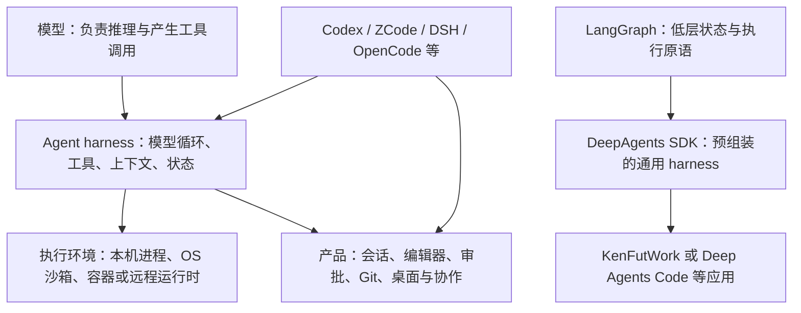

# 09 · DeepAgents 与开源 Coding Agent 对比

> **角色：调研**。核对日期：2026-10-03（北京时间）。用于技术比较与候选选型，不替代《改造计划》的架构决策。
> **方法**：本地固定版本源码、上游固定提交源码、官方文档与发布说明交叉核对。事实与工程判断分别标注；没有执行同模型、同任务、同预算的编码基准，因此本文不声称存在实测的编码成功率总排名。
> **范围**：重点比较 DeepAgents JS、Codex、ZCode、deepseek-harness；补充 OpenCode、OpenHands、Aider、Kimi Code、Cline、SWE-agent/mini-SWE-agent、Continue。`references/` 中其它项目只作层级分类，不做未经验证的全量排名。

## 1. 结论与评价口径

**判断：KenFutWork 继续采用 DeepAgents 作为当前默认运行时有合理依据；它应成为可替换的实现，不能成为产品能力上限。要做出完整 coding 产品，需要额外补齐产品与执行层。Codex 值得重点参考执行隔离、审批和编码工具；ZCode 值得参考桌面工作流与子会话；DSH 值得参考可替换服务和子代理生命周期。**

“谁好谁坏”要分成两种问题：给开发者直接用的产品是否顺手，以及作为 KenFutWork 的基础是否合适。前者包含模型质量、工具和交互；后者还包含嵌入成本、模型可替换性、领域扩展、状态归属和部署成本。本文的推荐是工程选型判断，不是排行榜成绩。

一个 coding Agent 的表现取决于至少五组因素：模型、系统提示与工具协议、上下文构造、执行环境、任务与预算。仅有相同模型名称也不足以公平比较：工具 schema、推理预算、重试、并行、上下文上限都可能不同。多代理更多、代码更多、GitHub 星更多，都不能直接推出修复质量更好。

## 2. 先分清比较对象

**事实**：LangGraph 自述为有状态 Agent 的低层编排框架，提供 durable execution、interrupt 和 memory 原语；DeepAgents 是其上的更高层 harness。DeepAgents SDK 与其配套 coding CLI 必须分别评价；JS SDK 与 Python SDK、CLI、ACP 包也不能混用版本或能力清单。[DA1][R1]

`references/` 本身不是 coding Agent 排名集合：

| 参考对象 | 本地 README 的定位 | 适合回答的问题 |
| --- | --- | --- |
| `langgraph` | 有状态 Agent 编排框架 | checkpoint、interrupt、长任务如何组织 |
| `codex`、`zcode`、`deepseek-harness`、`kimi-code` | Agent harness 与 coding 产品 | 编码工具、执行、会话与子代理如何组织 |
| `nomifun-tauri` | 本地优先 AI 工作站 | 桌面产品、模型配置与本机能力如何组织 |
| `cherry-studio` | 多模型桌面客户端 | BYOK、模型管理与客户端交互 |
| `loomic`、`jaaz` | 画布型多模态创作工作台 | Design 模式与生成工作流 |
| `jellyfish` | AI 短剧生产工作台 | 分镜、素材一致性与长生成任务 |
| MCP SDK/server、prompt/skill 资料 | 协议或资源 | 工具互操作与提示材料 |

这一分类来自各项目本地 README，不证明其完整功能、运行质量或最新上游状态。[R1]

## 3. DeepAgents SDK 的实际位置

### 3.1 它提供的是通用、按模型适配的 harness

**事实**：JS 1.14.0 的 `createDeepAgent` 最后调用 LangChain `createAgent`，将 model、tools、middleware、checkpointer、store 等交给底层；主要预组装 filesystem、subagent、summarization 和 tool-call 修补。memory、skills、HITL、async subagents 等按配置加入，用户可以扩展 middleware。[DA1]

**事实**：通用栈的 `write_todos` 规划工具是 opt-in，需要 `todoListMiddleware()`；部分 OpenAI Codex 模型 profile 会自动注入规划与工程提示。还有 provider-wide/per-model harness profile 注册、工具描述覆盖和工具/middleware 增减。它已是 model-aware harness，不能概括为只有一份固定通用提示。[DA2]

**判断**：DeepAgents 的优势是保留宿主自己的业务、HTTP/WS、模型配置和产品状态，又能复用上下文与工具机制。其约束是 LangChain message/middleware 与 LangGraph state/checkpointer 的运行契约；若需要彻底改变循环图，仍要下探底层，middleware 不代表能任意改变全部执行语义。

### 3.2 文件系统与上下文工程是核心能力

| SDK 机制 | 实际作用 | 容易误解的边界 |
| --- | --- | --- |
| StateBackend | 虚拟文件进入当前 thread 的 graph state | 默认不等于读取真实仓库 |
| StoreBackend | 文件经 BaseStore 跨 thread 保存 | namespace 不自动提供业务 RLS |
| FilesystemBackend | 操作真实磁盘 | 路径规则不等于 shell 隔离 |
| CompositeBackend | 按路径前缀组合不同后端 | 挂载需要与 execute 的真实文件视图对齐 |
| Offload + summarization | 大工具输出落文件；压缩前保存历史，保留摘要和近期消息 | 摘要不是无损记忆，offload 文件仍需要可检索 |
| Memory / skills middleware | 加载 AGENTS.md 与渐进披露的 skills | 文件规则、checkpoint、长期记忆不是同一机制 |

以上机制由 SDK 后端与 middleware 源码及官方文档确认。[DA3]

**事实**：checkpointer 和 store 需要宿主配置；持久化 thread state、跨 thread memory 与外部工具副作用是不同问题。可以使用 LangGraph/LangSmith 的 tracing/evaluation 生态，SDK 并不因此必须改为云托管执行。[DA1][DA3]

### 3.3 子代理不止一次性 task

**事实**：当前 JS 样本有三种不同机制：[DA4]

- **isolated task**：通常为临时子代理，使用任务描述作为上下文，最后返回报告；可自定义 model/tools/middleware/skills，或接已有 runnable。
- **experimental fork**：继承父对话与相应运行配置，但仍有实验性质和递归派发限制。
- **remote async**：使用 LangGraph SDK 与远端 Agent Protocol 的 thread/run，提供 start/check/update/cancel/list 控制，状态被跟踪到主 Agent state。

**判断**：不能把 DeepAgents 写成“只能阻塞调用子代理”。但远端异步任务也不等于本地默认已有可跨轮、冷恢复的常驻子会话和 mailbox。这里的 **Agent Protocol 与 ACP（Agent Client Protocol）是不同协议**，产品接入要按实际接口判断。

### 3.4 权限与执行隔离由不同层负责

**事实**：SDK 有 `interruptOn`/HITL 与 filesystem permission rules；HITL 需要 checkpointer 和宿主的 interrupt/resume 交互。filesystem rules 只覆盖 `ls`/`read_file`/`write_file`/`edit_file`/`glob`/`grep` 六个内置文件工具，无规则时默认放行，不自动覆盖任意 custom tool，也不覆盖 execute；对具备命令执行能力的 backend 配置文件权限会直接抛 `ConfigurationError`，除非禁用 execute 或改用按路由 scoped 的 CompositeBackend。`LocalShellBackend` 源码明确 **NO sandboxing or isolation**，直接在宿主执行命令；virtualMode 不能限制 shell。[DA5]

**判断**：它不是“完全没有权限”，也不是“因为有 Sandbox 协议就自动安全”。应用应提供真正的执行后端、授权与隔离；这种边界对自托管和本机 coding 都有实际影响。

### 3.5 SDK 与配套 coding 产品分开看

**事实**：Python 生态现有 **Deep Agents Code（`dcode`）**，官方说明包含 coding CLI 的 approval、skills、MCP、goal 和远程执行等；它建立在 **Python SDK** 上（`langchain-ai/deepagents` 仓库 `libs/code`，`deepagents-code==0.1.80`，2026-10-01），JS 宿主（含本项目）不能直接复用其 CLI 能力。JS repo 另有 **deepagents-acp**，负责 IDE 的 terminal/filesystem/permission/diff/session 桥接。[DA6]

**判断**：产品组选型应该包含 dcode/ACP，不能将裸 JS SDK 与完整 Codex CLI 比完就宣称整个 DeepAgents 生态没有 coding 产品。本次深入核查的是本项目使用的 JS SDK，dcode/ACP 仅核对官方说明，没有运行或验证其交互质量。

## 4. Codex、ZCode、DSH 的机制差异

### 4.1 Codex：编码执行基础设施强，协议与模型适配有边界

**事实**：本地 Codex 是 Rust 实现的 coding harness，`run_turn` 处理模型请求、工具结果、追加输入、压缩与收尾；公开仓库还包含 TUI、执行隔离、app-server 协议及 SDK。官方桌面 App 和云端服务不能全部视为这个仓库的开源内容。[C1]

- **编辑与执行**：`apply_patch` 有独立解析、校验和执行路径；平台沙箱包含 macOS Seatbelt、Linux sandbox、Windows RestrictedToken。该本地样本的 Linux 默认使用 bubblewrap，并结合 writable roots、namespace 和 seccomp，不能继续概括成“只有 Landlock”。这些是执行隔离机制，实际有效边界仍取决于运行配置；关闭沙箱或批准越界会改变边界。[C2]
- **模型开放程度**：支持自定义 `model_providers`、base URL、环境变量 key、headers 等，不能说成 OpenAI-only。但该样本 `WireApi` 只有 Responses，`wire_api="chat"` 已移除；自定义 provider 不等于直接支持任意 Anthropic、Gemini native 或 Chat Completions。[C3]
- **模型与 harness 配合**：压缩源码明确说模型受训看到特定历史排序。这说明协议兼容不能证明任意替换模型后都能保留相同工具行为与效果。[C3]
- **长期会话**：JSONL rollout、resume/fork、compaction checkpoint，以及独立子线程和 spawn/message/wait/interrupt 等多代理控制已经存在；MCP、skills 也是公开实现的一部分。[C4]
- **嵌入成本**：TypeScript SDK 是起 CLI 进程并交换 JSONL 的包装；app-server 提供 thread/turn 请求与通知。它不是直接插入现有 LangChain middleware 的 JS 内核。[C5]

**判断**：在本次核查的主比较对象中，Codex 是本机 patch、shell、审批与 OS 隔离最值得学习的参考之一。直接使用其适配模型和工作流是有力的 coding 产品候选；作为 KenFutWork 的通用双模式内核，Responses、进程协议和自有 thread/event 语义带来更高适配成本。这里的“强”指可核实的执行机制，不是未经评测的修复成功率第一。

### 4.2 ZCode：真实核心开源，产品最贴近当前 UI，公开能力仍有缺口

**事实**：本地及本轮上游 ZCode v3.14.3 都含真实 TypeScript agent core、turn state machine、Vercel AI SDK 模型适配、CLI/TUI、Electron 桌面、Web/server/RPC。**“只开源 UI 壳、整个 Agent 核心闭源”不适用于这个版本**；Computer Use 包则是明确的 unavailable 占位，公开声明与商业产品体验要分开。[Z1]

- **编码编辑**：`Edit` 要求之前 Read、唯一 old_string，并有 stale-file 提示。这是减少误改和并发覆盖的编码工作流机制。[Z2]
- **审批与隔离**：allow/ask/deny、plan/yolo、alwaysAsk 等权限机制存在；NOTICE 与执行适配器源码明确：共享执行器没有默认 OS 沙箱，命令通过 Node spawn 运行。权限规则、worktree、名为 sandbox 的字段都不能据此推成系统隔离。[Z2]
- **BYOK**：该版本原生协议集合为 Anthropic Messages、OpenAI Chat Completions、OpenAI Responses；不只能调用 GLM。两个精确匹配的 BigModel/Z.ai Anthropic URL 会被自动改发 ZCode 官方网关；普通其它 URL 原样发出。因此“自填 key”与“请求直达指定供应商”仍要分别验证。[Z3]
- **会话机制**：SQLite 会话存储、resume 与历史重建、microcompact/autoCompact、后台子代理通知、profile 模型选择、MCP 和按需 skill 加载都可查源码。[Z4]

**判断**：对本项目，ZCode 的主要价值是完整 coding 产品的组织方式：工具卡片、审批、长命令、子会话、Git 与桌面服务协议。当前已有 UI 接续投入，也使它成为更直接的产品参照。代价是账号、套餐、网关和其它应用层职责需要适配；公开 CUA 缺口和执行隔离不能靠照搬 UI 获得。真实核心源码可用于理解设计，不意味着应整体替换当前运行时。

### 4.3 deepseek-harness：把运行时本身也做成可替换插件

**事实**：DSH 基于 Cordis，模型、工具、session log、agent loop、UI 都是插件服务，注册可随卸载回收；loop 通过 Context 注册 Agent factory。Service Definition / Provider / Consumer 三元能力缝与 profile/bundle 层组合不是只停留在 README 口号。[D1]

- **运行时可换性**：相比在 LangChain 循环上加 middleware，DSH 把循环、存储和 UI 本身作为可替换服务；统一 execution world 可让文件、subprocess、PTY、LSP 跟随执行 provider。代价是需要掌握 scope、disposal、event 和装配层语义。[D1]
- **coding 能力**：base bundle 配置文件编辑、shell、搜索、MCP、任务/goal 和 session；独立 LSP 工具提供定义、引用、实现及 hover。模型适配器可接多供应商、兼容网关和自托管，并非只能调用 DeepSeek。[D2]
- **多代理**：可并排接 fresh spawn、history fork、ACP、Codex app-server、Claude Code SDK 与 DSH SDK；有 one-shot 与 continuable 子会话、消息、interrupt/list。子代理可替换性和持续会话契约比仅提供临时 task 更显式。[D3]
- **恢复与审计**：append-only session log 作为模型历史真相；副作用 dispatch 前的 flush 失败会阻止执行。崩溃后出现工具调用有记录而结果缺失时，明确返回 `TOOL_OUTCOME_UNKNOWN`，不把未知结果静默当成失败并自动重试。它没有宣称任意副作用 exactly-once。[D4]
- **审批与沙箱**：审批是独立能力缝，缺 answerer 可 fail closed。local sandbox 有 Linux、macOS、Windows runner 和无可用 runner 时拒绝裸跑的机制；但 full/partial 指它承诺的 file-effects 边界，不等于所有 OS/网络行为安全。Windows read、hardlink、旧 ABI 等还有特定局限。[D5]
- **稳定性与默认配置**：当前为 `0.2.0-rc.2`，官方明确 developer preview、可能破坏兼容、未经安全审计。trace/export 与产品默认遥测还需看具体 bundle；不能把某 OTel 路径的 feedback-only 推成所有遥测默认均不发送。[D6]

**判断**：如果问题是“如何设计可持续替换的 Agent 平台”，DSH 是本次最直接的架构参照；如果只是把 Agent 嵌入已有服务，整体迁移其运行体系的成本高于使用现有 DeepAgents 接线。插件结构更彻底不等于编码更准、生产更稳或安全已完成审计。

### 4.4 主比较对象的机制矩阵

| 维度 | DeepAgents JS SDK | Codex 本地样本 | ZCode 本地样本 | DSH 本地样本 |
| --- | --- | --- | --- | --- |
| 核心抽象 | 通用、model-aware harness + middleware | 专用 coding thread/turn 与执行栈 | TS coding runtime + 完整应用 ports/adapters | Cordis 可替换服务/插件 |
| 模型接口 | LangChain 模型对象/适配器与 profile | 自定义 provider，但样本线协议仅 Responses | Anthropic / Chat Completions / Responses | 多 provider adapter 与可替换 LLM 服务 |
| 上下文 | offload、summary、memory/skills、backend 组合 | coding 历史/compact 与模型约定配合 | microcompact + autoCompact + 持久历史 | compaction 插件 + canonical event log |
| 子代理 | isolated、experimental fork、remote async | 独立子线程与消息/控制 | profiles、后台子代理与会话设施 | 多 provider + continuable + 消息控制 |
| 执行隔离 | 由具体 backend 决定；LocalShell 无 OS 隔离 | 有实际 OS sandbox，受运行配置控制 | 共享执行适配器无默认 OS sandbox | 有 local runner；平台 partial 边界、未经审计 |
| 嵌入宿主 | JS in-process；宿主自管产品 | CLI SDK/app-server 进程协议 | 可见应用栈；需适配产品职责 | SDK/profile；需接受服务契约 |
| 对本项目主要价值 | 保留通用底座和现有投入 | 编码执行与权限参考、外部引擎候选 | 当前 coding 产品体验参考 | 插件缝与生命周期设计参考 |

事实依据见 [DA1]–[DA6]、[C1]–[C5]、[Z1]–[Z4]、[D1]–[D6]；最后一行为工程判断。

## 5. 互联网其它开源项目

以下均为 2026-10-03 核对的官方仓库快照。比“支持多少功能”更有意义的是机制与使用代价；表中评价为工程判断。

| 项目 | 相比通用 DeepAgents SDK 的主要优势 | 代价与边界 | 推荐用途 |
| --- | --- | --- | --- |
| OpenCode | 已有完整 BYOK coding 产品、primary/subagents、session compaction、headless HTTP/OpenAPI/SDK | 自带会话和工具模型；官方明确 No Sandbox，审批不等于隔离 | 开箱终端 BYOK；独立 coding server 候选 |
| Aider | repo map、模型编辑格式、Git、auto-lint 与可配置 test 修复闭环 | 产品职责集中于协作编辑；后台平台能力需另装配 | 范围明确的仓库修改、可审阅 patch |
| OpenHands SDK | 专门的 coding Conversation/event log、condenser、delegation、Agent Server 与远端 workspace | Python runtime/服务边界；容器、挂载和认证仍需配置 | 自托管远端编码执行；SDK 层的直接对照 |
| OpenHands Canvas | 多 backend/ACP、自动化与多种 Docker 执行部署 | 控制台与执行内核是不同仓库；共享挂载仍会写同一文件 | 完整自托管工作台参考 |
| Kimi Code | 终端、goal、独立子代理、resume/fork/compact、多协议 provider | 产品 runtime 的公共嵌入 API 稳定性需验证；审批不证明 OS 隔离 | 持续终端任务与 BYOK 产品参考 |
| Cline | 当前已有 TS SDK、CLI、桌面、持久会话、teams、调度和插件 | 较大的应用功能面；部分 surface 开源边界不同；OS 隔离本轮未核实 | TS 可嵌入 coding SDK 与完整产品的候选 |
| SWE-agent / mini-SWE-agent | 可实验的 coding harness；mini 用 bash-only 和线性轨迹形成简洁 baseline | 默认循环不等于完整审批、项目、插件和工作台 | 自动修 issue、评测、轨迹训练研究 |
| Continue | IDE context、工具授权及 chat/plan/agent 分层清楚 | README 已自述停止主动维护，新基础依赖有维护成本 | 历史实现与 IDE 设计参考 |

表中机制来源分别为 [O1]–[O8]；以下列出影响取舍的细节。

### 5.1 OpenCode：BYOK 产品候选，但没有默认安全沙箱

**事实**：本轮 canonical repo 为 `anomalyco/opencode`，TypeScript/Bun，供应商层使用多种 AI SDK 适配；文档区分 primary/subagents，可按 agent 配 model/prompt/permission。`opencode serve` 暴露 HTTP/OpenAPI，TUI 也是 client；源码含 tool-output pruning 与 summary compaction。[O1]

**事实**：官方 SECURITY 明确 **No Sandbox**，permission 是用户告知/审批机制。多数权限默认 allow，特定情况 ask/deny；需要真隔离时由 Docker/VM 等提供。[O1]

**判断**：如果目标是直接使用多模型 coding 产品，它比自己装配通用 SDK 更省工作；如果目标是安全执行不可信命令，就不能因产品完整而跳过执行环境设计。

### 5.2 Aider：窄而深的代码上下文与编辑闭环

**事实**：Aider 是 Python 终端 pair programming 工具。repo map 提供重要符号与签名，按文件依赖图排名并服从 token budget；这不是精确的动态调用图。支持编辑后 auto-lint，配置 `--test-cmd` 与 `--auto-test` 后可运行测试并修复失败，另有 Git 工作流。[O2]

**判断**：已经明确改动范围、需要高效编辑与审阅 patch 时，Aider 的专门设计很有价值；它不是 KenFutWork 多领域工作台的现成基础。其 benchmark 使用 coding exercises，与 SWE-bench issue 修复不是同一个任务集，不能直接比百分比。[O2][B1]

### 5.3 OpenHands：SDK 与控制台必须拆开评价

**事实**：当前 `OpenHands/OpenHands` 主仓承载 Agent Canvas；Python coding runtime、Conversation/Tool/LLM、Agent Server 与 REST/WS 在 `software-agent-sdk`，还提供 TypeScript client。SDK 支持本地或远端 workspace；原始事件日志与经过 condenser 的模型视图分开，delegation 与 confirmation 有官方示例。[O3]

**事实**：Canvas 可选择无沙箱、单 Docker 或每会话 Docker；控制台仍有宿主侧职责。多个会话挂载同一 host workspace 仍共享文件，容器隔离不自动解决写入冲突。[O8]

**判断**：对远端编码执行平台，OpenHands SDK 比只比较其 GUI 更有意义，是 DeepAgents SDK 最直接的 coding 专用对照之一；对 design/business 工具，通用 middleware 与 LangGraph 状态组合仍有价值。

### 5.4 Kimi Code：必须选对新旧仓库

**事实**：Python `MoonshotAI/kimi-cli` 已归档，其 README 指向 TypeScript `MoonshotAI/kimi-code`。新版支持多协议 provider，包括 Anthropic、OpenAI、Responses、Google/Vertex 与 custom endpoint，不能说成 Kimi-only。子代理使用独立上下文，session 支持 resume/fork/export，已有 goal 与自动 compact。[O4]

**判断**：长程终端任务与模型配置值得参考。但独立 LLM 上下文和审批模式不能视为 OS 沙箱；TypeScript 源码也不自动意味着可直接替代本项目 SDK。

### 5.5 Cline：当前范围已经超过 IDE 插件

**事实**：当前官方仓库有 IDE、CLI、desktop 和 SDK；桌面方案为 Tauri+Bun sidecar+Next.js。SDK 分 `Agent` 通用循环与 `ClineCore` 完整 runtime，后者提供会话、SQLite、内置工具、配置发现与 RPC；CLI 文档含 teams、调度、headless 和 compact，插件可挂工具与 lifecycle hooks。[O5]

**事实**：README 对 JetBrains plugin 明确保留非开源边界；本次没有验证其 OS 沙箱。`--data-dir` 的 isolated local state 不能作为系统隔离证据。[O5]

**判断**：这是本项目值得纳入短 PoC 的另一个 TS SDK 候选，尤其当目标是复用完整 coding runtime。代价是更宽的应用职责和配置语义；功能多不自动使它优于轻量的通用业务 harness。

### 5.6 SWE-agent / mini：复杂架构不等于更强编码

**事实**：SWE-agent README 说主要投入已转到 mini，建议新使用者考虑 mini，同时保留旧项目对工具接口/history 实验的价值。mini 的默认循环是 query→execute→observation、bash-only、线性消息与可保存轨迹，有 step/cost/time 预算，执行 environment 可替换。[O6]

**判断**：适合做简洁 baseline、批量 issue 修复和轨迹研究；不能把默认循环当成完整产品。README 自述的高分不与其它模型、预算或数据集的成绩混排。

### 5.7 Continue：维护状态影响新选型

**事实**：固定提交 README 声明 no longer actively maintained，并称 IDE/CLI 最终版为 2.0.0；同次 GitHub API `archived=false`。**“维护者声明停更”与“GitHub 归档标志”不是一回事**。其 IDE 与 CLI 有工具授权、headless 与上下文机制，但不同 surface 的 Plan/Bash 权限保证也不能混用。[O7]

**判断**：停止主动维护使其不适合作为本项目新长期核心依赖的首选；这是维护成本判断，不证明其历史代码差。

## 6. 不同目标下的推荐

下表是基于已核实机制的推荐，不是编码成绩总排名。

| 目标 | 本次推荐 | 推荐依据与主要代价 |
| --- | --- | --- |
| 自研 BYOK、多领域、Design/Code 平台 | **继续用 DeepAgents + 现有领域插件层** | 当前接线与状态投入可复用；需自己承担 coding 产品、权限和执行隔离 |
| 直接选择日常 coding 工具 | **优先试 Codex、OpenCode、Kimi Code/Cline；dcode/ACP 也纳入产品组** | Codex 有专门执行基础设施；其余更适合比较广泛 BYOK/不同产品 surface；最终按自己的模型与任务试用 |
| 完全可替换的插件式 Agent harness | **DSH 是最直接的设计参照** | 替换 loop/provider/session 等服务的边界清楚；developer preview 的兼容与维护风险需承担 |
| 当前 KenFutWork 的 coding UI 与子会话体验 | **ZCode 是最直接的参考** | 本地已有接续投入且源码可见；执行隔离、CUA 与宿主耦合要单独处理 |
| TS 可嵌入的完整 coding runtime | **DeepAgents 与 Cline SDK 做短 PoC** | 对照通用 middleware 与完整会话/runtime 设施；避免仅凭语言或功能数量替换 |
| 自托管远端 coding 执行 | **OpenHands Software Agent SDK** | coding server 与 workspace 设施更直接；增加 Python/容器服务边界 |
| 已明确范围的仓库编辑 | **Aider** | repo map、编辑、Git/lint/test 工作流集中；完整工作台另做 |
| 公平 baseline / 轨迹研究 | **mini-SWE-agent** | 简单默认循环便于控制变量；产品治理不是默认循环的职责 |
| 新长期核心依赖 | **不优先选 Continue** | 固定 README 的停更声明增加维护负担 |

**对主比较对象的明确评价**：DeepAgents 的强项是嵌入和通用组合，短板是 coding 产品完成度要宿主补；Codex 的强项是专用编码执行栈，代价是协议与进程适配；ZCode 的强项是完整可见的 TS 产品组织，边界是公开能力缺口与无默认 OS 隔离；DSH 的强项是运行时可替换性，代价是 preview 稳定性和体系迁移。这些都是具体取舍，没有证据把其中某个项目整体判为“坏”。

## 7. 对 KenFutWork 的具体判断

### 7.1 本项目并不是直接运行默认 DeepAgents

**事实**：锁文件解析到 `deepagents@1.14.0`、LangGraph 1.4.16、LangChain 1.5.11；依赖声明的 `^` 范围不代表本次安装就是最新版本。[K1]

本项目已经有自己的 harness 产品层：

| 本项目接线 | 源码事实 | 对比较的影响 |
| --- | --- | --- |
| 工具和系统提示 | `kernelTools` 桥接到 LangChain 工具，`systemPrompt` 由调用方组装后注入 | 领域插件和模式边界归本项目，不由 SDK 自动生成 |
| 子代理 | `childRunner` 用 `createAgent` 建子实例；按定义拾取工具，读文件工具走白名单；自建 task/background/result 工具 | 不能把本项目子代理限制称为 DeepAgents 上游能力上限 |
| 子代理上下文与恢复 | 子实例从新 HumanMessage 开始，代码此处没有传独立 checkpointer；定义禁止再次派发 | 当前接线与完整、可冷恢复的长期子会话存在差别 |
| 规划 | 显式挂 `todoListMiddleware()` | 当前界面的待办数据源来自本项目装配 |
| 压缩 | 显式配置 summarization middleware，使用同一 backend 存历史 | 触发与保留策略要与模型窗口及产品转录口径一起检查 |
| 治理和扩展 | 自有工具门、错误守卫、请求重试、通知与 `AgentRunExtension` middleware | 已有产品投入；更换 runtime 会涉及这些语义的重新适配 |
| 持久化 | checkpointer/store 经本项目服务取得；无数据库或连接失败会走进程内存实现 | SDK 有 checkpoint 支持，不等于每种部署都具备跨重启恢复 |

来源：`deep-agent.ts:309–593`、`subagent-definitions.ts:8–34,131–175`、`kernel-tools-bridge.ts:6–10,67–114`、`persistence/index.ts:20–65`。[K2][K3][K4]

**判断**：把使用体验问题直接归因为“DeepAgents 不如 Codex”，会跳过本项目的工具、上下文、运行事件和接线差异。应先从具体失败轨迹判断是模型、SDK、适配器还是产品状态的问题。

### 7.2 当前执行边界是重要差距

**事实**：当前 production backend 的 `/workspace/` 文件工具与 `LocalShellBackend` 使用同一真实目录，文件跨 run 保留；`virtualMode: true` 约束文件工具路径。源码同时明确说明：**这不会限制 execute，shell 命令仍可访问完整文件系统**。这里没有等价于 Codex 的 OS 沙箱，项目隔离目录也不能代替执行隔离。[K5]

**判断**：如果目标是允许 coding Agent 执行任意生成命令，优先补足执行边界比更换主循环更直接。DeepAgents 可接隔离 backend，问题在当前选择和接线；选用其它 runtime 也必须核实其实际启动的隔离模式、挂载、网络与审批，不能仅看名为 sandbox 的类或目录。

### 7.3 推荐的工作顺序

下列是候选后续工作，不是本次已授权实施的改造：

1. 核对上游 DeepAgents JS 补丁与当前适配器兼容性：本次核实已发布 1.14.1，其发布说明含 virtual-mode symlink 越界及超长 tool-call ID 的工具结果路径修复；当前锁定 1.14.0，值得优先评估更新，本文未修改依赖。[DA7]
2. 在现有 backend 缝落实真实执行隔离与审批语义；文件工具、execute、后台命令应共享明确的权限边界。
3. 验证长 coding 任务的完整链路：精确编辑、长命令输出、取消、压缩后续跑、断连重连和重启恢复。
4. 若需求确实需要长期协作，补独立子会话身份、持久化、恢复与父子通知；先比较 SDK 已有能力和本项目自建层，避免重复建设。
5. 完成同条件评测后再决定是否替换 runtime。保留现有 Design 画布与模式工具隔离，通过既有服务/扩展缝逐步验证。

**判断**：现阶段不建议为了获得一个看起来更成熟的 coding UI，把全部运行时替换为 Codex、ZCode 或 DSH。真实替换成本包含工具 schema、事件协议、权限、checkpoint、子代理、usage、取消与恢复；外部 coding 引擎可先作为单独候选执行后端评估，避免把整个双模式产品绑定到另一套产品模型。[K2][K3][K6]

### 7.4 运行时不能成为功能上限，但目前尚未完全解耦

**本次追问明确的目标**：KenFutWork 借鉴其它 Agent 的功能时，应由自身需求和插件契约决定行为，不能因为 DeepAgents 默认没有提供就删减需求。保留 DA 作为当前实现，与允许替换其能力乃至主运行时并不冲突。本节是调研中的设计建议，不表示下列解耦已经完成。

**事实**：已有 `agentFactory` 注入入口，`runtime.ts` 默认选择 `createKenFutWorkDeepAgent`；但替换契约仍暴露 SDK 细节：[K7]

- `KenFutWorkAgent` 的类型直接取自 `ReturnType<typeof createDeepAgent>` 的 stream/streamEvents。
- factory 输入直接包含 LangChain 模型及 LangGraph checkpointer/store 类型。
- `AgentRunExtension.createMiddleware` 返回 LangChain `AgentMiddleware`；目前 Code UI 的工具生命周期贡献也使用这条缝。
- run 调度直接构造 `HumanMessage`、调用 `streamEvents`，后续适配器消费 LangChain event/message 与 `lc_agent_*` metadata。

因此，**当前已有替换入口，尚不能说任意 Agent runtime 已能独立替换**。另一个实现若必须仿造 LangChain 类型、消息和事件才能接入，这条缝仍带有原实现的契约。[K7][K8]

| 借鉴的能力 | 通常可以怎样落地 | 与运行时的关系 |
| --- | --- | --- |
| 工具卡片、Git/项目流程、文件预览、MCP/skills | 既有领域插件、工具与产品事件契约 | SDK 通常不是能力上限；当前事件桥仍需适配 |
| 精确 patch、长命令、PTY/LSP、OS 沙箱 | 替换或增加工具/执行 provider，统一权限与工作区 | 不应依赖 DA 内置工具的默认实现；需处理同名与旁路问题 |
| 持续子代理、mailbox、冷恢复、多层协作 | 独立子会话与调度生命周期，再接适合的运行 provider | 不能只改 task schema 就宣称完成；状态、恢复与通知都要接线 |
| turn 中途 steering、自定义模型/工具调度、停止与重放策略 | runtime adapter 提供所需生命周期；必要时替换循环/完整 runtime | 可能真正超出当前 middleware 的接点，不能以“插件”二字掩盖 |

**建议的约束**：

1. KenFutWork 自己持有项目、会话、任务、授权、用量和用户可见生命周期；通用插件消费本项目契约。DA/LangChain 类型与原始事件尽量收敛到对应 adapter 内。
2. runtime、执行环境、子代理 provider 分别判断替换粒度。主 runtime 可继续使用 DA，同时换掉文件工具、子代理或 execute 实现；局部替换不足以满足需求时，允许替换完整 runtime。
3. 各 runtime 声明实际能力和语义。功能需要但 provider 不支持时显式拒绝或选择合适 provider，不静默降级，也不把所有 runtime 的最小能力交集当成产品上限。
4. adapter 可保留其专用、带版本的内部 checkpoint 和模型历史；本项目持有公共产品记录与事件。可替换不承诺现有 thread 的运行快照能在不同引擎间直接恢复，切换/迁移需明确处理。
5. 在真实功能落地时逐步建立接口契约验证：另一实现接入后，取消、审批、工具结果、usage、通知与终态能保持本项目语义。不要为了假想所有引擎提前建立巨大通用框架。

**判断**：DSH 的“一切皆插件”借鉴应延伸到运行时实现本身。对当前代码，应逐步把“在 DA 上扩展功能”推进到“本项目契约下可选择 DA 或其它实现”；这并不要求现在重写所有已工作的实现。

## 8. 怎样验证“谁写代码更好”

**事实**：SWE-bench 的任务是给定仓库与 issue 产出修复 patch，使用可复现的容器评估；Verified 是人工确认可解的一组问题。它评价特定配置在特定任务集上的结果，不覆盖桌面 UI、审批体验、KenFutWork 的 Design 行为或所有实际工程任务。[B1]

**建议**：本项目选型应使用同一仓库快照、同一模型版本、同一输入、相同权限与预算，对以下任务进行多次配对评测。专属产品最佳配置可另作一组，并单列与同模型组的差别。

| 任务类别 | 应验证的行为 |
| --- | --- |
| 小 bug 与回归测试 | 复现、修复、测试可通过，改动范围合理 |
| 跨文件重构 | import、类型与调用方完整接线，无孤儿实现 |
| 长任务 | 压缩后仍记得验收目标；后台结果被消费；能取消 |
| 并行工作 | 不覆盖他人改动；同文件冲突可被发现和处理 |
| 执行边界 | 越界文件、网络和命令按真实策略拒绝或审批 |
| 故障与恢复 | 工具失败、模型请求失败、断连与进程重启后状态可解释 |
| BYOK | 不同协议、工具调用、token 统计与模型窗口能正确适配 |
| 双模式 | Code 不破坏 Design 主区和工具能力边界 |

记录成功率、误改率、人工介入次数、总 token/实际费用、端到端耗时与恢复结果；同时保存提示、工具 schema、原始轨迹和最终 patch。审批提示和 checkpoint 的存在，不代表外部副作用能自动 exactly-once，重放与幂等需要单独验证。

## 9. 证据索引与研究边界

### 9.1 本项目与本地参考

- **[K1] 依赖版本**：[server package.json](../../apps/server/package.json)，`pnpm-lock.yaml:117–119,4711–4718,12266–12273`。
- **[K2] 主实例装配**：[deep-agent.ts](../../apps/server/src/agent/deep-agent.ts)，`309–593`；[run-extension.ts](../../apps/server/src/agent/run-extension.ts)，`3–10`。
- **[K3] 子代理定义与工具桥**：[subagent-definitions.ts](../../apps/server/src/agent/subagent-definitions.ts)，`8–34,131–175`；[kernel-tools-bridge.ts](../../apps/server/src/agent/kernel-tools-bridge.ts)，`6–10,67–114`。
- **[K4] 持久化选择**：[persistence/index.ts](../../apps/server/src/agent/persistence/index.ts)，`20–65`。只核对接线，未注入故障执行恢复测试。
- **[K5] 本地执行后端**：[backends/prod.ts](../../apps/server/src/agent/backends/prod.ts)，`19–36,59–88,95–127`；[backends/index.ts](../../apps/server/src/agent/backends/index.ts)，`33–66`。
- **[K6] 既有架构方向**：[改造计划](../方案设计/改造计划.md)，§2.3、§4.10、§4.11；[多端产品设计](../方案设计/多端产品设计.md)，§7；[子代理与后台任务设计](../方案设计/子代理与后台任务设计.md)。文档中的旧 SDK 版本和规划条目不代替当前源码事实。
- **[K7] 运行时替换入口与类型耦合**：[deep-agent.ts](../../apps/server/src/agent/deep-agent.ts)，`51–54,261–307`；[runtime.ts](../../apps/server/src/agent/runtime.ts)，`373–397,486–494,1938–1955,2232–2249`；[run-extension.ts](../../apps/server/src/agent/run-extension.ts)，`1–10`。
- **[K8] 插件与事件接线**：[agent-runs/plugin.ts](../../apps/server/src/features/agent-runs/plugin.ts)，`1–10,31–43,131–134`；[code-ui/agent-events-plugin.ts](../../apps/server/src/features/code-ui/agent-events-plugin.ts)，`11–19`；[stream-adapter.ts](../../apps/server/src/agent/stream-adapter.ts)，`3–8,22–32,77–94,138–140`。
- **[R1] 本地对象的产品定位**：`references/{langgraph,loomic,cherry-studio,nomifun-tauri,jaaz,jellyfish}/README.md`，分别核对了简介与 Features；仅用于本文分类。主比较对象的固定提交见下文。
- **[B1] SWE-bench 第一方定义与评估方法**：[固定提交 README](https://github.com/SWE-bench/SWE-bench/blob/02e7a74ffd0b707aab73d203fe87bdc7c76afc8e/README.md)，Overview、News、Set Up、Usage。本文未运行 SWE-bench，也不引用厂商不可比的成绩作为总排名。

### 9.2 外部来源与固定版本

默认分支 HEAD 是获取时的快照，不等于最新 release。[C1]–[C5] 锚点已按 2026-10-03 复核同步到本地检出 `2739e828`（复核时上游 main 与本地一致；早前引用的 `e53e932` 已随子模块更新失效，各条论断在新提交下逐条复核仍成立）；本项目事实以本次实时工作区读取为准，未将并行改动提交或覆盖。

| 对象 | 本次源码/版本依据 | 在线核对与许可 |
| --- | --- | --- |
| DeepAgents JS | 本地安装与锁文件 **1.14.0**；源码引用发布 tag | 已发布 **1.14.1**，2026-09-24；MIT |
| DeepAgents Python / Code | SDK 发布 **0.7.21**；Code（`dcode`）发布 **0.1.80**（2026-10-01，基于 Python SDK） | Python 侧发布 2026-09-30；不能与 JS 版本数字比较，JS 宿主不能直接复用 dcode CLI |
| deepagents-acp | 独立包 **0.1.33** | 不能把 monorepo latest release 当 JS SDK 版本 |
| Codex | 本地检出与上游 main 同为 [`2739e828`](https://github.com/openai/codex/commit/2739e828581c3deee59a270cd740675dc278ed14)，2026-10-02（2026-10-03 复核一致） | 稳定 release [`0.160.0`](https://github.com/openai/codex/releases/tag/rust-v0.160.0)；Apache-2.0 |
| ZCode | [`29628c9`](https://github.com/zai-org/ZCode/commit/29628c9acdb81b703bbd4080c207a0e7ce5e276e)，**3.14.3** | main 与本地相同；Apache-2.0 |
| DSH | [`639ed01`](https://github.com/deepseek-ai/deepseek-harness/commit/639ed015397290b3745d163aafe02ffee4aa3f84)，**0.2.0-rc.2** | master 与本地相同；MIT |
| OpenCode | [`c42ae0d`](https://github.com/anomalyco/opencode/commit/c42ae0d56b6f86f8df39d451d6d2cfe6414b3928)，2026-10-02 | MIT |
| Aider | [`5dc9490`](https://github.com/Aider-AI/aider/commit/5dc9490bb35f9729ef2c95d00a19ccd30c26339c)，2026-05-22 | Apache-2.0；HEAD 日期不能独自证明维护状态 |
| OpenHands Canvas | [`a8c8fb3`](https://github.com/OpenHands/OpenHands/commit/a8c8fb377761fc7c562f19db1d9da75bba413cb9)，2026-10-02 | 本次固定仓库 MIT；不代表商业服务条款 |
| OpenHands SDK | [`8034b0d`](https://github.com/OpenHands/software-agent-sdk/commit/8034b0dbc3f695f2c7c375e1ad4d352166f1ac75)，2026-10-02 | MIT |
| SWE-agent / mini | [`3ea751c`](https://github.com/SWE-agent/SWE-agent/commit/3ea751c087f32b16e039a2233dd6eefecef325d5) / [`04d809c`](https://github.com/SWE-agent/mini-swe-agent/commit/04d809ceab9df28f9adaed044884180159172930) | MIT；主开发投入转 mini 是 README 声明 |
| Continue | [`5522c6f`](https://github.com/continuedev/continue/commit/5522c6f44ca0ac3528b37244818fbfa39b5af470)，2026-07-21 | Apache-2.0；README 停更，API archived=false |
| Kimi 旧/新 | [`9ab1286`](https://github.com/MoonshotAI/kimi-cli/commit/9ab1286b8fe4e6bcd116949a27ce5e0ac3389c82) / [`21406fb`](https://github.com/MoonshotAI/kimi-code/commit/21406fb4c805cc8c715e6d1f16ad3fb5f25f4fe3) | 旧 Apache-2.0、已归档；新 MIT |
| Cline | [`c269dbb`](https://github.com/cline/cline/commit/c269dbb7f97256d53d4aedabb6c245b9ec54b1b6)，2026-10-02 | Apache-2.0；某些产品 surface 另有边界 |

许可来自各固定仓库的 LICENSE/package 或明确 README 许可说明；不代表模型 API 免费，也不覆盖所有商业服务、第三方插件、素材和二进制。

#### DeepAgents

- **[DA1] 三层结构与装配**：[JS 官方 overview](https://docs.langchain.com/oss/javascript/deepagents/overview)；[1.14.0 agent.ts](https://github.com/langchain-ai/deepagentsjs/blob/deepagents%401.14.0/libs/deepagents/src/agent.ts#L450-L551)；[JS 包元数据与许可](https://github.com/langchain-ai/deepagentsjs/blob/deepagents%401.14.0/libs/deepagents/package.json)。文档是核对日页面，源码是固定版本。
- **[DA2] 规划/profile**：同一 overview 的 Task planning；[Codex profile](https://github.com/langchain-ai/deepagentsjs/blob/deepagents%401.14.0/libs/deepagents/src/profiles/harness/builtins/openai-codex.ts#L12-L65)；[harness registry](https://github.com/langchain-ai/deepagentsjs/blob/deepagents%401.14.0/libs/deepagents/src/profiles/harness/registry.ts#L128-L212)。README 与源码有规划默认值口径差异，以明确版本源码和现行文档为准。
- **[DA3] 文件/上下文/持久化**：[官方 backends](https://docs.langchain.com/oss/javascript/deepagents/backends)；[summarization 源码](https://github.com/langchain-ai/deepagentsjs/blob/deepagents%401.14.0/libs/deepagents/src/middleware/summarization.ts)；[memory](https://github.com/langchain-ai/deepagentsjs/blob/deepagents%401.14.0/libs/deepagents/src/middleware/memory.ts)；[skills](https://github.com/langchain-ai/deepagentsjs/blob/deepagents%401.14.0/libs/deepagents/src/middleware/skills.ts)；[LangGraph persistence](https://docs.langchain.com/oss/javascript/langgraph/persistence)。
- **[DA4] 子代理**：[同步与 fork](https://github.com/langchain-ai/deepagentsjs/blob/deepagents%401.14.0/libs/deepagents/src/middleware/subagents.ts)；[远端 async](https://github.com/langchain-ai/deepagentsjs/blob/deepagents%401.14.0/libs/deepagents/src/middleware/async_subagents.ts)。
- **[DA5] 权限/执行**：[官方 HITL](https://docs.langchain.com/oss/javascript/deepagents/human-in-the-loop)；[filesystem permission enforcement](https://github.com/langchain-ai/deepagentsjs/blob/deepagents%401.14.0/libs/deepagents/src/permissions/enforce.ts#L66-L90)；[filesystem middleware](https://github.com/langchain-ai/deepagentsjs/blob/deepagents%401.14.0/libs/deepagents/src/middleware/fs.ts#L1830-L1871)；[LocalShell 明确边界](https://github.com/langchain-ai/deepagentsjs/blob/deepagents%401.14.0/libs/deepagents/src/backends/local-shell.ts#L1-L46)。
- **[DA6] 配套产品**：[Deep Agents Code](https://docs.langchain.com/deepagents-code)；[ACP README](https://github.com/langchain-ai/deepagentsjs/blob/main/libs/acp/README.md)；[Python 0.7.21 发布](https://github.com/langchain-ai/deepagents/releases/tag/deepagents%3D%3D0.7.21)。产品页/ACP main 为核对日快照，仅用于确认范围。
- **[DA7] JS 补丁**：[1.14.1 官方发布说明](https://github.com/langchain-ai/deepagentsjs/releases/tag/deepagents%401.14.1)。

#### Codex 与 ZCode

- **[C1] 范围与主循环**：[Codex README](https://github.com/openai/codex/blob/2739e828581c3deee59a270cd740675dc278ed14/README.md)；[run_turn](https://github.com/openai/codex/blob/2739e828581c3deee59a270cd740675dc278ed14/codex-rs/core/src/session/turn.rs#L163-L340)；[LICENSE](https://github.com/openai/codex/blob/2739e828581c3deee59a270cd740675dc278ed14/LICENSE)。该固定提交即本地 `references/codex` 检出，2026-10-03 复核与上游 main 一致。
- **[C2] 编辑/隔离**：[apply_patch](https://github.com/openai/codex/blob/2739e828581c3deee59a270cd740675dc278ed14/codex-rs/core/src/tools/handlers/apply_patch.rs#L336-L359)；[sandbox manager](https://github.com/openai/codex/blob/2739e828581c3deee59a270cd740675dc278ed14/codex-rs/sandboxing/src/manager.rs#L49-L60)；[Linux sandbox README](https://github.com/openai/codex/blob/2739e828581c3deee59a270cd740675dc278ed14/codex-rs/linux-sandbox/README.md#L24-L58)。
- **[C3] Provider 与模型约定**：[provider/Responses 契约](https://github.com/openai/codex/blob/2739e828581c3deee59a270cd740675dc278ed14/codex-rs/model-provider-info/src/lib.rs#L104-L180)；[压缩与模型训练的排序约定](https://github.com/openai/codex/blob/2739e828581c3deee59a270cd740675dc278ed14/codex-rs/core/src/compact.rs#L60-L75)。
- **[C4] 状态/子代理/扩展**：[rollout JSONL](https://github.com/openai/codex/blob/2739e828581c3deee59a270cd740675dc278ed14/codex-rs/rollout/src/lib.rs#L19-L82) 与 [历史重建](https://github.com/openai/codex/blob/2739e828581c3deee59a270cd740675dc278ed14/codex-rs/core/src/session/rollout_reconstruction.rs)；[resume/fork](https://github.com/openai/codex/blob/2739e828581c3deee59a270cd740675dc278ed14/codex-rs/core/src/thread_manager.rs#L1070-L1476)；[compaction checkpoint](https://github.com/openai/codex/blob/2739e828581c3deee59a270cd740675dc278ed14/codex-rs/core/src/compact.rs#L78)；[multi-agent handlers](https://github.com/openai/codex/blob/2739e828581c3deee59a270cd740675dc278ed14/codex-rs/core/src/tools/handlers/multi_agents_v2.rs#L29-L42)；[MCP/skills workspace modules](https://github.com/openai/codex/blob/2739e828581c3deee59a270cd740675dc278ed14/codex-rs/Cargo.toml#L75-L77)。
- **[C5] 宿主接入**：[TS SDK README](https://github.com/openai/codex/blob/2739e828581c3deee59a270cd740675dc278ed14/sdk/typescript/README.md)；[app-server requests](https://github.com/openai/codex/blob/2739e828581c3deee59a270cd740675dc278ed14/codex-rs/app-server-protocol/src/protocol/common.rs#L551-L577)。官网 app-server 页本轮返回 403，未作为已读证据。
- **[Z1] 开源范围**：[README.en](https://github.com/zai-org/ZCode/blob/29628c9acdb81b703bbd4080c207a0e7ce5e276e/README.en.md)；[turn machine](https://github.com/zai-org/ZCode/blob/29628c9acdb81b703bbd4080c207a0e7ce5e276e/apps/zcode-cli/packages/core/src/agent/turn-machine.ts#L41-L65)；[模型适配器](https://github.com/zai-org/ZCode/blob/29628c9acdb81b703bbd4080c207a0e7ce5e276e/apps/zcode-cli/packages/adapters/src/model/runner-runtime.ts#L1-L52)；[CUA stub](https://github.com/zai-org/ZCode/blob/29628c9acdb81b703bbd4080c207a0e7ce5e276e/packages/zcode-cua/index.js#L1-L14)；[LICENSE](https://github.com/zai-org/ZCode/blob/29628c9acdb81b703bbd4080c207a0e7ce5e276e/LICENSE)。
- **[Z2] 编辑/审批/执行**：[Edit](https://github.com/zai-org/ZCode/blob/29628c9acdb81b703bbd4080c207a0e7ce5e276e/apps/zcode-cli/packages/core/src/tool/handlers/edit.ts#L52-L64)；[permissions](https://github.com/zai-org/ZCode/blob/29628c9acdb81b703bbd4080c207a0e7ce5e276e/apps/zcode-cli/packages/core/src/permission/service.ts#L97-L177)；[NOTICE](https://github.com/zai-org/ZCode/blob/29628c9acdb81b703bbd4080c207a0e7ce5e276e/NOTICE.md#L9-L11)；[Node execution adapter](https://github.com/zai-org/ZCode/blob/29628c9acdb81b703bbd4080c207a0e7ce5e276e/apps/zcode-cli/packages/adapters/src/exec/node-execution-adapter-run.ts#L204-L279)。
- **[Z3] 协议与网关**：[provider schema](https://github.com/zai-org/ZCode/blob/29628c9acdb81b703bbd4080c207a0e7ce5e276e/packages/provider/src/config/provider-data-schema.ts)；[official gateway routing](https://github.com/zai-org/ZCode/blob/29628c9acdb81b703bbd4080c207a0e7ce5e276e/apps/zcode-cli/packages/adapters/src/model/official-coding-plan-gateway.ts#L22-L92)。
- **[Z4] 长期会话**：[SQLite store](https://github.com/zai-org/ZCode/blob/29628c9acdb81b703bbd4080c207a0e7ce5e276e/apps/zcode-cli/packages/adapters/src/storage/session-store/sqlite-session-store.ts)；[resume](https://github.com/zai-org/ZCode/blob/29628c9acdb81b703bbd4080c207a0e7ce5e276e/apps/zcode-cli/packages/core/src/runtime/methods/resume.ts#L59-L101)；[compact](https://github.com/zai-org/ZCode/blob/29628c9acdb81b703bbd4080c207a0e7ce5e276e/apps/zcode-cli/packages/core/src/compact/policy.ts#L68-L72)；[subagents](https://github.com/zai-org/ZCode/blob/29628c9acdb81b703bbd4080c207a0e7ce5e276e/apps/zcode-cli/packages/core/src/subagent/runner.ts#L109-L170)；[MCP](https://github.com/zai-org/ZCode/blob/29628c9acdb81b703bbd4080c207a0e7ce5e276e/apps/zcode-cli/packages/core/src/mcp/index.ts#L60-L83)；[Skill](https://github.com/zai-org/ZCode/blob/29628c9acdb81b703bbd4080c207a0e7ce5e276e/apps/zcode-cli/packages/core/src/tool/handlers/skill.ts#L18-L70)。

#### DSH

- **[D1] 可替换架构**：[architecture](https://github.com/deepseek-ai/deepseek-harness/blob/639ed015397290b3745d163aafe02ffee4aa3f84/docs/architecture.md#L9-L55)；[Agent factory 注册](https://github.com/deepseek-ai/deepseek-harness/blob/639ed015397290b3745d163aafe02ffee4aa3f84/packages/core/agent-loop/src/index.ts#L355-L369)。
- **[D2] Coding/provider**：[base bundle](https://github.com/deepseek-ai/deepseek-harness/blob/639ed015397290b3745d163aafe02ffee4aa3f84/packages/bundle/base/README.md#L48-L70)；[pi-ai adapter](https://github.com/deepseek-ai/deepseek-harness/blob/639ed015397290b3745d163aafe02ffee4aa3f84/packages/llm/llm-pi-ai/README.md)；[LSP tools](https://github.com/deepseek-ai/deepseek-harness/blob/639ed015397290b3745d163aafe02ffee4aa3f84/packages/lsp/tool-lsp/README.md)。
- **[D3] 子代理**：[providers](https://github.com/deepseek-ai/deepseek-harness/blob/639ed015397290b3745d163aafe02ffee4aa3f84/packages/subagent/README.md#L10-L36)；[continuable](https://github.com/deepseek-ai/deepseek-harness/blob/639ed015397290b3745d163aafe02ffee4aa3f84/packages/subagent/subagent/README.md#L45-L63)。
- **[D4] 恢复语义**：[canonical history](https://github.com/deepseek-ai/deepseek-harness/blob/639ed015397290b3745d163aafe02ffee4aa3f84/docs/architecture.md#L121-L129)；[checkpoint policy](https://github.com/deepseek-ai/deepseek-harness/blob/639ed015397290b3745d163aafe02ffee4aa3f84/packages/session/session-checkpoint-policy/README.md#L94-L117)；[对应实现](https://github.com/deepseek-ai/deepseek-harness/blob/639ed015397290b3745d163aafe02ffee4aa3f84/packages/session/session-checkpoint-policy/src/index.ts#L63-L82)。
- **[D5] 审批与沙箱**：[user approval](https://github.com/deepseek-ai/deepseek-harness/blob/639ed015397290b3745d163aafe02ffee4aa3f84/packages/interaction/user-approval/README.md)；[sandbox-local](https://github.com/deepseek-ai/deepseek-harness/blob/639ed015397290b3745d163aafe02ffee4aa3f84/packages/sandbox/sandbox-local/README.md)；[platform chains](https://github.com/deepseek-ai/deepseek-harness/blob/639ed015397290b3745d163aafe02ffee4aa3f84/packages/sandbox/sandbox-local/src/index.ts#L151-L188)。
- **[D6] 稳定性/遥测**：[README](https://github.com/deepseek-ai/deepseek-harness/blob/639ed015397290b3745d163aafe02ffee4aa3f84/README.md)；[SAFETY](https://github.com/deepseek-ai/deepseek-harness/blob/639ed015397290b3745d163aafe02ffee4aa3f84/SAFETY.md)；[LICENSE](https://github.com/deepseek-ai/deepseek-harness/blob/639ed015397290b3745d163aafe02ffee4aa3f84/LICENSE)；[session OTel](https://github.com/deepseek-ai/deepseek-harness/blob/639ed015397290b3745d163aafe02ffee4aa3f84/packages/session/session-telemetry-otel/README.md)；[base bundle](https://github.com/deepseek-ai/deepseek-harness/blob/639ed015397290b3745d163aafe02ffee4aa3f84/packages/bundle/base/README.md#L50)。

#### 互联网对照组

- **[O1] OpenCode**：[README](https://github.com/anomalyco/opencode/blob/c42ae0d56b6f86f8df39d451d6d2cfe6414b3928/README.md)；[package.json](https://github.com/anomalyco/opencode/blob/c42ae0d56b6f86f8df39d451d6d2cfe6414b3928/packages/opencode/package.json)；[agents](https://github.com/anomalyco/opencode/blob/c42ae0d56b6f86f8df39d451d6d2cfe6414b3928/packages/web/src/content/docs/agents.mdx)；[server](https://github.com/anomalyco/opencode/blob/c42ae0d56b6f86f8df39d451d6d2cfe6414b3928/packages/web/src/content/docs/server.mdx)；[compaction](https://github.com/anomalyco/opencode/blob/c42ae0d56b6f86f8df39d451d6d2cfe6414b3928/packages/opencode/src/session/compaction.ts)；[SECURITY](https://github.com/anomalyco/opencode/blob/c42ae0d56b6f86f8df39d451d6d2cfe6414b3928/SECURITY.md)；[permissions](https://github.com/anomalyco/opencode/blob/c42ae0d56b6f86f8df39d451d6d2cfe6414b3928/packages/web/src/content/docs/permissions.mdx)；[LICENSE](https://github.com/anomalyco/opencode/blob/c42ae0d56b6f86f8df39d451d6d2cfe6414b3928/LICENSE)。
- **[O2] Aider**：[README](https://github.com/Aider-AI/aider/blob/5dc9490bb35f9729ef2c95d00a19ccd30c26339c/README.md)；[repo map](https://github.com/Aider-AI/aider/blob/5dc9490bb35f9729ef2c95d00a19ccd30c26339c/aider/website/docs/repomap.md)；[lint/test](https://github.com/Aider-AI/aider/blob/5dc9490bb35f9729ef2c95d00a19ccd30c26339c/aider/website/docs/usage/lint-test.md)；[benchmark](https://github.com/Aider-AI/aider/blob/5dc9490bb35f9729ef2c95d00a19ccd30c26339c/benchmark/README.md)；[LICENSE](https://github.com/Aider-AI/aider/blob/5dc9490bb35f9729ef2c95d00a19ccd30c26339c/LICENSE.txt)。
- **[O3] OpenHands SDK**：[SDK README](https://github.com/OpenHands/software-agent-sdk/blob/8034b0dbc3f695f2c7c375e1ad4d352166f1ac75/README.md)；[condenser](https://github.com/OpenHands/software-agent-sdk/blob/8034b0dbc3f695f2c7c375e1ad4d352166f1ac75/openhands-sdk/openhands/sdk/context/condenser/README.md)；[delegation](https://github.com/OpenHands/software-agent-sdk/blob/8034b0dbc3f695f2c7c375e1ad4d352166f1ac75/examples/01_standalone_sdk/25_agent_delegation.py)；[confirmation](https://github.com/OpenHands/software-agent-sdk/blob/8034b0dbc3f695f2c7c375e1ad4d352166f1ac75/examples/01_standalone_sdk/04_confirmation_mode_example.py)；[Agent Server](https://github.com/OpenHands/software-agent-sdk/blob/8034b0dbc3f695f2c7c375e1ad4d352166f1ac75/openhands-agent-server/openhands/agent_server/README.md)；[SDK LICENSE](https://github.com/OpenHands/software-agent-sdk/blob/8034b0dbc3f695f2c7c375e1ad4d352166f1ac75/LICENSE)。
- **[O8] OpenHands Canvas**：[Canvas README](https://github.com/OpenHands/OpenHands/blob/a8c8fb377761fc7c562f19db1d9da75bba413cb9/README.md)（自托管产品、多 backend/ACP、三种 Docker 部署选项与共享挂载写冲突说明）；[Canvas LICENSE](https://github.com/OpenHands/OpenHands/blob/a8c8fb377761fc7c562f19db1d9da75bba413cb9/LICENSE)。
- **[O4] Kimi**：[旧仓迁移说明](https://github.com/MoonshotAI/kimi-cli/blob/9ab1286b8fe4e6bcd116949a27ce5e0ac3389c82/README.md)；[新版 README](https://github.com/MoonshotAI/kimi-code/blob/21406fb4c805cc8c715e6d1f16ad3fb5f25f4fe3/README.md)；[providers](https://github.com/MoonshotAI/kimi-code/blob/21406fb4c805cc8c715e6d1f16ad3fb5f25f4fe3/docs/en/configuration/providers.md)；[agents](https://github.com/MoonshotAI/kimi-code/blob/21406fb4c805cc8c715e6d1f16ad3fb5f25f4fe3/docs/en/customization/agents.md)；[sessions](https://github.com/MoonshotAI/kimi-code/blob/21406fb4c805cc8c715e6d1f16ad3fb5f25f4fe3/docs/en/guides/sessions.md)；[interaction/goal](https://github.com/MoonshotAI/kimi-code/blob/21406fb4c805cc8c715e6d1f16ad3fb5f25f4fe3/docs/en/guides/interaction.md)；[新 LICENSE](https://github.com/MoonshotAI/kimi-code/blob/21406fb4c805cc8c715e6d1f16ad3fb5f25f4fe3/LICENSE)。旧仓 archived 标记另经仓库 API 核实。
- **[O5] Cline**：[README](https://github.com/cline/cline/blob/c269dbb7f97256d53d4aedabb6c245b9ec54b1b6/README.md)；[SDK](https://github.com/cline/cline/blob/c269dbb7f97256d53d4aedabb6c245b9ec54b1b6/sdk/README.md)；[CLI](https://github.com/cline/cline/blob/c269dbb7f97256d53d4aedabb6c245b9ec54b1b6/apps/cli/README.md)；[LICENSE](https://github.com/cline/cline/blob/c269dbb7f97256d53d4aedabb6c245b9ec54b1b6/LICENSE)。
- **[O6] SWE/mini**：[SWE-agent README](https://github.com/SWE-agent/SWE-agent/blob/3ea751c087f32b16e039a2233dd6eefecef325d5/README.md)；[mini README](https://github.com/SWE-agent/mini-swe-agent/blob/04d809ceab9df28f9adaed044884180159172930/README.md)；[默认循环](https://github.com/SWE-agent/mini-swe-agent/blob/04d809ceab9df28f9adaed044884180159172930/src/minisweagent/agents/default.py)；[mini LICENSE](https://github.com/SWE-agent/mini-swe-agent/blob/04d809ceab9df28f9adaed044884180159172930/LICENSE.md)。
- **[O7] Continue**：[维护声明 README](https://github.com/continuedev/continue/blob/5522c6f44ca0ac3528b37244818fbfa39b5af470/README.md)；[IDE agent](https://github.com/continuedev/continue/blob/5522c6f44ca0ac3528b37244818fbfa39b5af470/docs/ide-extensions/agent/how-it-works.mdx)；[headless](https://github.com/continuedev/continue/blob/5522c6f44ca0ac3528b37244818fbfa39b5af470/docs/cli/headless-mode.mdx)；[CLI permissions](https://github.com/continuedev/continue/blob/5522c6f44ca0ac3528b37244818fbfa39b5af470/docs/cli/tool-permissions.mdx)；[LICENSE](https://github.com/continuedev/continue/blob/5522c6f44ca0ac3528b37244818fbfa39b5af470/LICENSE)。archived=false 另经仓库 API 核实，不能仅依维护声明推断该标志。

### 9.3 未验证的部分

- 本次是源码与官方资料调研，没有安装和运行所有候选产品，没有做横向编码基准。
- “支持某能力”表示存在源码机制或官方支持说明，不表示所有模型、平台、权限模式下体验一致。
- 在线仓库默认分支、发布与维护状态是核对日期的快照；产品网站、商业版、插件和公开源码的功能边界可能不同。
- 本地参考源码行号会随子模块更新漂移；外部关键结论优先引用固定提交。
- 运行时的持久化不等于任意工具副作用可安全重放；模型上下文隔离不等于文件写入隔离；工具审批不等于 OS 沙箱。
